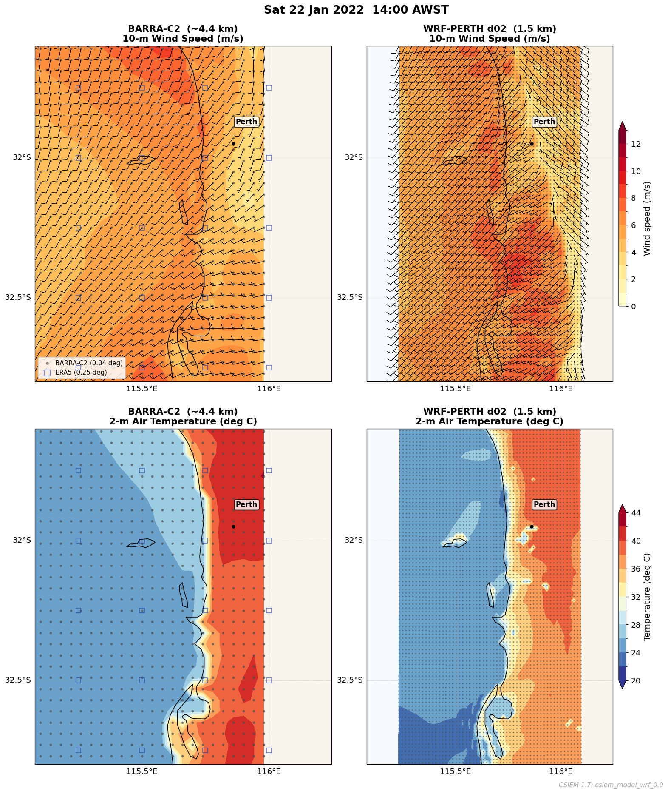
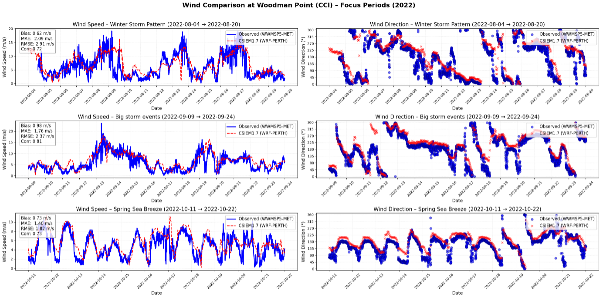
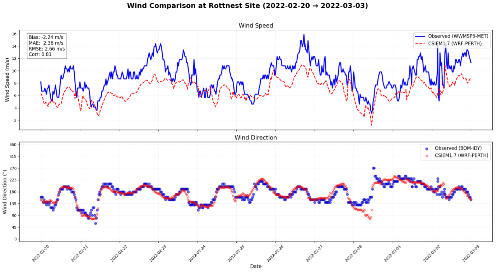
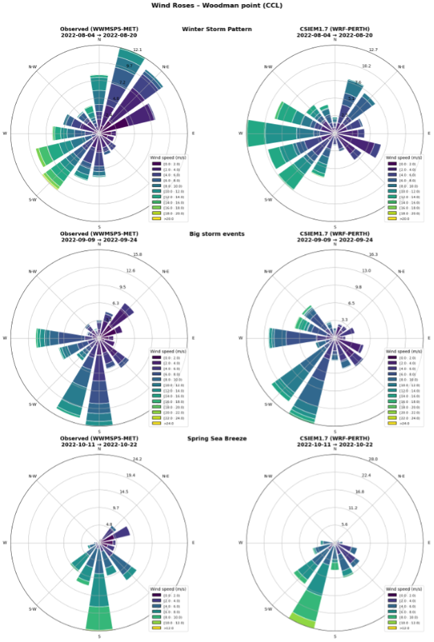
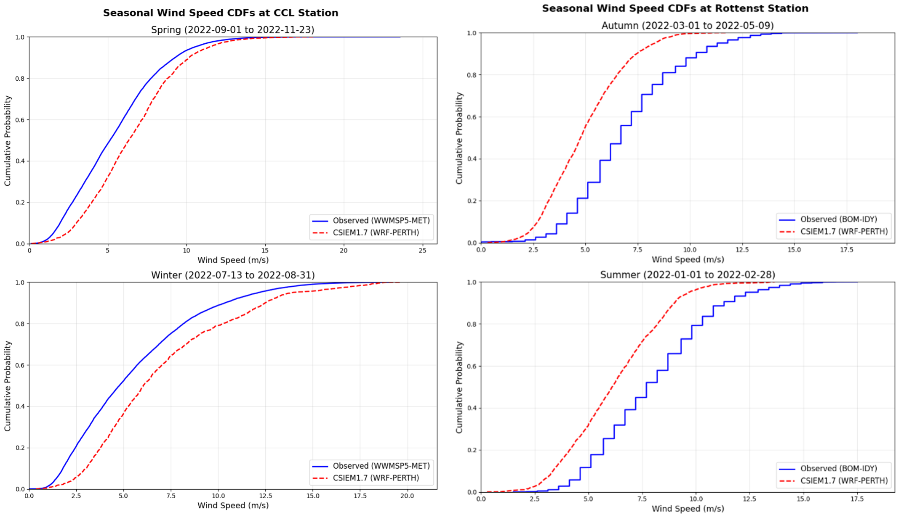
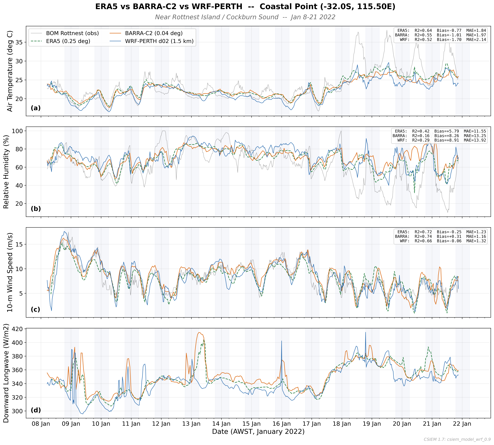
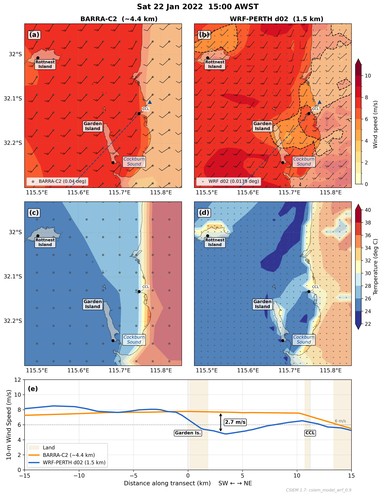

# (PART)  SCIENCE APPLICATIONS {-} 

# Weather & Waves {#weather-waves}

## Overview

Atmospheric and wave forcing are fundamental boundary conditions for the CSIEM hydrodynamic model, directly controlling wind-driven circulation, surface heat exchange, vertical mixing, and wave-induced resuspension in Cockburn Sound and the surrounding coastal waters. The quality of these forcing fields strongly influences the fidelity of all downstream predictions --- from temperature and salinity structure through to water quality, light climate, and benthic habitat assessments.

A key design requirement of the CSIEM platform is flexibility in meteorological and wave forcing. The platform must support simulations spanning different time periods (from historical reconstructions back to 1990 through to near-real-time analyses), at different spatial resolutions (from regional reanalysis products to km-scale downscaled fields), and for different use-cases (from rapid screening runs using readily available reanalysis data, to high-fidelity simulations employing bespoke high-resolution atmospheric modelling). To meet this requirement, CSIEM is configured to accept forcing from multiple meteorological and wave model products, allowing users to select the most appropriate option for their specific application. This chapter describes the available atmospheric forcing products, the approach to high-resolution weather modelling using WRF, and the wave modelling products integrated within the platform.


## Meteorological forcing {#met-forcing}

### Available products

Five meteorological forcing options are available within the CSIEM platform, summarised in Table \@ref(tab:met-products). These span a range of spatial resolutions, temporal coverage, and levels of complexity, providing users with flexibility to match the forcing product to the requirements of their application.

<br>

```{r met-products, echo=FALSE, message=FALSE, warning=FALSE}
library(knitr)
library(kableExtra)

met_tbl <- data.frame(
  Product = c("ERA5", "BARRA-PH", "BARRA-C2", "WRF (static SST)", "WRF (SST feedback)"),
  Resolution = c("~31 km", "1.5 km", "~4.4 km", "1.5 km", "1.5 km"),
  Period = c("1940--present", "1990--2019", "1979--present", "2017--2024", "2021--2024"),
  Source = c("ECMWF reanalysis", "BoM reanalysis", "BoM reanalysis", "WRF v4.4.1 (ERA5-driven)", "WRF v4.4.1 (CSIEM SST feedback)"),
  Strengths = c(
    "Global coverage, long record, freely available",
    "High resolution, assimilates Australian observations",
    "Successor to BARRA-PH, extended temporal coverage",
    "Resolves sea breeze and land--sea gradients at km-scale",
    "As one-way, plus captures local SST-driven modulation of atmospheric boundary layer"
  ),
  Limitations = c(
    "Too coarse for coastal applications; does not resolve sea breeze structure",
    "Discontinued after 2019; not available for recent or future periods",
    "Recently released but no high-resolution option over Perth so available at 4km resolution, with potential smoothing of coastal gradients",
    "Computationally intensive; currently limited temporal coverage and uses coarse SST resolution for ocean boundary",
    "Requires prior coastal model run, and thus a two-step workflow; automated two-way coupling not yet implemented"
  ),
  stringsAsFactors = FALSE
)

kbl(met_tbl, caption = "Summary of meteorological forcing options available in the CSIEM platform.", align = "l", escape = FALSE) %>%
  row_spec(0, background = "#14759e", bold = TRUE, color = "white") %>%
  kable_styling(full_width = F, font_size = 10) %>%
  column_spec(1, width_min = "8em", bold = TRUE) %>%
  column_spec(2, width_min = "5em") %>%
  column_spec(3, width_min = "7em") %>%
  column_spec(4, width_min = "10em") %>%
  column_spec(5, width_min = "15em") %>%
  column_spec(6, width_min = "15em") %>%
  scroll_box(width = "700px", fixed_thead = FALSE)
```

<br>
A summary of the key features of each product is as follows:

**ERA5** is a global atmospheric reanalysis produced by the European Centre for Medium-Range Weather Forecasts (ECMWF). While it provides the longest continuous record and is freely available, its ~31 km horizontal resolution is insufficient to resolve the fine-scale atmospheric features that drive circulation in Cockburn Sound --- most notably the sea breeze system and the land--sea thermal contrast along the Darling Scarp. ERA5 is available within CSIEM primarily as a fallback option or for driving the lateral boundaries of higher-resolution models, and is not recommended as direct forcing for Cockburn Sound simulations.

**BARRA-PH** is the Bureau of Meteorology's Atmospheric High-Resolution Regional Reanalysis for Australia, providing 1.5 km resolution fields that assimilate local observations (Su *et al.*, 2019). It has been the primary forcing product for CSIEM historical simulations covering 1990--2019, but was discontinued and is not available for more recent periods. **BARRA-C2** is a successor product at ~4.4 km resolution with extended temporal coverage from 1979 to the present, though it has not yet been extensively validated for Perth's coastal meteorology.

**WRF** (Weather Research and Forecasting) modelling provides the highest-fidelity option. The WRF configuration developed for CSIEM is called **WRF-PERTH**, and is described in detail in the following section.


```{block2, hint_1ww, type='rmdnote2'}

*Users can select their preferred meteorological forcing option in the main simulation `fvc` file. The files configuring the atmospheric boundary condition coupling into a CSIEM simulation are located in the `model_components/includes/bc/1_weather` folder.*
```

See Figure 7.1 for a comparison of the spatial resolution and key features of the BARRA-C2, and WRF-PERTH products over the Perth coastal region; these differences are described in further detail in the next sections.

```{r, echo=FALSE, out.width="90%"}

```

:::{.figcap}
**Figure 7.1.** Comparison of wind fields from the BARRA-C2 reanalysis and WRF-PERTH products. The left plots show the ERA5 grid resolution for context, illustrating how differences in spatial resolution lead to distinct local dynamics, particularly in the representation of sea breeze structure and nearshore wind gradients around Cockburn Sound.
:::


### WRF high-resolution downscaling {#wrf-downscaling}

The dominant meteorological feature controlling circulation and water quality in Cockburn Sound is the "Fremantle Doctor" --- the strong south-westerly sea breeze that develops on most summer afternoons in response to differential heating between the Indian Ocean and the coastal land mass (Masselink & Pattiaratchi, 2001). This sea breeze drives the two-layer wind-forced circulation within the Sound, controls the rate of vertical mixing and flushing, and modulates stratification intensity. During winter, storm-driven north-westerly winds and associated frontal systems enhance deep mixing and exchange with the open ocean.

Accurate simulation of these features requires atmospheric modelling at kilometre-scale resolution --- sufficient to resolve the sharp thermal and moisture gradients between the ocean surface, the narrow coastal plain, and the elevated Darling Scarp immediately inland. Coarser products (ERA5 at 31 km, or even BARRA at 1.5--4.4 km) smooth these gradients, leading to systematic biases in wind speed, direction, and timing that propagate into hydrodynamic predictions.

To address this, a bespoke WRF v4.4.1 (ARW core) configuration has been developed for the Perth region (WRF-PERTH). The model adopts a two-domain nested approach:

- **Domain 1 (parent - d01)**: 7.5 km resolution, 171 $\times$ 179 grid cells, covering the broader south-west Western Australia region. This domain captures synoptic-scale weather patterns and provides lateral boundary conditions for the inner nest.
- **Domain 2 (nest - d02)**: 1.5 km resolution, 56 $\times$ 96 grid cells, covering the Perth coastal strip from approximately Mandurah (south) to Two Rocks (north), and from Rottnest Island (west) to the Darling Scarp (east). This domain explicitly resolves the sea breeze front, coastal convergence zones, and orographic effects of the escarpment.

Both domains use 45 vertical levels with a hybrid sigma-pressure coordinate, extending to a model top at 50 hPa. The vertical spacing is concentrated near the surface to resolve the atmospheric boundary layer structure that directly controls surface wind stress and heat exchange.

The physics parameterisations adopted are:

- **Planetary boundary layer**: YSU non-local scheme (Hong *et al.*, 2006), which captures counter-gradient turbulent fluxes important for convective conditions during sea breeze development.
- **Radiation**: RRTMG longwave and shortwave schemes, updated every 5 minutes to resolve the rapid changes in radiation during sea breeze onset.
- **Land surface**: Noah LSM with 4-layer soil model, using 21-class USGS land-use categories.
- **Microphysics**: WSM 5-class single-moment scheme.
- **Surface layer**: Revised MM5 Monin-Obukhov similarity theory.

Lateral boundary conditions are provided by ERA5 reanalysis at 6-hourly intervals. Each simulation covers a calendar month, producing output at 30-minute intervals on domain 2. In the one-way configuration, sea surface temperature is held constant from the ERA5 initial condition for the duration of each monthly run.

```{r, echo=FALSE, out.width="95%"}
knitr::include_graphics("./media/hydro/wind/seabreeze_Jan22-23_2022.gif")
```

:::{.figcap}
**Figure 7.2.** Animation of the WRF-PERTH 1.5 km model output for 22--23 January 2022, demonstrating the ability of the model to capture the subtle features of the sea breeze near the coast, including the development and penetration of the sea breeze front into Cockburn Sound and Owen Anchorage, and the sheltering effect of Garden Island.
:::


### SST coupling {#sst-coupling}

A significant limitation of a one-way WRF configuration is that SST is held based on coarse-scale ERA5 SST estimates. For Perth's coastal meteorology, where SST gradients between the warm Leeuwin Current, cooler upwelled waters inshore, and the shallow embayments of Cockburn Sound can strongly modulate the intensity and timing of the sea breeze, this static assumption may introduce systematic biases.

WRF supports time-varying SST via an `sst_update` mechanism, whereby ocean model output (from either ROMS or TUFLOW-FV; see Chapters 8 and 9, respectively) can be regridded onto the WRF domain and ingested at 4-hourly intervals. This allows the atmospheric boundary layer to respond dynamically to evolving SST fields --- for example, capturing the enhanced land--sea thermal contrast during periods of coastal upwelling, or the reduced contrast associated with warm Leeuwin Current intrusions.

In the current implementation, this coupling is one-way (ocean $\rightarrow$ atmosphere): the hydrodynamic model is run to completion first, and the resulting SST fields are then interpolated onto the WRF grid, and used to force WRF. An iterative two-way atmosphere--ocean coupling, in which WRF wind stress and heat fluxes are fed back to the ocean model at runtime, requires further development to use a coupler framework (e.g., ESMF/NUOPC) and is not yet operational within the CSIEM platform. Nevertheless, the one-way SST coupling and two-step model coupling approaches provide a meaningful improvement over a static-SST approach, particularly for multi-week simulations where SST evolution is non-negligible.


### WRF wind validation

To evaluate the performance of the WRF forcing, the 1.5 km WRF model output was compared against observations from two monitoring locations: an onshore coastal site at Woodman Point (CCL) and an offshore site at Rottnest Island Airport. The analysis used the 2022 data-set, corresponding to the period for which field wind observations were available at CCL (July 13 to November 23, 2022) and Rottnest Island (January 1 to May 9, 2022). The observed 2 m wind measurements at CCL were adjusted to 10 m using a standard neutral-stability conversion factor of 1.15, consistent with the expected log-law ratio under typical coastal roughness conditions.

To demonstrate the model's ability to capture key wind regimes that drive circulation in Cockburn Sound, several focus periods were identified at CCL: (a) a multiple winter storm sequence (August 4--20, 2022), (b) a strong frontal passage with rapid directional shifts (September 9--24, 2022), and (c) a representative spring sea-breeze cycle (October 11--22, 2022). An offshore focus period was also examined at Rottnest Island (February 20 -- March 3, 2022).

```{r, echo=FALSE, out.width="95%"}

```

:::{.figcap}
**Figure 7.3.** Time-series comparison of observed vs WRF wind speed and direction at CCL for the three focus periods (August storm sequence, September frontal passage, and October sea-breeze cycle), with bias statistics inset.
:::

The model generally captures the temporal variability in wind speed and direction, including rapid shifts during storms and diurnal oscillations during sea-breeze cycles. However, a positive bias in wind speed is evident during high-wind events, indicating a tendency for overestimation in storm sequences. Bias statistics for each period indicate moderate correlation ($r \approx$ 0.7--0.8) and RMSE values around 1.8--2.9 m/s.

```{r, echo=FALSE, out.width="95%"}

```

:::{.figcap}
**Figure 7.4.** Time-series comparison of observed vs WRF wind speed and direction at Rottnest Island Airport (February 20 -- March 3, 2022).
:::

At the offshore site, the model exhibits closer agreement with observations, with reduced directional bias and higher correlation ($r \approx$ 0.8), suggesting improved performance in conditions less influenced by coastal topography.

```{r, echo=FALSE, out.width="95%"}

```

:::{.figcap}
**Figure 7.5.** Wind-rose comparison for each focus period at Woodman Point (CCL). Left: observed winds. Right: WRF winds. Colours represent wind-speed classes (m/s), with identical binning and colour scales.
:::

The wind roses confirm that the model replicates the dominant S--SW sea-breeze regime and the NW winds linked to frontal systems, capturing both directional frequency and wind-speed distribution. Minor biases include a slight over-representation of persistent NW flows in storm periods.

Seasonal cumulative distribution functions (CDFs) of wind speed at both stations (Figure 7.6) reveal seasonal dependencies in model bias. At CCL, the WRF CDFs are shifted rightward in winter, confirming overestimation during storm-dominated periods, while spring shows closer alignment reflecting better sea-breeze capture. At Rottnest, underestimation is evident in autumn CDFs. These patterns have implications for hydrodynamic forcing: overestimation at CCL could enhance simulated mixing and flushing, while underestimation offshore may reduce predicted open-ocean exchange.

```{r, echo=FALSE, out.width="95%"}

```

:::{.figcap}
**Figure 7.6.** Seasonal cumulative distribution functions (CDFs) of wind speed for observed and WRF winds at both stations.
:::

```{block2, hint_2ww, type='rmdnote2'}

*Users can access the CSIEM WRF-PERTH simulation at:* `github.com\SEAF-CS\csiem_model_wrf_1.0`
```


### Cross-product comparison

The ERA5, BARRA-C2 and WRF (no SST Feedback) were compared against half-hourly observations from the Bureau of Meteorology (BOM) automatic weather station at Rottnest Island (32.007°S, 115.502°E) over a two-week period from 8–21 January 2022 (Figure 7.7). For each gridded product, time series were extracted at the nearest grid point to the BOM station. Statistical metrics — coefficient of determination (R²), mean bias, and mean absolute error (MAE) — were computed by linearly interpolating model time series onto the half-hourly observation times.

All three products capture the diurnal air temperature cycle, though with varying fidelity. WRF-PERTH shows the highest correlation with observations (R² = 0.57) but also the largest warm bias (+1.76°C, MAE = 2.14°C), tending to overestimate daytime maxima. BARRA-C2 has a moderate correlation (R² = 0.53) with a smaller bias (+0.57°C, MAE = 1.54°C), while ERA5 shows the lowest correlation (R² = 0.44) with a slight cool bias (−0.77°C, MAE = 1.84°C). WRF's warm bias is consistent with the model resolving the broader coastal land–sea temperature contrast, while the BOM station sits on a small island where maritime moderation dampens the temperature range.

The relative humidity predictions were the most challenging variable for all products at this location, with R² values of 0.42 (ERA5), 0.26 (BARRA-C2), and 0.29 (WRF-PERTH). ERA5 exhibits a dry bias (−9.8%, MAE = 11.6%), WRF a moderate dry bias (−6.9%, MAE = 11.9%), and BARRA-C2 is nearly unbiased (+0.3%) but with comparable scatter (MAE = 12.3%). The poor correlations likely reflect the strong influence of local island micrometeorology on observed humidity — Rottnest Island's small land area means the BOM station is heavily influenced by the immediate marine boundary layer, surf zone evaporation, and local land surface heating, effects that are sub-grid-scale for all three products.

Wind speed was the best-captured variable across all products. BARRA-C2 and ERA5 achieve R² values of 0.74 and 0.72 respectively, with small biases (+0.21 and −0.25 m/s). WRF-PERTH has a slightly lower R² (0.66) but the smallest bias (−0.06 m/s) and lowest MAE (1.09 m/s), suggesting that while the higher resolution does not improve temporal correlation, it reduces systematic error in wind magnitude. The sea breeze signal — characterised by light easterly (offshore) winds in the morning transitioning to strong westerly (onshore) flow each afternoon — is well-reproduced by all three products.

In comparing these variables, it is noted that the weather station data at Rottnest Island is collected on a small island (~19 km²) and influenced by local meteorological dynamics not resolved by the model products being compared. All three gridded products represent the station location as open ocean or as a blended land–ocean grid cell, depending on their resolution and land mask. This spatial representativeness mismatch is most pronounced for temperature and humidity, where island microclimate effects (e.g., limited thermal inertia of the small land mass, enhanced marine influence, local surface heterogeneity) drive observed variability that the models cannot resolve. Wind speed, being more spatially homogeneous over open water, is less affected. It is also important to note that BARRA-C2, as a reanalysis product, assimilates observed surface and upper-air data through its data assimilation cycle. This means BARRA-C2 is not a fully independent comparison — its fields at observation sites are partially constrained by the very observations against which it is being evaluated. In contrast, WRF-PERTH is a free-running dynamical downscaling that receives no observational corrections after initialisation, making its performance metrics a more stringent test of atmospheric model skill.


```{r, echo=FALSE, out.width="95%"}

```

:::{.figcap}
**Figure 7.7.** Comparison of 2-m air temperature (a), 2-m relative humidity (b), 10-m wind speed (c), and downward longwave radiation (d) at Rottnest Island (32.007°S, 115.502°E) for 8–21 January 2022. Time series from ERA5 (0.25°, dashed green), BARRA-C2 (0.04°, solid orange), and WRF-PERTH d02 (1.5 km, solid blue) are extracted at the nearest grid point to the BOM automatic weather station (thin grey line). Grey shading denotes nighttime (local sunset to sunrise). Inset boxes show R², mean bias, and mean absolute error (MAE) computed against half-hourly BOM observations.
:::

A distinct benefit of the higher resolution products (i.e. 1.5km) is their ability to capture the wind shadow effect downwind of various coastal features. In Cockburn Sound, the dynamics of the circulation may be sensitive to the wind and temperature gradients that emerge downwind of Garden Island. This wind sheltering effect is potentially important in shaping the amount of mixing that can occur in the deep-basin. The WRF-PERTH model captures this effect, with a clear reduction in wind speed in the lee of Garden Island, while the coarser products show a more uniform wind field across the Sound (Figure 7.8). 

### Wind-shadow effect

As typical in summer, a well-developed sea breeze drives south-westerly winds of 8–10 m/s across the ocean west of Garden Island. The WRF-PERTH d02 simulation resolves a pronounced wind shadow in Cockburn Sound, where wind speeds drop to 5–6 m/s in the lee of the island — a reduction of approximately 2.7 m/s relative to the BARRA-C2 reanalysis at the same location (~3 km downwind of Garden Island centre) - see Figure 7.8. BARRA-C2 does not clearly represent Garden Island and consequently shows a near-uniform wind field across the sound with no discernible sheltering effect. The temperature panels reinforce this contrast; WRF captures a tongue of cooler marine air (~24–26°C) penetrating through the gap between Rottnest and Garden Islands and spreading across the coastal strip, while BARRA produces a smoother, broader transition between the cool ocean and hot land (~38–40°C) with less spatial structure. The transect through the sea breeze axis confirms that the sheltering signal is entirely absent in BARRA, highlighting the value of kilometre-scale resolution for resolving the coastal wind climate *within* Cockburn Sound — this distinction has implications for wind-driven circulation, mixing, and ecological processes within the Sound.


```{r, echo=FALSE, out.width="95%"}

```

:::{.figcap}
**Figure 7.8.** Comparison of BARRA-C2 reanalysis (~4.4 km) and WRF-PERTH d02 (1.5 km) atmospheric fields over Cockburn Sound at 15:00 AWST on 22 January 2022 during a sea breeze event. (a, b) 10-m wind speed with wind barbs; the dashed black contour in (b) marks 6 m/s, and the dashed blue line shows the transect location. (c, d) 2-m air temperature. Grey dots show native grid points for each product. Black dots mark the Rottnest Island BOM, Garden Island HSF, and Cockburn Cement (CCL) wind stations. (e) Wind speed along a SW–NE transect through Garden Island (0 km) and CCL (11.2 km); tan shading indicates land. The arrow at 3 km downwind denotes the 2.7 m/s difference between BARRA-C2 and WRF attributable to Garden Island wind sheltering that the coarser product cannot resolve. Coastline from the Australian Coastline 50K 2024 dataset (NESP MaC 3.17, AIMS).
:::

## Wave climate {#wave-climate}

Wave conditions in the Cockburn Sound region are an important driver of sediment resuspension, turbidity, light attenuation, and the associated impacts on benthic habitat. CSIEM incorporates wave forcing from one of two gridded wave model products --- SWAN or WWM --- whose outputs (significant wave height, direction, and period) are read into TUFLOW-FV as boundary conditions for each water column cell. In the default configuration, there is no two-way interaction between the wave and hydrodynamic models, though this is possible for focused investigations.

Readers are referred to the associated wave modelling reports for detailed descriptions of the wave model setups and their scientific justification. The focus here is on benchmarking the wave products within the CSIEM platform against available field data.


### Wave modelling products

Two wave modelling products are available (Figure 7.9):

- **WWM** (Wind Wave Model): The primary continuous wave product for CSIEM, developed as part of the WWMSP program and reported in detail in Pattiaratchi and Janekovic (2024). The model provides a 13-year continuous hindcast on an unstructured mesh with variable resolution. As this format does not read natively into TUFLOW-FV, a conversion step interpolates the raw WWM results onto a high-resolution regular grid.

- **SWAN** (Simulating Waves Nearshore): Developed by BMT as part of the CSIEM platform development and application to the Westport EIA. SWAN is configured with three nested sub-domains of increasing resolution (termed A, B, C), which can be hierarchically stacked within TUFLOW-FV so that the highest resolution product available in any cell is applied. Readers are referred to the SWAN modelling report for a detailed model description and validation (BMT, 2026).

```{r, echo=FALSE, out.width="80%"}
knitr::include_graphics("./media/image23.png")
```

:::{.figcap}
**Figure 7.9.** Outline of different wave model domain extents available in CSIEM. In TUFLOW-FV, the application is hierarchical so the highest resolution option is used where available.
:::

```{block2, hint_3ww, type='rmdnote2'}

*Users can select their preferred wave forcing option in the main simulation `fvc` file. The files configuring the wave boundary condition coupling within a CSIEM simulation are located in the `model_components/includes/bc/2_waves` folder.*
```

### 2013 model inter-comparison

As the CSIEM platform spans multiple years and has several wave forcing options, an initial screening compared the available models against JPPL field data. For a focus period in September 2013 at site S02, the BMT SWAN model (both B and C resolution domains) was relatively accurate in capturing the magnitude and temporal evolution of significant wave height, direction, and period. The WWM model displayed an over-prediction bias in wave height but was comparable in capturing direction and period. The validation of the WWM calibration reported in Pattiaratchi and Janekovic (2024) showed accurate and non-biased results against the nearby Stirling Channel FPA data in 2022 and other WWMSP Project 5.2 data, suggesting potential differences in methodology or model versions between these assessments.

```{r, echo=FALSE, out.width="82%"}
knitr::include_graphics("./media/image24.png")
```

:::{.figcap}
**Figure 7.10.** Comparison of (a) significant wave height, (b) wave direction, and (c) wave period comparing SWAN-B, SWAN-C, WWM, TUFLOW-FV and AWAC data at site S01 for a period in 2013.
:::

Tests were also undertaken to verify that the raw wave boundary condition values were being correctly interpolated into the selected TUFLOW-FV mesh, as shown for the "B" grid in Figure 7.10.


### 2013 and 2023 wave climate validation

Further comparison of the WWM outputs was undertaken against JPPL-AWAC data at sites S01 and S02 (2013), and against ADV data from Success Bank and Parmelia Bank (2023).

#### 2013 {.unnumbered}

Performance against the JPPL S01 and S02 AWAC data indicated that the WWM model generally over-predicted significant wave height by a factor of up to 2. A bias-correction factor of 0.5 was therefore applied within TUFLOW-FV, after which the scaled output agreed well with the field data, with regression coefficients > 0.47 and MAE < 0.052 m at both sites.

#### {.panelset .unnumbered}

##### JPPL-AWAC : S01 {.unnumbered}

```{r, echo=FALSE, out.width="90%"}
knitr::include_graphics("./media/image25.png")
```

:::{.figcap}
**Figure 7.11-i.** Comparison of significant wave height, wave direction, and wave period for WWM, CSIEM, and AWAC data at site S01 in 2013. Click to enlarge.
:::

##### JPPL-AWAC : S02 {.unnumbered}

```{r, echo=FALSE, out.width="90%"}
knitr::include_graphics("./media/image26.png")
```

:::{.figcap}
**Figure 7.11-ii.** Comparison of significant wave height, wave direction, and wave period for WWM, CSIEM, and AWAC data at site S02 in 2013. Click to enlarge.
:::


#### 2023 {.unnumbered}

Similar comparisons were made against ADV data at Parmelia Bank A (115.7128 E, 32.1200 S) and Parmelia Bank B (115.7201 E, 32.1333 S). With the bias correction applied to significant wave height from WWM, the CSIEM output agreed well with the field data, with regression coefficients > 0.76 and MAE < 0.22 m at both sites.

The observed wave direction showed more variability, with periods where the model diverges from observations, particularly during high-variability phases. Model performance for wave period was mixed: the general trend was captured, but there was significant scatter in the observed data at shorter wave periods.

#### {.panelset .unnumbered}

##### WWMSP9-AWAC : PB-A {.unnumbered}

```{r, echo=FALSE, out.width="90%"}
knitr::include_graphics("./media/image27.png")
```

:::{.figcap}
**Figure 7.12-i.** Comparison of significant wave height, wave direction, and wave period for WWM, CSIEM, and ADV measurements at Parmelia Bank A in 2023/24.
:::

##### WWMSP9-AWAC : PB-B {.unnumbered}

```{r, echo=FALSE, out.width="90%"}
knitr::include_graphics("./media/image28.png")
```

:::{.figcap}
**Figure 7.12-ii.** Comparison of significant wave height, wave direction, and wave period for WWM, CSIEM, and ADV measurements at Parmelia Bank B in 2023/24.
:::


## Summary

This chapter has described the meteorological and wave forcing options available within the CSIEM platform. Five meteorological products span a range of resolutions and temporal coverage, from the coarse global ERA5 reanalysis through to bespoke 1.5 km WRF simulations with SST coupling capability. The WRF high-resolution downscaling approach is designed to resolve the nearshore climatic gradients --- particularly the sea breeze system and orographic effects of the Darling Scarp --- that are critical drivers of circulation and mixing in Cockburn Sound but are poorly captured by coarser reanalysis products. The potential for driving WRF from dynamically evolving ocean model SST fields represents a further enhancement for simulations where atmosphere--ocean feedbacks are significant. For routine application and more streamlined workflows, the BARRA-PH or BARRA-C2 reanalysis products are fully integrated within the model configurations and can be easily applied without additional setup.

Two wave modelling products (SWAN and WWM) provide wave boundary conditions for the hydrodynamic model. Validation against field data from 2013 and 2023 demonstrates that, with bias correction, the WWM product captures the key features of the wave climate in the Cockburn Sound region, but further refinement is necessary due to some limitations. An in-depth analysis of the SWAN model option within CSIEM is available in BMT (2026) to which readers are referred. The flexibility to select from multiple forcing products for both weather and waves supports a range of use-cases, from rapid multi-decadal screening simulations to targeted high-resolution studies.
