# Hydrodynamics {#hydrodynamics}

## Overview

The hydrodynamics of Cockburn Sound are governed by the interplay of seasonal wind regimes, relatively weak tidal forcing, episodic periods of stratification, and the regional drivers of currents along Perth's coast. The system is also influenced by human-induced changes to the physical environment which have occurred over time, including both changes to the Sound's bathymetry, and discharges to the system that impact local water temperature and salinity patterns. This chapter describes the approach to simulation of hydrodynamics within the CSIEM platform, and performance tests to validate the model. Hydrodynamic conditions are highly variable in space and time (Figure 9.1), and serve as the foundation for ecosystem predictions due to their role in shaping the accumulation patterns of nutrients, reduced oxygen concentrations, and other water quality processes like those associated with algal bloom development.

<br>

<center>
<video width="97%" height="97%" controls>
<source src="./media/hydro/1_4panel_animation.mp4" type="video/mp4">
</video>
</center>

:::{.figcap}
**Figure 9.1.** Example hydrodynamic output from CSIEM showing wind, wave, salinity and temperature variation across the Perth coast in July 2013.
:::

<br>


```{block2, hintM2-1, type='rmdnote2'}
*This chapter provides a general summary of the model and its performance; please note some results are specific to a particular version of the model at the time of preparation, and the model performance is subject to iterative refinements over time. For performance of a specific model version follow the below links to the MARVL Viewer.*
```


## Hydrodynamic setting

To contextualise the approach to model setup, the primary driver of circulation in Cockburn Sound is wind. During summer, the prevailing south-westerly sea breeze pattern is the dominant forcing mechanism, inducing a two-layer circulation where surface waters are driven northward by the wind, while a compensatory return flow develops at depth, moving southward. This mechanism serves to transport heat, nutrients, and other properties throughout the water column and across the basin. The horizontal shear established during these flows is generally effective at promoting vertical mixing; however, from late spring through to early autumn, sustained solar heating at the surface, combined with periods of calm weather and weak tidal mixing, results in the formation of a pycnocline that separates the bottom waters from the surface layer. This thermal stratification is most notable in the southern region of the Sound, where the residence time of bottom water is longest and flushing is most restricted, and can lead to hypoxic conditions. In contrast, during the winter months, increased storm activity, changing Leeuwin current strength, and a shift to more variable northerly winds enhance vertical mixing, eroding stratification and replenishing oxygen levels throughout the water column.

Freshwater inputs from surface runoff and groundwater are limited in Cockburn Sound, and thus salinity-driven stratification is generally weak. However, under certain conditions, especially following large rainfall events or in proximity to anthropogenic discharges, salinity gradients can form and contribute to stratification, albeit to a lesser extent than thermal effects. In addition to the natural dynamics, hypersaline discharges from the Perth Seawater Desalination Plant have the potential to intensify near-bottom density stratification. These discharges tend to move along the seabed due to their higher salinity, which can exacerbate hypoxic conditions when overlaid by a stable, warmer water column. Warm waters discharged after cooling industrial facilities can also contribute to vertical buoyancy gradients along the Kwinana Shelf.

Tidal forcing plays a relatively minor role in the overall circulation of Cockburn Sound. The microtidal regime, with tidal ranges averaging around 0.5 metres, results in weak tidal currents that are generally insufficient to drive substantial mixing or water exchange on their own. Nonetheless, tides do contribute to localized nearshore and residual circulation features and can influence sediment resuspension and mixing near coastal infrastructure, particularly in combination with wind forcing.

From the point of view of environmental quality assessments, the embayment's capacity for flushing and water renewal is an important indicator and varies both spatially and seasonally. In the northern part of Cockburn Sound, where connections to offshore waters are more direct and wind-induced circulation is stronger, flushing times are relatively short---on the order of several days under favourable wind conditions. In contrast, the southern basin experiences significantly longer residence times, with previous estimates suggesting it can be of the order of 30 to 50 days during summer. The most notable modification to the natural hydrodynamic regime was the construction of the Garden Island Causeway in the 1970s, which connects the mainland to Garden Island. This solid structure substantially impedes the natural exchange of water between the central basin and offshore waters, and, as a result, regions to the south of Cockburn Sound now experience these extended residence times and greater susceptibility to water quality deterioration.

Early three-dimensional models (e.g. Mills and D'Adamo, 1995) provided key insights into seasonal circulation patterns and the effects of infrastructure like the Garden Island Causeway. More recently, a range of high-resolution models (e.g., FVCOM, TUFLOW-FV, SCHISM, ROMS, ELCOM) have been applied for various applications and have demonstrated good performance in simulating the hydrodynamics of the Sound, including the two-layer wind-driven circulation, residual currents and temperature structure (e.g., Xiao *et al.*, 2022). An additional requirement for integrated prediction and environmental assessment in the Sound is flexibility in capturing the role of coastal infrastructure and associated operations. Desalination operations, port development, and dredging activities all impact hydrodynamic conditions and sediment movement. In particular, dredging and port operations also modify local bathymetry over time, altering currents and remobilising sediments. The CSIEM hydrodynamic model seeks to build on this past experience and has been developed to provide a platform able to holistically accommodate all these various factors.

In this section, the model setup described in Chapter 4 is presented alongside observed data on currents, water levels, temperature and salinity, with the aim to demonstrate the underlying capability of the model in resolving aspects such as flushing times, key circulation features and stratification phenology.


## Hydrodynamic model description 

### Overview 

CSIEM consists of a set of linked models to capture the hydrodynamics of Cockburn Sound and the surrounding waters. The core engine capturing local hydrodynamics is the 3-D unstructured model TUFLOW-FV, which simulates local water levels and currents, turbulent mixing, and water density, temperature and salinity. This model is forced by weather, wave and regional ocean model outputs, each of which has several options within the CSIEM software ecosystem, and which are described in Chapter 4.

The model adopts a flexible mesh (users can select one of 4 available options; three as depicted in Figure 4.3 and a fourth "Westport EIA Mesh") and is based on a finite-volume numerical scheme, which solves the conservative integral form of the non-linear shallow water equations. The model resolves the advection and transport of scalar constituents including both salinity and temperature. The equations are solved in 3D with baroclinic coupling from both salinity and temperature and adopts the UNESCO equation of state for density (Fofonoff and Millard, 1983). The vertical scheme in the model adopts a hybrid z-σ approach, with variable z-spacing (by default ranging from 0.2 - 1m thickness) to the tidal minimum elevation, and then 6 σ-layers spanning the tidal envelope. 

There are several prior applications of TUFLOW-FV to Cockburn Sound, which have demonstrated the model can accurately capture vertical density structure, currents and thermal dynamics (e.g., BMT, 2018b). The current CSIEM implementation of TUFLOW-FV builds on this past experience, with updates to the latest model software ([2025.2.1](https://docs.tuflow.com/fv/release/2025.2.1/)), and improved mesh and boundary condition specification. The specific setup as adopted in CSIEM is outlined next.

### Model parameterisation 

**Surface thermodynamics**: Surface momentum exchange and heat dynamics are solved in each water column cell of the domain, using standard bulk-transfer approach, with assumed momentum input linked to wind stress, and heat exchange based on humidity and temperature gradients between the water surface and 10m height above the surface. Light penetration is split into 4 representative band-widths, NIR, PAR, UVA and UVB, which enter the upper cell and are subject to light attenuation using a band-width specific light attenuation coefficient; this is set to default values in TUFLOW-FV, but can be manipulated by the coupled sediment or water quality model libraries as appropriate. Non-penetrative (longwave) radiative fluxes are also included, with the downward longwave set based on outputs from the linked atmospheric model (Chapter 7), and the upward component computed dynamically based on the temperature of the uppermost water cell.

**Turbulence**: In the current application, turbulent mixing of momentum and scalars has been calculated using the Smagorinsky scheme in the horizontal plane and through application of the coupled General Ocean Turbulence Model ([GOTM](https://gotm.net)) for vertical mixing. The calculation of horizontal turbulent mixing adopts a 2nd order approximation of the spatial gradients. In the vertical, the turbulence option 3 is adopted within GOTM by default (second order with k-epsilon style closure), however, other GOTM options are selectable as desired for more specific applications.

**Bottom boundary layer**: The bottom shear stress configuration within CSIEM adopts the roughness--length relationship approach ('equivalent Nikuradse roughness (m)\'), assuming a rough-turbulent logarithmic velocity profile in the lowest model layer. The roughness length, $k_s$, settings are assigned based on the area type (e.g., soft substrate, hard substrate, reef, seagrass coverage, etc.). For this purpose, the bottom was categorized into 21 zones ([Appendix B](benthicapp)) where the benthic characteristics and associated roughness estimates for each zone were specified. The model optionally includes an additional ability when coupled with the ecosystem model, whereby the bottom drag is influenced by the dynamic biomass of aquatic vegetation within the cell.

### Boundary specification 

The hydrodynamics within the CSIEM domain are driven by a carefully co-ordinated set of boundary conditions, which are summarised generally in Section 4.4. These include spatially variable inputs along the ocean boundary as well as for the surface meteorological forcing, and on the landward side, river and discharges are also included. Together, these create the necessary external forcing to resolve the key circulation features within our focus region, and the associated variability in temperature and salinity.

A summary of the 7 main types of boundary conditions configured include:

- **Weather conditions**: CSIEM supports multiple meteorological forcing options, including the BoM BARRA reanalysis products and a bespoke 1.5 km WRF model for the Perth region. The choice of product depends on the simulation period and resolution requirements. A detailed comparison of the five available forcing options (ERA5, BARRA-PH, BARRA-C2, WRF one-way, WRF two-way) and their validation is provided in [Chapter 7](weather-waves).

- **Wave conditions**: Wave forcing is provided by either the SWAN or WWM wave models, whose outputs (significant wave height, direction, period) are read into TUFLOW-FV as boundary conditions. The available products, their domain configurations, bias correction, and validation against field data are described in [Chapter 7](weather-waves).

- **Ocean conditions**: The 2km ROMS raw model output is processed into an intermediate NetCDF file with water levels and depth-resolved profiles of currents, temperature and salinity  specified at each model edge cell, and at an hourly resolution. An assessment of the performance of ROMS in capturing the seasonal and inter-annual variability in regional ocean dynamics, refer to Chapter 4. In the case of salinity, some seasonal bias was assessed, and thus an additional bias-correction step was applied to the raw ROMS model output.  Where needed, the coarser scale HYCOM model can instead be used in place of ROMS, but the performance of this approach is not discussed further here.

- **Estuarine inputs**: Inputs of flow are included at four locations into the CSIEM domain: at the Narrows Bridge, at the Canning Bridge, at Mandurah, and at Dawesville Channel.  Flows, and their associated temperature and salinity, were computed based on measured upstream flow rates, and interpolated temperature and salinity data.
 
- **Groundwater inputs**: Inputs of flow from groundwater along the eastern edge of Cockburn Sound were computed by an associated model setup using the MODFLOW system (Donn *et al.* 2025). See Chapter 11 for detail on how this is configured. The inputs have a relatively negligible effect on CS hydrodynamics but are included to ensure inclusion of the associated nutrient loads.  

- **Stormwater inputs**: A set of 13 point source inputs associated with urban and industrial stormwater inputs are also included in the model. These are based on the report of Donn *et al.* (2025) and flow amounts quantified based on a model assessment of the Lake Richmond system for the Mangles Bay Drain, and a simple rainfall-runoff approximation for the other smaller urban pipe networks. See Chapter 13 for further detail.

- **Local discharges**: Cockburn Sound and the surrounding Perth waters that are captured within the CSIEM domain have been impacted by numerous discharges (and intakes) over time. The specific flow volumes and their salinity and temperature specification depends on the year of simulation configured. In general, the  hydrodynamics are influenced by warm water discharges, the high-salinity Perth desalination plant (PSDP) discharge, and other low-salinity waste-water discharges. These are configured to enter at the pipe outlet location, either into the water column as a surface-1m or bottom-1m inflow.  See Chapter 13 for further detail.
 
## Field data and approach to validation

A range of data has been compiled and is used in the below assessment of model performance. These data are from varied sources and available via the CSIEM data catalogue (Figure 9.2) as described in Hipsey *et al.* (2025). 

In order to make sense of the large diversity of monitoring data, the approach to hydrodynamic model validation has adopted a three-step strategy:

- **Synoptic scale assessment** of temperature and salinity dynamics, scanning regional and seasonal differences across multiple years, comparing both surface and bottom conditions (images viewable [<span style="color: blue">via the **MARVL-VIEWER** web-app</span>](https://csiem-mv.seaf.org.au), or via a [<span style="color: blue">**Report Card**</span>](validation/temperature.html) style summary).
- **Focused validation** of the model coinciding with periods of interesting events, and/or periods of high quality data-sets.
  - Water currents: Key data-sets recording high-resolution currents within Cockburn Sound and Owen Anchorage include:
    - UWA-OI : 2011, *Summer*
    - JPPL-AWAC : 2013, *Summer*
    - WWMPS5-AWAC : 2021-2022, *All Seasons*
    - WWMSP9-AWAC : 2023-2024, *Winter and Summer* (ADV only)
  - Density Structure: Key data-sets recording high-resolution vertical density profiles within Cockburn Sound and Owen Anchorage include:
    - UWA-SMCWS : 1992-1994, *Seasonal Transects*
    - DWER-CSMWQ : 1980-2024, *Monthly, Summer*
    - DWER-CSMOORING : 2020-2022, *Hourly, All Seasons*
    - WWMPS3-CTD : 2022-2024, *Monthly, All Seasons*
- **Benchmarking** against prior publications reporting specific behaviors and patterns in the system (e.g., residual circulation features, two-layer flow dynamics, and seasonal regimes). Specifically, these include assessment based on:
  - D’Adamo (1992) – seasonal regimes 
  - Ruiz-Montoya & Lowe (2014) – controls on exchange
  - Xiao *et al.* (2022) – summer stratification, exchange dynamics and flushing

A summary of the locations of "hydrodynamic" and water "physico-chemical" data within the CSIEM data platform are summarised in Figure 9.2, below. For a detailed summary of all sensor deployments that were used to select data from, refer to Appendix A.

### {.panelset .unnumbered}

#### Hydrodynamics Dataset Summary {.unnumbered}

```{r, echo=FALSE, out.width="90%"}
knitr::include_graphics("./media/image44.png")
```

:::{.figcap}
**Figure 9.2-i.** Hydrodynamics data-set: Summary of CSIEM data catalogue showing identified hydrodynamics data. Visit the csiem-data catalogue for further information. Click to enlarge.
:::

#### Temp/Sal Dataset Summary {.unnumbered}

```{r, echo=FALSE, out.width="90%"}
knitr::include_graphics("./media/image45.png")
```

:::{.figcap}
**Figure 9.2-ii.** Hydrodynamics data-set: Summary of CSIEM data catalogue showing identified temperature and salinity data (bottom). Visit the csiem-data catalogue for further information. Click to enlarge.
:::


## Water surface elevation {#sec-water-level-validation}

Model water levels were validated against two independent tide gauge records — BOM Hillarys (station 71012) and Fremantle Fishing Boat Harbour (H175) — across eight simulation runs spanning 2013 to 2023, covering both A-mesh (11,694 cells) and B-mesh (30,206 cells) configurations. A comprehensive, interactive comparison of all runs and stations is provided in the [<span style="color: blue">**Water Level Validation Report Card**</span>](validation/water_level_validation.html).

The model reproduces tidal phasing and amplitude well at both stations, with Willmott (1981) skill scores consistently above 0.95 for 2013–2022 runs (median RMSE 7.0 cm at Hillarys, 9.1 cm at Fremantle). Slightly larger errors at Fremantle are attributed to its proximity to the Swan River mouth and unresolved harbour geometry. The 2023 runs show degraded performance (RMSE ~12 cm, skill ~0.92) with a negative bias of 8–9 cm, likely related to interannual sea-level variability not fully captured in the ROMS ocean boundary forcing. Mesh sensitivity is negligible — A-mesh and B-mesh produce near-identical results for the same simulation year.

Sub-tidal water level variability was assessed by applying a Godin (1972) tidal filter (A24$\times$A24$\times$A25 sequential rolling mean) to both observed and modelled hourly records. The filtered signal reveals the seasonal sea-level cycle driven by the Leeuwin Current, with elevated water levels during austral autumn–winter (May–August) and lower levels during summer. The model captures this seasonal modulation and the associated sub-tidal fluctuations forced by continental shelf waves (CSW) propagating poleward along the WA coast following tropical cyclone activity in the northwest (~500 km/day). Detailed per-year sub-tidal comparisons with TC and CSW annotations are available in the [<span style="color: blue">**Water Level Validation Report Card**</span>](validation/water_level_validation.html).

## Synoptic-scale validation of temperature and salinity

Water temperature and salinity patterns were subject to an iterative calibration process, comparing the grab data and continuous data available for these variables against the model at several assessment zones. 

An interactive tool for exploring model validation plots is [<span style="color: blue">available via the **MARVL-VIEWER** web-app</span>](https://csiem-mv.seaf.org.au); select the year of interest and navigate to the water temperature and salinity variables. In these plots, any data within the CSIEM "data-warehouse" from the various compiled data-sets will show in that polygon, and is used in the model error assessment. A condensed summary of these analyses is also shown below in a report card format.

Initial experience with early versions of CSIEM highlighted issues associated with incorrect seasonal trends in salinity and biases in temperature that were refined in later versions. In addition, a wider range of years have since been considered in the model assessment process as the model has progressed. Refinements have included adjustments to the ocean boundary inputs and parameter calibration in the heat balance model.

Analysis of these outputs is shown in the below sections to highlight specific aspects.

### Surface heating and cooling

Variability in temperature is significantly controlled by changes in heating and cooling, which manifests differently throughout the region. An example of the seasonal model temperature predictions (Figure 9.3) shows the approach to assessing model performance in different locations, by combining nearby data from CTD profiles, sensors and other data-sources into a single assessment score. 

```{r, echo=FALSE, out.width="80%"}
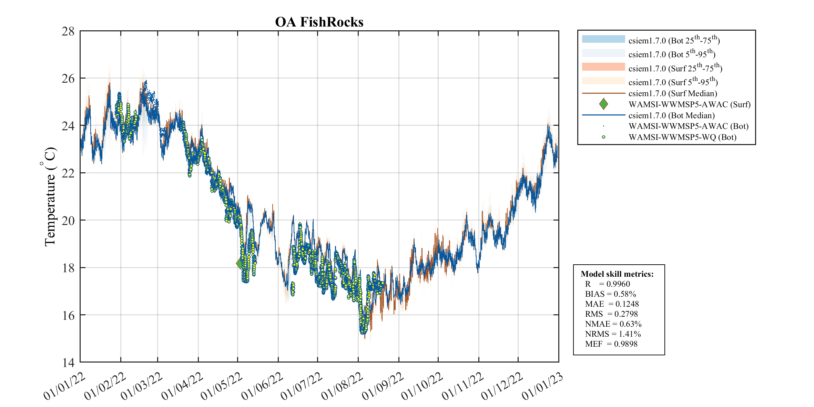
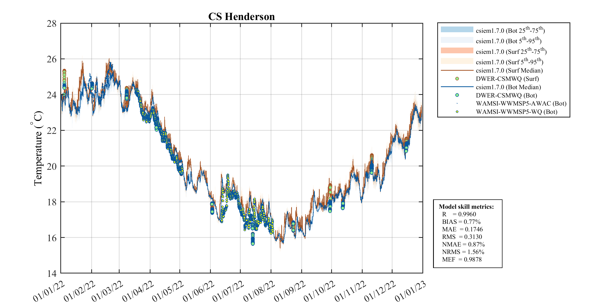
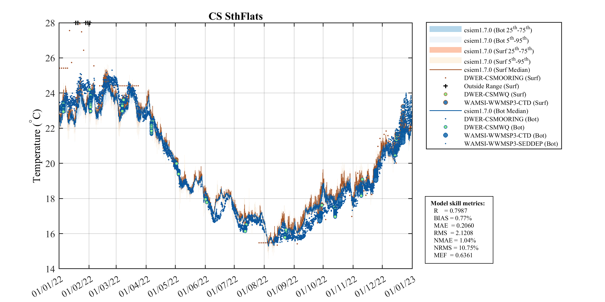
```

:::{.figcap}
**Figure 9.3.** Comparison of water temperature in three regions (a-c) of the model between Jan - Dec 2022, comparing the model simulations against various observed data-sets in the `csiem-data` catalogue.
:::

Given the large volume of temperature data along the Perth coast, a detailed spatial and temporal breakdown of temperature model performance across all assessment polygons and validation years has been summarised in the [<span style="color: blue">**Temperature Validation Report Card**</span>](validation/temperature.html). This shows the "traffic-light" summary of model performance across key regions and years, and doesn't rely on any single data source as the sole point of truth.

In general, over this regional and multi-annual scale (6-year) data-set, the modelled data closely aligns with the field observations for temperature and salinity, capturing both the seasonal trends and variations throughout the year, and between assessment regions. The high correlation coefficient (r>0.95 for temperature) and low mean absolute error (MAE~0.2°C for temperature) indicates an excellent agreement between the model and observations across a range of hydrodynamic conditions. Over the entire temperature data-set with millions of evaluated data-points, the model has a small bias of just -0.2°C, which is a slight cool bias; this is likely due to a combination of factors including the accuracy of the surface heat flux parameterisation and can be the focus of future calibration refinements. 

The period from 2021-2023 contains sites of dense data (multi-sensor deployments), and these are explored in more detail in the next sections. In particular, episodes of short-term stratification (vertical density gradients) are also resolved in the model, in response to solar heating or river inflows, as indicated between the difference between surface and bottom (explored further in Sections 9.10 and 9.11).


### Salinity boundary dynamics {#salt-boundary}

An analysis of the 2km WA-ROMS regional model identified issues associated with the intra-annual variability in salinity (see salinity bias-correction in [Chapter 8.3](#boundary-salinity)). To demonstrate the significance of this correction on the CSIEM model performance, multiple years of the simulation were compared at a region off Rottnest and a nearshore region south of Cockburn Sound. These results show the bias-corrected salinity forcing used in CSIEM is able to accurately capture the seasonal patterns (or lack thereof) in the observed data outside of the main CSOA region of interest. In the (nearshore) SW region, the comparisons include the ROMS prediction to demonstrate the need for the bias correction in the nearshore boundary polygons in order to prevent inaccuracies entering the domain at the northern and southern edges. 

#### {.panelset .unnumbered}

##### 2013 {.unnumbered}

```{r, echo=FALSE, out.width="49%", fig.show="hold"}
knitr::include_graphics(c("./media/hydro/saltemp/SAL_NRSROT_2013.png", "./media/hydro/saltemp/SAL_SW_2013.png"))
```

:::{.figcap}
**Figure 9.4-i.** Comparison of (a) offshore (*IO_NRSROT*) and (b) nearshore (*SW_Region*) polygon salinities, for the year **2013**, showing the seasonal variability outside of CSOA region. Note the "ROMS" output are also added to the SW site for comparison. Click to enlarge
:::

##### 2015 {.unnumbered}

```{r, echo=FALSE, out.width="49%", fig.show="hold"}
knitr::include_graphics(c("./media/hydro/saltemp/SAL_NRSROT_2015.png", "./media/hydro/saltemp/SAL_SW_2015.png"))
```

:::{.figcap}
**Figure 9.4-ii.** Comparison of (a) offshore (*IO_NRSROT*) and (b) nearshore (*SW_Region*) polygon salinities, for the year **2015**, showing the seasonal variability outside of CSOA region. Note the "ROMS" output are also added to the SW site for comparison. Click to enlarge
:::

##### 2020 {.unnumbered}

```{r, echo=FALSE, out.width="49%", fig.show="hold"}
knitr::include_graphics(c("./media/hydro/saltemp/SAL_NRSROT_2020.png", "./media/hydro/saltemp/SAL_SW_2020.png"))
```

:::{.figcap}
**Figure 9.4-iii.** Comparison of (a) offshore (*IO_NRSROT*) and (b) nearshore (*SW_Region*) polygon salinities, for the year **2020**, showing the seasonal variability outside of CSOA region. Note the "ROMS" output are also added to the SW site for comparison. Click to enlarge
:::

##### 2021 {.unnumbered}

```{r, echo=FALSE, out.width="49%", fig.show="hold"}
knitr::include_graphics(c("./media/hydro/saltemp/SAL_NRSROT_2021.png", "./media/hydro/saltemp/SAL_SW_2021.png"))
```

:::{.figcap}
**Figure 9.4-iv.** Comparison of (a) offshore (*IO_NRSROT*) and (b) nearshore (*SW_Region*) polygon salinities, for the year 2021, showing the seasonal variability outside of CSOA region. Note the "ROMS" output are also added to the SW site for comparison. Click to enlarge.
:::

##### 2022 {.unnumbered}

```{r, echo=FALSE, out.width="49%", fig.show="hold"}
knitr::include_graphics(c("./media/hydro/saltemp/SAL_NRSROT_2022.png", "./media/hydro/saltemp/SAL_SW_2022.png"))
```

:::{.figcap}
**Figure 9.4-v.** Comparison of (a) offshore (*IO_NRSROT*) and (b) nearshore (*SW_Region*) polygon salinities, for the year 2022, showing the seasonal variability outside of CSOA region. Note the "ROMS" output are also added to the SW site for comparison. Click to enlarge.
:::

##### 2023 {.unnumbered}

```{r, echo=FALSE, out.width="49%", fig.show="hold"}
knitr::include_graphics(c("./media/hydro/saltemp/SAL_NRSROT_2022.png", "./media/hydro/saltemp/SAL_SW_2023.png"))
```

:::{.figcap}
**Figure 9.4-vi.** Comparison of (a) offshore (*IO_NRSROT*) and (b) nearshore (*SW_Region*) polygon salinities, for the year 2023, showing the seasonal variability outside of CSOA region. Note the "ROMS" output are also added to the SW site for comparison. Click to enlarge.
:::


### Salinity seasonal variation

A CS-scale assessment of salinity was undertaken to assess salinity over the six validation focus years (Figure 9.5). Note the year to year variability also captured by cycling through the tabs.

#### {.panelset .unnumbered}

##### 2013 {.unnumbered}

```{r, echo=FALSE, out.width="95%"}
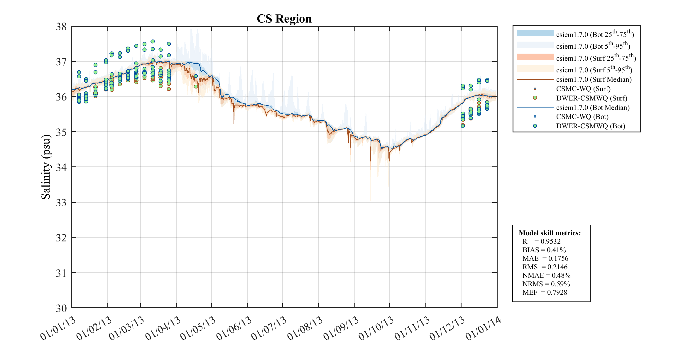
```

:::{.figcap}
**Figure 9.5-i.** Comparison of Cockburn Sound (*CS_Region*) polygon salinity predictions with all available observations, for the year **2013**, showing the seasonal variability within the Sound. Click to enlarge
:::

##### 2015 {.unnumbered}

```{r, echo=FALSE, out.width="95%"}
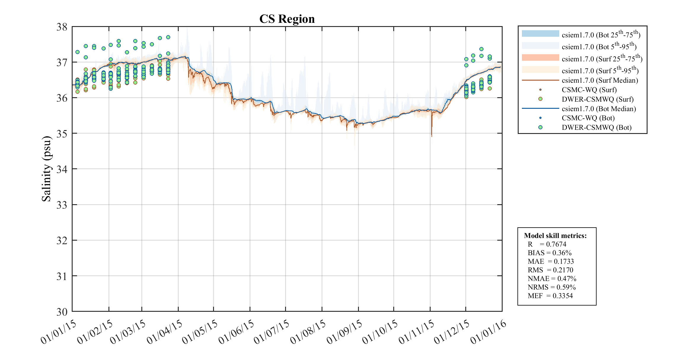
```

:::{.figcap}
**Figure 9.5-ii.** Comparison of Cockburn Sound (*CS_Region*) polygon salinity predictions with all available observations, for the year **2015**, showing the seasonal variability within the Sound. Click to enlarge
:::

##### 2020 {.unnumbered}

```{r, echo=FALSE, out.width="95%"}
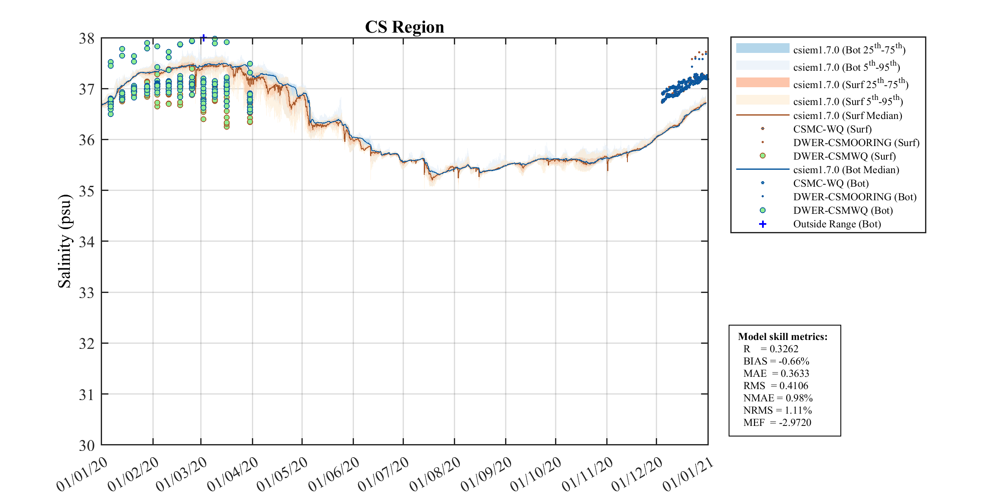
```

:::{.figcap}
**Figure 9.5-iii.** Comparison of Cockburn Sound (*CS_Region*) polygon salinity predictions with all available observations, for the year **2020**, showing the seasonal variability within the Sound. Click to enlarge
:::

##### 2021 {.unnumbered}

```{r, echo=FALSE, out.width="95%"}
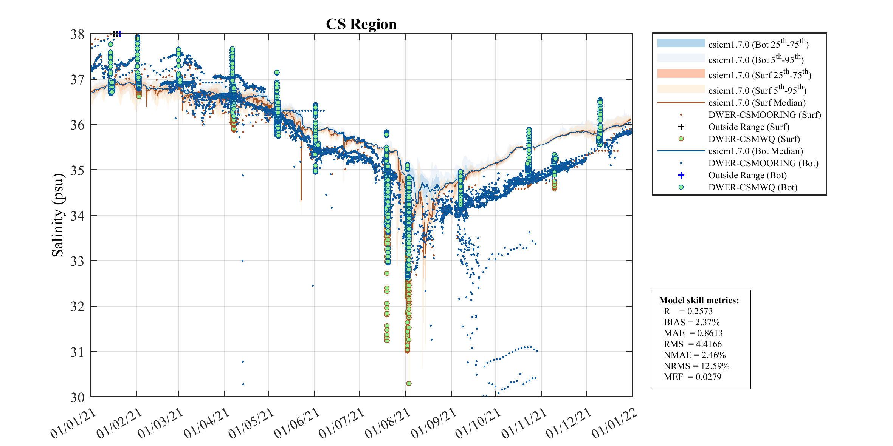
```

:::{.figcap}
**Figure 9.5-iv.** Comparison of Cockburn Sound (*CS_Region*) polygon salinity predictions with all available observations, for the year **2021**, showing the seasonal variability within the Sound. Click to enlarge
:::

##### 2022 {.unnumbered}

```{r, echo=FALSE, out.width="95%"}
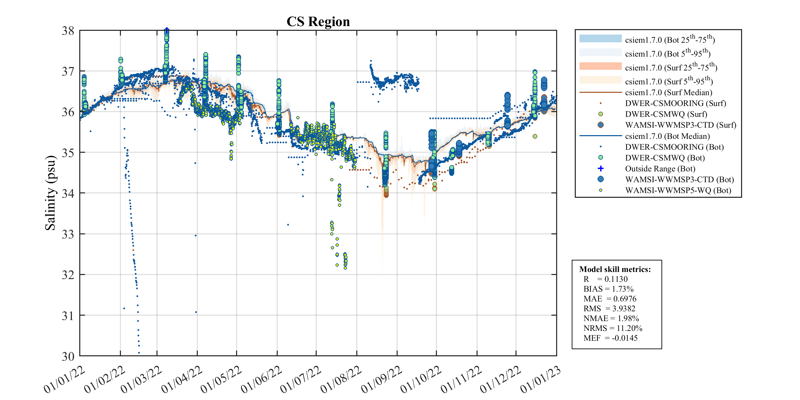
```

:::{.figcap}
**Figure 9.5-v.** Comparison of Cockburn Sound (*CS_Region*) polygon salinity predictions with all available observations, for the year **2022**, showing the seasonal variability within the Sound. Click to enlarge
:::

##### 2023 {.unnumbered}

```{r, echo=FALSE, out.width="95%"}
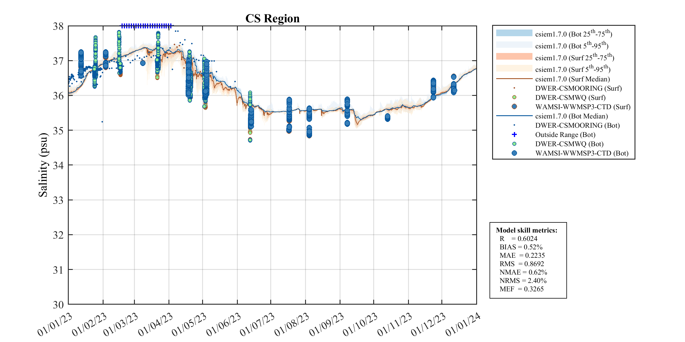
```

:::{.figcap}
**Figure 9.5-vi.** Comparison of Cockburn Sound (*CS_Region*) polygon salinity predictions with all available observations, for the year **2023**, showing the seasonal variability within the Sound. Click to enlarge
:::

### Density profiles

Both the seasonal variations in temperature and salinity shape the density structure of the water column, which ultimately controls the nature of water flows and mixing within the system. To compare the model's ability to resolve this, we review the monthly density profiles at two deep sites - one in the north of the main basin, and one in the south. Figure 9.6 presents the monthly density profiles for the year 2022, showing excellent month-to-month evolution of the density structure through the seasonal cycle.

```{r, echo=FALSE, out.width="95%"}
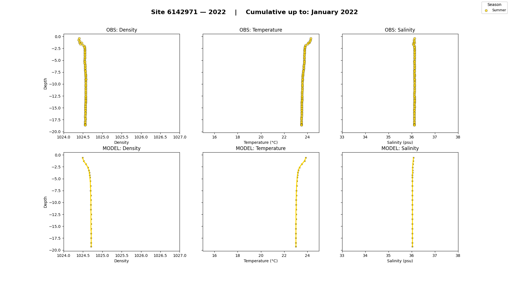
```

:::{.figcap}
**Figure 9.6.** Monthly density profiles at a site in the north of the deep basin for the year 2022, comparing model predictions with observed data. Profile data from DWER-CSMWQ.
:::


## Currents and water circulation

Following the general assessment of water levels, temperature and salinity as outlined in the above sections, the model's resolution of key hydrodynamic circulation features was further examined. This included a point-scale comparison of the model against velocity data collected in both Owen Anchorage and within Cockburn Sound, and a subsequent analysis of the two-layer flow dynamics and residual circulation features.

### Water velocity validation {#sec-currents-validation}

The model's ability to resolve water currents was assessed against three independent field data-sets spanning different time periods, spatial scales, and instrument types. A comprehensive, interactive comparison of all data-sets is provided in the [<span style="color: blue">**Current Validation Report Card**</span>](validation/adcp_validation.html), which presents side-by-side observed and modelled current profiles organised by validation window and hydrodynamic regime. Key findings from each data source are summarised below.

#### Owen Anchorage — ADV (WWMSP9, 2023) {.unnumbered}

Near-bed current velocities from four ADV sites on Parmelia Bank and Success Bank (WWMSP Project 9.1; Hansen *et al.* 2025) were compared against bottom-layer model output across four deployment windows spanning 2023–2024. The model captures the temporal variation in current speed and direction, with correlation coefficients >0.45 and RMSE < 0.10 m/s across all sites and windows. Key directional shifts associated with seasonal wind regime changes are well reproduced. Notably, the first ADV deployment window (d1: Feb–Mar 2023) overlaps with the exchange flux analysis in Section 9.8 (Figure 9.10), where episodic flow reversals through the northern transect are driven by shifts in wind direction and the alongshore pressure gradient. The ADV observations at Parmelia Bank confirm the model correctly resolves these reversal events at the local scale, providing independent validation of the exchange dynamics described in Section 9.8.

#### Cockburn Sound — AWAC profiles (JPPL, 2013) {.unnumbered}

Depth-resolved current profiles from two AWAC moorings north of Cockburn Sound (S01 shallow shelf ~10 m, S02 central basin ~18 m; Dec 2012–2013) were compared against the 2013A model run. The model captures the phase of current reversals and the general magnitude of currents at both sites. At S02 the northward surface current dominance during summer months is well reproduced. Full depth-resolved comparisons across eight validation windows are available in the [<span style="color: blue">**Current Validation Report Card**</span>](validation/adcp_validation.html) (JPPL AWAC tab).

#### Cockburn Sound — ADCP profiles (WWMSP5, 2021–2022) {.unnumbered}

A depth-resolved assessment of the vertical current structure was undertaken using upward-looking ADCP profiles at seven sites across Cockburn Sound (CS1–CS7, 6–20 m depth). Eight validation windows spanning April 2021 to July 2022 were selected, covering the full seasonal cycle from summer sea-breeze through autumn transition, post-cyclone shelf waves, winter storm-driven renewal, and Leeuwin Current–dominated baroclinic exchange. The model generally reproduces the observed two-layer flow structure, diurnal sea-breeze reversals, and the timing of regime transitions. Full depth-resolved comparisons of current speed and direction, along with model residual circulation maps and regime summaries for each window, are provided in the [<span style="color: blue">**Current Validation Report Card**</span>](validation/adcp_validation.html).


### Monthly-mean circulation

The circulation in Cockburn Sound is strongly governed by wind, particularly the prevailing south-westerly sea breeze during the summer months. The summer wind pattern induces a two-layer circulation where surface waters are driven northward by the wind, while a compensatory return flow develops at depth, moving southward. In winter the circulation reverses with a southerly tendency. The mean monthly currents are shown in Figure 9.7. 

#### {.panelset .unnumbered}

##### Jan {.unnumbered}

```{r, echo=FALSE, out.width="95%"}
knitr::include_graphics("./media/hydro/currents/temperature_velocity_01_January.png")
```

:::{.figcap}
**Figure 9.7-i.** Comparison of (a) surface-layer and (b) bottom-layer streamlines based on monthly-mean currents for the year 2023.
:::

##### Feb {.unnumbered}

```{r, echo=FALSE, out.width="95%"}
knitr::include_graphics("./media/hydro/currents/temperature_velocity_02_February.png")
```

:::{.figcap}
**Figure 9.7-ii.** Comparison of (a) surface-layer and (b) bottom-layer streamlines based on monthly-mean currents for the year 2023.
:::

##### Mar {.unnumbered}

```{r, echo=FALSE, out.width="95%"}
knitr::include_graphics("./media/hydro/currents/temperature_velocity_03_March.png")
```

:::{.figcap}
**Figure 9.7-iii.** Comparison of (a) surface-layer and (b) bottom-layer streamlines based on monthly-mean currents for the year 2023.
:::

##### Apr {.unnumbered}

```{r, echo=FALSE, out.width="95%"}
knitr::include_graphics("./media/hydro/currents/temperature_velocity_04_April.png")
```

:::{.figcap}
**Figure 9.7-iv.** Comparison of (a) surface-layer and (b) bottom-layer streamlines based on monthly-mean currents for the year 2023.
:::

##### May {.unnumbered}

```{r, echo=FALSE, out.width="95%"}
knitr::include_graphics("./media/hydro/currents/temperature_velocity_05_May.png")
```

:::{.figcap}
**Figure 9.7-v.** Comparison of (a) surface-layer and (b) bottom-layer streamlines based on monthly-mean currents for the year 2023.
:::

##### Jun {.unnumbered}

```{r, echo=FALSE, out.width="95%"}
knitr::include_graphics("./media/hydro/currents/temperature_velocity_06_June.png")
```

:::{.figcap}
**Figure 9.7-vi.** Comparison of (a) surface-layer and (b) bottom-layer streamlines based on monthly-mean currents for the year 2023.
:::

##### Jul {.unnumbered}

```{r, echo=FALSE, out.width="95%"}
knitr::include_graphics("./media/hydro/currents/temperature_velocity_07_July.png")
```

:::{.figcap}
**Figure 9.7-vii.** Comparison of (a) surface-layer and (b) bottom-layer streamlines based on monthly-mean currents for the year 2023.
:::

##### Aug {.unnumbered}

```{r, echo=FALSE, out.width="95%"}
knitr::include_graphics("./media/hydro/currents/temperature_velocity_08_August.png")
```

:::{.figcap}
**Figure 9.7-viii.** Comparison of (a) surface-layer and (b) bottom-layer streamlines based on monthly-mean currents for the year 2023.
:::

##### Sep {.unnumbered}

```{r, echo=FALSE, out.width="95%"}
knitr::include_graphics("./media/hydro/currents/temperature_velocity_09_September.png")
```

:::{.figcap}
**Figure 9.7-ix.** Comparison of (a) surface-layer and (b) bottom-layer streamlines based on monthly-mean currents for the year 2023.
:::

##### Oct {.unnumbered}

```{r, echo=FALSE, out.width="95%"}
knitr::include_graphics("./media/hydro/currents/temperature_velocity_10_October.png")
```

:::{.figcap}
**Figure 9.7-x.** Comparison of (a) surface-layer and (b) bottom-layer streamlines based on monthly-mean currents for the year 2023.
:::

##### Nov {.unnumbered}

```{r, echo=FALSE, out.width="95%"}
knitr::include_graphics("./media/hydro/currents/temperature_velocity_11_November.png")
```

:::{.figcap}
**Figure 9.7-xi.** Comparison of (a) surface-layer and (b) bottom-layer streamlines based on monthly-mean currents for the year 2023.
:::

##### Dec {.unnumbered}

```{r, echo=FALSE, out.width="95%"}
knitr::include_graphics("./media/hydro/currents/temperature_velocity_12_December.png")
```

:::{.figcap}
**Figure 9.7-xii.** Comparison of (a) surface-layer and (b) bottom-layer streamlines based on monthly-mean currents for the year 2023.
:::

#### {.unnumbered}

These results are consistent with evidence within the [<span style="color: blue">ADCP current profile observations</span>](validation/adcp_validation.html)  within the Sound (CS1, CS2, CS4, CS5), which reveal a seasonally-reversing circulation pattern in the bottom layer. During late spring and summer (November–March), a clockwise (cyclonic) gyre signature is evident: bottom currents at CS4 (southern shelf) flow persistently north-northeastward (mean 38–71°, R=0.39–0.83), while CS2 (mid-western basin) exhibits southward bottom flow (159–343°) and CS5 (northern shelf) flows west-northwestward (265–322°). This pattern is consistent with a basin-scale clockwise recirculation. From autumn through winter (April–July), the bottom-layer circulation reverses to an anti-clockwise pattern, most clearly expressed at CS4 where the dominant direction shifts from NE to SW (216–220°, R=0.61–0.68), while CS1 (northern basin) shifts to northward flow and CS5 to southward. The surface layer shows persistently strong NW flow at CS2 (R=0.40) and NE flow at CS4 (R=0.49), suggesting that vertical shear and two-layer flow structure are important features of the Sound's dynamics. 

### Residual currents

Additionally, the residual circulation has previously been described by Xiao *et al.* (2022) under summer conditions. The anti-clockwise eddy has been highlighted, due to its relevance during periods when Pink Snapper form spawning aggregations, since larvae are thought to be retained in the Sound due to the nature of this particular circulation feature.

To demonstrate the residual flow circulation we compute the residual velocities in each cell and compute net streamlines based on this velocity field. Unlike in the above section, the residual velocities were computed using a Godin-filter to remove the tidal dynamics, but retain the sub-tidal variability. A monthly summary of residual currents for 2023 are shown in Figure 9.8. The results show a southward tendency in the winter months, and a weak clockwise gyre, and a northerly flow tendency and anti-clockwise feature in other months. 

```{r, echo=FALSE, out.width="97%"}
knitr::include_graphics("./media/hydro/currents/residual_image.png")
```

:::{.figcap}
**Figure 9.8.** Streamlines showing the residual flow circulation features, based on the monthly average of surface residual currents.
:::


## Controls on water exchange and flushing

Controls on the exchange dynamics of Cockburn Sound have been described previously by 
Ruiz-Montoya & Lowe (2014) and Xiao *et al.* (2022). They highlight the variability in exchange controlled by variable patterns in wind-forcing (including the seasonal and diurnal shifts in wind patterns), seasonal changes in the along-shore sub-tidal pressure gradient, and also due to significant events such as associated with continental shelf waves propagating along the Perth coast. 

Within the CSIEM domain, a series of "node-strings" are included across key regions within the domain to compute mass fluxes. An example of the weekly net flow into the sound through the northern transect (from Woodman Point to the top of Garden Island) in 2013, shows the seasonal shift associated with the changing wind and water current patterns (Figure 9.9). In general, whilst there is variability from year to year, there is a northerly flow tendency from October to April and a southerly tendency during winter between May and September. 


```{r, echo=FALSE, out.width="90%"}
knitr::include_graphics("./media/hydro/CS_Flows.png")
```

:::{.figcap}
**Figure 9.9.** (a) Model results showing the net weekly flow through the CS North transect (NS5). (b) schematic showing the flow direction in context of the local domain.
:::


The summer dynamics are also further explored following a similar analysis as in Xiao *et al.* (2022). In Figure 9.10, the summer pattern of wind is shown alongside the variability in the mean water level, and the alongshore pressure gradient (Ruiz-Montoya & Lowe, 2014), to explain the variability in daily exchange volumes and directions. Exchange reversal is associated with a shift in wind patterns and associated shift in direction of the water pressure gradient, for example, as seen in mid-January 2023 and late February 2023. The latter reversal event falls within ADV validation window d1 (Section 9.7.1), where near-bed current observations at Parmelia Bank independently confirm the model's resolution of these flow reversals at the local scale.

```{r, echo=FALSE, out.width="90%"}
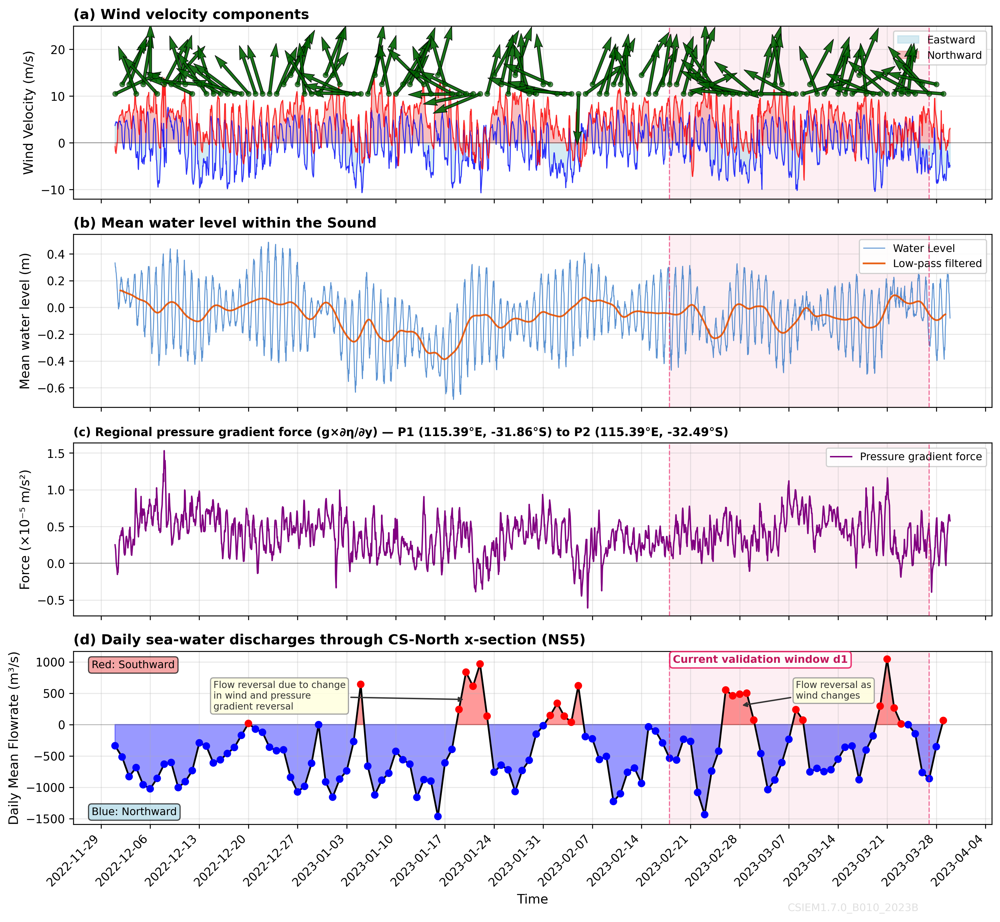
```

:::{.figcap}
**Figure 9.10.** Analysis of controls on Cockburn Sound exchange flows (Dec 2022 – Mar 2023), summarising the wind regime (a), mean water level variation within the Sound (b), the regional alongshore pressure gradient force between a northern and southern offshore point (c), and the net daily exchange flow through the CS-North transect NS5 (d). The pink shaded region indicates the overlap with ADV current validation window d1.
:::


The Ruiz-Montoya & Lowe (2014) and Pattiarachi *et al.* (2025) data-sets (termed UWA-ADCP and WWMSP5-AWAC, respectively), and the Xiao *et al.* (2022) FVCOM modelling, all highlight the characteristic two-layer flow that occurs across the northern transect (Woodman Pt to Nth of Garden Is.). This is seen in the model in the current-profile validation and residual circulation plots in Section 9.7. The pattern of exchange with Cockburn Sound and the surrounding waters is therefore complex, varying both through time, and also vertically across the transect. The variation leads to variability in the rate of flushing of the internal Cockburn Sound waters. To depict the overall effect of the changing two-layer flow dynamic on the water retention time, a water "age" tracer was included into the simulation, and a transect shows locations of net retention (Figure 9.11). Playing the animation shows relatively "new" water coming in from areas around Cockburn Sound (both in from the North and South), and the retention of relatively "old" water within the main basin. Importantly, periods of strong two-layer flow occur whereby "new" water inserts into the lower portion of the basin, before it is subjected to vertical mixing. 


```{r, echo=FALSE, out.width="97%"}
knitr::include_graphics("./media/hydro/curtain_1panel_animation_2023-01-AGE_long.gif")
```

:::{.figcap}
**Figure 9.11.** Transect animation of CSIEM "water age" variable and vertical current vectors, highlighting variability in water flow direction and the two-layer exchange between CS and OA.
:::

## D'Adamo hydrodynamic regimes

In his seminal work on Cockburn Sound dynamics, D'Adamo (1992), synthesised the spatio-temporal variability in water conditions into several categories that occur throughout the year associated with changing hydrodynamic structure and mixing behaviour. The different hydrodynamic regimes emerge from the shifting interplay between atmospheric forcing (wind and evaporation), regional ocean forcing, and episodic freshwater inflows. These changing states regulate stratification phenology, the extent of deep-water renewal, and broader exchange dynamics between the Sound and the adjacent continental shelf, and thus provide important context for interpreting patterns in water quality and when assessing ecological risks. These are summarised as:

- Summer (wind-dominated, well-mixed): Higher rates of evaporation and solar heating maintain elevated salinity and temperature in the basin relative to surrounding coastal waters, with minimal freshwater influence. Some diurnal thermal stratification forms, and strong (>10 m s⁻¹) afternoon sea breezes from the south-west occur regularly, driving a wind-forced surface flow heading north, and a deeper return current creating a tendency for formation of a bottom anti-clockwise gyre. Regular full-depth mixing occurs through the combined effects of water column wind stirring and night-time convective cooling, limiting persistent stratification.

- Autumn (transition, stratified):  The cumulative effect of several high evaporation months leads to persistently elevated basin salinity, while the strengthening Leeuwin Current elevates temperature within the south-bound regional waters, resulting in cooler basin temperatures relative to the shelf. Basin waters in this regime are typically denser than shelf waters (high salinity, low temperature), promoting a buoyant ocean inflow pattern into the north of the Sound. Prolonged periods of weak wind forcing exist between relatively infrequent storms (≈5 per month), which allows periods of several days, or even weeks in some circumstances, where persistent vertical thermal and salinity stratification dominates, and mixing due to wind and convective cooling is not strong enough to cause mixing down the entire water column (incomplete vertical mixing). 

- Winter–Spring (storm-driven renewal):  Reduced evaporation and lower solar radiation occur alongside the relatively warm Leeuwin Current offshore waters, plus residual brackish waters from freshwater inputs, results in basin densities typically lower than the shelf. Weak winds are interspersed with strong winter storm events (≈6–10 per month), which regularly drive full-depth mixing. Following storm events, the deep waters in the Sound are influenced by bottom flows entering from the north and south entrances, driving a gradual export of displaced basin waters via surface water flows from both entrances.

- Winter–Spring (river plume episodes): The above storm-dominated cycle becomes disrupted during major estuary discharge events, when significant brackish water plumes  exit from Fremantle and move southward into Cockburn Sound, mediated by favourable (north-east to north-west) wind conditions. These events generate a buoyant surface plume and cause persistent vertical density stratification within the Sound, temporarily suppressing vertical mixing. After the inflow event, the lower salinity creates a legacy density anomaly that is gradually replaced by bottom inflows entering from the north and south entrances, and export of displaced basin waters through surface flows.

It is worth highlighting that these are general states, and they can be complicated by atypical flows (e.g., summer floods associated with cyclones in the north). 

As part of the Southern Metropolitan Coastal Water Study (SMCWS) a simple plot was introduced to show the typical annual cycle in $S$, $T$ and $ρ$ differences between Cockburn Sound and the adjacent shelf waters. In this plot, diagonals are lines of density difference, and based on either field or model data, the seasonal shifts in density difference between the embayment and surrounding ocean can be depicted.  D'Adamo (1992) used this plot comparing the salinity difference versus temperature difference in order to show reversals of density difference, evolving month-by-month and circling around through consecutive seasons. The significance of the plot is to highlight the shifting environment within which the Cockburn Sound embayment is operating, and in particular when strong barotropic or baroclinic conditions will be dominating water exchange.

To understand the models' ability to capture the shifts in regimes, the plot was replicated using outputs from the CSIEM simulations (Figure 9.12), and based on modelled data extracted from the same locations as in the original analysis. The results for the modelled calendar year 2021 are most similar to the 1990's data-set originally used in the D'Adamo analysis, since a significant low-salinity river plume occurred within winter and persisted into spring in that year, similar to the 1992-1994 period originally studied. The other years that were investigated in the model show the monthly evolution, but notably the dry years (2015 and 2023/4) have their seasonal cycle restricted to occur within regimes X and Y. This is expected as a result of the very low flows in these years through the Swan-Canning and Peel-Harvey systems, and also noting that since the original D'Adamo study, the high-salinity PSDP discharge now occurs within the Sound, and causes a seasonally persistent salinity increase, and also since the low-salinity waste water plumes are now discharged to the west of Garden Island. 

#### {.panelset .unnumbered}

##### D'Adamo : 2021 {.unnumbered}

```{r, echo=FALSE, out.width="90%"}
knitr::include_graphics("./media/hydro/dadamo/dadamo_2021A.png")
```

:::{.figcap}
**Figure 9.12-i.** Year 2021.
:::

##### D'Adamo : 2022 {.unnumbered}

```{r, echo=FALSE, out.width="90%"}
knitr::include_graphics("./media/hydro/dadamo/dadamo_2022B.png")
```

:::{.figcap}
**Figure 9.12-ii.** Year 2022.
:::

##### D'Adamo : 2023 {.unnumbered}

```{r, echo=FALSE, out.width="90%"}
knitr::include_graphics("./media/hydro/dadamo/dadamo_2023B.png")
```

:::{.figcap}
**Figure 9.12-iii.** Year 2023.
:::

##### D'Adamo : Reference {.unnumbered}

```{r, echo=FALSE, out.width="95%"}
knitr::include_graphics("./media/hydro/dadamo/original.png")
```

:::{.figcap}
**Figure 9.12-iv.** "Density regime plot originally presented in D'Adamo (1992), showing the field observations of the SMCWS study presented in terms of the gradient between the within-sound and offshore density conditions".
:::


## Vertical stratification

A key feature of Cockburn Sound in summer and autumn is short to medium periods of water column density stratification (Dalseno *et al.*, 2024; Xiao *et al.*, 2024). The model has therefore been explored in terms of its ability to resolve periods of vertical stratification. Figure 9.13 depicts the dynamics of thermal stratification developing in the main basin during an early summer period, and Figure 9.14 shows monthly transect profiles of temperature, salinity and current speed across Cockburn Sound and Owen Anchorage from September 2022 to June 2023.


```{r, echo=FALSE, out.width="90%"}
knitr::include_graphics("./media/hydro/stratification/Curtain_Animation.gif")
```

:::{.figcap}
**Figure 9.13.** Multi-panel animation of the 2023 early summer period, showing the thermal stratification developing in the main basin of Cockburn Sound.
:::

#### {.panelset .unnumbered}

##### Sep {.unnumbered}

```{r, echo=FALSE, out.width="90%"}
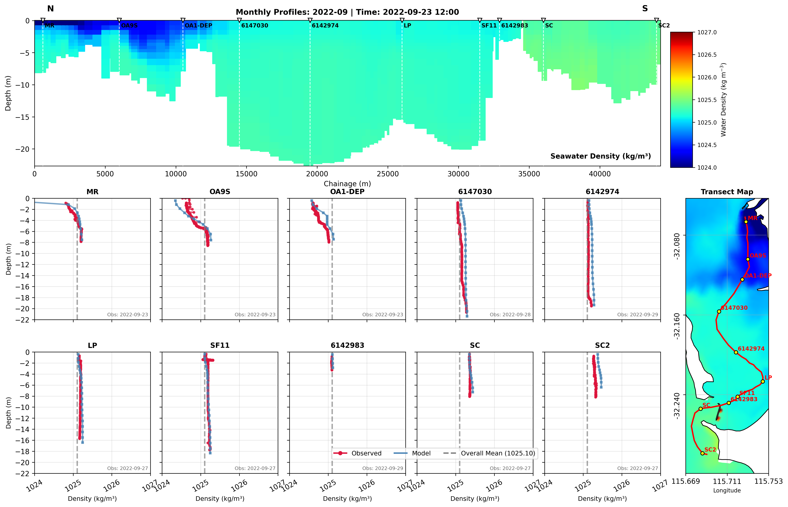
```

:::{.figcap}
**Figure 9.14-i.** Transect profiles of temperature, salinity and current speed across Cockburn Sound and Owen Anchorage, September 2022.
:::

##### Oct {.unnumbered}

```{r, echo=FALSE, out.width="90%"}
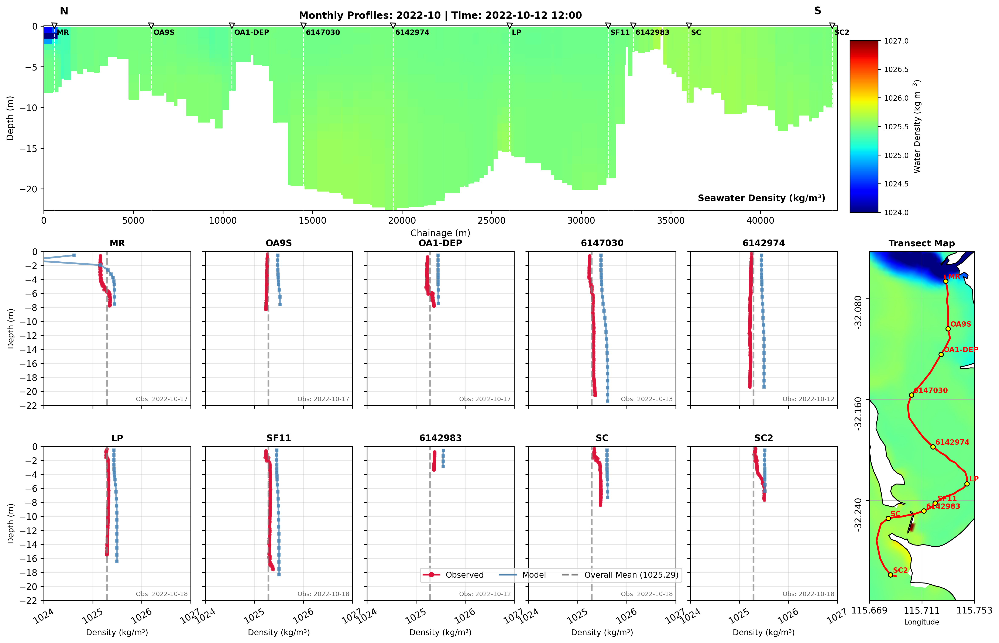
```

:::{.figcap}
**Figure 9.14-ii.** Transect profiles of temperature, salinity and current speed across Cockburn Sound and Owen Anchorage, October 2022.
:::

##### Nov {.unnumbered}

```{r, echo=FALSE, out.width="90%"}
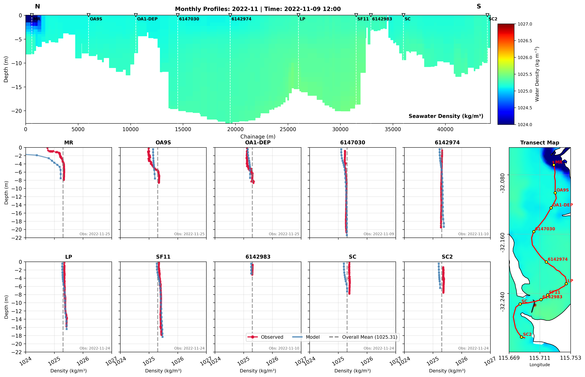
```

:::{.figcap}
**Figure 9.14-iii.** Transect profiles of temperature, salinity and current speed across Cockburn Sound and Owen Anchorage, November 2022.
:::

##### Dec {.unnumbered}

```{r, echo=FALSE, out.width="90%"}
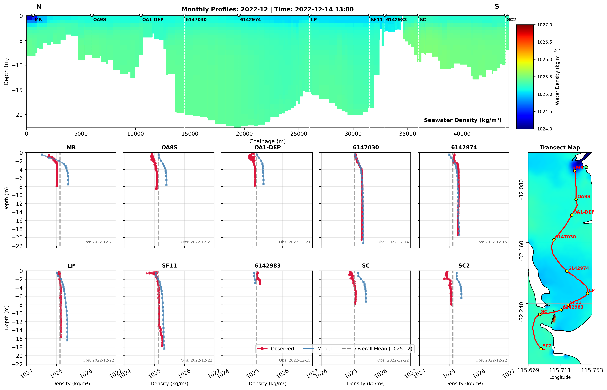
```

:::{.figcap}
**Figure 9.14-iv.** Transect profiles of temperature, salinity and current speed across Cockburn Sound and Owen Anchorage, December 2022.
:::

##### Jan {.unnumbered}

```{r, echo=FALSE, out.width="90%"}
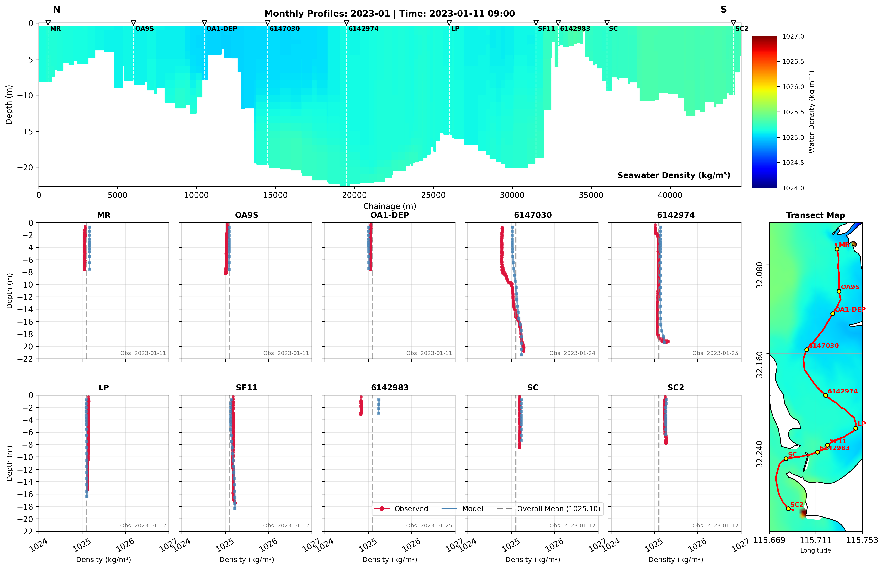
```

:::{.figcap}
**Figure 9.14-v.** Transect profiles of temperature, salinity and current speed across Cockburn Sound and Owen Anchorage, January 2023.
:::

##### Feb {.unnumbered}

```{r, echo=FALSE, out.width="90%"}
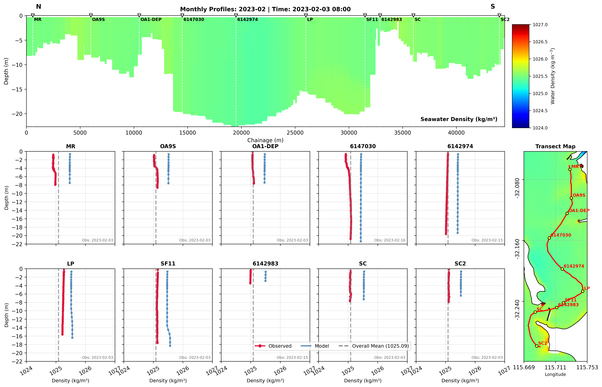
```

:::{.figcap}
**Figure 9.14-vi.** Transect profiles of temperature, salinity and current speed across Cockburn Sound and Owen Anchorage, February 2023.
:::

##### Mar {.unnumbered}

```{r, echo=FALSE, out.width="90%"}
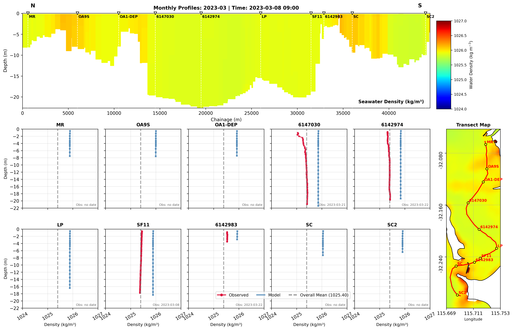
```

:::{.figcap}
**Figure 9.14-vii.** Transect profiles of temperature, salinity and current speed across Cockburn Sound and Owen Anchorage, March 2023.
:::

##### Apr {.unnumbered}

```{r, echo=FALSE, out.width="90%"}
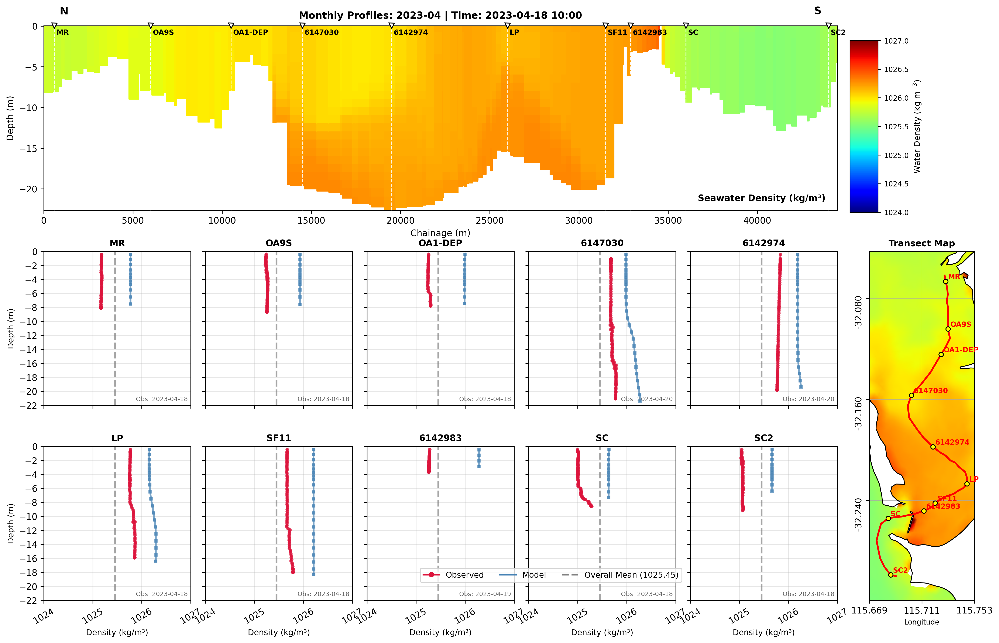
```

:::{.figcap}
**Figure 9.14-viii.** Transect profiles of temperature, salinity and current speed across Cockburn Sound and Owen Anchorage, April 2023.
:::

##### May {.unnumbered}

```{r, echo=FALSE, out.width="90%"}
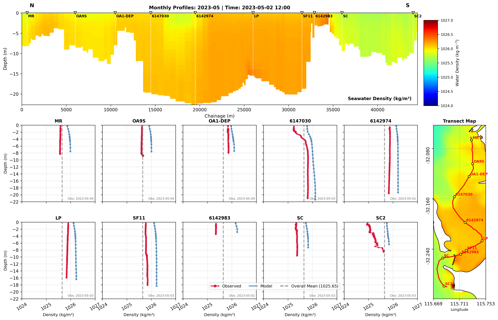
```

:::{.figcap}
**Figure 9.14-ix.** Transect profiles of temperature, salinity and current speed across Cockburn Sound and Owen Anchorage, May 2023.
:::

##### Jun {.unnumbered}

```{r, echo=FALSE, out.width="90%"}
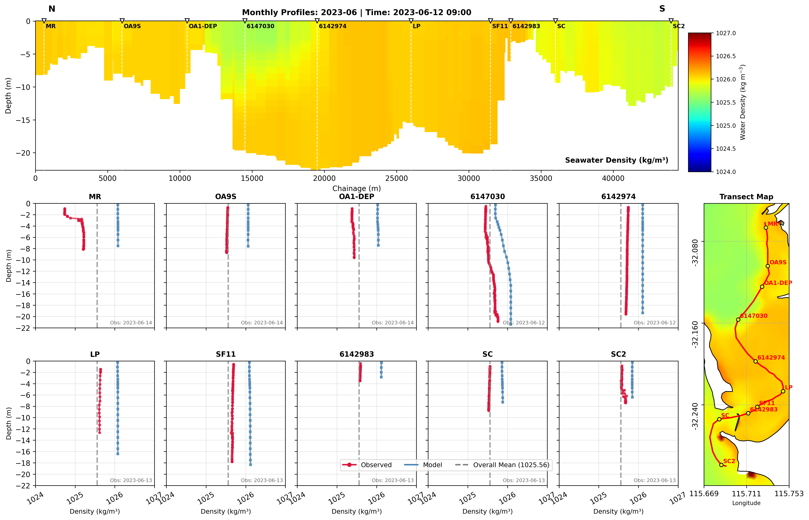
```

:::{.figcap}
**Figure 9.14-x.** Transect profiles of temperature, salinity and current speed across Cockburn Sound and Owen Anchorage, June 2023.
:::

The overall strength of vertical stratification in water density can be contributed to by both salinity gradients and thermal gradients (D'Adamo, 2002), and this is episodic and can be short-lived depending of the prevailing strength of wind and currents. The monthly profile (CTD) data-sets collected are not well-suited to explore the transient nature of stratification episodes, so we look to the high-frequency sensors that are available to demonstrate this aspect. 

### Thermal stratification validation

A main vertically resolved data-set is the thermistor-chain deployed at two deep-water stations as part of the WWMSP, which collected data during five deployments during 2021 and 2022 at one site in the north of the basin (CS1) and one site in the south (CS3). Raw thermistor observations from the CS1 & CS3 sites were obtained from the data-warehouse (`wamsi/wwmsp5/wq`), spanning depths from the seabed up to approximately 5 m below the surface (see Pattiarachi *et al.*, 2024 for deployment details). Note that bottom comparisons of the deep sensors in this data-set are also shown in section 9.6, indicating the model captures the seasonal trends in this data-set well. 

The thermistors for each location and each deployment were interpolated onto a vertical profile (50 cm resolution) for comparison with the CSIEM simulations - the results for CSIEM 1.7A are shown in Figure 9.15. At both the north site (CS1) and the south site (CS3), the observations reveal a characteristic pattern of episodic thermal stratification during the late spring–summer period, with surface-to-bottom temperature differences reaching >2 °C during sustained heating events, interspersed with rapid destratification episodes driven by wind mixing. The model reproduces the key features of the observed vertical thermal structure with good fidelity: the onset and duration of stratification episodes, the depth of the developing thermocline, and the timing of wind-driven mixing events that periodically homogenise the water column are all well captured. The magnitude of surface warming and the vertical temperature gradient across the thermocline are consistent between observed and modelled fields at both sites. Minor discrepancies are evident in the sharpness of the thermocline, with the model producing a somewhat smoother vertical transition, likely reflecting the vertical grid resolution and turbulence closure scheme. 


#### {.panelset .unnumbered}

##### North Basin CS1 (2021: Deployment2) {.unnumbered}

```{r, echo=FALSE, out.width="90%"}
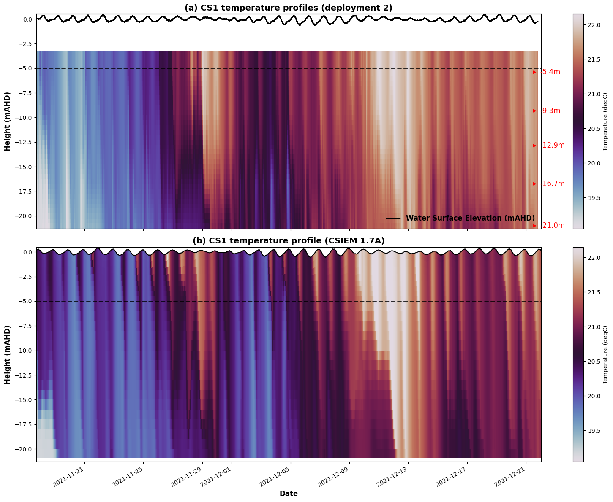
```

:::{.figcap}
**Figure 9.15-i.** Comparison of observed (a) vs modelled (b) vertical temperature profiles at site CS1 (north end of the deep basin). The observation depths are indicated by the red markers in panel (a) and were vertically-interpolated to create a 5cm resolution profile for each hour. The horizontal dash-line demarcates the depth below which model vs observed data should be compared.
:::

##### South Basin CS3 (2021: Deployment2) {.unnumbered}

```{r, echo=FALSE, out.width="90%"}
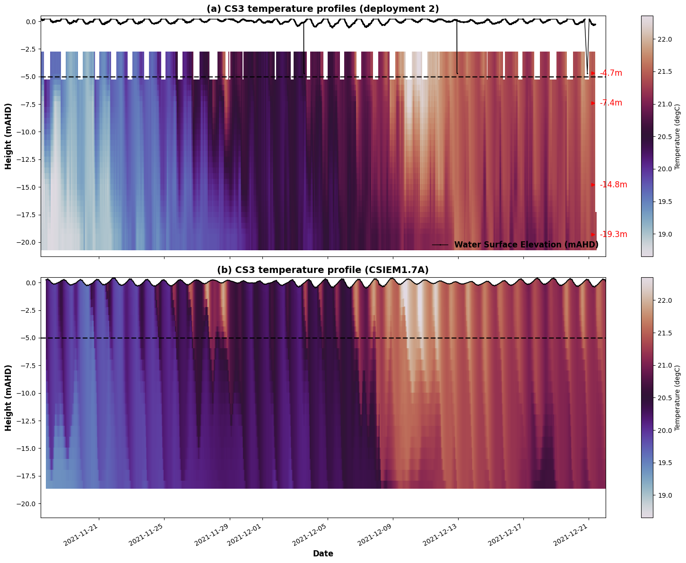
```

:::{.figcap}
**Figure 9.15-ii.** Comparison of observed (a) vs modelled (b) vertical temperature profiles at site CS3 (south end of the deep basin). The observation depths are indicated by the red markers in panel (a) and were vertically-interpolated to create a 5cm resolution profile for each hour. The horizontal dash-line demarcates the depth below which model vs observed data should be compared.
:::

<!--
##### 2021 : April-May {.unnumbered}

```{r, echo=FALSE, out.width="90%"}
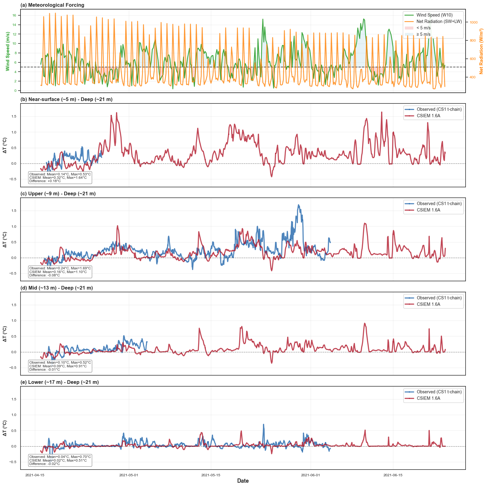
```

:::{.figcap}
**Figure 9.15-iii.** Time-series comparison of observed vs modelled vertical temperature differences.
:::

##### 2022 : January-March {.unnumbered}

```{r, echo=FALSE, out.width="90%"}
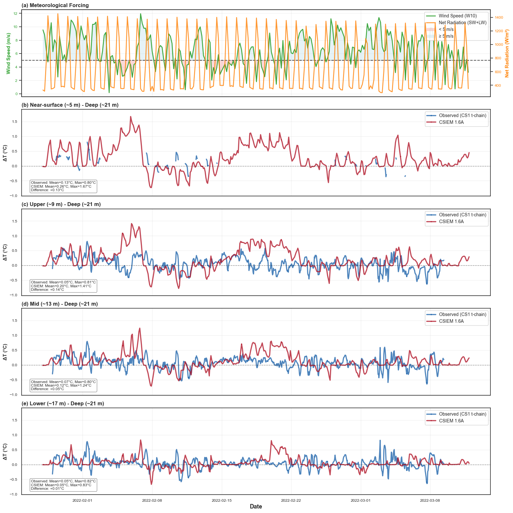
```

:::{.figcap}
**Figure 9.15-iv.** Time-series comparison of observed vs modelled vertical temperature differences.
:::

##### 2022 : June-August {.unnumbered}

```{r, echo=FALSE, out.width="90%"}
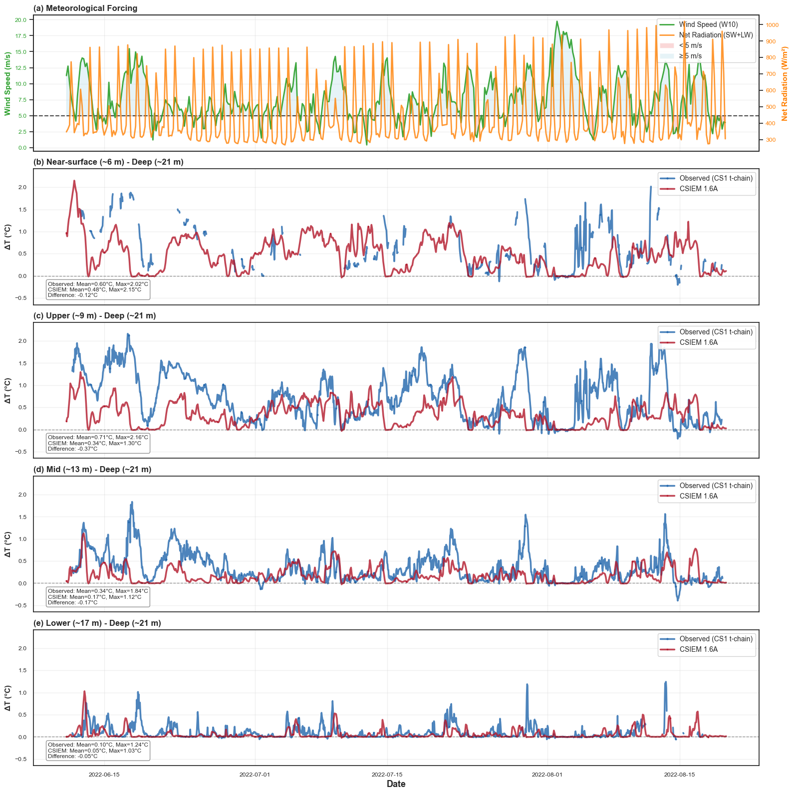
```

:::{.figcap}
**Figure 9.15-v.** Time-series comparison of observed vs modelled vertical temperature differences.
:::
-->

#### {.unnumbered}

In addition to the thermistor-chain data, the DWER profiling moorings deployed at four locations across Cockburn Sound (CS4, Desal, CS13 and CS11) provide a further extensive data-set for assessing the model's vertical structure, particularly in the deep basin. These moorings collect continuous (~ hourly) profiles of temperature, salinity, dissolved oxygen and density through the water column; a month-by-month comparison of observed vs modelled curtain plots (depth vs time) is presented for each station, ordered from north to south in the [<span style="color: blue">**Temperature & Salinity Mooring Report Card**</span>](validation/mooring.html). Note that the mooring data is subject to sensor drift and biofouling, so months where data quality was considered unreliable have been excluded from the report cards following review against DWER field notes. Nonetheless, there are many months of high quality data which compare well with the model and shows CSIEM has excellent fidelity in resolving the dynamic patterns of mixing and stratification.


## River inflow events influencing Cockburn Sound

As outlined above, the effect of high versus low river flow events within the Swan-Canning basin can influence the regimes experienced by the Sound. From the point of view of assessing CS ecosystem conditions, this also has particular relevance in terms of computing nutrient budgets and loads (see Chapter 10). Given the changing flow directions along the Perth coast (see section 9.8), the timing and magnitude of the Swan-Canning flow events moving through Fremantle will influence the nature of Swan Estuary water entering into Cockburn Sound. An example of CSIEM output for the 2021 winter period is shown in Figure 9.16.

```{r, echo=FALSE, out.width="95%"}
knitr::include_graphics("./media/hydro/river/curtain_4panel_animation_2021-08-FLOOD.gif")
```

:::{.figcap}
**Figure 9.16.** Multi-panel animation of the 2021 winter flow season, showing connectivity of the river plume into Cockburn Sound, and its eventual mixing.
:::

To demonstrate the spatial extent of river influence, a satellite image with a clear CDOM signal showing the river plume, was compared to a simulation undertaken with a conservative tracer (TRC_tr1) added to the Canning and Narrows inflows (Figure 9.17). Noting that CDOM (measured) and TRC_tr1 (modelled) variables are not directly equivalent, and slight timing differences between the snapshots, the comparison nonetheless shows the promising performance of the model in capturing the general flow tendency, the plume extent, and its pattern of dispersion through Cockburn Sound.

```{r, echo=FALSE, out.width="95%"}
knitr::include_graphics("./media/hydro/river/Flood_Tracer_4-8-2021.png")
```

:::{.figcap}
**Figure 9.17.** Comparison of river plume extent during August 2021, as depicted in satellite imagery (left, using CDOM as an indicator of river water presence), and also the modelled river inflow tracer (right, TRC_tr1). The river plume was driven south due to the prevailing wind conditions at this time.
:::


Investigation of vertical salinity structure during this 2021 winter flow event highlights the effect of the river pulse as it builds up within the Sound, as shown for example comparing against vertical profile data from the DWER water quality moorings (Figure 9.18). The model faithfully captures the timing of the arrival of the plume at the most distant mooring (CS13), the extent of salinity dilution and the nature of the plume's deepening as mixing progressively erodes the sharp stratification.

 
```{r, echo=FALSE, out.width="90%"}
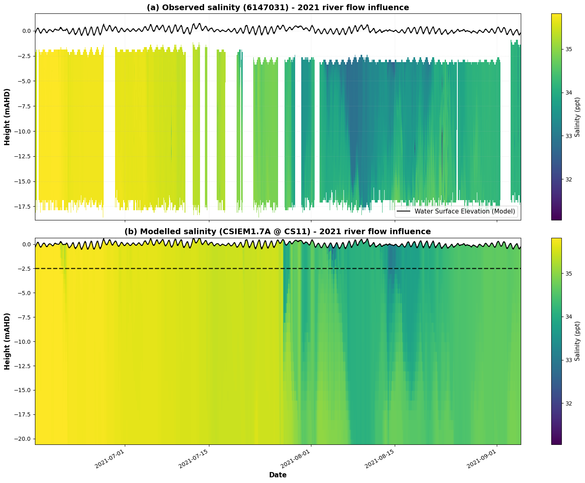
```

:::{.figcap}
**Figure 9.18.** Comparison of the model with the profile mooring in the southern reach of the deep basin, showing the transition due to penetration of the brackish river plume.
:::

Comparison of bottom versus surface water salinity and temperature during 2021 highlight the effect of the river pulses throughout the Sound, as shown for example comparing the north and south regions of the Cockburn Sound deep basin (Figure 9.19). 

```{r, echo=FALSE, out.width="90%"}
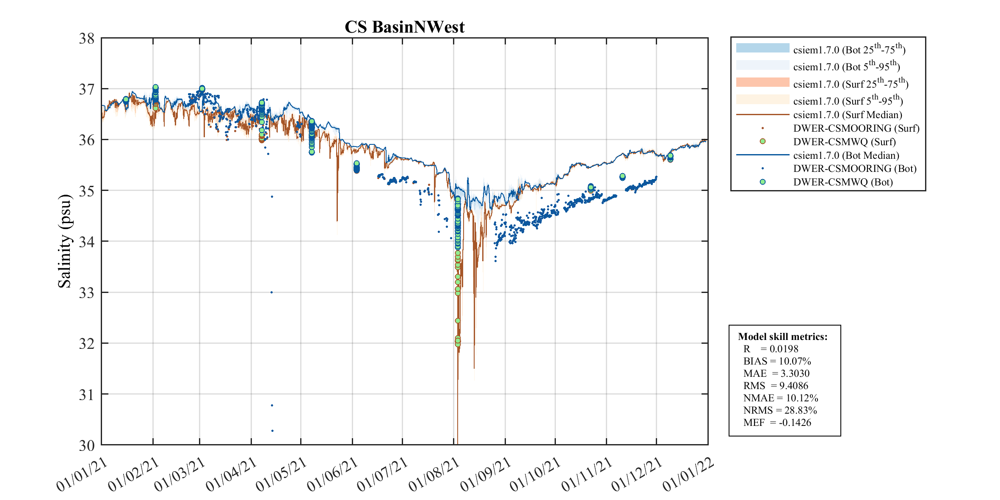
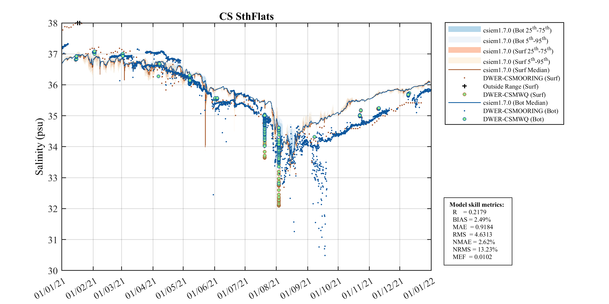
```

:::{.figcap}
**Figure 9.19.** Comparison of the model with the surface and bottom mooring data, and the regular profile data, at north (top) and south (bottom) locations in the deep basin.
:::


## Influence of industry discharges on temperature and salinity

Outputs of the model at various times are able to show the effect of surface cooling waters released to the Sound (Figure 9.20), and the brine discharge (Figure 9.21).


```{r, echo=FALSE, out.width="49%", fig.show="hold"}
knitr::include_graphics(c("./media/image41.png", "./media/image42.png"))
```

:::{.figcap}
**Figure 9.20.** Comparison of water temperature within Cockburn Sound for two time snapshots in April 2013.
:::

```{r, echo=FALSE, out.width="90%"}
knitr::include_graphics("./media/image43.png")
```

:::{.figcap}
**Figure 9.21.** Output of the CSIEM model demonstrating the plume from the PSDP brine discharge, as both a salinity anomaly, and discharge tracer.
:::

 The influence of these discharges on the background water temperature and salinity levels are able to be seen in the "`KS-South`" assessment polygon spanning the region with the Kwinana discharges in Figure 9.22 (2023 shown, other years visible through ([<span style="color: blue">**MARVL-VIEWER**</span>](https://csiem-mv.seaf.org.au)). This region receives the PSDP brine which is seen to cause the large range of model salinities in this region (as shown in the blue-shading); these high salinity values are not observed elsewhere and match the range seen in the profile data-set.

```{r, echo=FALSE, out.width=c("30%","69%"), fig.show="hold"}
knitr::include_graphics(c("./media/hydro/KS_South.png", "./media/hydro/KS_South_SAL_2023.png"))
```

:::{.figcap}
**Figure 9.22.** Comparison of observed and simulated $Salinity$ ($psu$), within Kwinana South polygon. The small points are data from the DWER mooring logger situated above the seabed, and the circles represent data from the CTD casts collected in this region as part of the DWER-CSMWQ and WWMSP programs.
:::

Detailed analyses of these plumes is beyond the scope of this documentation and we do not seek to describe their near-field dynamics in detail here; interested readers can however refer to BMT (2018b) for an analysis of the PSDP brine plume as undertaken with TUFLOW-FV using a similar configuration as to what has been adopted within CSIEM. 


## Summary

This chapter describes a holistic assessment of the outputs from the hydrodynamic model TUFLOW-FV, which is the core engine used within the CSIEM platform. This assessment of the model's performance demonstrates the model's ability to resolve currents and key circulation features within Cockburn Sound and the surrounding waters. This assessment has been made in the context of development of an integrated approach to ecosystem prediction, linking met-ocean conditions, biogeochemistry and ecology in a coordinated way over the scales relevant to cumulative environmental impact assessment.

Development of the CSIEM model has been undertaken during the WWMSP Project 1.2, and co-ordinated in with other applications of the CSIEM model that have focused on hydrodynamics, flushing and sediment transport as part of Westport's assessment of port options, and environmental impact assessment. Note further validation metrics have been undertaken through this process using the Westport specific mesh configuration, and these two independently undertaken assessments of the model can be viewed as complementary.

Examples presented in this chapter have been selected to demonstrate general aspects of the model performance for specific years and select periods where high quality data was available. Note that the model has been applied across many years of different conditions, and a detailed catalogue of the model validation plots of key parameters for all the CSIEM assessment polygons and all the available data sets is able to be interrogated via the [<span style="color: blue">**MARVL-VIEWER**</span>](https://csiem-mv.seaf.org.au). Further focused validation plots exploring dynamics of these system and the response during specific events are also able to be made using the numerous specific scripts included in the `csiem-marvl` repository (see Chapter 5).


<br>

```{block2, hintHydroSummary, type='rmdsummary'}
This hydrodynamic model assessment has demonstrated the model is capable to resolve:

- *Variability in water levels*: tidal, seasonal and sub-tidal signals validated against BOM Hillarys and Fremantle tide gauges across eight multi-year runs (median Willmott skill 0.96, RMSE 7–9 cm), including the Leeuwin Current influence on seasonal sea level and continental shelf wave responses to tropical cyclone activity
- *Variability in water currents across the Perth coastal region*: comparison against AWAC and ADV deployments in Owen Anchorage and Cockburn Sound, capturing the phase and magnitude of current reversals under both summer sea-breeze and winter storm conditions
- *Dynamics of two-layer flow in Cockburn Sound*: wind-driven surface flow heading northward with a compensatory deep return current, including episodic flow reversals linked to shifts in the alongshore pressure gradient
- *Residual circulation features within Cockburn Sound*: prediction of the anti-clockwise bottom gyre in summer and the seasonal reversal to southward-dominated flow in winter, consistent with previously observed patterns
- *Gradients in temperature and salinity, including vertical structure*: seasonal and inter-annual patterns across multiple assessment regions validated over six years (r > 0.95 for temperature), and depth-resolved comparisons against mooring profilers and thermistor chains demonstrating resolution of episodic stratification events
- *Seasonal regimes and changing controls on flow dynamics and mixing*: reproduction of the D'Adamo (1992) density regime progression, capturing the annual cycle through summer sea-breeze cycle, autumn-stratified conditions, winter storm-driven renewal, and river plume influence
- *Retention time and flushing rates*: water-age tracer analysis showing spatial variability in residence time, with shorter flushing in the north and extended retention in the southern basin, modulated by the two-layer exchange dynamic
- *Sensitivity to Swan River flows*: validated against the 2021 winter flood event, capturing plume penetration into the Sound, the timing of salinity dilution at distal moorings, and the progressive deepening and erosion of the brackish surface layer; accurately resolving the different response of 2021 (southward) and 2022 (northward) high-flow events on Cockburn Sound salinity
```

<br>


