# Swan River Inputs {#swan-river}

## Overview

The dynamics of the  Swan-Canning Estuary (SCE)  has an impact on Perth coastal waters, and resolving these dynamics is an important focus of the CSIEM model setup. The flows from the estuary into the coast vary considerably, both throughout the year, and also from year-to-year. They can have a considerable impact on water salinity, vertical mixing, water nutrient concentrations, and the benthic light-climate experienced within the CS and OA regions.

During high catchment flow years, the amounts of water exiting Fremantle into the ocean are considerable. Depending on the direction of winds and prevailing currents at the time of peak discharge, the SCE plume will travel with a northward or southward tendency. In particular, when the flow travels southward, the river plume can extend all the way to the north of Cockburn Sound, and, sometimes, the plume can extend across the full extent of the Sound, as occurred in 2021 (Figure \@ref(fig:sce-plumes); see also Section 7.5). The plume extent and direction may also be sensitive to the specific tidal regime or any sea-level anomaly occurring at the time of the peak river discharge. WHislt the large plumes are most noticeable, there is also a base load of nutrients leaving the SCE system even under normal conditions.


(ref:sce-plumes) Satellite imagery of CDOM coloured water exiting Fremantle, show the pattern of the SCE river plume, for six different dates (a - f). Imagery from the Sentinel-2 platform. Taken from [https://csiemdash-leaflet.seaf.org.au]; follow this link for further images and image processing details.

```{r sce-plumes, echo=FALSE, fig.cap="(ref:sce-plumes)", out.width="99%"}
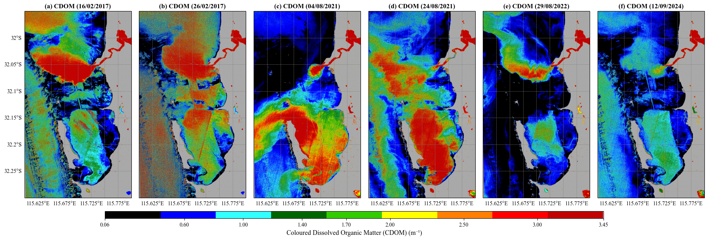
```


Water flows into the SCE have been monitored since the 1970's and catchment nutrient contributions have been monitored since the 1990's. These data-sets provide important context for the interannual variability in flows and nutrient concentrations, and insights into long-term changes brought about by the climate drying-trend and catchment management. The water and nutrients entering the SCE are a blend of water from the large Avon River catchment and the smaller but more urbanised Swan Coastal Plain catchments, and each of these systems has a different response to rainfall and the different land management and nutrient export signatures. 

Overall, there are 30 main reporting catchments that enter the SCE, plus the Avon. Not all the catchments entering the systems are gauged and so catchment modelling has also previously been relied upon to understand the *total* flow and nutrient contributions into the system. In addition, the estuary itself is an important filter of nutrient loads, and able to process and assimilate some of the raw catchment inputs before they enter the ocean plume. The prior development of the Swan-Canning Estuarine Response Model (SCERM) has been undertaken for a range of years, and well calibrated for the system (Huang et al., 2019), in particular to capture the seasonal salt-wedge dynamics, hypoxia and nutrient recycling. This model however did not resolve the ocean extent of the SCE river plume, and focused on areas upstream of Blackwall Reach. 

The aim of this chapter to is to described the setup and rationale of the SCE sub-domain within CSIEM, and to undertake detailed analysis the results to ascertain the catchment nutrient loads that make it from the SCE into the CSOA region. This provides important contextual information for understanding the nutrient dynamics and nutrient budget of Cockburn Sound, and serves as a foundation to help understand the relative scale of any local impacts that are being assessed.  

## Interannual variability in catchment discharge volumes and nutrient export loads

Integrated modelling of the Swan–Canning system has shown that interannual variability in freshwater discharge and nutrient export to the estuary is dominated by hydroclimatic forcing, with strong contrasts between wet and dry years, which is superimposed on a long-term drying trend. Simulations using the Swan Canning Catchment Model (SCCM) and  Avon catchment model by Paraska et al. (2021) provides the most recent estimate of the total annual flows and associated nutrient loads. The model shows that they vary by factors of several between years, with discharge magnitude being the primary control on total nitrogen (TN) and total phosphorus (TP) export.

The Avon River catchment is a dominant driver of the interannual variability experienced within the system. In wet years, when the Avon catchment is activated, this water source dominates total inflow to the estuary and accounts for the majority of nitrogen and phosphorus loads; this is a reflection of its large catchment area. In contrast, during dry years, Avon flows are greatly reduced or episodic, and the Swan Coastal Plain catchments contribute a larger proportion of total inflow and nutrient loads despite lower absolute volumes overall. In general, when the Avon dominates the total nitrogen loads in wet years, and Ellen Brook dominates the total P loads in normal to dry years.

### Guaged vs un-guaged flows

The SCE has 44 discrete input points from the surrounding catchment (Figure \@ref(fig:sce-inflows)). Many of these inflows represent small urban stormwater catchments that contribute small flows over all. Of the 44, there are 8 main guaged catchments (Figure \@ref(fig:sce-gauged)), which have long-term flow and nutrient monitoring; these 8 contribute approximately 80% of the total flow into the system on average, and even more durin ghigh Avon flow years. 


(ref:sce-inflows) Entry points of the Swan Coastal Plain catchments into the Swan-Canning Estuary (taken from Paraska et al., 2022). Of these 44 discrete inputs, the 8 major inflows are gauged.

```{r sce-inflows, echo=FALSE, fig.cap="(ref:sce-inflows)", out.width="70%"}
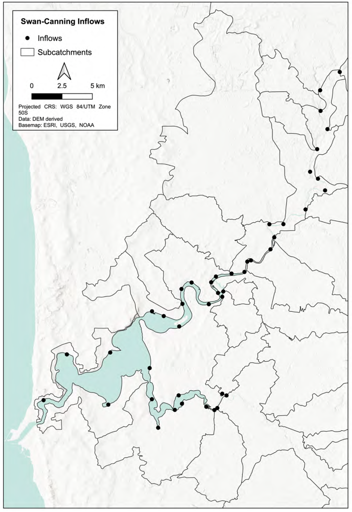
```


(ref:sce-gauged) Comparison of the gauged (monitored) catchment areas and the ungauged catchment areas contributing water into the SCE.

```{r sce-gauged, echo=FALSE, fig.cap="(ref:sce-gauged)", out.width="70%"}
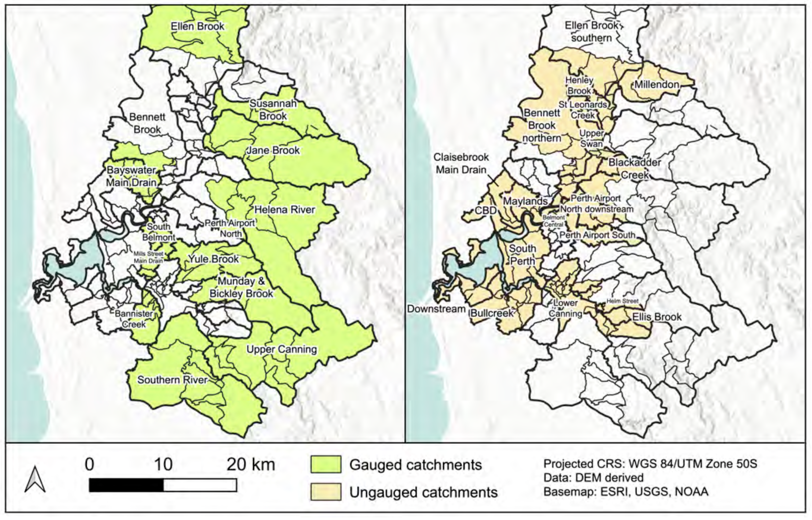
```


### Nutrient load changes over time

The analysis further shows that apparent long-term reductions in nutrient export since earlier modelling studies arise from a combination of management interventions and reduced discharge volumes associated with climate drying, rather than consistent reductions in flow-weighted nutrient concentrations. As a result, year-to-year comparisons of nutrient loads can obscure management signals, particularly when wet and dry years are compared directly.

Interannual variability also affects the seasonal timing of nutrient delivery, with wet years characterised by strong winter nutrient pulses and enhanced estuarine flushing, while dry years exhibit lower loads but reduced dilution capacity. These findings highlight the need to assess nutrient export and downstream water quality response over multi-year periods that explicitly account for this hydrologic variability.

### In-estuary processing

The catchment-derived sediment, carbon and nutrients experiences rapid dilution and biogeochemical transformations once it enters the SCE waterbody. In particular, there is loss of coarse particulates to the sediment, and vice versa, the sediment may re-release dissolved nutrient species, as mediated by oxygen. These effects are accounted for in the CSIEM setup, such that the upstream processing (e.g. in zones 1-8 of Figure \@ref(fig:sce-gauged)a) is captured since we adopt measured nutrients at the domian boundary locations, and the downstream processing (e.g. in zones 9-12 of Figure \@ref(fig:sce-erz)a), is captued by being simulated with the AED biogeochemical model (see Chapter 12.)


(ref:sce-erz) (a) Colour-coded estuary response zones used in prior SCE catchment-estuary modelling, showing (b) the nutrient vs N load contribution from all catchments upstream of zone 5. The CSIEM domain includes zones 9 - 12 within its modelled footprint, and nutrient concentrations in zones 5 and 8 are used to prescribe the concentrations to the inflowing water. Adapted from Paraska et al. (2021).

```{r sce-erz, echo=FALSE, fig.cap="(ref:sce-erz)", out.width="95%"}
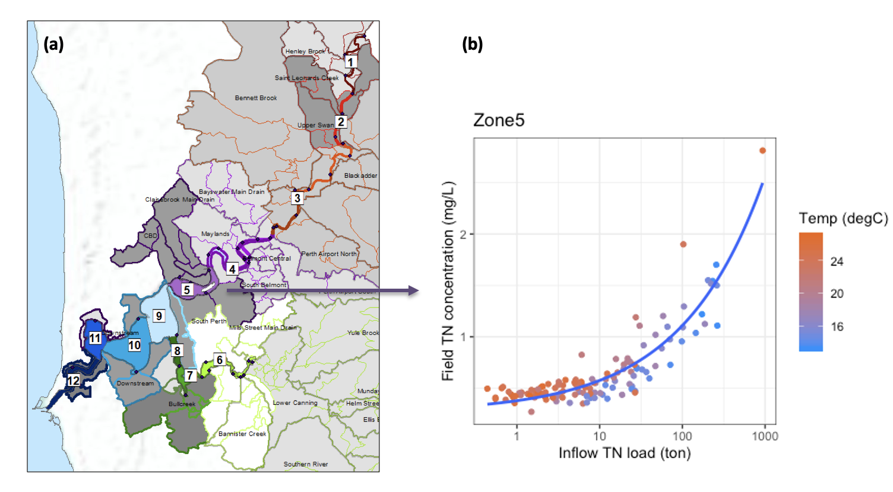
```

### Atypical summer storms

An interesting feature of the SCE and Perth coastal waters is the occasional occurrence of atypical flood events in the summer months. These events can be significant with rainfall totals exceeding 100mm, which result from the weather systems that influence the mid-latitudes after tropical cyclones develop in the northwest and dissipate. Whilst these flow events may be short-lived, they can have a profound influence on the estuary, and contribute substantial catchment-derived nutrients to the waterways when the ambient conditions are warm and when there is ample light. Several of the last summer flood events can also extend into the Perth coastal waters and influence Cockburn Sound and Owen Anchorage, as seen in Figure \@ref(fig:sce-plumes)a,b, showing the February 2017 summer plume. The deliver of nutrients during the summer has implications for nutrient fate and processing compared to the traditional winter pulse.

The loads that enter the ocean plume are mediated by their passage through the estuary, which is characterised by sharp two-layer stratification in the lower estuarine reach relevant to the CSIEM domain (Figure 11.5). Interestingly, two otherwise similar events, had distinct water dilution and mixing patterns, as mediated by different water salinity antecedent conditions, and sea-level conditions (Winter et al., 2019). The "Upper Swan Tracer" is an indicator of catchment nutrient levels, and the different patterns of this variable in the reach from 5 - 20km between the two events is a key determinant of what will be exported into the ocean.

<br>
<center>
<video width="97%" height="97%" controls>
<source src="./media/swan/4_panel_flood.mp4" type="video/mp4">
</video>
</center>

**Figure 11.5.** Animation of two similar summer flood events as simulated by the Swan-Canning Estuarine Response Model (SCERM). The time axis on the top-panels is adjusted to 0 at the peak of the river inflow to the SCE. Both events are similar magnitude, however, the model depicts the different stratification and salinity response in the lower estuary (2000 in the left and 2017 in the right).  Cross section spans from Fremantle Port at 0km to Perth CBD at 25km, and further up to Guildford at 60km. Analysis adapted from Winter et al. (2019).
<br>

## River inputs to the CSIEM domain

The CSIEM domain includes the dynamics of the Lower Swan-Canning estuary, west of the Narrows Bridge, and north of the Canning Hwy Bridge. The model setup therefore includes inputs from both the Swan and Canning tributaries directly into the domain as boundary conditions. Two alternate methods have been implemented and either can be chosen to specify the boundary condition:

 - **SCERM coupling**: The boundary conditions using this method adopt depth-resolved currents, water levels and biogeochemical variables from the calibrated SCERM model years (see Paraska et al., 2022, and Huang et al. 2019). This provides a high resolution input at the two boundary locations.
 - **CSV**: The boundary conditions are a time-series input file computed based on a sum of the upstream catchment flows, and using interpolated nutrient and water quality data from the most nearby routine DBCA monitoring stations.

For CSIEM 1.7.0, the model has been using the CSV approach to provide consistency between the CSEIM validation focus years. A summary of the past 25 years of flow and nutrient load data, as prescribed at the CSIEM model boundary, is show in Figures 8.6 - 8.8. 

The CSIEM validation focus years are highlighted and shown to vary across the range of river flow conditions (dry, mid and wet), and years in which atypical summer flow events occur are marked. 2022 and 2021 are large flow years, even acorss the entire record, and 2015 and 2020 are very dry years. A monthly summary of the selected flow years is also presented to demonstarte the nature of each year relative to the long-term mean. 

Note that the model also includes brackish water inputs from the Peel-Harvey estuary. They are shown here for completeness, but note are not part fo the tracer and load analysis undertaken in this Chapter.

### Water flows

#### {.panelset .unnumbered}

##### SCE Flow (time-series) {.unnumbered}

```{r, echo=FALSE, out.width="95%"}
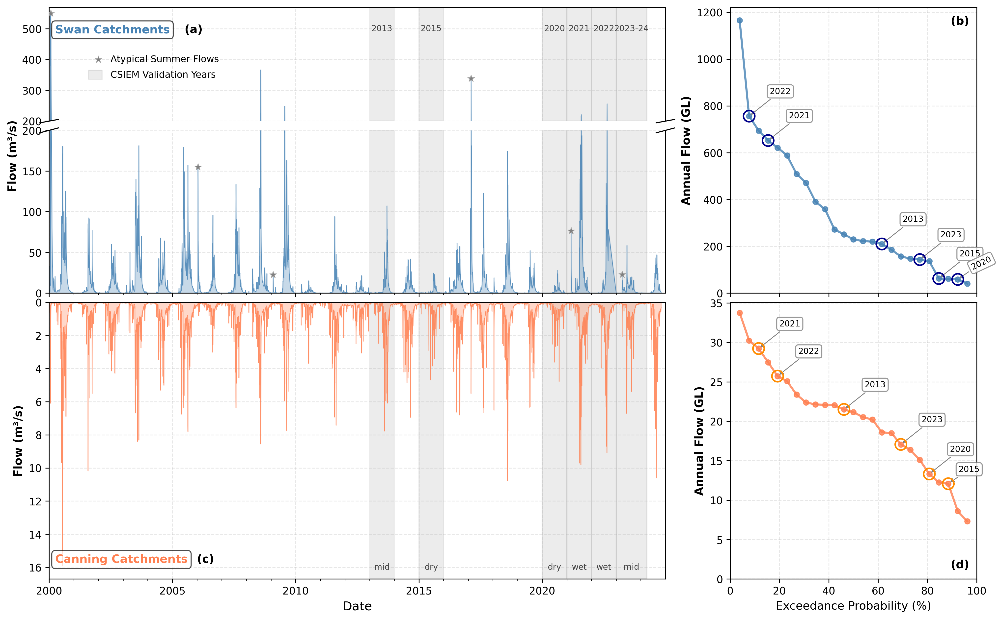
```

:::{.figcap}
**Figure 11.6-i.** Time-series (a,c) and exceedance plot (b,d) of water flows entering the SCE from all guaged catchment areas above the Narrows Bridge location (a and b), and upstream of the Canning Bridge location (c and d).
:::

##### SCE Flow (monthly) {.unnumbered}

```{r, echo=FALSE, out.width="95%"}
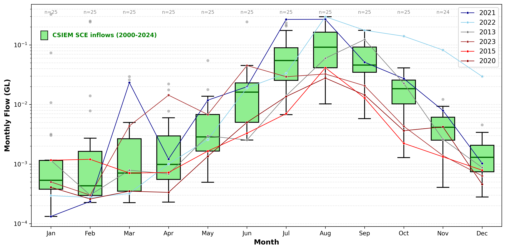
```

:::{.figcap}
**Figure 11.6-ii.** Long-term monthly flow distriubtion (Swan plus Canning catchments) for the years 2000 - 2024, overlain by the six CSIEM validation focus years.
:::

### Nitrogen loads


#### {.panelset .unnumbered}


##### SCE Nitrogen (time-series) {.unnumbered}

```{r, echo=FALSE, out.width="95%"}
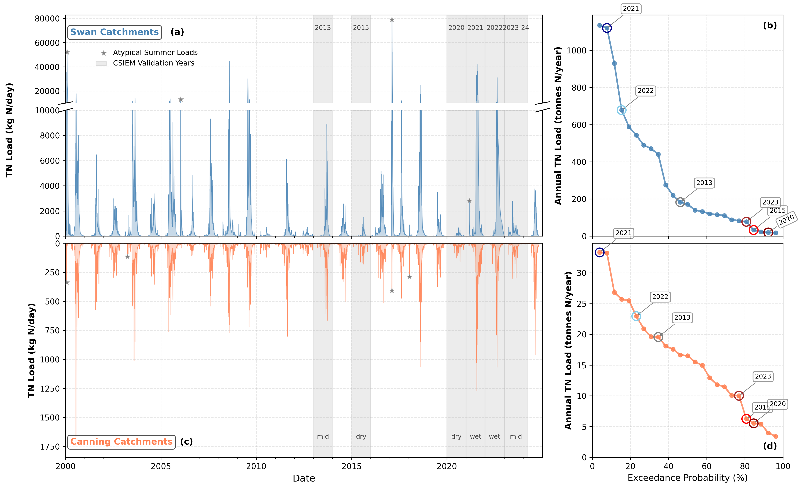
```

:::{.figcap}
**Figure 11.7-i.** Time-series (a,c) and exceedance plot (b,d) of nitrogen loads entering the SCE from all guaged catchment areas above the Narrows Bridge location (a and b), and upstream of the Canning Bridge location (c and d).
:::


##### SCE Nitrogen speciation {.unnumbered}

```{r, echo=FALSE, out.width="95%"}
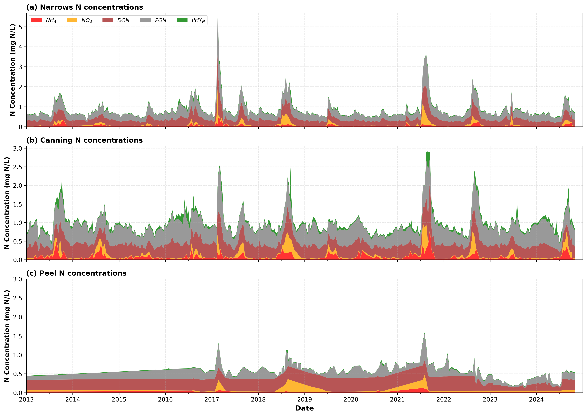
```

:::{.figcap}
**Figure 11.7-ii.** Comparison of the gauged (monitored) catchment areas and the ungauged catchment areas contributing water into the SCE.
:::

### Phosphorus loads

#### {.panelset .unnumbered}

##### SCE Phosphorus {.unnumbered}

```{r, echo=FALSE, out.width="95%"}
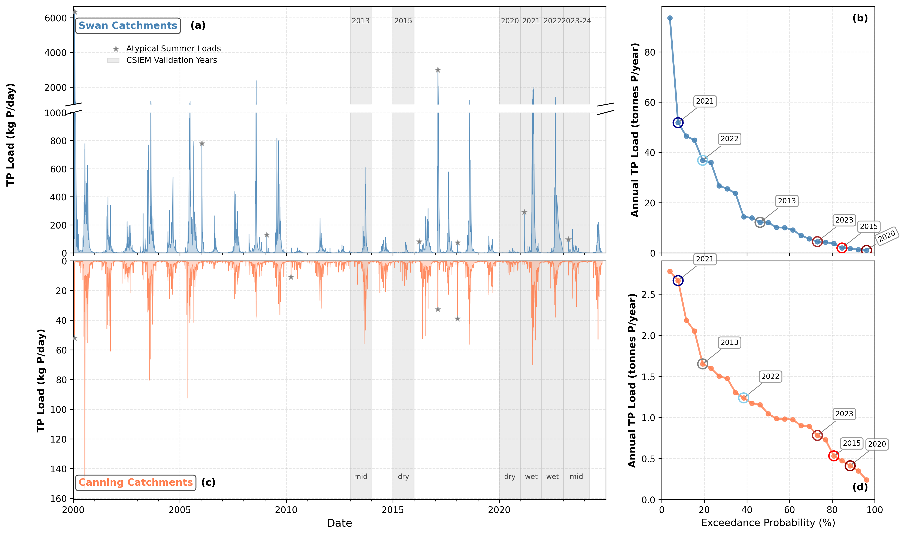
```

:::{.figcap}
**Figure 11.8-i.** Time-series (a,c) and exceedance plot (b,d) of phosphorus loads entering the SCE from all guaged catchment areas above the Narrows Bridge location (a and b), and upstream of the Canning Bridge location (c and d).
:::


##### Phosphorus speciation {.unnumbered}

```{r, echo=FALSE, out.width="95%"}
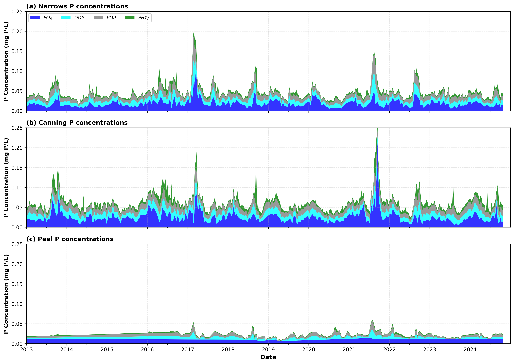
```

:::{.figcap}
**Figure 11.8-ii.** Interpolated and filled phosphorus speciation data for the 3 main estaury boundary inputs.
:::

<br>

## River plume connectivity with Cockburn Sound

River tracers used within CSIEM have been analysed to understand the river mass flux into (and out of) Cockburn Sound. A river tracer serves as a virtual dye in the water that allows water that has entered from a particular source to be tracked once it moves through the domain, subject to currents and dilution. For this analysis, the 6 focus validation years were run with the SCE inflows entering at the Narrows and Canning, and in addition to the water and nutrient amounts as shown in the previous section, a river tracer with a concentration of 1 g/m3 was added. This value is similar to the mean Total Nitrogen (TN) concentrations in the centre fo the estuary, and conceptually the tracer can be though of a conservative (non-reactive) load of mass entering the domain. Additionally, the model then includes a set of "flux node-strings", which are transects across certain areas of interest in the domain, where detailed accounts of water, tracer and nutrient flows are tracked. In the default CSEIM setup, node-strings are included int he underlying TUFLOW-FV hydrodynamic model at key locations including the Fremantle Port, across the north face of Cockburn Sound (Woodman Point to the north tip of Garden Island), across the south entrance into Cockburn Sound (following the causeway bridge) and along the edge of the Kwinana Shelf. In this setup, the fluxes through these key transects are summed to compute a weekly total.

The results show that the seasonal pulse of material of river origin entering the Sound during winter conditions, and this is highly variable depending on the river flow magnitude in any given year (Figure 11.9). For each year the results show the seasonal reversal of the mean flow into the sound (integrated across all vertical depths), is predominant northward from October to March (blue squares in panel (a)) and Southward from April to September (red squares in panel (a)), though with some week-to-week variability in this broad trend noticeable. The bottom panel of each plot, shows the amount of river tracer 


#### {.panelset .unnumbered}

##### 2013 {.unnumbered}

```{r, echo=FALSE, out.width="90%"}
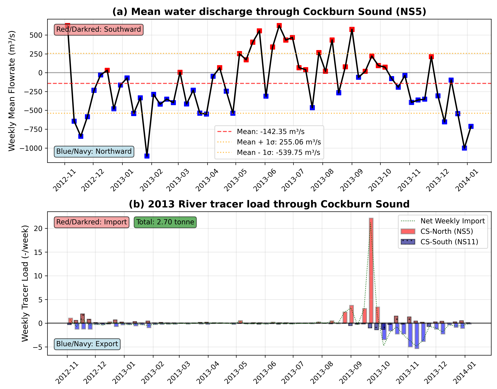
```

:::{.figcap}
**Figure 11.9-i.** River tracer throughflow analysis for the simulated year **2013**, showing (a) net water exchange through the CS-North transect, and (b) the weekly "river tracer load" (tonnes/week) moving through CS-North and South, for a river constituent entering the SCE with a hypothetical concentration of $1\: g/m^3$.
:::

##### 2015 {.unnumbered}

```{r, echo=FALSE, out.width="90%"}
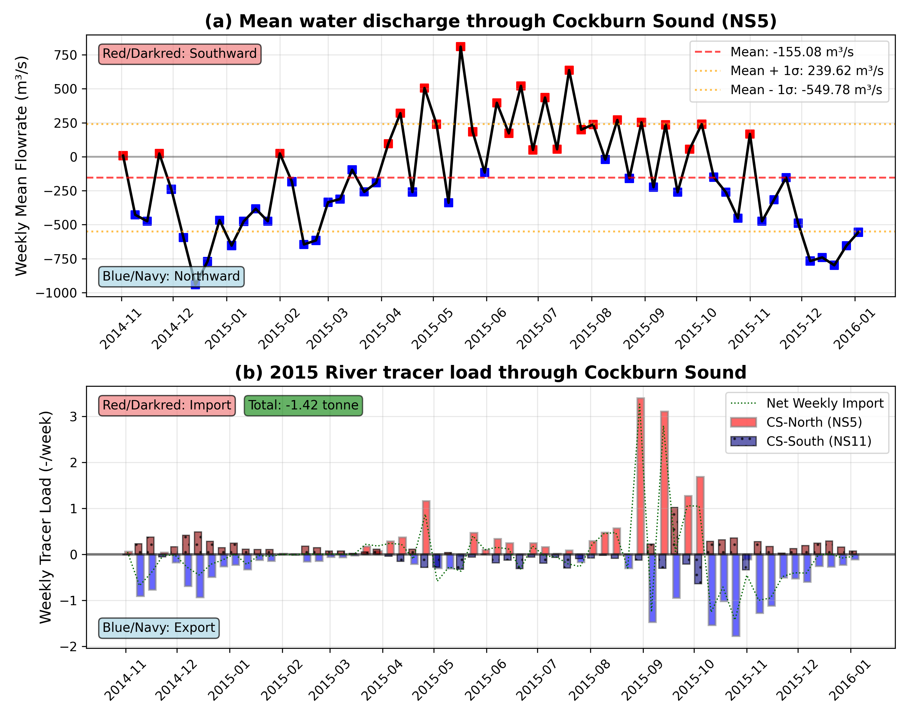
```

:::{.figcap}
**Figure 11.9-ii.** River tracer throughflow analysis for the simulated year **2015**, showing (a) net water exchange through the CS-North transect, and (b) the weekly "river tracer load" (tonnes/week) moving through CS-North and South, for a river constituent entering the SCE with a hypothetical concentration of $1\: g/m^3$.
:::


##### 2020 {.unnumbered}

```{r, echo=FALSE, out.width="90%"}
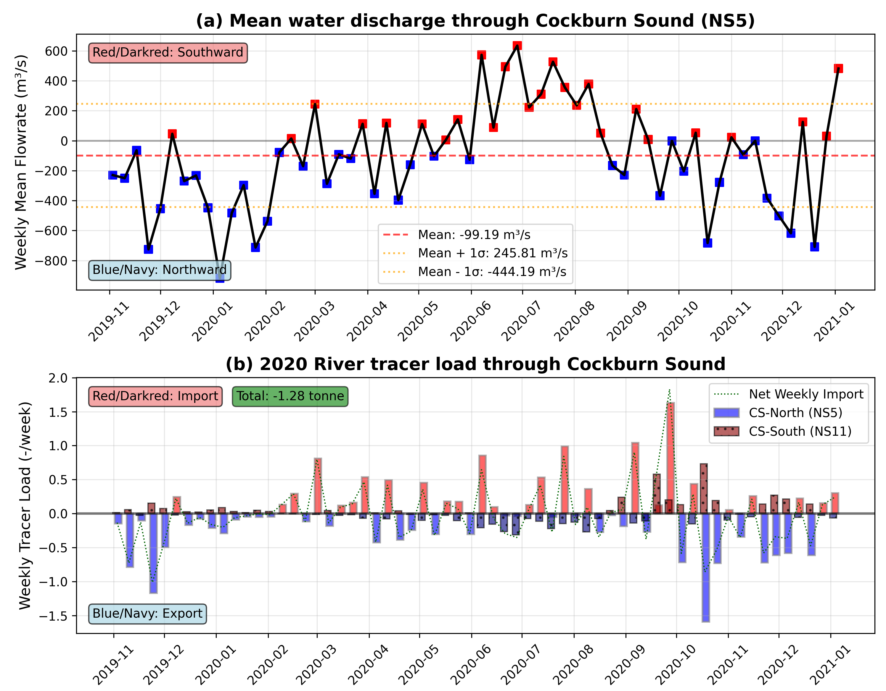
```

:::{.figcap}
**Figure 11.9-iii.** River tracer throughflow analysis for the simulated year **2020**, showing (a) net water exchange through the CS-North transect, and (b) the weekly "river tracer load" (tonnes/week) moving through CS-North and South, for a river constituent entering the SCE with a hypothetical concentration of $1\: g/m^3$.
:::


##### 2021 {.unnumbered}

```{r, echo=FALSE, out.width="90%"}
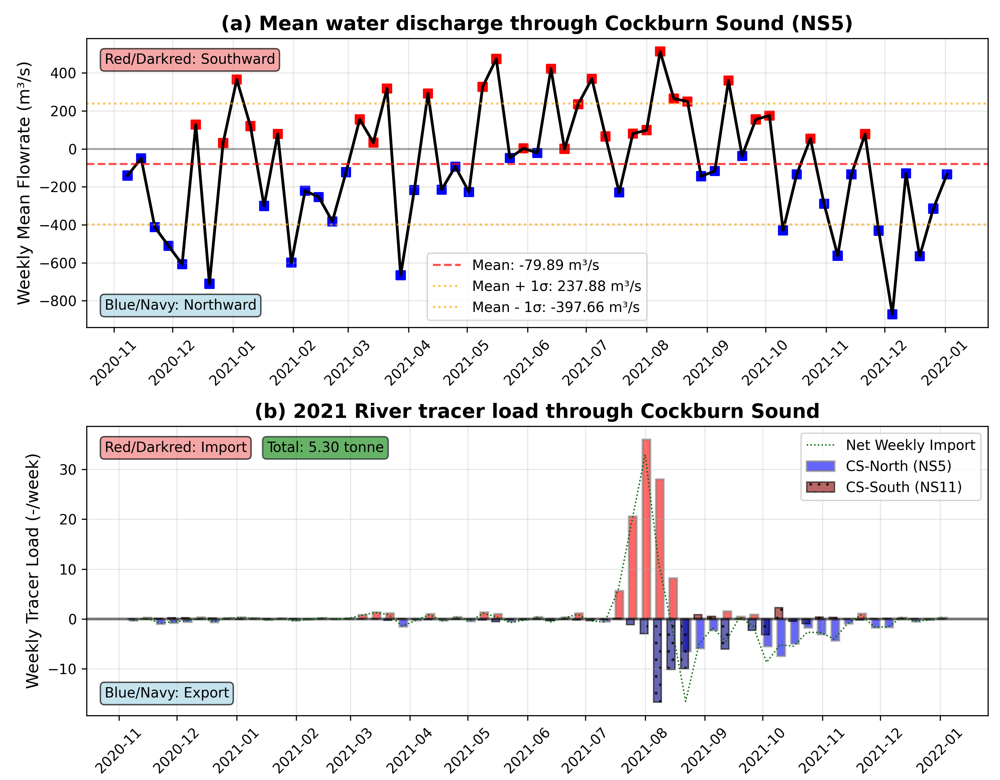
```

:::{.figcap}
**Figure 11.9-iv.** River tracer throughflow analysis for the simulated year **2021**, showing (a) net water exchange through the CS-North transect, and (b) the weekly "river tracer load" (tonnes/week) moving through CS-North and South, for a river constituent entering the SCE with a hypothetical concentration of $1\: g/m^3$.
:::


##### 2022 {.unnumbered}

```{r, echo=FALSE, out.width="90%"}
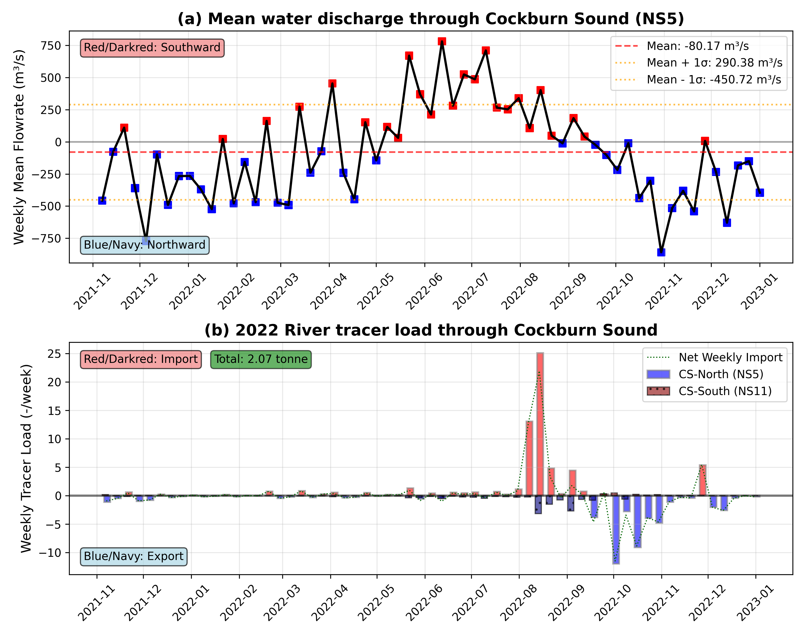
```

:::{.figcap}
**Figure 11.9-v.** River tracer throughflow analysis for the simulated year **2022**, showing (a) net water exchange through the CS-North transect, and (b) the weekly "river tracer load" (tonnes/week) moving through CS-North and South, for a river constituent entering the SCE with a hypothetical concentration of $1\: g/m^3$.
:::


##### 2023/4 {.unnumbered}

```{r, echo=FALSE, out.width="90%"}
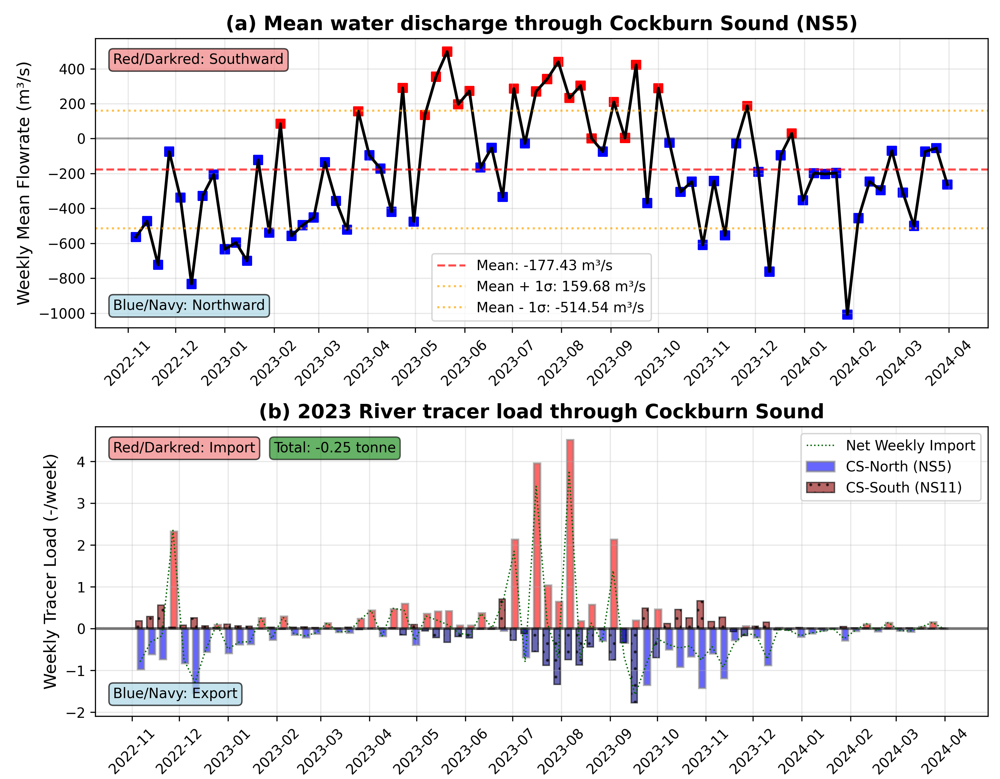
```

:::{.figcap}
**Figure 11.9-vi.** River tracer throughflow analysis for the simulated year **2023/4**, showing (a) net water exchange through the CS-North transect, and (b) the weekly "river tracer load" (tonnes/week) moving through CS-North and South, for a river constituent entering the SCE with a hypothetical concentration of $1\: g/m^3$.
:::


## River nutrient exports through Fremantle

In the previous section, the tracer is used as an indicator of SCE nutrients to show the timing and relative magnitude of SCE waters making it to Cockburn Sound. In this section, we use the modelled flow and simulated nutrient concentrations from the biogeochemical model to compute the actual nitrogen load, enabling us to also consider the form of nitrogen. This is first computed for the water exiting SCE through the Fremantle Port, and then following on from the river tracer analysis, it is possible to also adapt this approach to compute the amount of river-derived nutrients leaving Fremantle that make their way into the main Cockburn Sound embayment (through the Woodman Point to Garden Island transect).

The analysis in Figure 11.10 shows the total load existing Fremantle into the ocean, and a separate plot of the bio-available nitrogen fraction ($DIN = NO_3 + NH_4$). Based on the rate of river tracer dilution, an estimate of N from river origin is also made for each year in the bottom panel.

#### {.panelset .unnumbered}

##### 2013 {.unnumbered}

```{r, echo=FALSE, out.width="90%"}
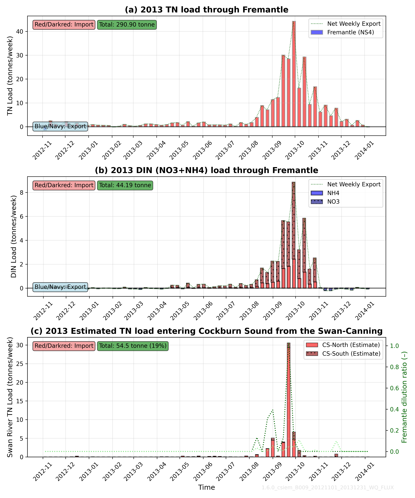
```

:::{.figcap}
**Figure 11.10-i.** SCE river plume nitrogen load analysis for the simulated year **2013**, showing (a) the total weekly nitrogen load exiting Fremantle Port, (b) the weekly bio-available fraction of TN leaving Fremantle, and (c) an estimate load of the weekly N tonnes entering Cockburn Sound from the SCE catchments.
:::

##### 2015 {.unnumbered}

```{r, echo=FALSE, out.width="90%"}
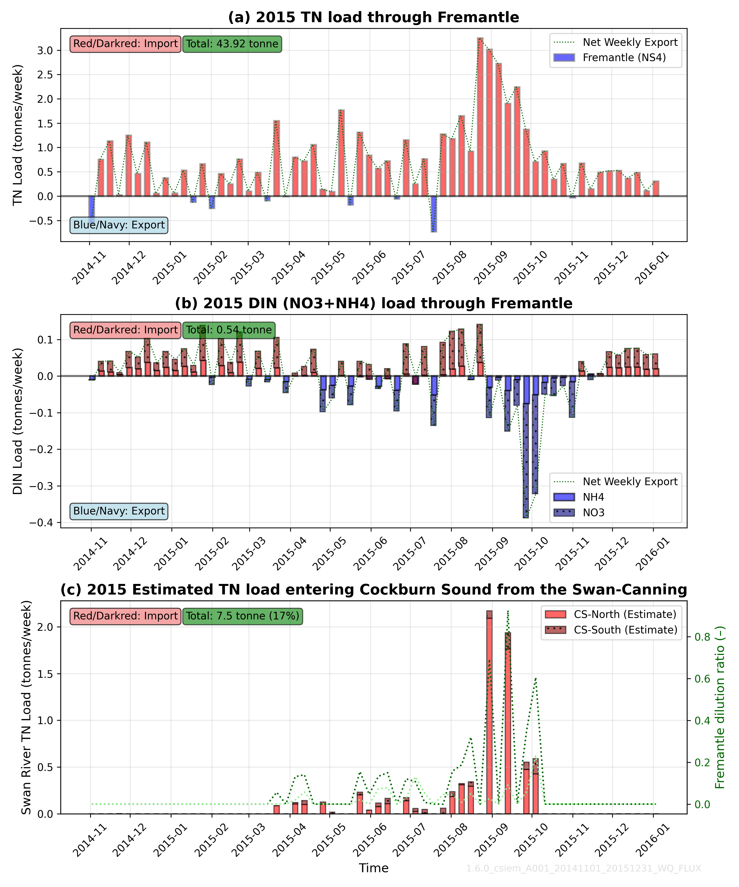
```

:::{.figcap}
**Figure 11.10-ii.** SCE river plume nitrogen load analysis for the simulated year **2015**, showing (a) the total weekly nitrogen load exiting Fremantle Port, (b) the weekly bio-available fraction of TN leaving Fremantle, and (c) an estimate load of the weekly N tonnes entering Cockburn Sound from the SCE catchments.
:::


##### 2020 {.unnumbered}

```{r, echo=FALSE, out.width="90%"}
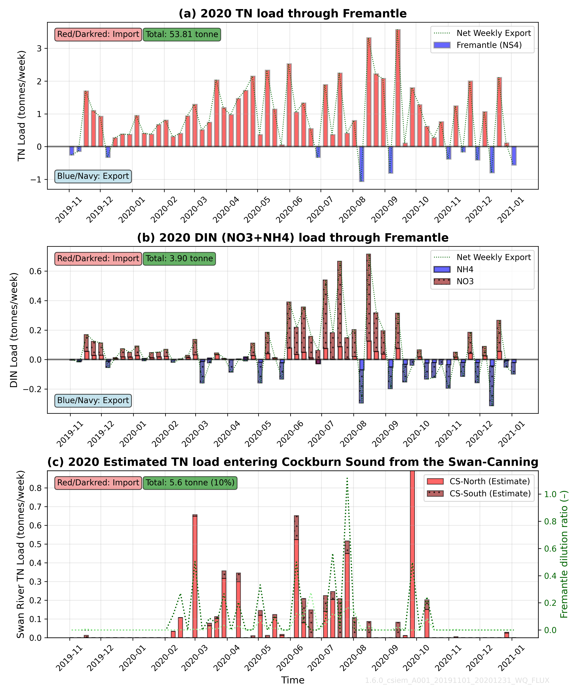
```

:::{.figcap}
**Figure 11.10-iii.** SCE river plume nitrogen load analysis for the simulated year **2020**, showing (a) the total weekly nitrogen load exiting Fremantle Port, (b) the weekly bio-available fraction of TN leaving Fremantle, and (c) an estimate load of the weekly N tonnes entering Cockburn Sound from the SCE catchments.
:::


##### 2021 {.unnumbered}

```{r, echo=FALSE, out.width="90%"}
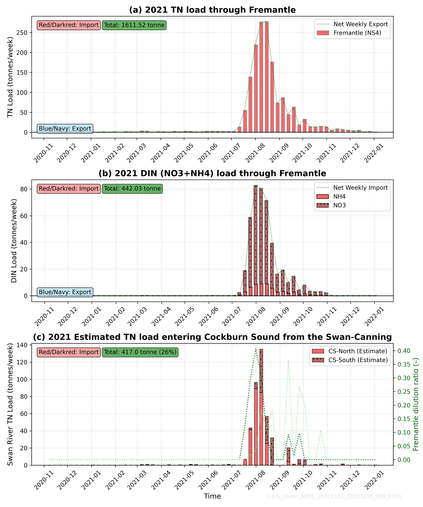
```

:::{.figcap}
**Figure 11.10-iv.** SCE river plume nitrogen load analysis for the simulated year **2021**, showing (a) the total weekly nitrogen load exiting Fremantle Port, (b) the weekly bio-available fraction of TN leaving Fremantle, and (c) an estimate load of the weekly N tonnes entering Cockburn Sound from the SCE catchments.
:::


##### 2022 {.unnumbered}

```{r, echo=FALSE, out.width="90%"}
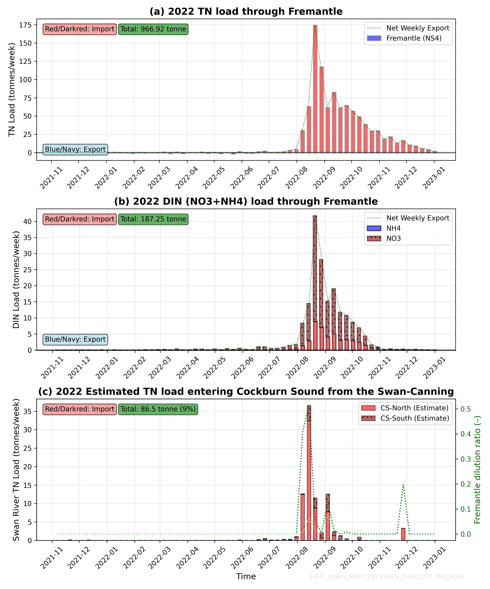
```

:::{.figcap}
**Figure 11.10-v.** SCE river plume nitrogen load analysis for the simulated year **2022**, showing (a) the total weekly nitrogen load exiting Fremantle Port, (b) the weekly bio-available fraction of TN leaving Fremantle, and (c) an estimate load of the weekly N tonnes entering Cockburn Sound from the SCE catchments.
:::


##### 2023/4 {.unnumbered}

```{r, echo=FALSE, out.width="90%"}
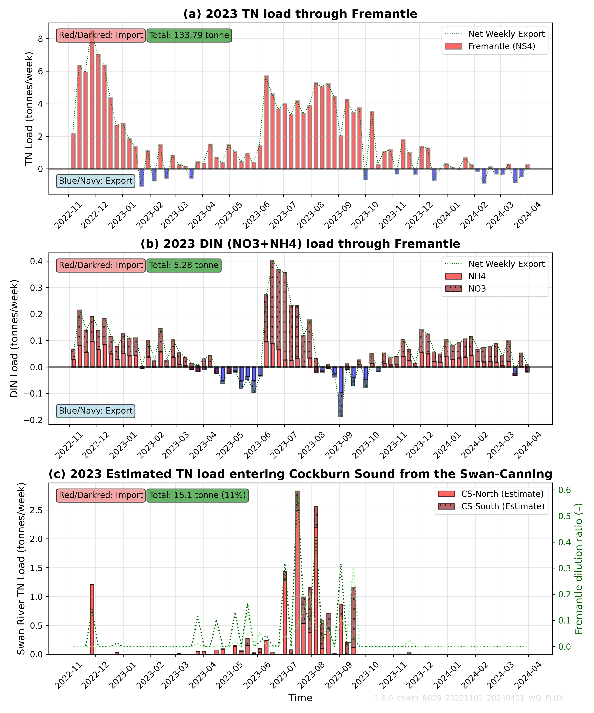
```

:::{.figcap}
**Figure 11.10-vi.** SCE river plume nitrogen load analysis for the simulated year **2023/4**, showing (a) the total weekly nitrogen load exiting Fremantle Port, (b) the weekly bio-available fraction of TN leaving Fremantle, and (c) an estimate load of the weekly N tonnes entering Cockburn Sound from the SCE catchments.
:::


## SCE N load contributions

The analysis of N movement from the SCE input points, through Fremantle Port and into Cockburn Sound, is summarised into total annual tonnes to enable comparisons of each year (Table 11.1). The summary shows that between 67 - 118% of the incoming nutrients at the Narrows and Canning input points exits the domain through Fremantle, into the ocean. Noting that the two low flow years had the highest and lowest percentages (and total absolute loads), the most reliable estimates are from the four mid to high flow simulation years, where the range sits between 83 - 91%. The reason the amount exiting Fremantle is generally less than is input, is due to the sedimentation of particulate nitrogen, and a small amount of denitrification. In the dry (low flow) year, the amount exiting Fremantle is lower than that entering from upstream, reflecting the internal sediment loading occurring within the lower Swan-Canning system.

When looking at the inputs to Cockburn Sound, the annual totals show that 9-26% of what leaves Fremantle Port will make it across the north Cockburn Sound node-string (Woodman Point to Garden Island). Interestingly, the two high flow years which had the highest overall loads leaving Fremantle, had quite divergent amounts that ended up reaching Cockburn Sound. This is due to the local hydrodynamic controls on the river plume dispersion which differed between the two years; with the 2021 year having a south-east tendency (see Figure 10.14) and the 2022 plume having a more northward tendency.  Overall the SCE inputs to Cockburn Sound are quite variable from year to year, varying between relatively insignificant numbers in dry years (~ 7 tonnes N), to very high loads in wet years (86 - 417 tonnes N).


```{r 8-swanloads, echo=FALSE, message=FALSE, warning=FALSE}
library(knitr)
library(kableExtra)
library(readxl)
library(rmarkdown)

# function to fix floating point decimals
# df = dataframe to fix
# colNames = list() of colummns to fix
fixDecimals <- function(df, colNames){
  for(i in colNames){
    for(ii in 1:NROW(df[,i])){
      currentVal <- df[ii,i]
      currentVal <- as.numeric(currentVal)
      if(!is.na(currentVal)==TRUE){
        newVal <- as.character(currentVal)
        df[ii,i] <- newVal
      } 
    }
  }
  return(df)
}

theSheet <- read_excel('tables/swan_loads.xlsx', sheet = 2)

theSheet <- fixDecimals(
  df = theSheet, 
  colNames = list("2013")
  )

theSheet <- theSheet[theSheet$Table == "swan",]
theSheetGroups <- unique(theSheet$Group)


kbl(theSheet[,3:9], caption = "Comparison of the fate of SCE catchment loads across years.", align = "l",) %>%
  pack_rows(theSheetGroups[1],
            min(which(theSheet$Group == theSheetGroups[1])),
            max(which(theSheet$Group == theSheetGroups[1])),
            background = '#ebebeb') %>%
  pack_rows(theSheetGroups[2],
            min(which(theSheet$Group == theSheetGroups[2])),
            max(which(theSheet$Group == theSheetGroups[2])),
            background = '#ebebeb') %>%
    pack_rows(theSheetGroups[3],
            min(which(theSheet$Group == theSheetGroups[3])),
            max(which(theSheet$Group == theSheetGroups[3])),
            background = '#ebebeb') %>%
  pack_rows(theSheetGroups[4],
            min(which(theSheet$Group == theSheetGroups[4])),
            max(which(theSheet$Group == theSheetGroups[4])),
            background = '#ebebeb') %>%
  pack_rows(theSheetGroups[5],
            min(which(theSheet$Group == theSheetGroups[5])),
            max(which(theSheet$Group == theSheetGroups[5])),
            background = '#ebebeb') %>%

  row_spec(0, background = "#14759e", bold = TRUE, color = "white") %>%
  kable_styling(full_width = F,font_size = 10) %>%
  column_spec(1, width_min = "15em") %>%
  column_spec(2, width_min = "7em") %>%
  column_spec(3, width_min = "7em") %>%
  column_spec(4, width_min = "7em") %>%
  column_spec(5, width_min = "7em") %>%
  column_spec(6, width_min = "7em") %>%
  column_spec(7, width_min = "7em") %>%
    scroll_box(width = "680px", height = "750px",
             fixed_thead = FALSE)
```


## Summary

Overall, the SCE inputs to Perth waters are highly variable, and the contributions of the SCE river plume to the CSOA region differed substantially for the six focus years that were studied in detail. The total tonnes of nitrogen entering are relatively insignificant in dry years, but can become substantial in wet years (>400 tonnes). Of these loads, a smaller percentage is comprised of bio-available $DIN$, but this would enter as a short-lived pulse that could have water quality implications.  The water quality response of Cockburn Sound and Owen Anchorage to the myriad of inputs to the system, including this SCE load, is explored further in Chapter 13.

