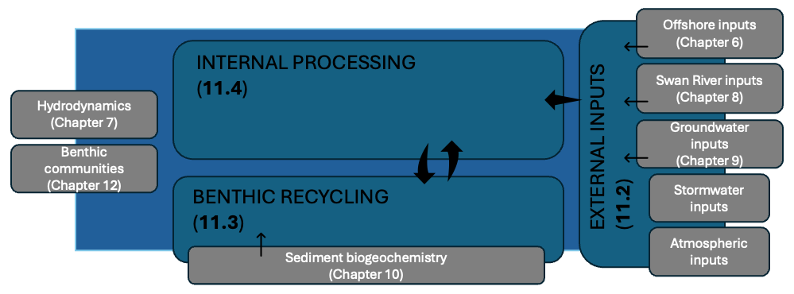
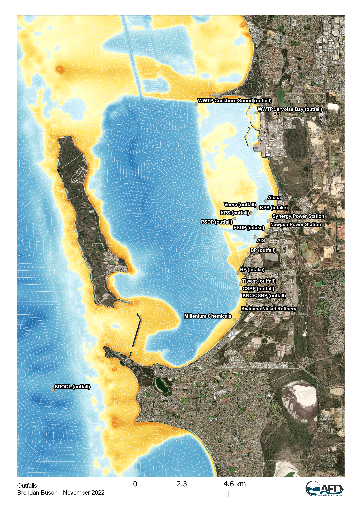
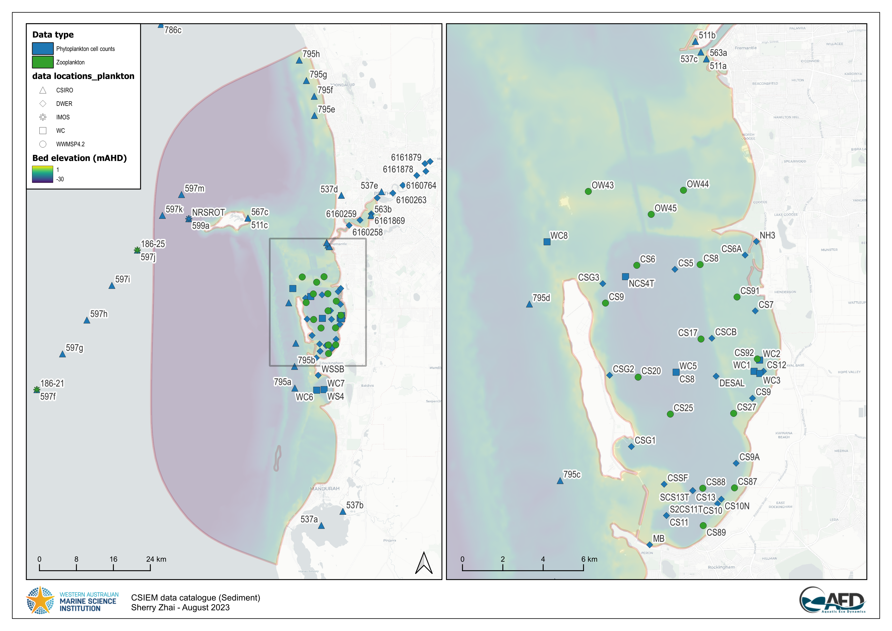
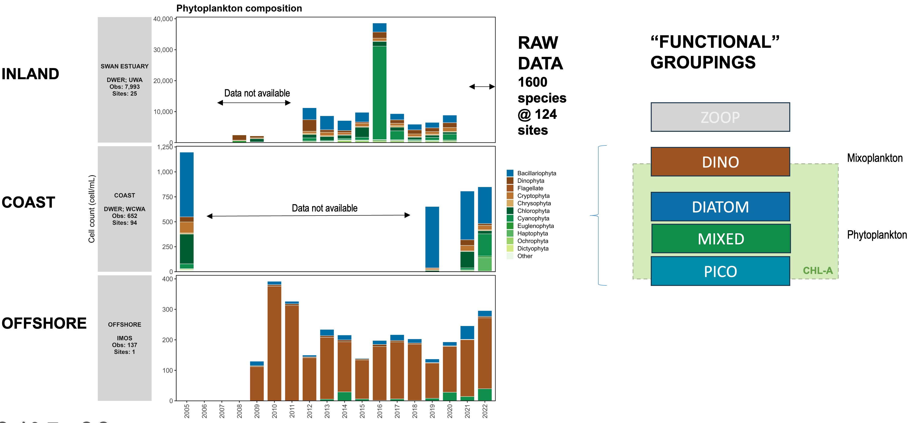

# Integrated Ecosystem Model Assembly {#bgc-model}

## Overview

Cockburn Sound has undergone significant water quality changes over many decades, shaped by both natural processes and intense human activity (Mitchell et al., 2025). Understanding how nutrients and other pollutants move through the system has proved challenging, in part because the Sound receives inputs from many different sources. These include atmospheric deposition, groundwater inflows, stormwater and urban drainage, industrial and wastewater discharges, as well as nutrients released from the seabed itself. Although direct river flows to Cockburn Sound are limited, nutrient concentrations commonly rise near the shoreline and at discharge points, and occasional large flow events from the Swan–Canning Estuary can also influence local water quality.

The history of changes means that ecosystem structure and function has also shifted.  From the 1950s through to the 1980s, severe eutrophication occurred, whereby an excess of nutrients fuelled high algal productivity and reduced water clarity. During this period, wastewater and industrial effluents increased substantially, and the construction of the Garden Island causeway in the 1970s further reduced flushing of nutrients to the open ocean. The combined effect of these pressures was dramatic: more than 80% of the seagrass meadows were lost, largely due to nutrient enrichment and growth of epiphytes that blocked light from reaching the leaves.

Significant management efforts have since helped reduce nutrient loads, particularly through improved wastewater treatment and redirecting discharges offshore. However, the legacy of historical inputs remains. Nutrient-rich groundwater continues to enter the Sound, sandy sediments store large historical nutrient loads, and internal recycling of nitrogen and phosphorus still contributes substantially to the nutrients available in the water column. While concentrations of nitrogen and phosphorus have declined in recent decades, improvements in water clarity and phytoplankton biomass have been slower and less consistent. Fish kills, algal blooms, and episodes of low-oxygen bottom waters continue to be reported. In addition, hypersaline brine from the desalination plant has been shown to form dense plumes that may settle near the seabed, reinforcing stratification and making hypoxia more likely under certain conditions.

Together, these patterns highlight that nutrient dynamics in Cockburn Sound are shaped by a combination of external loads, internal cycling, and physical processes such as mixing, stratification, and ocean exchange. Assessing these interactions requires an integrated approach capable of linking hydrodynamics, nutrient budgets, biological processes, and local management actions. An advanced biogeochemical model provides this capability. It allows us to explore how nutrients move through the system today, identify key environmental risks, and evaluate how future changes—such as dredging, coastal development, or climate-driven shifts in flows and temperatures—may influence water quality.

Developing such a model relies on a firm understanding of the broader physical environment (Chapter 7) and the many sources of nutrients entering the system (Chapters 8, 9 and 10). Previous studies have shown that nitrogen, in particular, plays a central role in controlling productivity in the region. Even small inputs can drive substantial ecological responses in this naturally low-nutrient coastal setting. Although overall nitrogen concentrations have decreased due to improved management, phytoplankton biomass has remained elevated at several locations, and seagrass extent has not increased, reinforcing the need for an integrated model able to quantify both external inputs and internal ecosystem processes.

The CSIEM model domain spans the wider Western Australian coastal zone and therefore captures a range of nutrient sources beyond those that directly enter Cockburn Sound —including catchment discharges, groundwater inputs, and wastewater treatment plant outfalls. To build a robust and defensible modelling framework, it is essential to clearly describe these inputs and how they shape nutrient conditions within the Sound.

This chapter therefore outlines the approach used to (i) specify external nutrient loads, (ii) the approach to parameterisation of different benthic zones, and (iii) describes how the model represents internal biogeochemical cycling (Figure \@ref(fig:bgc-overview)). Together, these components form the foundation for understanding present-day ecosystem conditions and assessing future environmental risks. Links to other modules are also outlined.

(ref:bgc-overview) Schematic overview of this chapter highlighting the focus of the three sub-sections in relation to other chapters.

```{r bgc-overview, echo=FALSE, fig.cap="(ref:bgc-overview)", out.width="95%"}

```

<br>

## Inputs and Nutrient Loads

### Groundwater inputs

Submarine groundwater discharge (SGD) has emerged as a dominant nitrogen source into Cockburn Sound following redirection of urban and industrial wastewater outflows to the Cape Peron Sepia Depression ocean outfall (Greenwood et al., 2016). The approach to capturing the variability in groundwater flows, and groundwater nutrient speciation is outlined in detail in [Chapter 9](groundwater).

```{block2, hint_6gw, type='rmdnote2'}
*The files adding the groundwater discharges into a CSIEM simulation are located in the `model_components/includes/bc/6_gw` folder.*
```

### Catchment river / estuarine inputs

Catchment surface water inputs to the CSIEM modelling region include nutrient loads transported from the Swan-Avon catchment via the Swan-Canning Estuary and from the Peel-Harvey catchment through the Peel-Harvey Estuary. The Swan-Canning contributions can be significant in high flow years, and to a lesser extent outflows from the Peel-Harvey system can also be a minor contributor. The degree to which either source enters the Cockburn Sound region depends on the prevailing currents at the time, for example if there is a predominantly southward or northward flow tendency (see Chapter 7). For both these inputs, flow rate and water quality data were sourced from the Department of Water and Environmental Regulation (DWER) Water Information Reporting (WIR) portal, and these data were interpolated into daily intervals to facilitate continuous model simulations between 1990 and 2024. 

- **Swan-Canning** : For this system the CSIEM model domain extends to boundary locations at the Narrows and Canning Bridges. To establish total flow through these boundaries, flow rates from upstream locations were aggregated. Water quality observations from the Narrows Bridge (site 6160262) and Canning Bridge (site 6167160) were interpolated to set inflowing for nutrient inputs to the Swan and Canning Rivers, respectively.

- **Peel-Harvey** : For this system, the flow data used for 1970-2018 was derived from a calibrated catchment model developed in the ARC Linkage project (Hennig et al., 2023). For the period 2019-2024, total flow was estimated by summing flows from gauged rivers within the Peel-Harvey Catchment. Nutrient concentrations at site 6140029, near the Dawesville Cut, were used to define the water quality boundary condition for Peel-Harvey inputs.

The nutrient load reaching the Swan-Canning River from the catchment is approximately 370 tonnes TN and 10 Tonnes TP per year (Paraska et al., 2021) and reaching the Peel-Harvey Estuary is approximately 630 tonnes TN and 60 tonnes TP per year (Hennig et al., 2023). Despite these significant contributions, direct impacts on Cockburn Sound's trophic conditions are mitigated by two primary factors: (1) both the Swan-Canning and Peel-Harvey estuaries act as nutrient filters, where primary production and sedimentation processes assimilate and reduce nutrient loads before they exit to marine environments (Paraska et al., 2021; Huang et al., 2023; Valesini et al., 2023); and (2) as these nutrient-laden flows enter the open marine waters beyond Cockburn Sound, they are rapidly diluted, reducing potential impacts on Cockburn Sound's ecosystems. An analysis of the amount of  water of estuary origin that enters Cockburn Sound specifically is summarised in [Chapter 8](swan-river). 

```{block2, hint_45scephe, type='rmdnote2'}
*The files adding the estuary discharges into a CSIEM simulation are located in the `model_components/includes/bc/4_sce` and `model_components/includes/bc/5_phe` folders for the Swan-Canning and Peel-Harvey systems, respectively.*
```

### Local stormwater inputs

There are several minor surface water feature that drain directly to Cockburn Sound, which is the Mangles Bay Drain that routes water overflowing out of [Lake Richmond](https://en.wikipedia.org/wiki/Lake_Richmond) into the southern most point of Cockburn Sound. The latest estimates from the WWMSP Project 3.3 stormwater field survey (Bekele et al., 2023), suggested that maximum contribution of nutrients from stormwater directly to Cockburn Sound could be less than about 0.1 tonnes N/year, though it was noted that there is a high degree of uncertainty due to sparse observations in stormwater fluxes and their nutrient concentrations. Due to the low nutrient load, stormwater was not included in early CSIEM versions. 

From CSIEM version 1.7.2 estimates of stormwater have been included. This is undertaken in two ways:

- **Mangles Bay Drain (Lake Richmond outflow; Drain 1)** : A 1D lake water balance model (based on the GLM-AED platform) has been applied to Lake Richmond and calibrated on local data commissioned by City of Rockingham (Vogwill et al., 2026). This model predicts daily outflow from the lake into the Mangles Bay Drain, considering local stormwater and groundwater inputs, and rainfall and evaporation. The [Lake Richmond model setup](https://github.com/SEAF-CS/lake-richmond) was updated and extended to simulate discharges over the period 1990 - 2024. The model does simulate water quality, and so nutrient concentrations in the discharge water get  assigned based on a simple monthly 'climatology' based on averaging historic grab samples available in WIR for sites 6140792, and 6140793 
- **Other beach discharges (Drains 2 - 13)**: A urban contributing area is assigned to each catchment, and a simple "rational method" is used to compute a daily discharge volume. Nutrient concentrations in the inflowing water are assigned based on the summary table of measurements in Bekele et al. (2023) and assumed to not vary temporally.

The simulation includes these inputs at 14 locations selected within the domain by identifying the nearest cell to the discharge point. Note that as some of the outfalls discharge to the beach rather than directly into the water, we do not account for any loss or "waterfall" effect, and assume all water enters into the nearest wet cell to the beach zone.

```{block2, hint_7sw, type='rmdnote2'}
*The files adding the stormwater discharges into a CSIEM simulation are located in the `model_components/includes/bc/7_sw` folder.*
```

### Wastewater treatment plants (WWTPs) inputs

The CSIEM model domain includes multiple WWTP outfalls, such as those from Alkimos, Beenyup, Subiaco, Woodman Point, Point Peron, and East Rockingham. Since 1984, treated wastewater from Woodman Point and Point Peron WWTPs has been redirected offshore through the Sepia Depression Ocean Outlet Landline (SDOOL), located 4.1 kilometers offshore west-southwest of Point Peron. This offshore discharge through a diffuser that aids in enhancing dilution to minimize nearshore nutrient impacts (BMT, 2014).

Nutrient loads from these WWTPs are recorded in the publicly accessible [National Outfall Database](https://nod.org.au) (NOD), and were used to set input values in the CSIEM model for the period between 2015 to 2021, for when data is available. Outside this time range, average discharge rates and nutrient concentrations were extrapolated based on this historical data. A summary of average discharge rates, nitrogen loads, and phosphorus loads from each of the outfalls is provided in Table 9.1, which indicate a significant amount of nutrient load to the coastal ecosystem.

**Table 9.1**. Summary of average discharge rate, nitrogen load, and phosphorus load from the WWTPs based on the National Outfall Database data from 2015 - 2021.

  ---------------------------------------------------------------------------------------------------------
  Outfall           Discharge rate (ML/day)   Nitrogen Load (tonnes/year)   Phosphorus Load (tonnes/year)
  ----------------- ------------------------- ----------------------------- -------------------------------
  Alkimos           11.75                     31.42                         12.04

  Beenyup           99.62                     597.36                        274.35

  Subiaco           57.29                     276.74                        134.72

  Point Peron       18.33                     433.48                        60.73

  Woodman Point     149.19                    1062.61                       269.48

  East Rockingham   3.05                      4.73                          7.13
  ---------------------------------------------------------------------------------------------------------

```{block2, hint_wwtp, type='rmdnote2'}
*The files adding the industry discharges into a CSIEM simulation are located in the `model_modifier_libary/discharges` folder.*
```

### Industrial inputs

Cockburn Sound is impacted by multiple industrial sources, including BP Refinery, Kwinana Power Station, Cockburn Power Station, Tiwest, and the Perth Seawater Desalination Plant (PSDP) - see Figure \@ref(fig:bgc-outfalls) for a spatial summary. Despite the presence of these industrial facilities, studies have generally indicated that nutrient contributions from these sources are minimal, especially following the relocation of treated wastewater to the Sepia Depression Ocean Outlet Landline (SDOOL) in 2004 (BMT, 2014 & 2018a; Bekele et al., 2023). Current nutrient loads from industrial sources are considered negligible compared to those from groundwater and wastewater treatment plants (Gunaratne et al., 2023).


(ref:bgc-outfalls) Current and historic discharge points into Cockburn Sound, in the context of the model domain.

```{r bgc-outfalls, echo=FALSE, fig.cap="(ref:bgc-outfalls)", out.width="80%"}

```

For the current study, the CSIEM model configuration mirrors the industrial input settings outlined in Gunaratne et al. (2023), reflecting the limited contribution of these sources in nutrient modeling for Cockburn Sound. Continued monitoring and management are essential to ensure that nutrient inputs from industrial sources remain controlled, supporting the long-term ecological balance in the Sound.

```{block2, hint_disch, type='rmdnote2'}
*The files adding the industry discharges into a CSIEM simulation are located in the `model_modifier_libary/discharges` or `model_modifier_libary/intakes` folder.*
```

### Offshore inputs

The broader Perth coastal region receives nutrients also from waters passing through that are associated with the regional oceanographic currents. These nutrient inputs from offshore are added into the boundary of the CSIEM domain, and the net loads entering are a combination of (i) the high-resolution flow field from the ROMS model, and (ii) the monthly summary of nutrient and chlorophyll-a concentrations at each of the six boundary polygons. The model computes the incoming or outgoing flux of each nutrient species at each of the boundary grid cells.  The approach to capturing the water currents and the seasonal and inter-annual changes in nutrient concentrations is outlined in detail in [Chapter 6](ocean-climatology).

```{block2, hint_3ocean, type='rmdnote2'}
*The files governing the ocean boundary conditions are located in the `model_components/includes/bc/3_ocean` folder of a CSIEM simulation.*
```

### Atmospheric inputs

Within the model atmospheric inputs are captured as being either wet or dry deposition. Specifically into Cockburn Sound, prior reporting has suggested rainfall sourced nitrogen input as 2.1 t N/yr (DPSIR report), and a separate dust nitrogen contribution of ~0.2 t N/yr.  
 
- **Wet deposition** : refers to the delivery of dissolved/particulate material scavenged by precipitation and is quantified as: rainfall depth × rainwater concentration (e.g., NO₃⁻, NH₄⁺). Rainfall DIN concentration was measured nearby in the Peel catchment by Wells et al (2023) [at a concentration of 15 uM N](https://aquaticecodynamics.github.io/peel-book/iso.html#results-findings-4); this is applied to rainfall rate in the Cockburn Model. 

- **Dry deposition** : refers to direct settling/transfer to the water surface without precipitation, including (i) gravitational settling of particles (dust/sea salt/industrial particulate matter), and (ii) turbulent transfer of gases and fine aerosols (e.g., HNO₃, NH₃, nitrate/ammonium aerosols). Dry deposition is able to be estimated using ambient concentrations (from air monitoring) plus a deposition velocity, or via surrogate surfaces / dust collectors, and will vary depending on wind direction and position in the vicinity of the Kwinana industrial activities. As no air-shed model is available to capture this, the model adopts a simple assumption of a fixed deposition amount. This is estimated to be ...

```{block2, hint_atmdep, type='rmdnote2'}
*Atmospheric inputs of N and P into a CSIEM simulation are configured in the AED configuration file `model_components/includes/wq/AED_<VER>/aed.nml` .*
```

<br>

## Benthic Recycling Rates

The varied benthic (bottom) substrates across Cockburn Sound, Owen Anchorage and farther afield play a critical role in regulating and recycling carbon and nutrients within the water, and therefore controlling water quality. To assess the current state of the Cockburn environment and to simulate future scenarios, the rates of flux across the sediment–water interface for O\(_2\) and nutrients are therefore critical factors to be resolved. In this section, field studies and specialised modelling of the sediment were used as data sources for the purposes of defining the necessary parameters needed for setup and configuration of the integrated biogeochemical model. Note that this section focuses on the base biogeochemical description of sediment-water interaction across the broad habitat types. More specific benthic community modules are also configureable and can impact on water column nutrient and oxygen conditions - these are described in  [Chapter 14](benthic).

Four major sources of information were used to determine benthic fluxes:

1. **Eyre et al. (2025)**  
   Cores were taken from the field to the laboratory and fluxes were measured for one day. This source measured many variables, at 12 locations, but for only one day of a year and at only one temperature.

2. **Dalseno et al. (2024)**  
   O\(_2\) concentration was measured as a depth profile for two months, from the surface to the sediment. O\(_2\) concentration decrease in bottom waters was observed to coincide with low wind, low mixing and stratification. It also coincided with DIC increase at the same depths. O\(_2\) flux was inferred to be caused by organic matter consumption and was assumed to have a flux rate of around 30 mmol m\(^{-2}\) d\(^{-1}\).

3. **Sediment modelling using CANDI-AED**  
   The CANDI-AED sediment model was aligned with data from the Eyre et al. (2025) study results, using as input results from a larger hydrodynamic and biogeochemical model (CSIEM). CSIEM set the environmental context of the simulations, and other theoretical assumptions were built into the CANDI-AED sediment model in order to produce sediment fluxes for many variables. The greater Cockburn simulation environment was conceptualised as having five main environments: **Offshore**, **Deep-dark**, **Benthic algae** (shelf with benthic algae), **Seagrass** (shelf with benthic algae and seagrass) and **Groundwater** (nearshore with groundwater). The model was run under steady conditions, as well as with seasonal fluctuations and with one-off events.

4. **The Southwest Australian Coastal Biogeochemistry survey (Keesing et al. 2011)**  
   Concentrations and fluxes were measured at 5 sites in Cockburn Sound and 30 other sites in southwest Western Australia. They also measured fluxes in cores taken from sites within Cockburn Sound. Where benthic algae was present, there was a high amount of nutrient uptake from the sediment into the algal biomass.

Broader surveys have also informed the interpretation of these fluxes. Jorgensen et al. (2022) examined O\(_2\) and carbon fluxes around the world from thousands of data points. Eyre and Ferguson (2009) examined O\(_2\) and carbon fluxes in coastal sites around Australia.

### Overview of benthic flux assumptions

Most of the benthic flux estimates stem from a few key assumptions. These assumptions provide an initial estimate, but in each case there are caveats that create uncertainty, and thus necessitate the field studies and numerical modelling.

- Total O\(_2\) consumption parallels the production of total dissolved inorganic carbon (DIC) (Jorgensen et al. 2022). DIC can be understood as organic carbon oxidised to CO\(_2\) then reaching equilibrium with carbon acid–base species. To a first approximation, the ratio of organic carbon input to DIC production to O\(_2\) consumption is close to 1:1:1.

- Reactive incoming organic matter, such as algal detritus, contains organic N and P at approximately Redfield ratio, and so the flux of total dissolved inorganic N and P can also be estimated from organic carbon. Given an aerobic sediment, inorganic N should be mostly oxidised species such as NO\(_3^-\) and NO\(_2^-\) rather than reduced species such as NH\(_4^+\).

Given these fundamentals, a few site measurements could broadly predict the quantities of all the other components. However, the exceptions to each of these assumptions create uncertainty:

- A small amount of DIC flux is also produced from the dissolution of CO\(_3^{2-}\) minerals in the sediment, and so it is not all from organic C.

- O\(_2\) is also consumed by oxidising some NH\(_4^+\) to NO\(_x\), where the NH\(_4^+\) is released from the oxidation of organic matter. Hence approximately 15% (16/106) of the O\(_2\) oxidising organic matter can also react with NH\(_4^+\).

- If the upper layers of the sediment are not well mixed then insufficient O\(_2\) is available for oxidation, leading to anaerobic oxidation. Hence the DIC flux out of the sediment would be higher than the O\(_2\) flux into the sediment.

- The by-products of anaerobic oxidation, such as Fe\(^{2+}\), H\(_2\)S and CH\(_4\) can also consume O\(_2\), further complicating the assumption of 1:1 O\(_2\):DIC. This is a non-linear relationship, in that more anaerobic reactions in the deep sediment create more O\(_2\) demand from their by-products. The exact distribution between these species cannot be known with a simple calculation, hence the need for sediment models.

- The global average DIC:O\(_2\) flux ratio (referred to as the respiratory quotient) has actually been estimated at 0.9 for water depths 0 to 50 m, i.e. about 11% more O\(_2\) is consumed than DIC is produced (Jorgensen et al. 2022). This comes about from O\(_2\) oxidation of reduced species.

- Denitrification reactions remove N from the system as N\(_2\), which is not typically measured with species such as NH\(_4^+\) and NO\(_3^-\). Denitrification requires a complex pattern of O\(_2\) depletion and replenishment.

- Organic matter may be buried faster than it is oxidised, creating an ongoing source of organic matter and a source for anaerobic oxidation deep in the sediment. This is especially the case with less reactive organic matter, such as leaf detritus. The global average burial rate is that about 6% of incoming organic matter escapes oxidation (Jorgensen et al. 2022).

- A history of changing organic matter inputs can create a store of organic matter that does not reflect the current inputs.

- Benthic algae provide a source of O\(_2\) to the upper layers of sediment that is independent of the water column O\(_2\). These algae also consume DIC and nutrients and upon burial in the sediment they cease to provide O\(_2\) but instead become a source of organic matter.

- Similarly, seagrass roots exude O\(_2\) into the sediment and consume DIC and nutrients. Seagrass leaf detritus provides a source of organic matter.

As mentioned above, CANDI-AED was set up for three of the major environments defined for Cockburn Sound. The Deep-dark environment had no benthic algae or seagrass and so it had fewer of these exceptions. Further, it was calibrated to match the 1:1:1 organic:DIC:O\(_2\) ratio. This base simulation then added benthic algae to the Deep-dark environment, and then seagrass to the benthic algae environment. Fluxes for O\(_2\) and key nutrients are described below, then summarised in Table 1.

### Fluxes in each sediment environment

#### Deep-dark sediments

The O\(_2\) fluxes measured in the four deep cores by Eyre et al. (2025) were all within a narrow range (average 27 ± 2 mmol m\(^{-2}\) d\(^{-1}\)). They were also close to the DIC fluxes in three of the four cores, thus matching the fundamental assumption described above, that reactive organic matter is consumed aerobically. Based on this, the values measured by Eyre et al. can be used with confidence as a basis for other fluxes.

Dalseno et al. (2024) estimated the O\(_2\) flux in Cockburn Sound, during O\(_2\) depletion, at 30 mmol m\(^{-2}\) d\(^{-1}\). They compared that to the mean O\(_2\) flux in shelf sediments globally with a wide range between 23 and 67 mmol m\(^{-2}\) d\(^{-1}\). This was also compared to one example of a region experiencing seasonal O\(_2\) depletion, where O\(_2\) demand was 19 mmol m\(^{-2}\) d\(^{-1}\) i.e. lower O\(_2\) demand because of lower O\(_2\) availability.

Jorgensen et al. (2022) summarised thousands of measured O\(_2\) fluxes and developed a formula for total O\(_2\) consumption (TOU) based on water depth.

Since the four dark cores from Eyre et al. (2025) were from around 20 m depth, TOU is estimated by this formula at 32 mmol m\(^{-2}\) d\(^{-1}\).

By balancing organic matter influx, oxidation and DIC outflux in the Deep-dark environment, the CANDI-AED project produced a flux of 22 mmol m\(^{-2}\) d\(^{-1}\). Seasonal simulations had a range of ±5 mmol m\(^{-2}\) d\(^{-1}\), with organic matter input higher in summer. The simulation that dropped O\(_2\) for one month decreased O\(_2\) flux by 4 mmol m\(^{-2}\) d\(^{-1}\).

Eyre et al. measured NO\(_3^-\) outfluxes at 0.43 and NH\(_4^+\) at 0.13 mmol m\(^{-2}\) d\(^{-1}\). The NO\(_3^-\) was consistent between the four cores. The NH\(_4^+\) flux was consistent in 3 of the cores, where one core consumed NH\(_4^+\) rather than producing it. The greater flux of NO\(_3^-\) than NH\(_4^+\) helped to confirm that the sediment was still largely aerobic and therefore confirm the O\(_2\) flux values. Greenwood et al. (2016) created a total N budget for Cockburn Sound and used a simplifying assumption in their budget that all of the N fluxing out of the sediment was NO\(_3^-\), rather than NH\(_4^+\), though they acknowledge that it is common in shallow marine systems for both NO\(_3^-\) and NH\(_4^+\) to be present.

CANDI-AED calculated fluxes of NO\(_x\) (net NO\(_3^-\) + NO\(_2^-\)) and NH\(_4^+\) at 0.47 and 0.31 mmol m\(^{-2}\) d\(^{-1}\). This is a greater total N release from the sediment than measured in the cores. The assumed bottom water concentrations of N were very low and the main source of N to the sediment was organic N. The model set the C:N ratio from the average of measured data from Eyre et al. (106:16). Seasonal fluctuations of both species were around 0.48 mmol m\(^{-2}\) d\(^{-1}\), that is, close to 100% increase or decrease.

Eyre et al. measured DON flux as an uptake of 1.2 ± 0.3 mmol m\(^{-2}\) d\(^{-1}\), which was consistent in three of four cores. One core had a small DON release. DON was not included as a variable in the CANDI-AED model project.

Eyre et al. measured PO\(_4^{3-}\) effluxes at 0.02 mmol m\(^{-2}\) d\(^{-1}\). This was consistent in three cores; however, one core had an uptake of PO\(_4^{3-}\) of around 0.02 mmol m\(^{-2}\) d\(^{-1}\). CANDI-AED calculated a PO\(_4^{3-}\) flux of 0.24 mmol m\(^{-2}\) d\(^{-1}\), which was similar in magnitude to the NO\(_x\) and NH\(_4^+\) fluxes. The result from CANDI-AED was about 1% of the DIC flux, and simply matched the assumption of C:P ratio around 106:1.

Together, these can be considered as the base background fluxes where the site is not hypoxic or undergoing an algal bloom.


Table 11.2. Summary of fluxes in mmol m\(^{-2}\) d\(^{-1}\) in the area denoted "deep-dark". Negative values indicate consumption in the sediment; positive means production in the sediment and flux to the water.

| Species | Eyre et al. (2025) | CANDI-AED steady flux | CANDI-AED seasonal range | CANDI-AED O\(_2\) drop range | CANDI-AED Organic range | Summary flux range (Lower) | Summary flux range (Upper) |
|--------|---------------------|-----------------------|--------------------------|------------------------------|--------------------------|-----------------------------|-----------------------------|
| O\(_2\)     | -27                 | -23                   | 7.5                      | +4.1                         | +4.7                     | +18                         | +26                         |
| NO\(_x^-\)  | +0.43               | +0.54                 | 0.48                     | -0.056                       | -0.16                    | +0.25                       | +0.75                       |
| NH\(_4^+\)  | +0.13               | +0.12                 | 0.96                     | +0.42                        | +1.5                     | -0.52                       | +0.45                       |
| PO\(_4^{3-}\) | +0.02             | +0.24                 | 0.088                    | +0.017                       | +0.19                    | +0.18                       | +0.27                       |
| DON    | -1.2                | –                     | –                        | –                            | –                        | -0.79                       | -1.6                        |


#### Benthic-algae dominated sediments

Eyre et al. measured values from two cores that were taken from shallow areas but did not have seagrass: these were taken as the cores that contained benthic algae. The sum of both light and dark incubations was taken.

Eyre et al. measured a small outflux of O\(_2\) from the sediment to the water, at 0.02 mmol m\(^{-2}\) d\(^{-1}\), from photosynthesis. The ratio of O\(_2\) to DIC flux was around 0.8, which conforms with the ratio of 0.9 mentioned by Dalseno et al. (2024), stated above. We can say with confidence that a sediment with benthic algae will have approximately net zero O\(_2\) flux. There is still consumption of O\(_2\) in the sediment, however this is in balance with photosynthetic O\(_2\) production.

The CANDI-AED project added benthic algae as a variable, setting its mass based on Chl-a measurements by Eyre et al. in these cores. The model was then calibrated to produce net zero O\(_2\) and DIC fluxes. O\(_2\) was produced by the benthic algae and DIC was taken up into biomass. As the benthic algae was mixed into the deeper layers of sediment beyond where it could photosynthesise, it became a source of organic matter. The model calculated that O\(_2\) efflux was 1.5 mmol m\(^{-2}\) d\(^{-1}\), fluctuating about 11 mmol m\(^{-2}\) d\(^{-1}\), seasonally between producing and consuming O\(_2\). Keesing et al. reported O\(_2\) fluxes in the order of ±10s of mmol m\(^{-2}\) h\(^{-1}\), with the highest being +150 and several around +100. These high values would be around 3000 mmol m\(^{-2}\) d\(^{-1}\), two orders of magnitude higher than we have seen in other data sources. We assume that the units have been misreported and that the general processes outlined in the study are still relevant.

Eyre et al. measured NO\(_3^-\) flux in two cores, one as efflux and one as uptake; NH\(_4^+\) flux had one uptake and one efflux measurement. Therefore we do not have a good general estimate of measured NO\(_3^-\) or NH\(_4^+\) flux from these cores. Keesing et al. (2011) had similar mixed results of NO\(_3^-\) release and consumption. Keesing et al. measured strong NH\(_4^+\) production in dark core incubations during summer, with light incubations close to zero. Keesing et al. stated that NH\(_4^+\) fluxes were generally an order of magnitude higher than NO\(_3^-\) fluxes. CANDI-AED produced an NO\(_x\) flux of 0.6, with a seasonal variation of 0.5 mmol m\(^{-2}\) d\(^{-1}\). NH\(_4^+\) flux was 1.5 mmol m\(^{-2}\) d\(^{-1}\), with a seasonal variation of 0.21 mmol m\(^{-2}\) d\(^{-1}\). Note that when calibrated to have an O\(_2\) flux of approximately zero, the extra organic N provided by benthic algae led to more NH\(_4^+\) than NO\(_x\), the opposite relationship to the Deep-dark environment.

PO\(_4^{3-}\) was also measured as efflux in one core and uptake in the other, and so there is no general estimate of PO\(_4^{3-}\) flux from these cores. This was also the case in the core fluxes measured by Keesing et al. (2011). CANDI-AED produced a PO\(_4^{3-}\) flux of 0.4 with a 0.086 mmol m\(^{-2}\) d\(^{-1}\) seasonal variation. Note that, as with the NH\(_4^+\), this is also higher than the Deep-dark environment, because of the extra source of organic P from benthic algae.

Eyre et al. measured DON at 0.4 and 2.8 mmol m\(^{-2}\) d\(^{-1}\), consumption in both cores.

Table 11.3. Summary of fluxes in mmol m\(^{-2}\) d\(^{-1}\) in the area denoted "benthic-algae". Negative values indicate consumption in the sediment; positive means production in the sediment and flux to the water.

| Species | Eyre et al. (2025) | CANDI-AED steady flux | CANDI-AED seasonal range | CANDI-AED O\(_2\) drop range | CANDI-AED Organic range | Summary flux range (Lower) | Summary flux range (Upper) |
|--------|---------------------|-----------------------|--------------------------|------------------------------|--------------------------|-----------------------------|-----------------------------|
| O\(_2\)     | +0.02               | +1.5                  | +11                      | +4.7                         | +6.1                     | -5.0                        | +5.0                        |
| NO\(_x^-\)  | –                   | +0.6                  | +0.50                    | -0.029                       | -0.12                    | +0.1                        | +1.1                        |
| NH\(_4^+\)  | –                   | +1.5                  | +0.21                    | +0.89                        | +1.5                     | +0.61                       | +2.4                        |
| PO\(_4^{3-}\) | –                 | +0.35                 | +0.086                   | +0.017                       | +0.15                    | +0.32                       | +0.41                       |
| DON    | -1.6                | –                     | –                        | –                            | –                        | -1.5                        | -1.7                        |

#### Vegetated sediments

The Eyre et al. six "seagrass cores" had a small net production of O\(_2\) from the sediment, at around 0.0325 mmol m\(^{-2}\) d\(^{-1}\). There was a corresponding small DIC flux, with the ratio of around 0.8 (except for one core with a ratio of 2).

CANDI-AED simulated the same base amount of aerobic oxidation of organic matter, plus benthic algae metabolism as well as seagrass root O\(_2\) production and root DIC uptake, calibrated towards a rate of aerobic oxidation and DIC production in the sediment. The reaction rate was calibrated well; however, the flux was likely an over-prediction of O\(_2\) (27 mmol m\(^{-2}\) d\(^{-1}\)) and DIC flux from the sediment. The seasonal variation in O\(_2\) flux was ±5 mmol m\(^{-2}\) d\(^{-1}\).

As with the shallow cores without seagrass, the NO\(_3^-\) flux was a mix of efflux and uptake and we cannot derive a general conclusion from the cores. CANDI-AED had a net NO\(_x\) efflux of 3.8 with a seasonal variation of 0.84 mmol m\(^{-2}\) d\(^{-1}\). This flux is higher than the Deep-dark sediment because of the extra organic N from leaf detritus and O\(_2\) injected into the upper sediment by the roots.

NH\(_4^+\) was measured at 0.31 mmol m\(^{-2}\) d\(^{-1}\) and was consistently taken up by the sediment in all cores with seagrass. CANDI-AED produced an NH\(_4^+\) release from the sediment of 1.8, with a seasonal variation of around 0.91 mmol m\(^{-2}\) d\(^{-1}\). Here the cores and the model produced a conflicting result. CANDI-AED produced more NO\(_x\) than NH\(_4^+\), reflecting the extra seagrass root O\(_2\) oxidising the NH\(_4^+\).

PO\(_4^{3-}\) flux from the six cores also had a mix of uptake and efflux, so as with NO\(_3^-\), no general conclusion can be drawn. CANDI-AED produced a PO\(_4^{3-}\) flux of 0.3 with a seasonal variation of 0.05 mmol m\(^{-2}\) d\(^{-1}\).


Table 11.4. Summary of fluxes in mmol m\(^{-2}\) d\(^{-1}\) in the area denoted "seagrass". Negative values indicate consumption in the sediment; positive means production in the sediment and flux to the water.

| Species | Eyre et al. (2025) | CANDI-AED steady flux | CANDI-AED seasonal range | CANDI-AED O\(_2\) drop range | CANDI-AED Organic range | Summary flux range (Lower) | Summary flux range (Upper) |
|--------|---------------------|-----------------------|--------------------------|------------------------------|--------------------------|-----------------------------|-----------------------------|
| O\(_2\)     | +0.0325             | +27                   | +11                      | +5.7                         | +9.7                     | -5.0                        | +5.0                        |
| NO\(_x^-\)  | -3 × 10\(^{-5}\)    | +3.8                  | +0.84                    | -0.010                       | -0.79                    | +3.0                        | +4.6                        |
| NH\(_4^+\)  | -0.31               | +1.8                  | +0.91                    | +0.51                        | +0.27                    | +1.1                        | +2.0                        |
| PO\(_4^{3-}\) | +0.01             | +0.26                 | +0.044                   | +0.068                       | +0.072                   | +0.23                       | +0.28                       |
| DON    | -425                | –                     | –                        | –                            | –                        | -230                        | -620                        |


<br>

## Internal biogeochemical cycling

The aim of this section is to present a summary of the CSIEM water quality configuration to resolve the fate and transport of nutrients and associated water quality constituents within the water column. These processes following the input of the various inputs and external loads described in Section 11.1, and the benthic (sediment-water) interactions summarised in Section 11.2.  

### Biogeochemical model description

In the CSIEM default configuration, the biogeochemical (water quality) model AED is dynamically linked with TUFLOW-FV (as described in [Chapter 7](hydrodynamics)) to simulate the mass balance and redistribution of carbon, nutrients, sediment and biotic components. This includes partitioning between organic and inorganic nutrient forms and resolution of the relevant interactions between abiotic and biotic components. Outputs additionally include light extinction and turbidity (including from particle resuspension and water column contributors), chlorophyll a (chl-a), and benthic productivity and habitat quality. 

In this project, the AED model was tailored to fit the local datasets for Cockburn Sound and include the new science findings from the WAMSI Westport research program (Figure \@ref(fig:bgc-overview)). 

In addition, in CSIEM new modules for simulating the light spectrum, seagrass dynamics, and Habitat Suitability Indices (HSI) were developed, and outlined separately in Chapters 13 - 15.

(ref:bgc-aed-config) A conceptual overview of the CSIEM AED configuration (top) and summary of AED sub-repositories and selected modules (bottom). The selected modules in the faint colour are included in CSIEM 2.0 but not active in the v1.7 release.

```{r bgc-aed-config, echo=FALSE, fig.cap="(ref:bgc-aed-config)", out.width="90%"}
knitr::include_graphics("./media/image46.png")
knitr::include_graphics("./media/image47.png")
```

A summary of simulated model state variables is presented in Table 11.2, and for a detailed scientific documentation of the parameterisations used in the modules, then the reader is referred to the AED Science Manual (Hipsey et al., 2022).

```{block2, hint_aednml, type='rmdnote2'}
*The configuration of the model is configured via the `aed.nml` file, located in the `/includes/wq/` folder of the model repository. This records the specific combination of modules included (see Figure 11.1 bottom), and the final set of configured parameters.*
```

### AED model parameterisation : water column

#### Oxygen

Dissolved Oxygen ($DO$) dynamics respond to processes of atmospheric
exchange, sediment oxygen demand, microbial use during organic matter
mineralisation and nitrification, photosynthetic oxygen production and
respiratory oxygen consumption, chemical oxygen demand and respiration
by other biotic components. In general, dissolved
oxygen levels are affected by salinity and temperature changes, which
control oxygen solubility. In the Deep Basin of Cockburn Sound however, enriched
sediments create a large sediment oxygen demand ($SOD$), which can cause
a temporary sag in the oxygen saturation levels, particularly under
quiescent conditions when wind mixing is unable to replenish low oxygen
in the bottom waters. Superimposed on this is the often patchy
photosynthetic inputs of oxygen by phytoplankton and benthic
algae, and their subsequent high respiratory demands under dark
conditions.

The oxygen modelling approach follows the AED oxygen model setup as
outlined in the [AED science
description](https://aquaticecodynamics.github.io/aed-science/DO_1.html). The
configuration used in CSIEM simulations includes:

-   atmospheric exchange, based on oxygen solubility
-   sediment oxygen demand
-   oxygen consumption due to nitrification
-   oxygen consumption due to organic matter mineralisation
-   phytoplankton photosynthesis and respiration 
-   microphytobenthos photosynthesis and respiration
-   macroalgae photosynthesis and respiration (optional)
-   bivalve and zooplankton respiration (optional)

The sediment oxygen demand is calculated either by the static sediment
oxygen model, or when the SDG model is engaged, then the sediment oxygen
demand is computed dynamically based on the oxygen gradient across the
sediment-water interface (see 11.3). The settings for the model run with the static sediment oxygen demand models, include sensitivity of the SOD to temperature and oxygen concentration in the overlying water. The base oxygen flux rate is
however specified for each sediment zone; this is described 11.3 and summarised further below. Aside from the sediment oxygen demand, the parameters used in the oxygen module are largely fixed and based on either the solubility constants
for oxygen, and the reaction rates computed in the nutrient and primary
producer modules based on a pre-determined oxygen stoichiometry.

#### Nitrogen, phosphorus & silica

The CSIEM approach to simulate nutrients includes the
[nitrogen](https://aquaticecodynamics.github.io/aed-science/inorganic-nitrogen.html),
[phosphorus](https://aquaticecodynamics.github.io/aed-science/inorganic-phosphorus.html),
[silica](https://aquaticecodynamics.github.io/aed-science/silica.html)
and [organic
matter](https://aquaticecodynamics.github.io/aed-science/organic-matter.html)
modules within AED. Both the inorganic and organic, and dissolved and
particulate forms of C, N and P are modelled explicitly along the
general degradation pathway of POM to DOM to dissolved inorganic matter
(DIM). The nitrogen cycle includes the additional processes of denitrification
and nitrification that are not in the phosphorus and silica cycles.

A 6-pool organic matter module able to resolve reactivity
of the OM pool and its stoichiometry is included. Under this conceptual
model the decomposition of particulate detrital material is broken down
through a process of enzymatic hydrolysis that slowly converts POM to
labile DOM. The bioavailable DOM material enters the bacterial terminal
metabolism pathways. These are active depending on the ambient oxygen
concentrations and presence of electron acceptors, and of most relevance
are the pathways of aerobic breakdown, denitrification,
sulfate reduction, and methanogenesis. In most model approaches it is
assumed these communities vary in response to temperature, and are
mediated using a simple oxygen dependence or limitation factor.
Reoxidation of reduced by-products is also included to account the role
of nitrifiers.

Filterable reactive phosphorus also is known to adsorb onto suspended
solids (SS), however, the rate is often site specific. Particulate
organic matter  that deposits into the sediment may also be
resuspended back into the water column when the bottom shear stress is
adequate. 

The major components of N and P released by resuspension can be in
particulate form, depending on the organic matter content of the
sediment [@tang2019]. Therefore, the resuspension of particulate organic
matter is also considered in the model. The organic matter resuspension
rate, $R_{OM}$ is calculated as:

$$
R_{OM}=\sum_1^i \left(R_i\:f_{(OM-frac)} \right)  
(\#eq:resus2)
$$

where $i$ is the particle group index, $R_i$ is the resuspension rate,
and $f_{OM-frac}$ is the organic matter fraction in the sediment. This
is set to be unique in each of the simulated zones. Once $R_{OM}$ is
computed, this is partitioned into carbon, nitrogen and phosphorus
resuspension rates for the POC, PON and POP water column balances using
a user-prescribed sediment $OM$ C:N:P ratio. The OM fraction is variable among the sediment zones, and specified in each zone (see [Appendix B](benthicapp) for specific values).


#### Summary
For summary purposes, a simplified table of key water column biogeochemical parameters are presented in Table 11.1, 


**Table 11.1**. Summary of water column biogeochemical parameter descriptions, units and typical values.

+--------------------------------------------------------------------------+-------------------------------------------------+-------------------------------------------------------------------+-----------------------------------+-----------------------------+
| $$Symbol$$                                                               | Description                                     | Units                                                             | Value                             | *Comment*                   |
+:========================================================================:+:===============================================:+:===============================================:+:===============:+:===============:+:===============:+:===========================:+
| *Atmospheric exchange*                                                                                                                                                                                                                                           |
+--------------------------------------------------------------------------+---------------------------------------------------------------------------------------------------+-----------------------------------+-----------------+-----------------------------+
| $$k_{atm}^{O_{2}}$$                                                      | oxygen transfer coefficient                                                                       | m/s                               | calculated      | *Wanninkhof (1992)*         |
+--------------------------------------------------------------------------+---------------------------------------------------------------------------------------------------+-----------------------------------+-----------------+-----------------------------+
| $$k_{atm}^{DIN}$$                                                        | dissolved inorganic nitrogen deposition rate                                                      | mmol/m^2^/s                       | calculated      |                             |
+--------------------------------------------------------------------------+---------------------------------------------------------------------------------------------------+-----------------------------------+-----------------+-----------------------------+
| $$k_{atm}^{DIP}$$                                                        | phosphate deposition rate                                                                         | mmol/m^2^/s                       | calculated      |                             |
+--------------------------------------------------------------------------+---------------------------------------------------------------------------------------------------+-----------------------------------+-----------------+-----------------------------+
| *Chemical oxidation*                                                                                                                                                                                                                                             |
+--------------------------------------------------------------------------+---------------------------------------------------------------------------------------------------+-----------------------------------+-----------------+-----------------------------+
| $$\chi_{N:O_{2}}^{nitrif}$$                                              | stoichiometry of O~2~ consumed during nitrification                                               | g N/ g O~2~                       |                 | *14/32*                     |
+--------------------------------------------------------------------------+---------------------------------------------------------------------------------------------------+-----------------------------------+-----------------+-----------------------------+
| $$R_{nitrif}^{}$$                                                        | maximum rate of nitrification                                                                     | /d                                | 0.1             | 0.5 ^B^                     |
|                                                                          |                                                                                                   |                                   |                 |                             |
|                                                                          |                                                                                                   |                                   |                 | 0.0-0.2 ^E^                 |
+--------------------------------------------------------------------------+---------------------------------------------------------------------------------------------------+-----------------------------------+-----------------+-----------------------------+
| $$K_{nitrif}^{}$$                                                        | half saturation constant for oxygen dependence of nitrification rate                              | mmol O~2~/m^3^                    | 78.1            | 78.1 ^B^                    |
+--------------------------------------------------------------------------+---------------------------------------------------------------------------------------------------+-----------------------------------+-----------------+-----------------------------+
| $$\theta_{nitrif}^{}$$                                                   | temperature multiplier for nitrification                                                          | \-                                | 1.08            | 1.04 1.08 ^B^               |
+--------------------------------------------------------------------------+---------------------------------------------------------------------------------------------------+-----------------------------------+-----------------+-----------------------------+
| *Dissolved organic matter transformations*                                                                                                                                                                                                                       |
+--------------------------------------------------------------------------+---------------------------------------------------------------------------------------------------+-----------------------------------+-----------------+-----------------------------+
| $$\chi_{C:O_{2}}^{miner},\chi_{C:O_{2}}^{PHY}$$                          | stoichiometry of O~2~ consumed during aerobic mineralization and photosynthesis                   | g C/ g O~2~                       |                 | *12/32*                     |
+--------------------------------------------------------------------------+---------------------------------------------------------------------------------------------------+-----------------------------------+-----------------+-----------------------------+
| $R_{miner}^{DOC}$, $R_{miner}^{DON}$,$\ R_{miner}^{DOP}$                 | maximum rate of aerobic mineralisation of labile dissolved organic matter @ 20C                   | /d                                | 0.008           | 0.001 -- 0.05 ^A^           |
|                                                                          |                                                                                                   |                                   |                 |                             |
|                                                                          |                                                                                                   |                                   |                 | 0.001 -- 0.028 ^D^          |
+--------------------------------------------------------------------------+---------------------------------------------------------------------------------------------------+-----------------------------------+-----------------+-----------------------------+
| $K_{miner}^{DOC}$,$\ K_{miner}^{PON}$,$\ K_{miner}^{DOP}$                | half saturation constant for oxygen dependence on aerobic mineralisation rate                     | mmol O~2~/m^3^                    | 31.25           | 47 -- 78 ^A^                |
+--------------------------------------------------------------------------+---------------------------------------------------------------------------------------------------+-----------------------------------+-----------------+-----------------------------+
| $\theta_{miner}^{DOC}$,$\ \theta_{miner}^{DON}$,$\ \theta_{miner}^{DOP}$ | temperature multiplier for aerobic mineralisation                                                 |                                   | 1.02            |                             |
+--------------------------------------------------------------------------+---------------------------------------------------------------------------------------------------+-----------------------------------+-----------------+-----------------------------+
| $$R_{denit}^{}$$                                                         | maximum rate of denitrification                                                                   | /d                                | 0.26            | 0.5 ^B^                     |
+--------------------------------------------------------------------------+---------------------------------------------------------------------------------------------------+-----------------------------------+-----------------+-----------------------------+
| $$K_{denit}^{}$$                                                         | half saturation constant for oxygen dependence of denitrification                                 | mmol O~2~/m^3^                    | 2.0             | 21.8 ^B^                    |
+--------------------------------------------------------------------------+---------------------------------------------------------------------------------------------------+-----------------------------------+-----------------+-----------------------------+
| $$\theta_{denit}^{}$$                                                    | temperature multiplier for temperature dependence of denitrification                              | \-                                | 1.08            | 1.08 ^B^                    |
+--------------------------------------------------------------------------+---------------------------------------------------------------------------------------------------+-----------------------------------+-----------------+-----------------------------+
| *Particulate organic matter transformations*                                                                                                                                                                                                                     |
+--------------------------------------------------------------------------+---------------------------------------------------------------------------------------------------+-----------------------------------+-----------------+-----------------------------+
| $R_{decom}^{POC}$,$\ R_{decom}^{PON}$, $R_{decom}^{POP}$                 | maximum rate of decomposition of particulate organic material @ 20C                               | /d                                | 0.005           | 0.01 -- 0.07 ^A^; 0.008 ^C^ |
+--------------------------------------------------------------------------+---------------------------------------------------------------------------------------------------+-----------------------------------+-----------------+-----------------------------+
| $K_{decom}^{DOC}$,$\ K_{decom}^{PON}$,$\ K_{decom}^{DOP}$                | half saturation constant for oxygen dependence on particulate decomposition (hydrolysis) rate     | mmol O~2~/m^3^                    | 31.25           | 47 -- 78 ^A^                |
+--------------------------------------------------------------------------+---------------------------------------------------------------------------------------------------+-----------------------------------+-----------------+-----------------------------+
| $\theta_{decom}^{POC}$, $\theta_{decom}^{PON}$, $\theta_{decom}^{POP}$   | temperature multiplier for temperature dependence of mineralisation rate                          | \-                                | 1.02            | 1.08 ^B^                    |
+--------------------------------------------------------------------------+---------------------------------------------------------------------------------------------------+-----------------------------------+-----------------+-----------------------------+
| $\chi_{C:N}^{CPOM}$, $\chi_{C:P}^{CPOM}$                                 | C:N and C:P stoichiometry of CPOM                                                                 | mol:mol                           | 106:16:1        |                             |
+--------------------------------------------------------------------------+---------------------------------------------------------------------------------------------------+-----------------------------------+-----------------+-----------------------------+
| $\omega_{POC}$, $\omega_{PON}$, $\omega_{POP}$                           | settling rate of particulate organic material                                                     | m/day                             | 0.06            |                             |
+--------------------------------------------------------------------------+---------------------------------------------------------------------------------------------------+-----------------------------------+-----------------+-----------------------------+

^B^ Based on Bruce et al. (*2015*) AED application on the Yarra Estuary (Victoria); estimated from data from Roberts *et al*. (2012).
^C^ Based on Hamilton and Schladow (1997) for Prospect Reservoir
^D^ Based on incubations by Petrone *et al*. (2009) for Swan Estuary (Western Australia)
^E^ Based on Xia et al. (2004) for Yellow River

### AED model parameterisation : phytoplankton & microphytobenthos

#### PFTs

The approach to simulate algal biomass is to adopt several plankton
functional types ("PFT's") that are defined based on specific
groupings of species. Whilst each group that is simulated is unique, in the model they share a common mathematical approach and each simulate growth, death and
sedimentation processes, and customisable internal nitrogen, phosphorus
and/or silica stores. Distinction between groups is made by adoption of
group specific parameters for environmental dependencies, and/or
enabling options such as vertical migration or N fixation. This way the
group-specific traits are used to inform the groups parameterisations.

An analysis of available phytoplankton cell count data was used to define the phytoplankton
community in CSIEM. The data used in this review was from locations spanning a range of water environments across the domain (denoted inland, coast and offshore) including a combination of  IMOS, DWER and UWA data-sets (Figure \@ref(fig:bgc-plankton-sites)). The analysis justified the assignment of four PFTs (groups), according to the analysis and consideration of the traits associated with the dominant taxa (Figure \@ref(fig:bgc-pfts)).


(ref:bgc-plankton-sites) Summary of the [available phytoplankton data-sets within the csiem `data-warehouse`](https://github.com/SEAF-CS/csiem-data/blob/main/data-mapping/By%20Theme/Plankton/CS%20sites_plankton.png). Click to enlarge.

```{r bgc-plankton-sites, echo=FALSE, fig.cap="(ref:bgc-plankton-sites)", out.width="95%"}

```


(ref:bgc-pfts) Summary of phytoplankton cell abundance from a synthesis of available cell-count data (left). These were classified into 4 functional groups for the model simulation (right side). Click to enlarge.

```{r bgc-pfts, echo=FALSE, fig.cap="(ref:bgc-pfts)", out.width="95%"}

```

The algal biomass of each group, $PHY_C$, is simulated in units of
carbon ($mmol\:C/m^3$), and the groups have been configured to have a
constant C:N:P:Si ratio (this can be alternatively changed to use
dynamic stoichiometry and uptake of N and P sources in response to
changing water column condition and cellular physiology if preferred).
The total water column chlorophyll-a is calculated from the sum of the
individual groups with a carbon:chlorophyll-a conversion applied.
Balance equations that capture the various processes impacting
phytoplankton are outlined in the full description of the phytoplankton
model within the [AED science
manual](https://aquaticecodynamics.github.io/aed-science/phytoplankton.html).

The four pools configured to simulate the biomass of phytoplankton, were
denoted $pico$, $mixed$, $diatom$ and $dino$. The parameters used
in the setup are outlined in Table \@ref(tab:5-phytopars).

Only limited direct measurements for group-specific physiological rates and
parameters are available for this coastal region and were reviewed where possible. Other parameters were assigned based on prior experience and relevant literature
to set the other key parameters shown in Table \@ref(tab:5-phytopars)
for each group, such as the sedimentation rate, nutrient stoichiometry
and light sensitivity. Select parameters were also modified as part of a manual calibration process.

<br>

```{r 5-phytopars, echo=FALSE, message=FALSE, warning=FALSE}
library(knitr)
library(kableExtra)
library(readxl)
library(rmarkdown)

# function to fix floating point decimals
# df = dataframe to fix
# colNames = list() of colummns to fix
fixDecimals <- function(df, colNames){
  for(i in colNames){
    for(ii in 1:NROW(df[,i])){
      currentVal <- df[ii,i]
      currentVal <- as.numeric(currentVal)
      if(!is.na(currentVal)==TRUE){
        newVal <- as.character(currentVal)
        df[ii,i] <- newVal
      } 
    }
  }
  return(df)
}

theSheet <- read_excel('tables/water/phytoplankton_parameters.xlsx', sheet = 1)
theSheet <- fixDecimals(
  df = theSheet, 
  colNames = list("PFT1","PFT2","PFT3","PFT4")
  )
theSheet <- theSheet[theSheet$Table == "Parameter",]
theSheetGroups <- unique(theSheet$Group)

for(i in seq_along(theSheet$Parameter)){
  if(!is.na(theSheet$Parameter[i])==TRUE){
    theSheet$Parameter[i] <- paste0("$$",theSheet$Parameter[i],"$$")
  } else {
    theSheet$Parameter[i] <- NA
  }
}
for(i in seq_along(theSheet$Unit)){
  if(!is.na(theSheet$Unit[i])==TRUE){
    theSheet$Unit[i] <- paste0("$$\\small{",theSheet$Unit[i],"}$$")
  } else {
    theSheet$Unit[i] <- NA
  }
}

kbl(theSheet[,3:NCOL(theSheet)], caption = "Summary of the phytoplankton parameters used in the CSIEM implementation of the AED model.", align = "l",) %>%
  pack_rows(theSheetGroups[1],
            min(which(theSheet$Group == theSheetGroups[1])),
            max(which(theSheet$Group == theSheetGroups[1])),
            background = '#ebebeb') %>%
  pack_rows(theSheetGroups[2],
            min(which(theSheet$Group == theSheetGroups[2])),
            max(which(theSheet$Group == theSheetGroups[2])),
            background = '#ebebeb') %>%
  pack_rows(theSheetGroups[3],
					  min(which(theSheet$Group == theSheetGroups[3])),
					  max(which(theSheet$Group == theSheetGroups[3])),
					  background = '#ebebeb') %>%
  pack_rows(theSheetGroups[4],
          	min(which(theSheet$Group == theSheetGroups[4])),
          	max(which(theSheet$Group == theSheetGroups[4])),
          	background = '#ebebeb') %>%
  pack_rows(theSheetGroups[5],
            min(which(theSheet$Group == theSheetGroups[5])),
            max(which(theSheet$Group == theSheetGroups[5])),
            background = '#ebebeb') %>%
  pack_rows(theSheetGroups[6],
            min(which(theSheet$Group == theSheetGroups[6])),
            max(which(theSheet$Group == theSheetGroups[6])),
            background = '#ebebeb') %>%
  pack_rows(theSheetGroups[7],
            min(which(theSheet$Group == theSheetGroups[7])),
            max(which(theSheet$Group == theSheetGroups[7])),
            background = '#ebebeb') %>%

row_spec(0, background = "#14759e", bold = TRUE, color = "white") %>%
  kable_styling(full_width = F,font_size = 10) %>%
  column_spec(2, width_min = "10em") %>%
  column_spec(3, width_max = "19em") %>%
  column_spec(4, width_min = "5em") %>%
  column_spec(5, width_min = "5em") %>%
  column_spec(6, width_min = "5em") %>%
  column_spec(7, width_min = "5em") %>%
  footnote(general = "Values based on v1.7.0: csiem_model_tfvaed_1.7\\\\model_components\\\\includes\\\\wq\\\\aed_phyto_pars.csv") %>%
    scroll_box(width = "700px", height = "4200px",
             fixed_thead = FALSE)
```

<br>


#### MPB

The approach to simulate the biomass of benthic microalgae
(microphytobenthos) is to allocate a single biomass pool that
conceptually sits between the water and sediment (i.e., above/within the
sediment-water interface). The biomass of this group, $MPB$, is
simulated in units of carbon ($mmol\:C/m^2$), and has a dynamic C:N:P
stoichiometry based on the history of the deposited phytoplankton that
have landed on the sediment. The model is conceptually simple compared
to the overlying phytoplankton group model, with parameters to mediate
response to light, resuspension back into the water column, and burial
into the deeper sediment. Balance equations that capture the various
processes impacting phytoplankton are outlined in the full description
of the phytoplankton model within the [AED science
manual](https://aquaticecodynamics.github.io/aed-science/phytoplankton.html).

The $MPB$ pool configured to simulate the biomass is configured
according to the parameters outlined in Table \@ref(tab:5-mpbpars).

<br>

```{r 5-mpbpars, echo=FALSE, message=FALSE, warning=FALSE}
library(knitr)
library(kableExtra)
library(readxl)
library(rmarkdown)
theSheet <- read_excel('tables/water/phytoplankton_parameters.xlsx', sheet = 1)
theSheet <- theSheet[theSheet$Table == "Microphytobenthos",]
theSheetGroups <- unique(theSheet$Group)

for(i in seq_along(theSheet$Parameter)){
  if(!is.na(theSheet$Parameter[i])==TRUE){
    theSheet$Parameter[i] <- paste0("$$",theSheet$Parameter[i],"$$")
  } else {
    theSheet$Parameter[i] <- NA
  }
}
for(i in seq_along(theSheet$Unit)){
  if(!is.na(theSheet$Unit[i])==TRUE){
    theSheet$Unit[i] <- paste0("$$\\small{",theSheet$Unit[i],"}$$")
  } else {
    theSheet$Unit[i] <- NA
  }
}

kbl(theSheet[,3:6], caption = "Summary of the microphytobenthos parameters used in the CSIEM implementation of the AED model.", align = "l",) %>%
  pack_rows(theSheetGroups[1],
            min(which(theSheet$Group == theSheetGroups[1])),
            max(which(theSheet$Group == theSheetGroups[1])),
            background = '#ebebeb') %>%

row_spec(0, background = "#14759e", bold = TRUE, color = "white") %>%
  kable_styling(full_width = F,font_size = 10) %>%
  column_spec(2, width_min = "15em") %>%
  column_spec(3, width_max = "20em") %>%
  column_spec(4, width_min = "20em") %>%
    scroll_box(width = "680px", height = "700px",
             fixed_thead = FALSE)
```

<br>


### AED model parameterisation : suspended sediments & turbidity

The concentration of suspended matter at any location depends on vertical
fluxes associated with to particle resuspension and deposition, in addition to inputs
from the estuaries and subsequent advection and mixing of material through the system. 
CSIEM includes 2 inorganic sediment particles sizes ($SS_s$), organic particle classes (described in Section 11.4.2), and these impact the light climate within the water column
 (light intensity is denoted $I$). The TUFLOW-FV -- AED models are also
dynamically coupled to capture the feedback between $SS$, light, and
surface heating through the extinction coefficient $K_d$. The below sections describe the setup of the suspended sediments and turbidity and further information of the light calculations are outlined in Chapter 13.

#### Resuspension

Waves and currents are the primary mechanisms of sediment resuspension
in the coastal environment covered by the CSIEM domain. Sediments are resuspended into the water column when the bottom shear stress becomes greater than the critical shear stress
for the initiation of particle suspension [@rijn1993]. The critical shear stress
for the particles depends upon the particle properties such as size
and density, and in the AED model the critical shear stress can additionally be modified to account for the effect of benthic habitats above the sediment-water interface.

In order to capture the role of wind-driven waves on water column
suspended solids and organic matter concentrations within the model,
the WWM and SWAN wave models are included within CSIEM. The wave models predict the spatial
pattern of significant wave height and wave periods and the output is
used by the TUFLOW-FV model for modelling shear stress at the seabed as
affected by orbital wave velocities. Depending on the sediment particle
sizes, the combined stress from the wave and current activity is used to
predict the rate of sediment resuspension. 

The rate of resuspension (R) varies across the system due to 
heterogeneity in sediment properties. It is calculated by assuming
linearity with the excess shear stress at the bed [@lee2005], such that:

$$
R_s=\sum_{s=1}^{n_s=2}{{\ \ f}_{s}\ {\ \varepsilon}_{ss}}\ \ \text{max}\left(\tau_b-\tau_c,\ 0\right)
(\#eq:resus1)
$$

where $n_s$ is the number of particle size classes, $f_{s}$ is the
fraction of each particle size class in the sediment material zone,
$\varepsilon_{ss}$ is the bulk resuspension rate, $\tau_b$ is the bed
shear stress (computed based on the current and wave orbital velocities
in each cell), and $\tau_c$ is the critical shear stress for
resuspension, which depends on the sediment size class [@julien2010],
and optionally, the presence of vegetation.

To capture regional heterogeneity across the domain, the sediment
was categorized to 21 regions in order to categorise different sediment
properties between the shallow and deep areas and north to south (see [Appendix B](benthicapp)).


```{r dev-wavepars, echo=FALSE, message=FALSE, warning=FALSE}
library(knitr)
library(kableExtra)
library(readxl)
library(rmarkdown)

# function to fix floating point decimals
# df = dataframe to fix
# colNames = list() of colummns to fix
fixDecimals <- function(df, colNames){
  for(i in colNames){
    for(ii in 1:NROW(df[,i])){
      currentVal <- df[ii,i]
      currentVal <- as.numeric(currentVal)
      if(!is.na(currentVal)==TRUE){
        newVal <- as.character(currentVal)
        df[ii,i] <- newVal
      } 
    }
  }
  return(df)
}
theSheet <- read_excel('tables/wave_pars.xlsx', sheet = 2)
theSheet <- fixDecimals(
  df = theSheet, 
  colNames = list("SS1:Fines","SS2:Sand","POM")
  )
theSheet <- theSheet[theSheet$Table == "Data",]
# Replace broken cross-ref with static text
for(col in names(theSheet)){
  mask <- !is.na(theSheet[[col]]) & grepl("dev-zonepars", theSheet[[col]])
  if(any(mask)) theSheet[[col]][mask] <- "See Appendix B"
}
theSheetGroups <- unique(theSheet$Group)

for(i in seq_along(theSheet$Parameter)){
  if(!is.na(theSheet$Parameter[i])==TRUE){
    theSheet$Parameter[i] <- paste0("$$",theSheet$Parameter[i],"$$")
  } else {
    theSheet$Parameter[i] <- NA
  }
}
for(i in seq_along(theSheet$Unit)){
  if(!is.na(theSheet$Unit[i])==TRUE){
    theSheet$Unit[i] <- paste0("$$\\small{",theSheet$Unit[i],"}$$")
  } else {
    theSheet$Unit[i] <- NA
  }
}

kbl(theSheet[,2:NCOL(theSheet)], caption = "Summary of key parameters used to simulate sediment resuspension, deposition and turbidity. ", align = "l",) %>%

row_spec(0, background = "#14759e", bold = TRUE, color = "white") %>%
  kable_styling(full_width = T,font_size = 10) %>%
    scroll_box(fixed_thead = FALSE)
```

<sub><sup>a: van Rijn (1993)</sup></sub><br> <sub><sup>b: Depinto et al.
(2010)</sup></sub><br> <sub><sup>c: Evans (1994)</sup></sub><br>
<sub><sup>d: Tang et al. (2019)</sup></sub><br> <sub><sup>e: calculated
from Eq \@ref(eq:resus1)</sup></sub><br>

#### Turbidity

Computing turbidity from the concentration of particulates is included in the model in order to be able to be compared to routinely measured optical turbidity data (generally measured in Nephelometric Turbidity Units, NTU). The relation for calculation of turbidity from simulated variables within the model is expressed as:

$$
\text{Turbidity}  = \sum_{s=1}^{n_s=2} f_{t_{ss_s}}\:SS_s + \sum_{a=1}^{n_a=4} f_{t_{phy}}\: PHY + f_{t_{pom}}\: POC
(\#eq:resus6)
$$

where $f_{t_{ss}}$, $f_{t_{phy}}$, and $f_{t_{pom}}$ are empirical coefficients, determined through site specific correlations (Table 11.X). The suspended solids-turbidity
ratio is currently assumed to be 0.233, based on experimental data from the
WWMSP field assessment where both SS and turbidity were measured
simultaneously (REF), and historical literature reports. The phytoplankton-turbidity
ratio is currently assumed to be X, based on experimental data from the
O_2_ Marine field assessment where both turbidity was tracked during a bloom. 


<br>
```{r turbidity_kable, echo=FALSE}
library(knitr)

turbidity_tbl <- data.frame(
  `Symbol / Term` = c(
    "$f_{t_{ss}}$",
    "$f_{t_{pom}}$",
    "$f_{t_{phy}}$"
  ),
  Description = c(
    "Coefficient between turbidity and suspended solids",
    "Coefficient between turbidity and POC",
    "Coefficient between turbidity and algae"
  ),
  Units = c(
    "NTU (g m⁻³)⁻¹",
    "NTU (mmol POC m⁻³)⁻¹",
    "NTU (mmol PHY m⁻³)⁻¹"
  ),
  `Value` = c(
    "0.33",
    "0.0099",
    "0.003"
  ),
  Comment = c(
    "Chesapeake: Gallegos and Moore (2000)<br>Chesapeake: Gallegos (2001) Fig. 2b <br>Cockburn: Wilson and Wienczugotw (2025) = 0.359 across CSOA ",
    "Chesapeake: Gallegos (2001) found POC ≈ 40% POM (TVSS), so 0.33 / 0.4 = 0.825 NTU (g POC m⁻³)⁻¹",
    "Based on a typical literature range of 0.01 - 0.05 NTU per µg Chl-a L⁻¹ (0.0024 - 0.012 NTU / mmol C m⁻³)"
  ),
  check.names = FALSE
)

kable(
  turbidity_tbl,
  format = "markdown",
  escape = FALSE,
  caption = "Values for turbidity coefficients used in CSIEM water-quality modelling."
)
```
<br>


## Summary

The approach to develop an integrated biogeochemical model configuration for Cockburn Sound has been outlined based on i) adequate resolution of external inputs (Section 11.2), ii) capturing variability in benthic recycling rates (Section 11.3), and iii) appropriate parameterisation of internal biogeochemical cycling processes (Section 11.4). Linking these together, along with hydrodynamics, form the foundation of the CSIEM biogeochemical simulations. Each vary dynamically over a wide range of spatial and temporal scales, and their interplay shapes the complex water quality patterns that we see in Perth coastal waters. The validation of this approach is explored in the subsequent sections.


