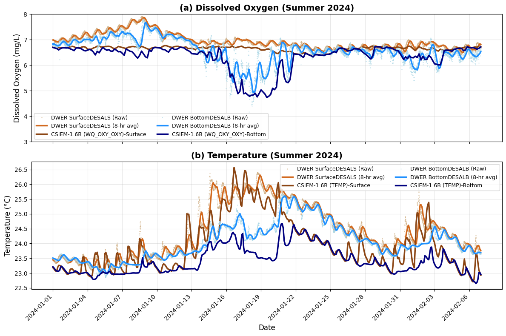

# Water Quality Dynamics {#water-quality}

## Overview

The approach to simulate water quality is outlined in Chapter 11. This describes the external loads, the approach to capturing benthic interactions, and the internal biogeochemical processes. In this section, the results of multiple years of CSIEM simulations are explored, looking at oxygen, nutrients, chlorophyll-a and turbidity under a range of conditions.

The approach to the assessment of the model is to consider both the broad-scale patterns - termed synoptic-scale assessment, whilst also considering event-scale dynamics that allow a deeper look at key processes shaping water quality.

## Synoptic scale assessment

A set of 10 main water quality variables are compared alongside the available data in the data-warehouse for 6 focus simulation years. Each year has different data availability, but in general around 10 - 30 of the reporting polygons contain field data and, in its entirety, this provides an extensive summary of the model performance across a range of locations. 

Images of $TSS$, $Turbidity$, $DO$, $TN$, $TP$, $NO_3$, $NH_4$ and $PO_4$ across multiple sites and multiple years, comparing both surface and bottom conditions are [<span style="color: blue">viewable via the **MARVL-VIEWER** web-app</span>](https://csiem-mv.seaf.org.au).

```{block2, hintWQ, type='rmdnote2'}
*Note that model performance and data available in the synoptic assessment has evolved over versions. For inspection of the performance of a specific model version refer to the model version instance within the MARVL Viewer.*
```


## Resuspension and Turbidity


## Stratification and Oxygen Drawdown

In Cockburn Sound, bottom-water oxygen variability is primarily governed by episodic water-column stratification that restricts vertical exchange between surface and near-bed waters. During summer, strong solar heating combined with weak wind forcing promotes the development of a thermally stratified surface layer, producing a shallow pycnocline that suppresses turbulent mixing. Numerical modelling and observations demonstrate that such stratification can persist over multi-day periods despite the shallow depth of the Sound, particularly during late summer when diurnal heating exceeds wind-driven and convective mixing (Xiao et al., 2022). 

Under these stratified conditions, oxygen consumption in bottom waters—dominated by sediment oxygen demand associated with organic matter deposition—can exceed vertical and lateral oxygen supply, leading to rapid declines in near-bed oxygen concentrations. Observations during stratified events show strong vertical oxygen gradients beneath the pycnocline and deoxygenation rates consistent with a substantial benthic sink (Dalseno et al., 2024). Xiao et al. (2022) further showed that compensating inflows of cooler subsurface water during summer circulation can reinforce near-bed density structure, prolonging bottom-water isolation.  Local density anomalies associated with desalination brine discharges may further enhance this effect by increasing bottom-layer density and reducing effective ventilation near the seabed (BMT, 2019). 

Therefore, risks around oxygen depletion reflect the interaction between transient density stratification, benthic oxygen demand, and near-bed density structure, rather than persistent or system-wide water-column separation. For the purpose of assessing model's ability to resolve these dynamics, we seek to replicate the "event-scale" behaviour when low oxygen risks occur. 

{width="97%" }

**Figure 12.X1.** Transect animation of CSIEM dissolved oxygen ($OXY\_oxy$) variable and vertical current vectors, highlighting variability in water flow direction, "hypoxic dome" behaviour. Note the two-layer exchange between CS and OA causing periodic "ventilation" of bottom waters. 

An audit of the suitable data was undertaken to identify observed bottom water 'events' showing oxygen drawdown.  The main event periods with observed data available are:

- **Autumn 2013**: WCWA 2013 PSDP studies
- **Summer 2018**: CSIRO bottom water DO installation (Dalseno et al. 2024)
- **Summer 2024**: DWER CS-MOORING data-set 

The 2018 (CSIRO) data-set was not used as validation for the model as the 2018 simulation year was not completed for the versions upto 1.7.0 and delayed access to the data. However, the SOD rate reported in Dalseno et al. (2024), was used as justification to set the model flux rates (see Chapter 11.3). The 2013 and 2024 event data are explored further below.

### Autumn 2013

As part of the PSDP investigations an intensive set of water column profiles was completed, as reported in BMT XXX. This data shows the vertical structure of the water column, with stratification forming ~9th April, peaking around the 20th April and ending by the 30th April. A summary of the event is shown in Figure 12.XX, comparing the surface 1m and bottom 1m water concentrations. 

{width="95%"}

**Figure 12.XX.** Time-series of dissolved oxygen averaged over the 
"BasinMWest" polygon, showing observed and modelled concentrations at the water surface and water bottom. The observed "WC" data is data from the WCWA-PSDP-XXX data-set.  

This event was similar to the drawdown reported in the Dalseno et al. (2024), and noting that AED adopted similar sediment oxygen demand rates to those (see Section 11.3.2), this confirms the approach. 

### Summer 2024

In the period from November 2023 - February 2024 the model was interrogated to identify the pattern of stratification and oxygen sag (Figure 12.X).  

{width="95%"}

**Figure 12.XX.** Overview of simulated dissolved oxygen (top panel) and water age (bottom panel). Vertical data taken from the red marker indicated on the maps. The low oxygen event is abruptly ended when "new" water enters into the basin from Owen Anchorage (indicated by the low water age numbers). 

The [Cockburn Sound moorings](https://estuaries.dwer.wa.gov.au/cockburn-sound/) maintained by DWER were reviewed for "events" and high quality data showing this phenomenon. The most clear indication was for the site "DESAL" where top and bottom sensors are deployed, and in January and February 2024 periods of oxygen stratification were observed.

{width="95%"}

**Figure 12.XX.** Surface and bottom time-series of (a) dissolved oxygen and (b) temperature, comapring the model predictions and observations at the DWER "DESAL" mooring.


## Nutrients


## Phytoplankton and Water Column Productivity

In this section the CSIEM results are first assessed at a synoptic scale considering both multi-year and multi-site variability throughout the annual cycle, and then a case study is explore to understand processes that control bloom formation.

### Seasonal variability

The best periods with datasets capturing the seasonal changes in chlorophyll-a biomass across the region of interest are the years 2021 and 2022, where regular sampling was undertaken as part of the CSMC and WWMSP programs throughout the annual cycle. 

#### {.panelset .unnumbered}

##### Warnbro {.unnumbered}

{width=95%}

**Figure 12.X-i.** Simulated versus observed chl-a concentrations, comparing the CSMC grab sample programs and the CSIEM predictions. 

##### Mangles {.unnumbered}

{width=90%}

**Figure 12.X-ii.** Simulated versus observed chl-a concentrations, comparing two satellite data-sets, two grab sample programs and the CSIEM predictions. Note the "ESA-SEN3-OLCI" imagery is not calibrated to Cockburn Sound conditions and shows a consistent bias which dominates the error in the model skill metrics.

##### KS South {.unnumbered}

{width=90%}

**Figure 12.X-iii.** Simulated versus observed chl-a concentrations, comparing two satellite data-sets, two grab sample programs and the CSIEM predictions. Note the "ESA-SEN3-OLCI" imagery is not calibrated to Cockburn Sound conditions and shows a consistent bias which dominates the error in the model skill metrics.


##### CS NWest {.unnumbered}

{width=90%}

**Figure 12.X-iv** Simulated versus observed chl-a concentrations, comparing two satellite data-sets, two grab sample programs and the CSIEM predictions. 

##### OA West {.unnumbered}

{width=90%}

**Figure 12.X-v.** Simulated versus observed chl-a concentrations, comparing two satellite data-sets, two grab sample programs and the CSIEM predictions. Note the "ESA-SEN3-OLCI" imagery is not calibrated to Cockburn Sound conditions and shows a consistent bias which dominates the error in the model skill metrics.


##### Rottnest NRS {.unnumbered}

{width=95%}

**Figure 12.X-vi.** Simulated versus observed chl-a concentrations, comparing two satellite data-sets, the IMOS grab sample program and the CSIEM predictions. Note the "ESA-SEN3-OLCI" imagery is not calibrated to Cockburn Sound conditions and shows a consistent bias which dominates the error in the model skill metrics.


### Event dynamics

Water-column productivity in Cockburn Sound is driven by nutrient supply and light availability, and moderated by patterns of stratification and rates of horizontal exchange  and mixing. Nutrient inputs arise predominately from (winter) catchment inputs, groundwater discharge and (summer) sediment recycling, with nitrogen generally considered to limit phytoplankton growth. The animation from the model highlights the interplay of these factors (Figure 12.X). 


{width="97%" }

**Figure 12.X1.** Transect animation of CSIEM chlorophyll-a ($PHY\_tchla$) and velocity current vectors (top) and the rate of gross water column productivity (algae photosynthesis) (bottom) panel. The plan-view images show the water column (phytoplankton) versus seabed (microphytobenthos) rates of productivity. 

Strong seasonality in light and temperature drives higher potential productivity in spring–summer, but this is frequently constrained by nutrient depletion and episodic stratification. Stratification can (temporarily) enhance surface productivity due to suppression of vertical nutrient supply from oxygen-deplete bottom-waters. However, wind-driven mixing events then subsequently can re-supply nutrients to the euphotic zone, producing short-lived "productivity pulses". 

To explore this dynamic, a period of "mild" bloom conditions not associated with inflows was identified and examined in the CSIEM simulations. The period of January 2024, described above associated with stratification and hypoxia, was chosen as a series of consecutive satellite images were identified showing a bloom progression sequence (Figure 12.XX), which shows the emergence of the bloom from the beginning of Janurary to the 26th, and then its rapid dissipation. 

The drivers of productivity during this time were examined in the model, considering GPP (gross primary productivity) predictions, the modelled temperature and nutrient limitation, and prevailing oxygen conditions (Figure 12.XX). As hypothesised, the date of the observed bloom peak in the satellite image aligns exactly with a time of heightened surface layer productivity identified in the model, which followed a stratification episode. The peak sag in oxygen was associated with a peak in dissolved inorganic nitrogen (~ 22 Jan 2024), which was subsquently mixed into the surface layer, with peak GPP matching the bloom image at 26th Jan 2024. Whilst warmer conditions preceded the productivity peak and enhanced the temperature multiplier, it was the re-supply of nitrogen after mixing that had built up in the bottom waters, into the euphotic zone that led to the elevated phytoplankton growth rate.


{width="93%"}

**Figure 12.XX.** Mild-bloom event as depicted within Sentinel-2 imagery showing estimated Chl-a observations in Jan 2024. Data based on the CR2CC-NN algorithm which is uncalibrated to Cockburn Sound conditions, but applied in a relative sense to compare spatio-temporal extent. The grey-masked areas are shallow benthic areas where bottom reflectance complicates colour interpretation and are thus excluded from the image.


{width="98%"}

**Figure 12.XX.** Comparison of deep basin (left) and shelf (right) depth profiles of phytoplankton (algae) productivity (GPP), temperature limitation (denoted FT, representing $\Phi(T)$) and nutrient limitation (denoted FN, representing $\Phi(N)$) for the dominant group (DIATOM, $a=3$), alongside $DO$ (bottom panel).  

This is not the only pathway for bloom generation, noting the wide variety of conditions occurring in the Sound over an annual cycle. This example does nonetheless demonstrate the interplay between physical and biogeochemical mechanisms that work together to create favourable bloom conditions.

## Summary


