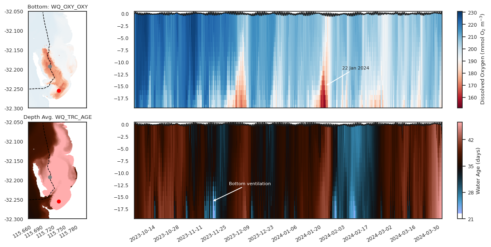

# Water Quality Dynamics {#water-quality}

## Overview

The approach to simulate water quality is outlined in Chapter 11. This describes the external loads, the approach to capturing benthic interactions, and the internal biogeochemical processes. In this section, the results of multiple years of CSIEM simulations are explored, looking at oxygen, nutrients, chlorophyll-a and turbidity under a range of conditions.

The approach to the assessment of the model is to consider both the broad-scale patterns - termed synopti-scale assessment, whilst also considering event-scale dynamics that allow a deeper look at key processes shaping water quality.

## Synoptic scale assessment

A set of 10 main water quality variables are compared alongside the available data in the data-warehouse for 6 focus simulation years. Each year has different data availability, but in general around 10 - 30 of the reporting polygons contain field data and this provides summary of the model performance across a range of locations. 

Images of TSS, Turbidity, DO, TN, TP, NO3, NH4 and PO4 across multiple sites and multiple years, comparing both surface and bottom conditions are [<span style="color: blue">viewable via the **MARVL-VIEWER** web-app</span>](https://csiem-mv.seaf.org.au).

```{block2, hintWQ, type='rmdnote2'}
*Note that model performance and data available in the synoptic assessment has evolved over versions. For inspection of the performance of a specific model version refer to the model version instance within the MARVL Viewer.*
```


## Resuspension and Turbidity


## Stratification and Oxygen Drawdown

In Cockburn Sound, bottom-water oxygen variability is primarily governed by episodic water-column stratification that restricts vertical exchange between surface and near-bed waters. During summer, strong solar heating combined with weak wind forcing promotes the development of a thermally stratified surface layer, producing a shallow pycnocline that suppresses turbulent mixing. Numerical modelling and observations demonstrate that such stratification can persist over multi-day periods despite the shallow depth of the Sound, particularly during late summer when diurnal heating exceeds wind-driven and convective mixing (Xiao et al.). 

Under these stratified conditions, oxygen consumption in bottom waters—dominated by sediment oxygen demand associated with organic matter deposition—can exceed vertical and lateral oxygen supply, leading to rapid declines in near-bed oxygen concentrations. Observations during stratified events show strong vertical oxygen gradients beneath the pycnocline and deoxygenation rates consistent with a substantial benthic sink (Dalseno et al., 2024). Xiao et al. (2022) further showed that compensating inflows of cooler subsurface water during summer circulation can reinforce near-bed density structure, prolonging bottom-water isolation.  Local density anomalies associated with desalination brine discharges may further enhance this effect by increasing bottom-layer density and reducing effective ventilation near the seabed. 

Therefore, risks around oxygen depletion reflect the interaction between transient density stratification, benthic oxygen demand, and near-bed density structure, rather than persistent or system-wide water-column separation. For the purpose of assessing model's ability to resolve these dynamics, we seek to replicate the "event-scale" behaviour when low oxygen risks occur. 

{width="97%" }

**Figure 12.X1.** Transect animation of CSIEM dissolved oxygen ($OXY\_oxy$) variable and vertical current vectors, highlighting variability in water flow direction, hypoxic dome behaviour, and the two-layer exchange between CS and OA casuign periodic "ventiliation" of bottom waters. 

An audit of the suitable data was undertaken to identify observed bottom water 'events' showing oxygen drawdown.  The main event periods with observed data available are:

- Autumn 2013: WCWA 2013 PSDP studies
- Summer 2018: CSIRO bottom water DO monitoring in 2017-2018 (Dalseno et al. 2024)
- Summer 2024: DWER CS-MOORING data-set for site "DESAL" where top and bottom sensors are deployed.

The 2018 data-set was not used as validation for the model as the 2018 simulation year was not completed for the versions upto 1.7.0 and delayed access to the data. However, the SOD rate reported in Dalseno et al. (2024), was used as justification to set the model flux rates (see Chapter 11.3). The 2013 and 2024 event data are explored further below.

### Summer 2024

In the period from November 2023 - February 2024 the model was interrogated to identify the pattern of stratification and oxygen sag (Figure 12.X).  

{width="95%"}

**Figure 12.XX.** Overview of simulated dissolved oxygen (top panel) and water age (bottom panel). Vertical data taken from the red marker indicated on the maps. The low oxygen event is abruptly ended when "new" water enters into the basin from Owen Anchorage (indicated by the low water age numbers). 


## Nutrients


## Phytoplankton and Water Column Productivity


## Summary


