# Water Quality Dynamics {#water-quality}

## Overview

The approach to simulate water quality is outlined in [Chapter 14](bgc-model). This describes the external loads, the approach to capturing benthic interactions, and the internal biogeochemical processes. In this section, the results of multiple years of CSIEM simulations are explored, looking at oxygen, nutrients, chlorophyll-a and turbidity under a range of conditions.

The approach to the assessment of the model has been to consider both the broad-scale patterns - termed synoptic-scale assessment - followed by considering event-scale dynamics that allow a deeper look at key processes shaping water quality. 

## Synoptic scale assessment

A set of 10 main water quality variables are compared alongside the available data in the data-warehouse for 6 focus simulation years (2013, 2015, 2020, 2021, 2022, 2023/4). Each year has different data availability, but in general around 10 - 30 of the [main reporting polygons](results) containing field data and, in its entirety, this provides an extensive summary of the model performance across a range of locations. 

Images of $TSS$, $Turbidity$, $DO$, $TN$, $TP$, $NO_3$, $NH_4$ and $PO_4$ across multiple sites and multiple years, comparing both surface and bottom conditions are [<span style="color: blue">viewable via the **MARVL-VIEWER** web-app</span>](https://csiem-mv.seaf.org.au). The inset of each time-series plot also includes model-fit metrics.

This review of the model against the large catalogue of available data is termed the synoptic assessment, as it provides a broad overview of model performance metrics in different conditions, and across the gradient of sites included within the model. In general, these graphs can be interpreted to explore seasonality, differences between regions and key locations of interest (e.g., Kwinana Shelf vs Owen Anchorage), differences between years (e.g., wet vs dry years), and (periodic) differences between surface and bottom conditions. These results are summarised in the below section headings for different water quality attributes, and further more focused validations are also introduced below to compliment synoptic scale. 

```{block2, hintWQ, type='rmdnote2'}
*Note that model performance and data available in the synoptic assessment has evolved over versions. For inspection of the performance of a specific model version refer to the model version instance within the MARVL Viewer.*
```

## Resuspension and Turbidity

Turbidity within Cockburn Sound and Owen Anchorage is a combination of inorganic and organic particulate matter, with the balance between these two components shifting significantly depending on the underlying environmental conditions. During storms, which predominantly move through in winter, high wave-induced orbital velocities in conjunction with elevated water currents lead to high seabed shear stresses (exceeding $1\: N/m^2$). This drives substantial resuspension of even coarse sediments and creates spikes of turbidity (WWMSP3.1 report). In contrast, in calmer conditions, higher rates of phytoplankton productivity increase particulate algal matter and detritus in the water which can dominate the water optical conditions and persist for longer periods (O2M, 2025). Across the different environments along the coast, and throughout the year, there exists a continuum of conditions reflecting the interplay of these two processes. This is further complicated by dredging and wash-plant activity near Woodman Point, and the diversity of plumes associated with shipping and berthing along the coast of Cockburn Sound. 

The TSS in the AED model is based on a combination of the two inorganic particles groups, organic detrital material and phytoplankton, with each of these particles groups resolved by a characteristic sedimentation rate and resuspension rate, with the latter controlled by sediment supply and benthic habitat coverage (see Section 11.3). In this section, we focus on looking at TSS and turbidity data, noting that chl-a and organic matter pools are reported on specifically in subsequent sections.

### Suitable validation data

An audit of the suitable data was undertaken to identify observed turbidity 'events' showing periods of temporarily elevated turbidity.  The main event periods with observed data available are:

- **1982-2024**: CSMC long-term water quality monitoring program.
- **2021-2024**: DWER Cockburn Sound Moorings
- **2023-2024**: WWMSP3.1 Sediment Deposition Loggers

The CSMC monitoring is low-frequency but includes numerous sites and provides robust and consistent background conditions, noting that the data is biased towards fair-weather conditions (i.e., limited winter coverage or within-storm conditions). In contrast, the DWER and WWMSP logger data-sets are less accurate and prone to sensor drift and biofouling, but windows of high quality data show several "events" in detail.

In addition, an analysis of the Sentinel-2 imagery for *Total Suspended Matter* (TSM) is used to demonstrate the nature of spatial patterns in water turbidity, here assuming TSM is highly-correlated to turbidity. Note that the default TSM algorithm is used, without local calibration. Visit the [CSIEM Sentinel-2 explorer](https://csiemdash-leaflet.seaf.org.au) for details of these images.

### Seasonal variability 

The Sentinel-2 TSM imagery provides useful context as the variability of turbidity over time. Noting that these images are biased to capture fair-weather (cloud free and glint free) conditions, they provide a picture of the background conditions. Figure 15.1a shows the variability in conditions including several clear water states (TSM mean of ~ 0.5 mg/L), a more commonly occurring "background state" (TSM mean ~0.8 - 1.2 mg/L), and the atypical high turbidity conditions (TSM > 1.3mg/L). On review of the images, the latter category was regularly associated with visible activities associated with shipping and berthing (e.g., Figure 15.1b). Over the 10 years of images, there is a seasonal signal evident in the TSM data, with generally higher turbidity during the months of Dec - Apr.   

```{r, echo=FALSE, out.width="90%"}
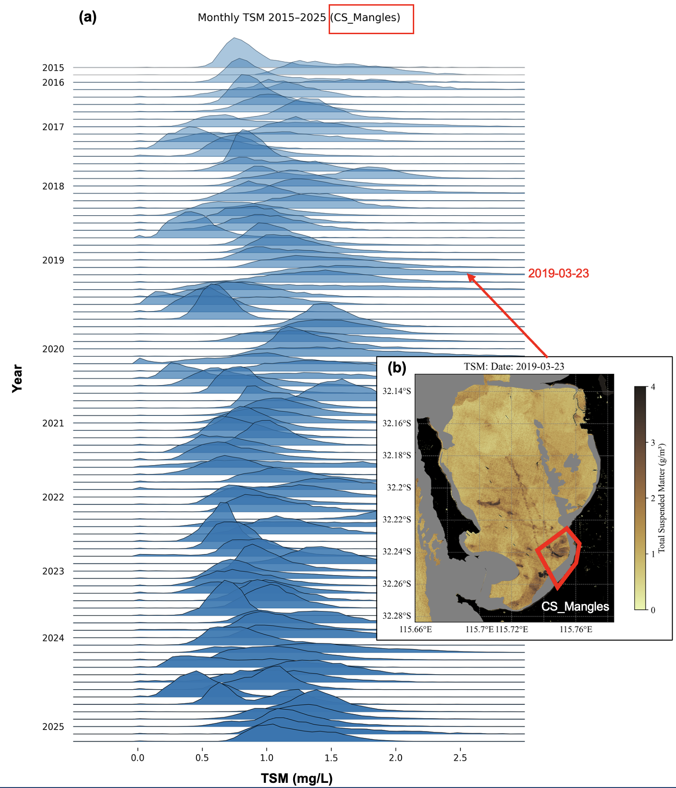
```

:::{.figcap}
**Figure 15.1.** Changes in water TSM within the CS_Mangles polygon. (a) ridgeplot showing TSM density in the selected polygon for each of 96 identified Sentinel-2 images (note the height of the ridge is the frequency of that value within the pixels within the selected polygon). (b) selected image from March 2019 showing the observed TSM pattern within the harbour and location of the CS_Mangles polygon used to compute the ridgeplot distributions. Note that the ridgeplot distributions removed the "masked" regions indicated by grey to remove areas confounded by bottom reflectance issues. To view further ridgeplot summaries for other CSIEM assessment polygons, visit the csiem-data repository.
:::


```{r, echo=FALSE, out.width="80%"}
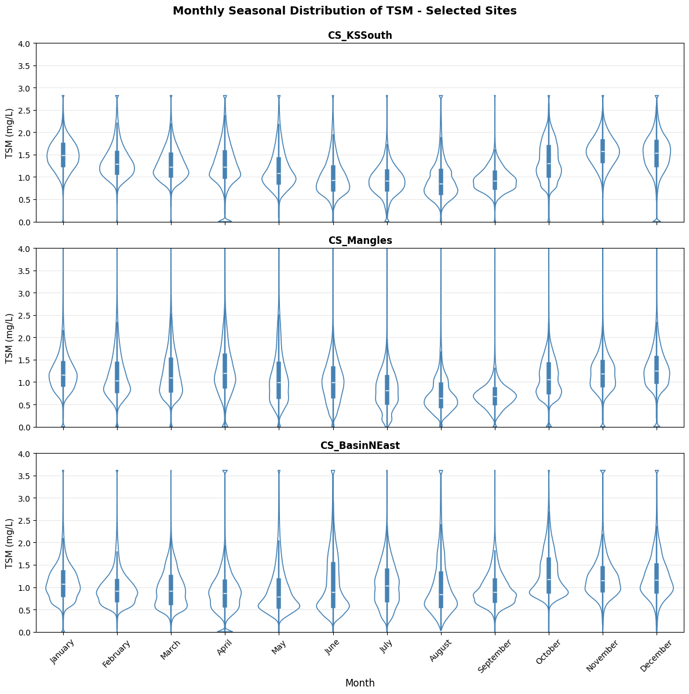
```

:::{.figcap}
**Figure 15.2.** Summary of monthly TSM values from the 10 years of Sentinel-2 images (n=96).
:::

The *in situ* TSS data similarly shows a pattern of high variability with a weak seasonal change. To give a broad overview a 10-year summary of TSS and Turbidity is shown in Figure 15.3, all data within the entire Cockburn Sound routine monitoring is presented and varying between 1 - 5 mg/L. 


#### {.panelset .unnumbered}

##### TSS data {.unnumbered}

```{r, echo=FALSE, out.width="90%"}
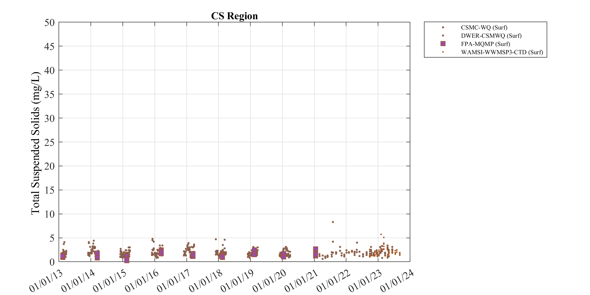
```

:::{.figcap}
**Figure 15.3-i.** Collation of available $TSS$ data across the CS Region polygon. For inspection of data in individual areas or areas outside of Cockburn Sound, visit the CSIEM Marvl Viewer.
:::


##### Turbidity data {.unnumbered}

```{r, echo=FALSE, out.width="90%"}

```

:::{.figcap}
**Figure 15.3-ii.** Collation of available $Turbidity$ data across the CS Region polygon. For inspection of data in individual areas or areas outside of Cockburn Sound, visit the CSIEM Marvl Viewer.
:::


Over the 6 years of CSIEM simulations, the model predicts a pattern of lower summer TSS and higher TSS peaks in the winter months in response to consecutive storms, and this pattern is more noticeable in wave exposed zones (e.g., Owen Anchorage vs Mangles Bay). The validation years 2013, 2015 and 2020 only have summer sampling data, which the model reproduces well across the different zones. The years 2021, 2022, and 2023 have monitoring throughout the year, and show the model results to be higher than the winter month monitoring, suggesting an over-prediction in resuspension. However, it is noted that the monitoring data is biased to fair-weather conditions, and so is not well suited to capture periodic increases associated with short-term storm dynamics. This is explored further in the next section.

A summary of the annual cycle of TSS predicted by the model is shown in Figure 15.4 for the year 2023, when several data-sets were available. This figure shows the different dynamics between the major regions within the model domain (CS, OA, GR, SW), with the highest peaks occurring in the GR and SW regions which are more exposed to extreme wave conditions. The model shows the tendency to over-predict slightly in the months between June - September within the CS and OA regions. The plots also highlight the difference in the regions between the surface and bottom TSS concentrations, with differences occurring due to the spatially variable coarse:fine particle ratio in the different benthic zones. As the grab-sample data is taken from the surface the model calibration focused on comparing the surface time-series with the observations.

#### {.panelset .unnumbered}

##### Cockburn Sound {.unnumbered}

```{r, echo=FALSE, out.width="90%"}
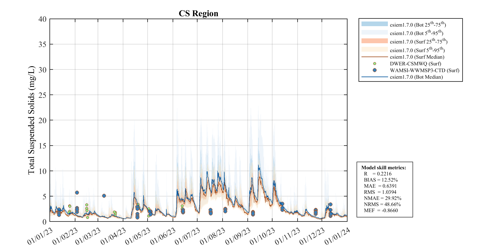
```

:::{.figcap}
**Figure 15.4-i.** Comparison of observed and simulated $TSS$ ($g/m^3$), within Cockburn Sound.
:::


##### Owen Anchorage {.unnumbered}

```{r, echo=FALSE, out.width="90%"}
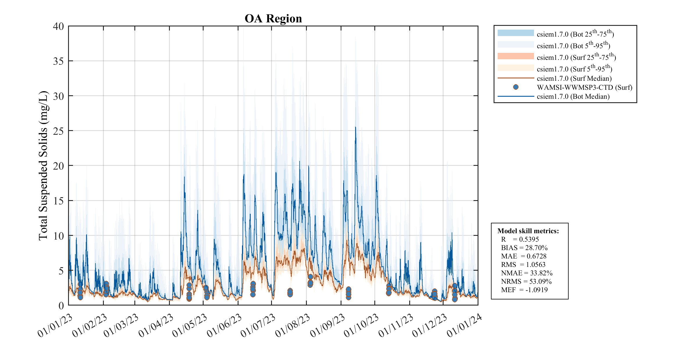
```

:::{.figcap}
**Figure 15.4-ii.** Comparison of observed and simulated $TSS$ ($g/m^3$), within Owen Anchorage.
:::

##### Gage Roads {.unnumbered}

```{r, echo=FALSE, out.width="90%"}
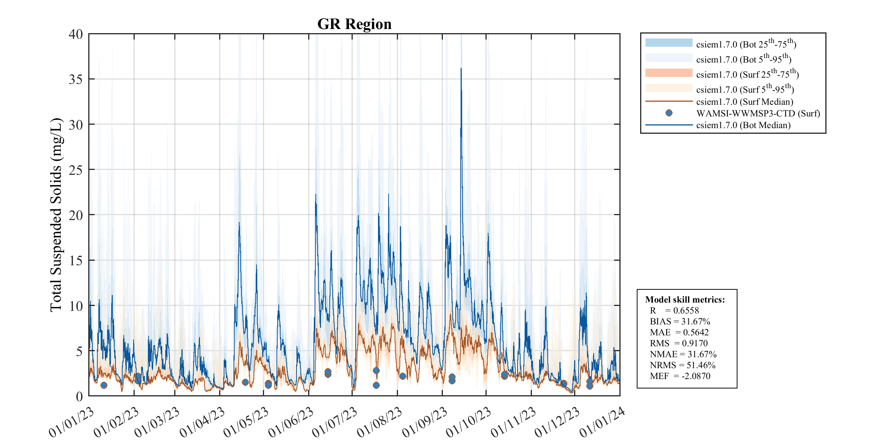
```

:::{.figcap}
**Figure 15.4-iii.** Comparison of observed and simulated $TSS$ ($g/m^3$), within Gage Roads.
:::

##### South Coast {.unnumbered}

```{r, echo=FALSE, out.width="90%"}
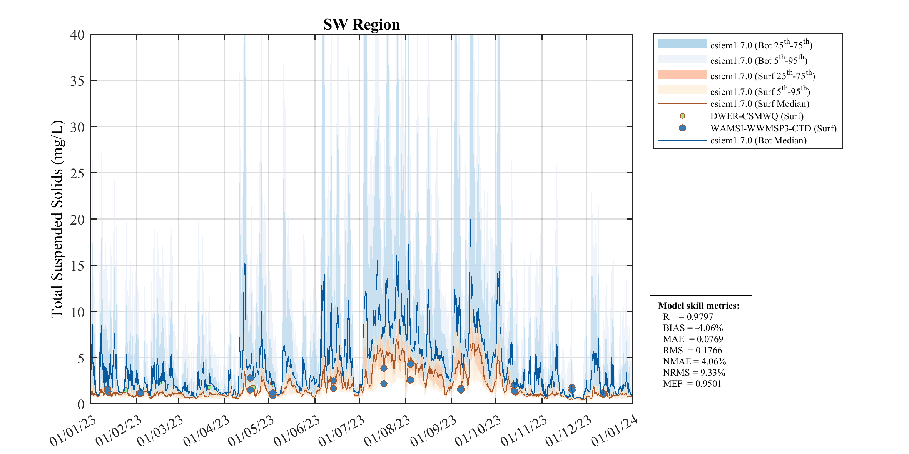
```

:::{.figcap}
**Figure 15.4-iv.** Comparison of observed and simulated $TSS$ ($g/m^3$), within the South Coast region.
:::


### Turbidity event calibration 

The above analysis shows the model is capturing the general drivers and variability across the domain, with a balance between particulate inputs to the water column and their subsequent deposition creating a spatio-temporal pattern that is largely consistent with the observed data-set. The WWMSP3.1 logger deployments in 2023 additionally allow for a more targeted look at sediment resuspension dynamics, based on their high frequency sensor data collected just above the seabed in areas exposed to different wave conditions. 

In Figure 15.5 the model is compared against this high-frequency turbidity data-set for a focus period in 2023 where there was a period of high wind events causing several notable turbidity pulses, in addition to nearby independent turbidity measurements from the routine monitoring program. The results show the simulated turbidity responding to the high wind-wave conditions, which generally shows alignment with the logger and monthly profile data.


#### {.panelset .unnumbered}

##### OA-West {.unnumbered}

```{r, echo=FALSE, out.width=c("20%","78%"), fig.show="hold"}
knitr::include_graphics(c("./media/wq/TURBIDITY_2023/maps/OA1.png", "./media/wq/TURBIDITY_2023/OA1.png"))
```

:::{.figcap}
**Figure 15.5-i.** Comparison of observed and simulated $Turbidity$ ($NTU$), within the Owen Anchorage (West) polygon. The small points are data from the WWMSP3 OA1 logger situated above the seabed, which is compared to the bottom concentrations within the model (blue line).
:::


##### OA-East {.unnumbered}

```{r, echo=FALSE, out.width=c("20%","78%"), fig.show="hold"}
knitr::include_graphics(c("./media/wq/TURBIDITY_2023/maps/S4S2.png", "./media/wq/TURBIDITY_2023/S4S2.png"))
```

:::{.figcap}
**Figure 15.5-ii.** Comparison of observed and simulated $Turbidity$ ($NTU$), within the Owen Anchorage (East) polygon. The small points are data from the WWMSP3 S4S2 logger situated above the seabed, which is compared to the bottom concentrations within the model (blue line).
:::

##### KS-Mid {.unnumbered}

```{r, echo=FALSE, out.width=c("20%","78%"), fig.show="hold"}
knitr::include_graphics(c("./media/wq/TURBIDITY_2023/maps/JB16A.png", "./media/wq/TURBIDITY_2023/JB16A.png"))
```

:::{.figcap}
**Figure 15.5-iii.** Comparison of observed and simulated $Turbidity$ ($NTU$), within the Kwinana Shelf (middle) polygon. The small points are data from the WWMSP3 JB16A logger situated above the seabed, which is compared to the bottom concentrations within the model (blue line).
:::

##### KS-South {.unnumbered}

```{r, echo=FALSE, out.width=c("20%","78%"), fig.show="hold"}
knitr::include_graphics(c("./media/wq/TURBIDITY_2023/maps/CSR14.png", "./media/wq/TURBIDITY_2023/CSR14.png"))
```

:::{.figcap}
**Figure 15.5-iv.** Comparison of observed and simulated $Turbidity$ ($NTU$), within the Kwinana Shelf (South) region. The small points are data from the WWMSP3 CSR-14 loggers situated above the seabed, which is compared to the bottom concentrations within the model (blue line).
:::

##### KS-South (S4S10) {.unnumbered}

```{r, echo=FALSE, out.width=c("20%","78%"), fig.show="hold"}
knitr::include_graphics(c("./media/wq/TURBIDITY_2023/maps/S4S10.png", "./media/wq/TURBIDITY_2023/S4S10.png"))
```

:::{.figcap}
**Figure 15.5-v.** Comparison of observed and simulated $Turbidity$ ($NTU$), within the Kwinana Shelf (South) region. The small points are data from the WWMSP3 S4S10 loggers situated above the seabed, which is compared to the bottom concentrations within the model (blue line).
:::


##### CS-SthFlats {.unnumbered}

```{r, echo=FALSE, out.width=c("20%","78%"), fig.show="hold"}
knitr::include_graphics(c("./media/wq/TURBIDITY_2023/maps/CSSF.png", "./media/wq/TURBIDITY_2023/CSSF_DL.png"))
```

:::{.figcap}
**Figure 15.5-vi.** Comparison of observed and simulated $Turbidity$ ($NTU$), within the Cockburn Sound (South Flats) region. The small points are data from the WWMSP3 CSSF-DL logger situated above the seabed, which is compared to the bottom concentrations within the model (blue line).
:::


## Stratification and Oxygen Drawdown

In Cockburn Sound, bottom-water oxygen variability is primarily governed by episodic water-column stratification that restricts vertical exchange between surface and near-bed waters. During summer, strong solar heating combined with weak wind forcing promotes the development of a thermally stratified surface layer, producing a shallow pycnocline that suppresses turbulent mixing. Numerical modelling and observations demonstrate that such stratification can persist over multi-day periods despite the shallow depth of the Sound, particularly during late summer when diurnal heating exceeds wind-driven and convective mixing (Xiao et al., 2022). 

Under these stratified conditions, oxygen consumption in bottom waters—dominated by sediment oxygen demand associated with organic matter deposition—can exceed vertical and lateral oxygen supply, leading to rapid declines in near-bed oxygen concentrations. Observations during stratified events show strong vertical oxygen gradients beneath the pycnocline and deoxygenation rates consistent with a substantial benthic sink (Dalseno et al., 2024). Xiao et al. (2022) further showed that compensating inflows of cooler subsurface water during summer circulation can reinforce near-bed density structure, prolonging bottom-water isolation.  Local density anomalies associated with desalination brine discharges may further enhance this effect by increasing bottom-layer density and reducing effective ventilation near the seabed (BMT, 2019). 

Therefore, risks associated with oxygen depletion reflect the interaction between transient density stratification, benthic oxygen demand, and near-bed density structure, rather than persistent or system-wide water-column separation. For the purpose of assessing the model's ability to resolve these dynamics (Figure 15.6), we seek to replicate the "event-scale" behaviour when low oxygen risks occur. 

```{r, echo=FALSE, out.width="97%"}
knitr::include_graphics("./media/wq/curtain_oxy_animation_2023-12-OXY.gif")
```

:::{.figcap}
**Figure 15.6** Transect animation of CSIEM dissolved oxygen ($OXY\_oxy$) variable and vertical current vectors, highlighting variability in water flow direction, "hypoxic dome" behaviour. Note the two-layer exchange between CS and OA causing periodic "ventilation" of bottom waters.
:::

### Suitable validation data

An audit of the suitable data was undertaken to identify observed bottom water 'events' showing oxygen drawdown.  The main event periods with observed data available are:

- **Autumn 2013**: WCWA 2013 PSDP studies 
- **Summer 2018**: CSIRO deep-basin bottom DO installation (Dalseno et al. 2024)
- **Autumn 2021**: DWER CS-MOORING profiling buoy data-set 
- **Winter 2021**: DWER CS-MOORING profiling buoy data-set 
- **Summer 2024**: DWER CS-MOORING fixed-depth deployment data-set 

The 2018 (CSIRO) data-set was not used as validation for the model as the 2018 simulation year was not completed for the versions upto 1.7.0 and delayed access to the data. However, the SOD rate reported in Dalseno et al. (2024), was used as justification to set the model flux rates (see Chapter 14.3). The 2013 and 2024 event data are explored further below.

### Autumn 2013

As part of the PSDP investigations an intensive set of water column profiles was completed, as reported in BMT (2018b). This data shows the vertical structure of the water column, with stratification forming ~9th April, peaking around the 20th April and ending by the 30th April. A summary of the event is shown in Figure 15.7, comparing the surface 1m and bottom 1m water concentrations. 

```{r, echo=FALSE, out.width="95%"}
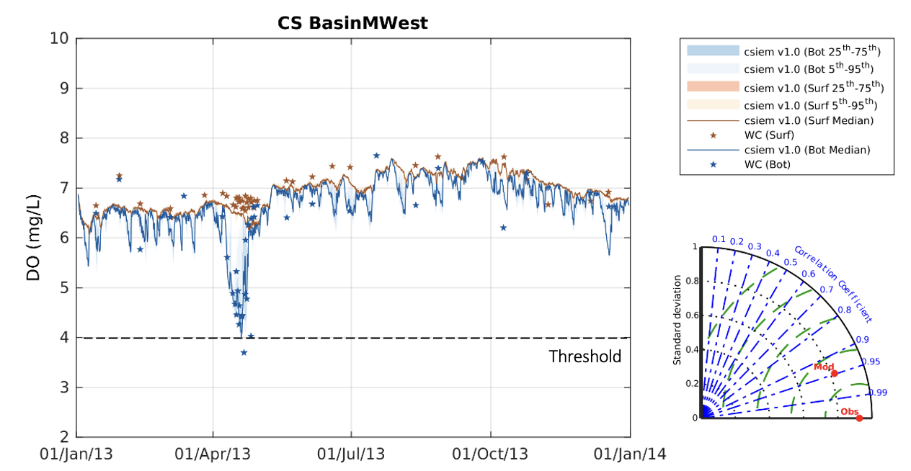
```

:::{.figcap}
**Figure 15.7.** Time-series of dissolved oxygen averaged over the "BasinMWest" polygon, showing observed and modelled concentrations at the water surface and water bottom. The observed "WC" data is data from the WCWA-PSDP-XXX data-set.
:::

This event was similar to the drawdown reported in the Dalseno et al. (2024), and noting that AED adopted similar sediment oxygen demand rates to those (see Section 11.3.2), this confirms the approach. 

### Summer 2024

In the period from November 2023 - February 2024 the model was interrogated to identify the pattern of stratification and oxygen sag (Figure 15.8).  

```{r, echo=FALSE, out.width="95%"}
knitr::include_graphics("./media/wq/oxygen_hovmoller_2024.png")
```

:::{.figcap}
**Figure 15.8.** Overview of simulated dissolved oxygen (top panel) and water age (bottom panel). Vertical data taken from the red marker indicated on the maps. The low oxygen event is abruptly ended when "new" water enters into the basin from Owen Anchorage (indicated by the low water age numbers).
:::

The [Cockburn Sound moorings](https://estuaries.dwer.wa.gov.au/cockburn-sound/) maintained by DWER were reviewed for "events" and high quality data showing this phenomenon. The data from the 8 installations between 2021 - 2024 was considered, also bearing in mind the field and sensor calibration reports. The clearest observation of stratification was for the site "DESAL" where top and bottom sensors are deployed, and in January and February 2024 periods of oxygen separation between surface and bottom were observed. This site is of interest as it is in ~ 16m of water, and so experiences different conditions relative to the deep basin where stratification has been previously highlighted. The comparison of the model during the event shows the correct timing of the onset and breakdown of stratification and a comparable rate and extent of oxygen drawdown relative to saturated conditions (Figure 15.9). The event is characterised by temperature difference between the surface and bottom waters. The model overestimates the degree of bottom water cooling (the model bottom temperature is 0.5 - 1 degree too cool) at this site, but captures the broad trend over the month.

```{r, echo=FALSE, out.width="95%"}
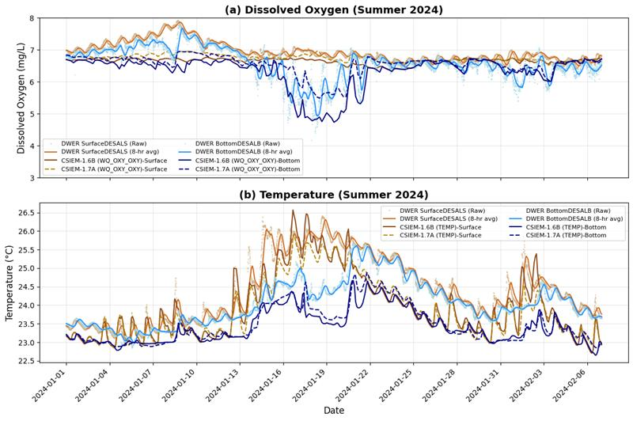
```

:::{.figcap}
**Figure 15.9** Surface and bottom time-series of (a) dissolved oxygen and (b) temperature, comparing the model predictions and observations at the DWER "DESAL" mooring.
:::

An animation of the event explains the conditions at the time of stratification onset (Figure 15.10).  

{width="97%" }

:::{.figcap}
**Figure 15.10.** Transect animation of CSIEM temperature, salinity and dissolved oxygen variables, highlighting a stratification event, and validation of the model stratification against mooring data.
:::

A broader month-by-month comparison of observed vs modelled dissolved oxygen and density anomaly profiles at the four DWER profiling moorings (CS4, Desal, CS13 and CS11) is presented in the [<span style="color: blue">**Dissolved Oxygen & Density Anomaly Mooring Report Card**</span>](validation/mooring_do.html). These curtain plots complement the event-scale analysis above by showing the model's ability to resolve vertical oxygen structure and density-driven stratification across seasons and sites.


## Nutrients


## Phytoplankton and Water Column Productivity

In this section the CSIEM results are first assessed at a synoptic scale considering both multi-year and multi-site variability throughout the annual cycle, and then a case study is explored to understand processes that control bloom formation.

### Suitable validation data

Several programs have collected chlorophyll-a within the CSOA region and associated waters. The main data sets are from the CSMC, spanning the period from 1982 to present. Data from FPA and WCWA has also been considered. Refer to the data summaries (e.g. follow the link WQ_DIAG_PHY_TCHLA.html in [Appendix A](datacat)) for a view of the data available.

In addition, the CSIEM data platform has also archived Sentinel 2 and Sentinel 3 imagery for the period from 2015 - 2024. These images have applied pre-existing algorithm for chl-a estimation and are not yet accurately calibrated to local conditions, however, they have been analysed to assess spatio-temporal patterns in chlorophyll-a, and used to support model validation where possible.

### Seasonal variability

 The best periods with datasets capturing the seasonal changes in chlorophyll-a biomass across the region of interest are the years 2021 and 2022, where regular sampling was undertaken as part of the CSMC and WWMSP programs throughout the annual cycle. 

#### {.panelset .unnumbered}

##### Warnbro {.unnumbered}

```{r, echo=FALSE, out.width="95%"}
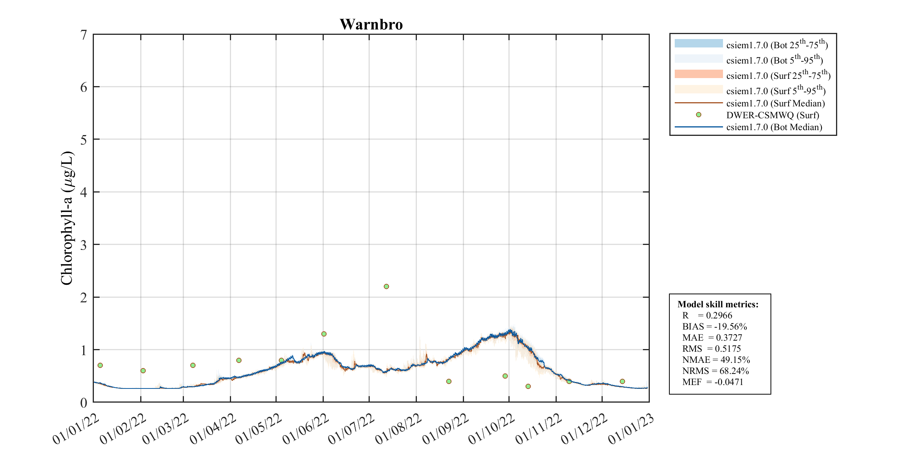
```

:::{.figcap}
**Figure 15.X-i.** Simulated versus observed chl-a concentrations, comparing the CSMC grab sample programs and the CSIEM predictions.
:::

##### Mangles {.unnumbered}

```{r, echo=FALSE, out.width="90%"}
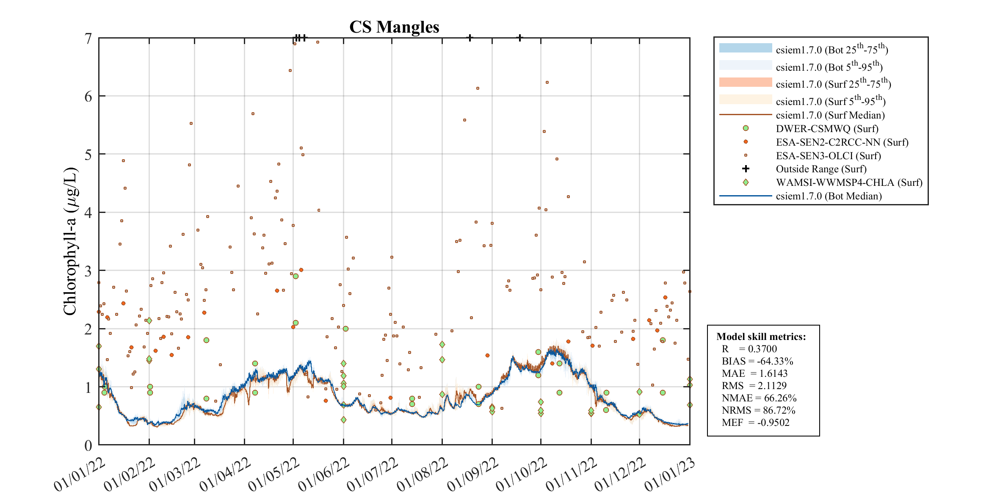
```

:::{.figcap}
**Figure 15.X-ii.** Simulated versus observed chl-a concentrations, comparing two satellite data-sets, two grab sample programs and the CSIEM predictions. Note the "ESA-SEN3-OLCI" imagery is not calibrated to Cockburn Sound conditions and shows a consistent bias which dominates the error in the model skill metrics.
:::

##### KS South {.unnumbered}

```{r, echo=FALSE, out.width="90%"}
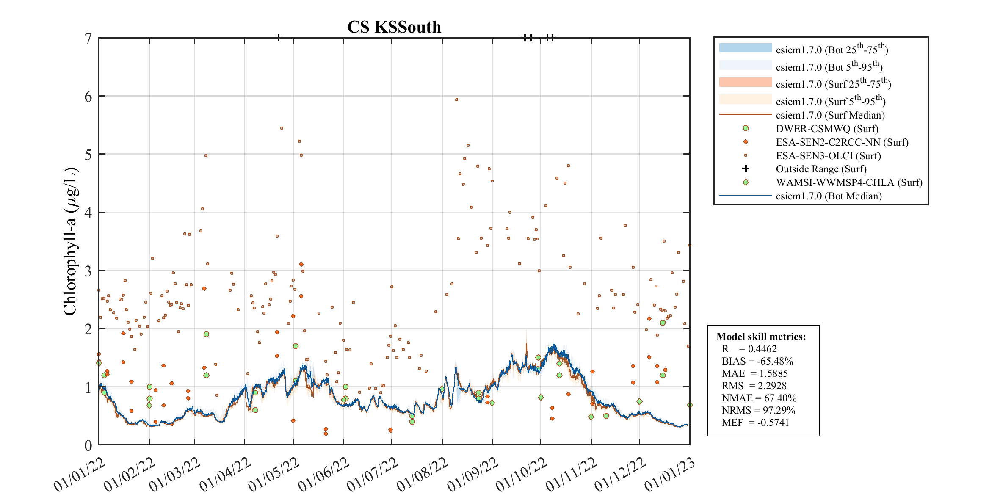
```

:::{.figcap}
**Figure 15.X-iii.** Simulated versus observed chl-a concentrations, comparing two satellite data-sets, two grab sample programs and the CSIEM predictions. Note the "ESA-SEN3-OLCI" imagery is not calibrated to Cockburn Sound conditions and shows a consistent bias which dominates the error in the model skill metrics.
:::


##### CS NWest {.unnumbered}

```{r, echo=FALSE, out.width="90%"}
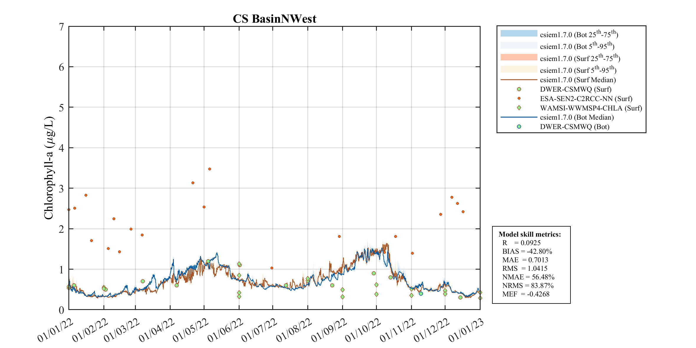
```

:::{.figcap}
**Figure 15.X-iv** Simulated versus observed chl-a concentrations, comparing two satellite data-sets, two grab sample programs and the CSIEM predictions.
:::

##### OA West {.unnumbered}

```{r, echo=FALSE, out.width="90%"}
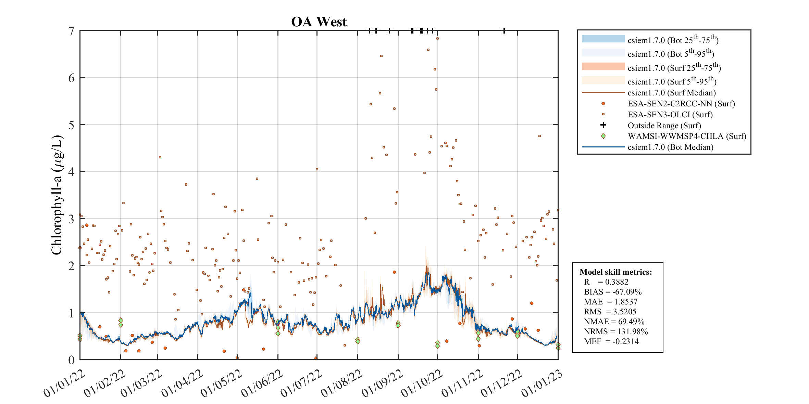
```

:::{.figcap}
**Figure 15.X-v.** Simulated versus observed chl-a concentrations, comparing two satellite data-sets, two grab sample programs and the CSIEM predictions. Note the "ESA-SEN3-OLCI" imagery is not calibrated to Cockburn Sound conditions and shows a consistent bias which dominates the error in the model skill metrics.
:::


##### Rottnest NRS {.unnumbered}

```{r, echo=FALSE, out.width="95%"}
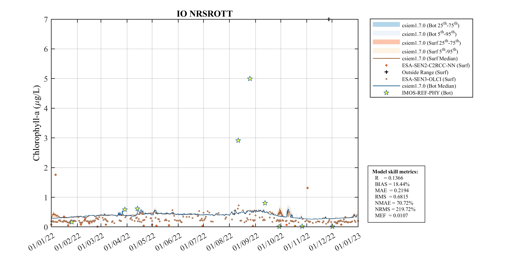
```

:::{.figcap}
**Figure 15.X-vi.** Simulated versus observed chl-a concentrations, comparing two satellite data-sets, the IMOS grab sample program and the CSIEM predictions. Note the "ESA-SEN3-OLCI" imagery is not calibrated to Cockburn Sound conditions and shows a consistent bias which dominates the error in the model skill metrics.
:::


### Productivity gradient

The areas of high and low biomass vary along the coast at different times of year, in response to the prevailing hydrodynamics. There is a general tendency of higher algal biomass being observed in the southern reaches of the Cockburn Sound and areas of reduced exchange along the Kwinana Shelf. For an example, a period of biomass build-up in January 2024 was observed within the 2024-01-26 Sentinel-2 imagery, showing the spatial pattern and in particular the northward tendency of the waters originating from the Sound. The model predicted biomass gradient was compared with this image, and displayed a similar spatial pattern (Figure 15.x). The controls on this event is discussed further below.

```{r, echo=FALSE, out.width="95%"}
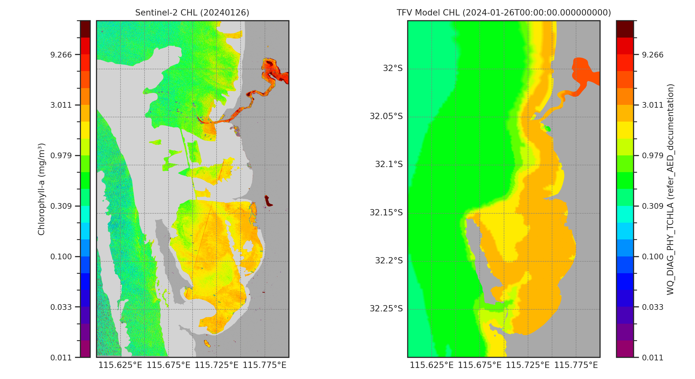
```

:::{.figcap}
**Figure 15.XX.** Spatial comparison of chlorophyll-a biomass as estimated from the Sentinel-2 image (left; applying the calibrated C2CC-NN algorithm), and from the CSIEM prediction (right). Imagery available from the [CSIEM Sentinel-2 explorer](https://csiemdash-leaflet.seaf.org.au)
:::

The variability in biomass reflects the spatial variability in depth-integrated productivity. The monthly cycle of gross primary productivity (GPP) across the domain is shown in Figure 15.XX, highlighting the seasonal shift in productivity hotspots and the contrast between shallow coastal zones and the deeper basin.

```{r, echo=FALSE, out.width="95%"}
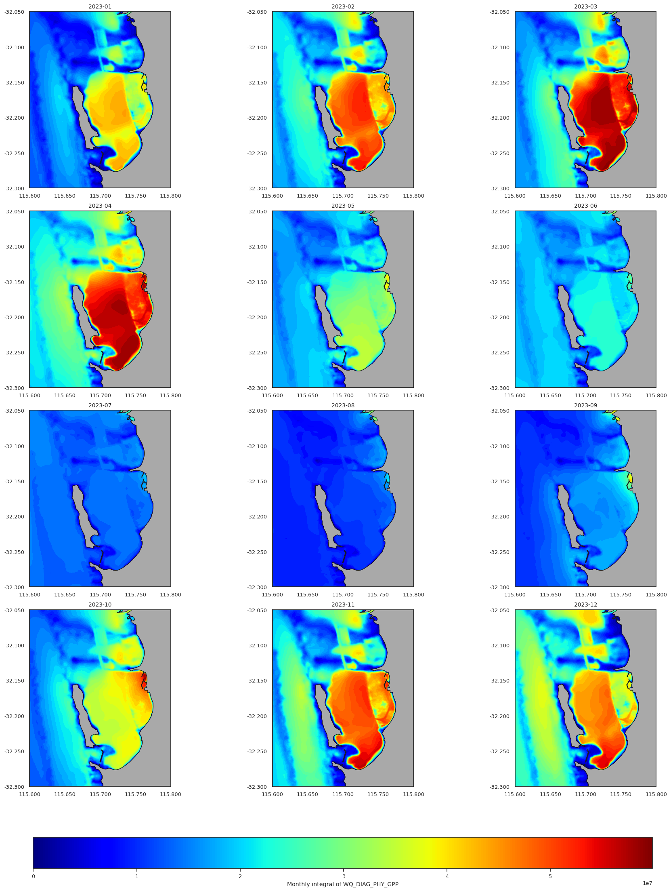
```

:::{.figcap}
**Figure 15.XX.** Monthly depth-integrated water column productivity (GPP) across the CSIEM domain, highlighting the seasonal and spatial variability in phytoplankton production.
:::


### Bloom event dynamics

Water-column productivity in Cockburn Sound is driven by nutrient supply and light availability, and moderated by patterns of stratification and rates of horizontal exchange  and mixing. Nutrient inputs arise predominately from (winter) catchment inputs, groundwater discharge and (summer) sediment recycling, with nitrogen generally considered to limit phytoplankton growth. The animation from the model highlights the interplay of these factors (Figure 15.X). 


```{r, echo=FALSE, out.width="97%"}
knitr::include_graphics("./media/wq/curtain_4panel_animation_2024-01-GPP.gif")
```

:::{.figcap}
**Figure 15.X1.** Transect animation of CSIEM chlorophyll-a ($PHY\_tchla$) and velocity current vectors (top) and the rate of gross water column productivity (algae photosynthesis) (bottom) panel. The plan-view images show the water column (phytoplankton) versus seabed (microphytobenthos) rates of productivity.
:::

Strong seasonality in light and temperature drives higher potential productivity in spring–summer, but this is frequently constrained by nutrient depletion and episodic stratification. Stratification can (temporarily) enhance surface productivity due to suppression of vertical nutrient supply from oxygen-deplete bottom-waters. However, wind-driven mixing events then subsequently can re-supply nutrients to the euphotic zone, producing short-lived "productivity pulses". 

To explore this dynamic, a period of "mild" bloom conditions not associated with inflows was identified and examined in the CSIEM simulations. The period of January 2024, described above associated with stratification and hypoxia, was chosen as a series of consecutive satellite images were identified showing a bloom progression sequence (Figure 15.XX), which shows the emergence of the bloom from the beginning of January to the 26th, and then its rapid dissipation. 

The drivers of productivity during this time were examined in the model, considering GPP (gross primary productivity) predictions, the modelled temperature and nutrient limitation, and prevailing oxygen conditions (Figure 15.XX). As hypothesised, the date of the observed bloom peak in the satellite image aligns exactly with a time of heightened surface layer productivity identified in the model, which followed a stratification episode. The peak sag in oxygen was associated with a peak in dissolved inorganic nitrogen (~ 22 Jan 2024), which was subsequently mixed into the surface layer, with peak GPP matching the bloom image at 26th Jan 2024. Whilst warmer conditions preceded the productivity peak and enhanced the temperature multiplier, it was the re-supply of nitrogen after mixing that had built up in the bottom waters, into the euphotic zone that led to the elevated phytoplankton growth rate.


```{r, echo=FALSE, out.width="93%"}
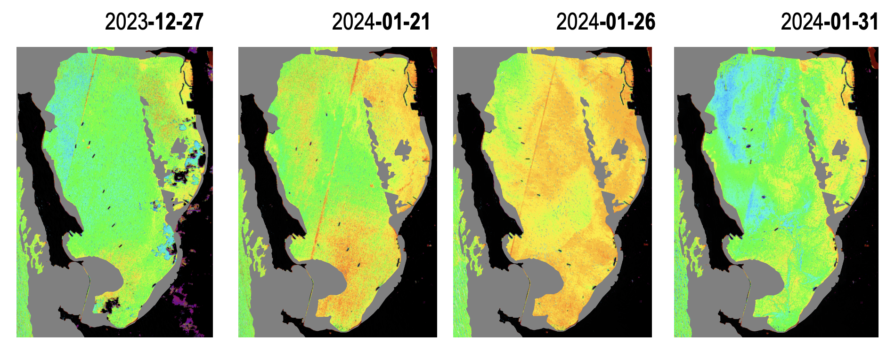
```

:::{.figcap}
**Figure 15.XX.** Mild-bloom event as depicted within Sentinel-2 imagery showing estimated Chl-a observations in Jan 2024. Data based on the CR2CC-NN algorithm which is uncalibrated to Cockburn Sound conditions, but applied in a relative sense to compare spatio-temporal extent. The grey-masked areas are shallow benthic areas where bottom reflectance complicates colour interpretation and are thus excluded from the image.
:::


```{r, echo=FALSE, out.width="98%"}
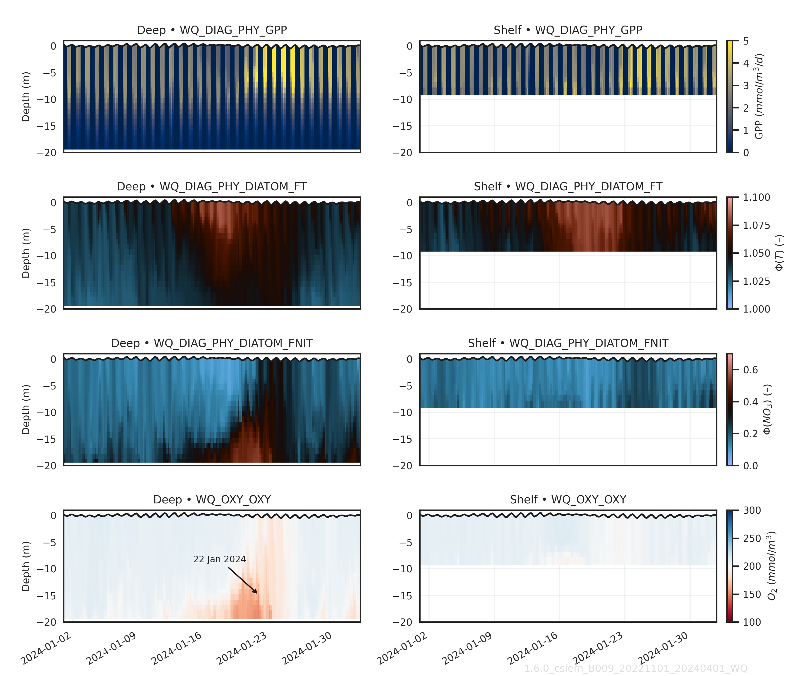
```

:::{.figcap}
**Figure 15.XX.** Comparison of deep basin (left) and shelf (right) depth profiles of phytoplankton (algae) productivity (GPP), temperature limitation (denoted FT, representing $\Phi(T)$) and nutrient limitation (denoted FN, representing $\Phi(N)$) for the dominant group (DIATOM, $a=3$), alongside $DO$ (bottom panel).
:::


The sequence observed in this event is not the only pathway for bloom generation, noting the wide variety of conditions occurring in the Sound over an annual cycle. This example does nonetheless demonstrate the interplay between physical and biogeochemical mechanisms that work together to create favourable bloom conditions. 

## Summary

This chapter has presented a multi-scale assessment of the CSIEM water quality predictions, covering resuspension and turbidity, stratification and oxygen drawdown, and phytoplankton dynamics. The assessment draws on an extensive observational data-set spanning routine monitoring (CSMC), high-frequency sensor deployments (DWER moorings, WWMSP3.1 loggers), satellite remote sensing (Sentinel-2 TSM and chlorophyll-a imagery), and targeted research campaign data.

**Resuspension and turbidity**: The model captures the dominant spatial and seasonal patterns in TSS and turbidity across the domain. Wave-exposed regions (Gage Roads, South Coast) experience the highest resuspension peaks during winter storms, while more sheltered areas (Cockburn Sound, Mangles Bay) show lower and less variable turbidity. Sentinel-2 TSM analysis over a 10-year record reveals a weak but persistent seasonal signal with higher turbidity during December--April. Comparison against the WWMSP3.1 high-frequency logger data confirms the model resolves the timing and relative magnitude of individual storm-driven turbidity pulses. A tendency for slight over-prediction during winter months is noted, though this is partly attributed to the fair-weather bias inherent in the grab-sample monitoring data.

**Stratification and oxygen drawdown**: The model resolves the episodic nature of water column stratification and its role in driving bottom-water oxygen depletion. Event-scale comparisons for autumn 2013 (WCWA-PSDP profiles) and summer 2024 (DWER DESAL mooring) demonstrate the model captures the onset, duration and breakdown of stratification events, and the associated rate and extent of oxygen drawdown. The model correctly represents the key mechanism -- thermal stratification suppressing vertical mixing, allowing sediment oxygen demand to deplete bottom waters -- and the subsequent ventilation of the basin when wind-driven mixing or lateral exchange from Owen Anchorage disrupts the density structure. A slight over-estimation of bottom-water cooling at some sites is noted as an area for continued refinement.

**Phytoplankton and water column productivity**: The model reproduces the observed seasonal cycle of chlorophyll-a across multiple zones, with validation against both grab-sample data and satellite imagery. Spatial gradients in biomass -- with higher concentrations in the southern Sound and along the Kwinana Shelf -- are consistent with the observed patterns. A detailed case study of a mild bloom event in January 2024 demonstrated the model's ability to resolve the mechanistic sequence linking stratification, bottom-water nutrient accumulation, wind-driven mixing and subsequent surface-layer productivity pulses. This event was independently corroborated by a sequence of Sentinel-2 images showing the bloom progression and dissipation.

Overall, the water quality model demonstrates good performance in resolving the key processes that govern turbidity, oxygen and productivity dynamics in Cockburn Sound. The confidence assessment for each variable is summarised in [Chapter 5](csiem-marvl).

