# Bio-optical Conditions {#light-climate}

## Overview

The underwater light climate in Cockburn Sound and Owen Anchorage is one of the most important attributes that links human activities, water quality and seagrass health. CSIEM includes advanced light simulation capability, able to resolve the light climate and variability in the drivers of light attenuation. 

Capturing the underwater light environment requires an understanding the role of different Inherent Optical Properties (IOPs), which control the absorption and scattering of light. These IOPs include algal cells, detrital particles, chromophoric DOM (CDOM), and different types of inorganic sediment particles. Each of these properties varies considerably over space and time, both over seasonal time-scales and also significantly during events such as a local algal blooms, or river flood pulses (see Figure 16.1). Daily shipping and dredging operations within the shallow waters can also lead to complex patterns of water turbidity.

```{r, echo=FALSE, out.width="95%"}
knitr::include_graphics("./media/image73.png")
```

:::{.figcap}
**Figure 16.1.** Snapshots taken from Sentinel-2 imagery showing periods where different optical properties can dominate water properties in and around Cockburn Sound. Visit the [CSIEM Sentinel-2 explorer](https://csiemdash-leaflet.seaf.org.au) for details and further images.
:::

Developing a well-calibrated light model is a useful way to help integrate the diversity of data from these sources and capture the variability in this key driver of ecosystem productivity. Additionally, key anthropogenic stressors associated with Cockburn Sound activities are related to dredging and in order to support environmental impact assessment, having a well parameterised light model is essential. Optically active constituents in the default CSIEM configuration include $SS_1$, $SS_2$, $POM$, $DOM$, and 4x $PHY$ groups (see Chapter 13), plus additional $SS$ groups can optionally be added to resolve the dredge- or shipping- related material. 

In this Chapter, two light model approaches are described which are configured within the AED model to compute the light climate variation in response to the optically active constituents. The first model is the "default" bulk-PAR model, and a second spectral model able to resolve the absorption and scattering of individual light wavelengths. Comparison of their predictions against selected data-sets is also described.

## Data availability and synthesis

A range of high quality light-related data-sets have been collected for assessing the light, including long-term monitoring of light attenuation, above and below water sensors measuring *in situ* $PAR$, and several spectral (multi-wavelength) light sensor deployments. Refer to Figure 16.2 for a broad summary of past data collection efforts, and Table \@ref(tab:13-lightdata) for a summary of key data sets considered during model assessment. 

```{r, echo=FALSE, out.width="90%"}
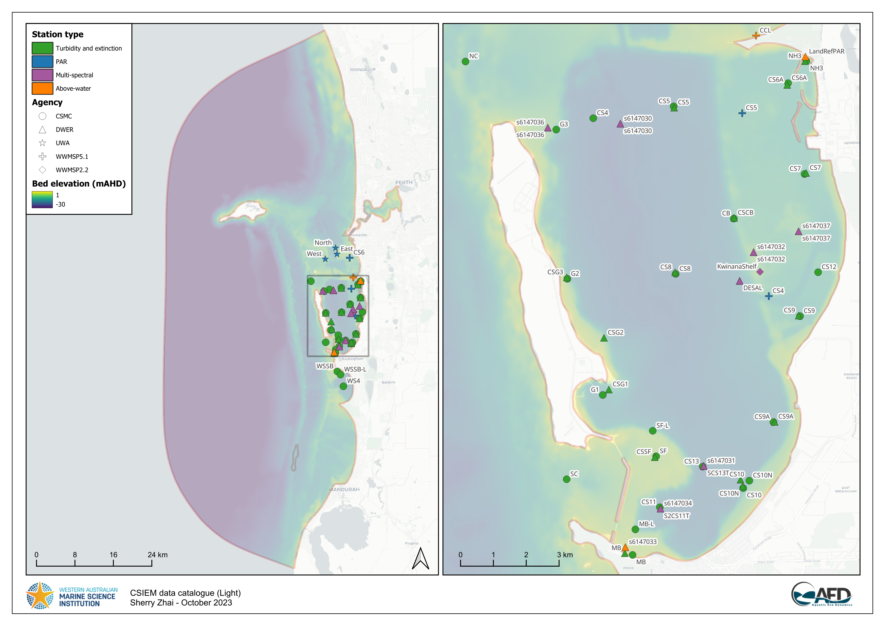
```

:::{.figcap}
**Figure 16.2.** Light data-set: Summary of CSIEM data catalogue showing identified light data. Click to enlarge. Visit the csiem-data catalogue for further information.
:::

<br>

```{r 13-lightdata, echo=FALSE, message=FALSE, warning=FALSE}
library(knitr)
library(kableExtra)
library(readxl)
library(rmarkdown)
theSheet <- read_excel('tables/data_summaries.xlsx', sheet = 1)
theSheet <- theSheet[theSheet$Table == "Light",]
theSheetGroups <- unique(theSheet$Group)


kbl(theSheet[,3:7], caption = "Summary of key data-sets included within CSIEM. Refer to Table 15.X for data sets reporting TSS and turbidity.", align = "l",) %>%
  pack_rows(theSheetGroups[1],
            min(which(theSheet$Group == theSheetGroups[1])),
            max(which(theSheet$Group == theSheetGroups[1])),
            background = '#ebebeb') %>%
  pack_rows(theSheetGroups[2],
            min(which(theSheet$Group == theSheetGroups[2])),
            max(which(theSheet$Group == theSheetGroups[2])),
            background = '#ebebeb') %>%
    pack_rows(theSheetGroups[3],
            min(which(theSheet$Group == theSheetGroups[3])),
            max(which(theSheet$Group == theSheetGroups[3])),
            background = '#ebebeb') %>%
  pack_rows(theSheetGroups[4],
            min(which(theSheet$Group == theSheetGroups[4])),
            max(which(theSheet$Group == theSheetGroups[4])),
            background = '#ebebeb') %>%

  row_spec(0, background = "#14759e", bold = TRUE, color = "white") %>%
  kable_styling(full_width = F,font_size = 10) %>%
  column_spec(2, width_min = "15em") %>%
  column_spec(3, width_max = "20em") %>%
  column_spec(4, width_max = "20em") %>%
  column_spec(5, width_min = "20em") %>%
    scroll_box(width = "680px", height = "720px",
             fixed_thead = FALSE)
```

<br>

## Bulk $PAR$ 

Photosynthetically Active Radiation (PAR; 400–700 nm) decreases with depth as light is absorbed and scattered by pure water, suspended inorganic sediments, phytoplankton pigments, and particulate and dissolved organic matter. In a bulk (band-averaged) model, this loss of light is represented with a diffuse
attenuation coefficient for PAR, \(K_{d,\text{PAR}}\) (m\(^{-1}\)).

Using the well-established Beer-Lambert equation, the downwelling PAR irradiance at depth \(z\) (m), denoted \(I_{\text{PAR}}(z)\)  (in W  m\(^{-2}\) , or converted to mol photons m\(^{-2}\) s\(^{-1}\)), is computed as:

\[
I_{\text{PAR}}(z)
= I_{\text{PAR}}(0^-)\,
\exp\left[-\int_0^{z} K_{d,\text{PAR}}(z')\,\mathrm{d}z'\right]
\]

where \(I_{\text{PAR}}(0^-)\) is PAR just below the water surface. Within AED, this calculation is resolved discretely over the vertical layer increments, such that the light at the bottom of each vertical layer is  calculated from the bulk layer properties:

\[
I_{\text{PAR}}(z^+_i)
= I_{\text{PAR}}(z^-_i)\,\exp\left(-K_{d_i}\,\Delta z_i\right).
\]

where $i$ denotes the vertical grid layer which has a thickness $\Delta z$, and \(K_{d_i} = K_{d,\text{PAR}}\) for the $i^{th}$ layer. To compute \(K_{d_i}\), the model aggregates the attenuation from contributions due to:

- background (pure) water,
- two classes of inorganic suspended sediment,
- particulate organic carbon (POC),
- dissolved organic carbon (DOC),
- phytoplankton / chlorophyll-_a_,

using a simple linear-additive formulation:

\[
K_{d_i}
= K_{w}
+ k_{\text{e_ss1}}\,SS_1
+ k_{\text{e_ss2}}\,SS_{\text{2}}
+ k_{\text{e_poc}}\,\text{POC}
+ k_{\text{e_doc}}\,\text{DOC}
+ \sum{k_e}_a\,PHY_a
\]

where:

- \(K_{w}\) is the background attenuation of PAR by pure water (m\(^{-1}\)), and
- \(k_{\text{e}}\) are the constituent-specific PAR attenuation coefficients (e.g. m\(^{-1}\) per unit concentration), and
- the constituents refer to their concentrations in the $i^{th}$ layer.

At the water's surface the incoming light ($I_0$) is specified based on the downwelling solar radiation intensity from the meteorological boundary condition file (either BARRA or WRF), and the PAR fraction entering the water is assigned to be 45% of the incoming solar intensity. At the seabed (or top of a submerged seagrass canopy), the incident light is computed by following the above equation down the set of water layers that make up the water column. This formulation is run as default in the CSIEM hydrodynamic–biogeochemical simulations to resolve spatial and temporal variability in underwater light climate, and to resolve benthic PAR. This can be optionally extended to run the spectrally-resolved light, described in Section 16.3.

Whilst the model is simple and applied widely, the challenge is locally parameterising the specific-attenuation coefficients, $k_{\text{e}...}$, in order to accurately reflect local conditions.  For Cockburn Sound, we reviewed literature values for similar embayments and local estimates, and then undertook refinement by a) adjusting of the specific attenuation factors to match $K_d$ observations (specifically for $SS$), and b) validating light attenuation against benthic PAR sensors (see Section 16.2 for a description of the available data-sets). A summary table of coefficients in shown in Table \@ref(tab:13-lightpars).


<br>

```{r 13-lightpars, echo=FALSE, message=FALSE, warning=FALSE}
library(knitr)
library(kableExtra)
library(readxl)
library(rmarkdown)

# function to fix floating point decimals
# df = dataframe to fix
# colNames = list() of colummns to fix
fixDecimals <- function(df, colNames){
  for(i in colNames){
    for(ii in 1:NROW(df[,i])){
      currentVal <- df[ii,i]
      currentVal <- as.numeric(currentVal)
      if(!is.na(currentVal)==TRUE){
        newVal <- as.character(currentVal)
        df[ii,i] <- newVal
      } 
    }
  }
  return(df)
}

theSheet <- read_excel('tables/water/phytoplankton_parameters.xlsx', sheet = 2)
theSheet <- fixDecimals(
  df = theSheet, 
  colNames = list("CSIEM")
  )
theSheet <- theSheet[theSheet$Table == "Parameter",]
theSheetGroups <- unique(theSheet$Group)

for(i in seq_along(theSheet$Parameter)){
  if(!is.na(theSheet$Parameter[i])==TRUE){
    theSheet$Parameter[i] <- paste0("$$",theSheet$Parameter[i],"$$")
  } else {
    theSheet$Parameter[i] <- NA
  }
}
for(i in seq_along(theSheet$Unit)){
  if(!is.na(theSheet$Unit[i])==TRUE){
    theSheet$Unit[i] <- paste0("$$\\small{",theSheet$Unit[i],"}$$")
  } else {
    theSheet$Unit[i] <- NA
  }
}

kbl(theSheet[,3:NCOL(theSheet)], caption = "Summary of the light attenuation parameters used in the CSIEM bulk-$PAR$ AED module.", align = "l",) %>%
  pack_rows(theSheetGroups[1],
            min(which(theSheet$Group == theSheetGroups[1])),
            max(which(theSheet$Group == theSheetGroups[1])),
            background = '#ebebeb') %>%


row_spec(0, background = "#14759e", bold = TRUE, color = "white") %>%
  kable_styling(full_width = F,font_size = 10) %>%
  column_spec(1, width_max = "6em") %>%
  column_spec(2, width_max = "13em") %>%
  column_spec(3, width_max = "11em") %>%
  column_spec(4, width_max = "11em") %>%
  column_spec(5, width_min = "5em") %>%
    scroll_box(width = "700px", height = "600px",
             fixed_thead = FALSE)
```

<br>

### $K_d$ validation

Since the simulated $K_d$ can have variable drivers, due to the numerous factors outlined in Table 16.2, the predictions are validated against local observations. The light attenuation coefficient has been measured across three main data collection programs (Table \@ref(tab:13-lightdata)). For brevity, the model is first shown against the four broad assessment regions which each contain several regular data sampling locations for the year of 2023 (Figure 16.3). For comparison against the CSMC data or local sampling sites, over different years and in specific sub-regions of Cockburn Sound, then refer to the MARVL viewer. 

The variability in $TSS$, $Chl-a$ and organic carbon pools in the model, is reflected in the predicted day-to-day variability in $K_d$, and the variance within the region. In general, the observed $K_d$ estimates show a low range of variation, whereas the model shows a difference between winter and summer.

#### {.panelset .unnumbered}

##### Cockburn Sound {.unnumbered}

```{r, echo=FALSE, out.width="90%"}
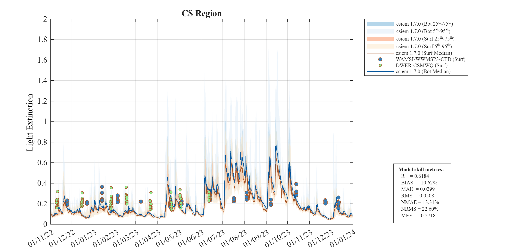
```

:::{.figcap}
**Figure 16.3-i.** Comparison of observed and simulated light extinction coefficient ($K_d,\:  /m$), within Cockburn Sound.
:::


##### Owen Anchorage {.unnumbered}

```{r, echo=FALSE, out.width="90%"}
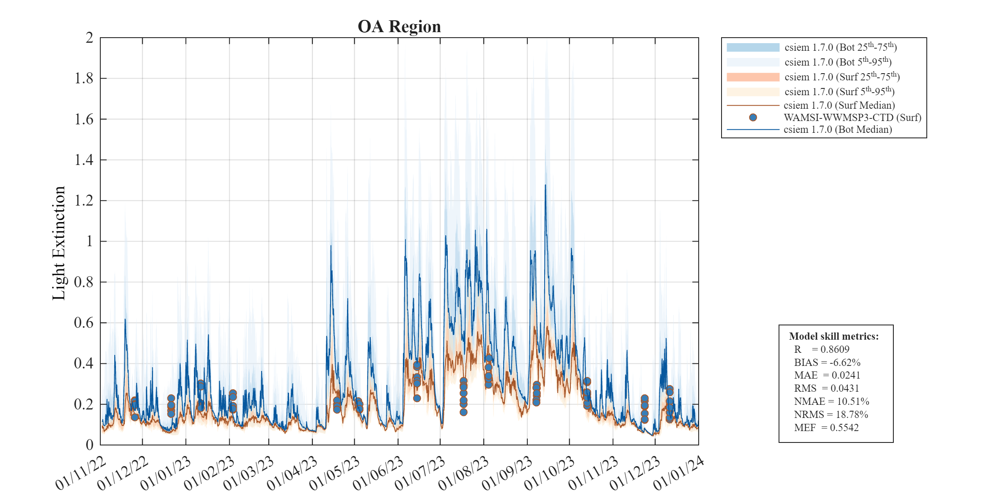
```

:::{.figcap}
**Figure 16.3-ii.** Comparison of observed and simulated light extinction coefficient ($K_d,\:  /m$), within Owen Anchorage.
:::

##### Gage Roads {.unnumbered}

```{r, echo=FALSE, out.width="90%"}
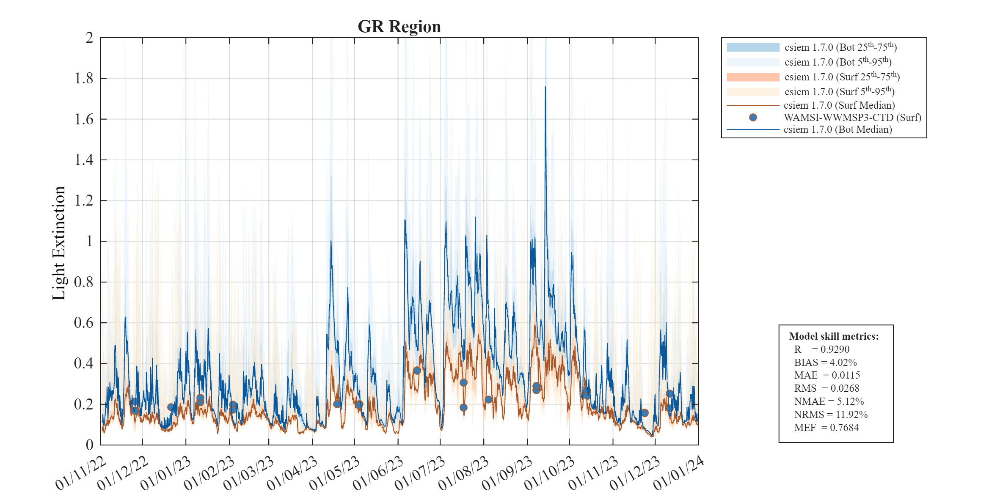
```

:::{.figcap}
**Figure 16.3-iii.** Comparison of observed and simulated light extinction coefficient ($K_d,\:  /m$), within Gage Roads.
:::

##### South Coast {.unnumbered}

```{r, echo=FALSE, out.width="90%"}
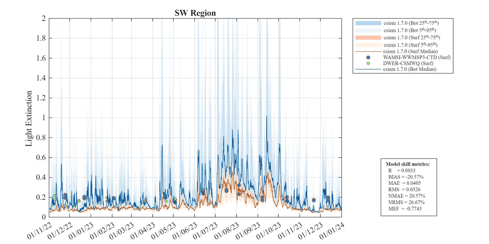
```

:::{.figcap}
**Figure 16.3-iv.** Comparison of observed and simulated light extinction coefficient ($K_d,\: /m$), within the South Coast region.
:::


### CS86 $K_d$ logger analysis

In addition to the profiling derived data (show above), the DWER mooring program includes a dedicated sensor array to compute $K_d$ directly. The CS86 site includes two light sensors vertically arranged in the water-column to have a fixed 1m of distance apart, allow a high-frequency data stream of attenuation to be estimated. Due to complications with the deployment and noise within the data, the data was critically analysed and a sub-set of the data was screened and deemed to be useful for the model validation. This is shown in Figure 16.4 for 5 of the deployments.  The summer period 

Light attenuation coefficients (Kd) were calculated from dual MS9 optical logger deployments at the CS86 mooring site. Two loggers positioned at 0.5 m and 1.5 m above the seafloor (1 m vertical   separation) measured downwelling irradiance across PAR and nine spectral wavelengths (410-700 nm). Kd values were derived using the Beer-Lambert Law: Kd = -ln(I_deep/I_shallow)/Δz. Raw logger data were interpolated to 20-minute time resolution. Quality control included filtering for daytime conditions (surface PAR ≥ 50 μmol/m²/s) and realistic Kd values (0-0.5 m⁻¹ for most deployments; 0-0.9 m⁻¹ for high-turbidity periods). Five trustworthy deployments spanning 167 days between August 2023 and January 2025 yielded 1,809 hourly records. 

Overall mean $K_d$ for PAR 0.214 m⁻¹, indicating relatively clear coastal waters and consistent with the profile derived measurements. Notable temporal variability was observed across deployments. Deployments 2  and 3 (SN67_SN136 pair) showed the clearest conditions with medians of 0.142 and 0.154 m⁻¹, respectively. Deployments 4 and 5 exhibited moderate attenuation (0.231 and 0.224 m⁻¹). Daily patterns showed strong diurnal variability, with hourly clustering revealing late-afternoon peaks in light attenuation, likely driven by sediment resuspension during afternoon breeze conditions. Deployment 7 (August-September 2024) captured a notable storm event around September 5, 2024, with $K_d$ values reaching 0.5-0.9 m⁻¹—more than triple baseline conditions. This deployment's median (0.337 m⁻¹) was 70% higher than the clearest periods, demonstrating the role of storm-driven sediment resuspension on water clarity. Spectral analysis revealed elevated attenuation across all wavelengths during this turbid period, with particularly strong increases at longer wavelengths (660-700 nm), characteristic of mineral particle scattering (discussed further below in Section X).
  
#### {.panelset .unnumbered}

##### Early Spring (2023)  {.unnumbered}

```{r, echo=FALSE, out.width="90%"}
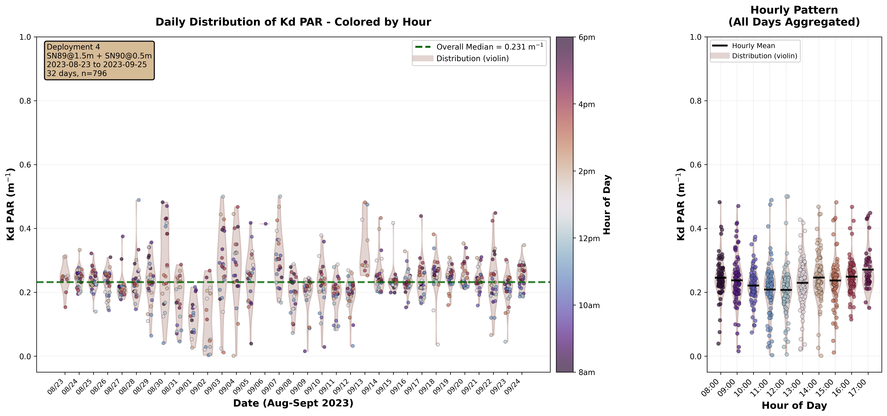
```

:::{.figcap}
**Figure 16.4-i.** Summary of observed light extinction coefficient ($K_d,\:  /m$) for PAR computed from the raw CS86 dual-light loggers, for a deployment in early Spring 2023.
:::

##### Late Spring  {.unnumbered}

```{r, echo=FALSE, out.width="90%"}
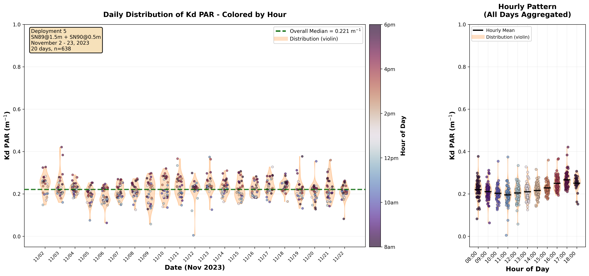
```

:::{.figcap}
**Figure 16.4-ii.** Summary of observed light extinction coefficient ($K_d,\:  /m$) for PAR computed from the raw CS86 dual-light loggers, for a deployment in late Spring 2023.
:::


##### Early Winter  {.unnumbered}

```{r, echo=FALSE, out.width="90%"}
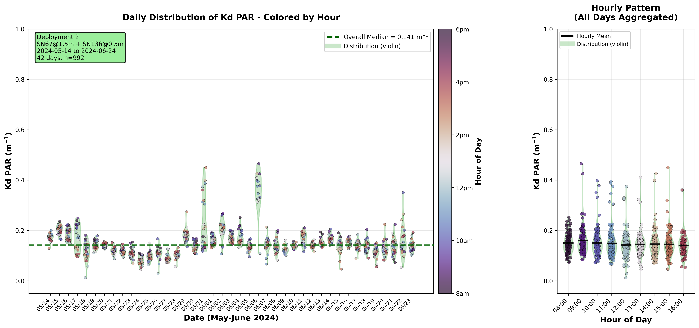
```

:::{.figcap}
**Figure 16.4-iii.** Summary of observed light extinction coefficient ($K_d,\:  /m$) for PAR computed from the raw CS86 dual-light loggers, for a deployment in early Winter 2023.
:::

##### Early Spring (2024)  {.unnumbered}

```{r, echo=FALSE, out.width="90%"}
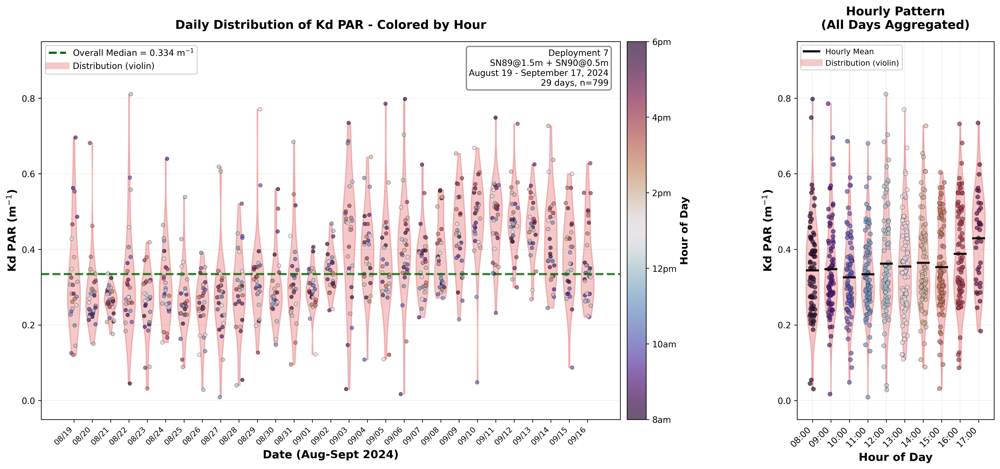
```

:::{.figcap}
**Figure 16.4-iv.** Summary of observed light extinction coefficient ($K_d,\:  /m$) for PAR computed from the raw CS86 dual-light loggers, for a deployment in early Spring 2024.
:::

##### Summer  {.unnumbered}

```{r, echo=FALSE, out.width="90%"}
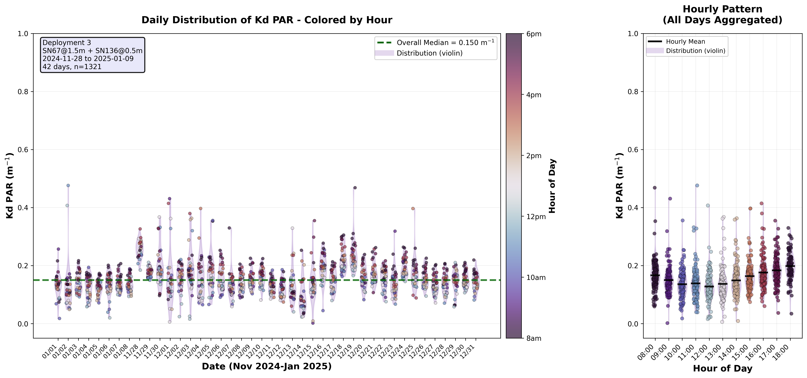
```

:::{.figcap}
**Figure 16.4-v.** Summary of observed light extinction coefficient ($K_d,\:  /m$) for PAR computed from the raw CS86 dual-light loggers, for a deployment in late Summer 2024
:::


### Benthic $PAR$ validation

The bulk-PAR light model within AED was assessed using the WWMSP2-MS9 data-set (Said et al., 2025). The data-set sits at a seabed depth of ~8 m on the western edge of Kwinana Shelf, and shows a range of conditions spanning from summer to 2022/2023 through to winter of 2023. Figure 16.5 below shows six 2-3 week periods where conditions were assessed. For this comparison the data was assumed to sit 20 cm above the seabed, and this was compared with the upper face of the bottom-most model layer.


#### {.panelset .unnumbered}

##### December {.unnumbered}

```{r, echo=FALSE, out.width="90%"}
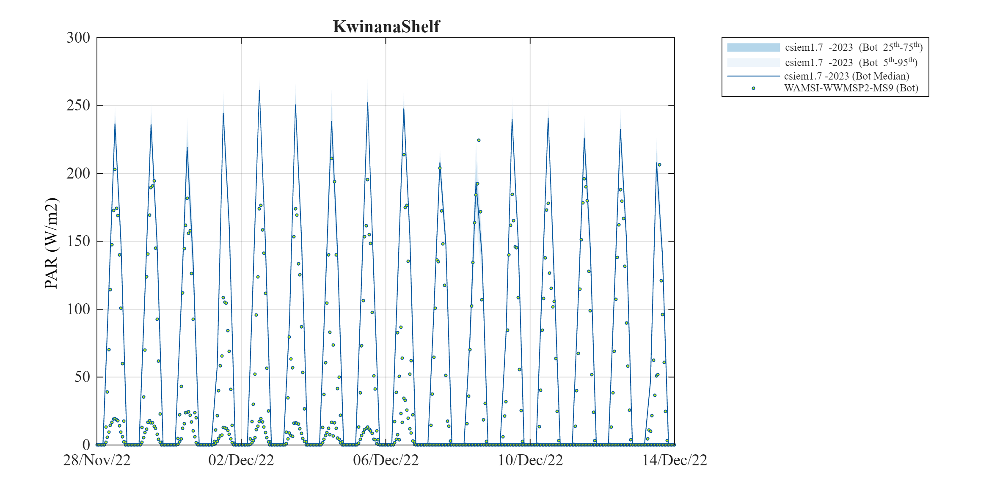
```

:::{.figcap}
**Figure 16.5-i.** Comparison of observed and simulated light ($PAR,\:W/m^2$) on the Kwinana Shelf in December 2022.
:::


##### January {.unnumbered}

```{r, echo=FALSE, out.width="90%"}
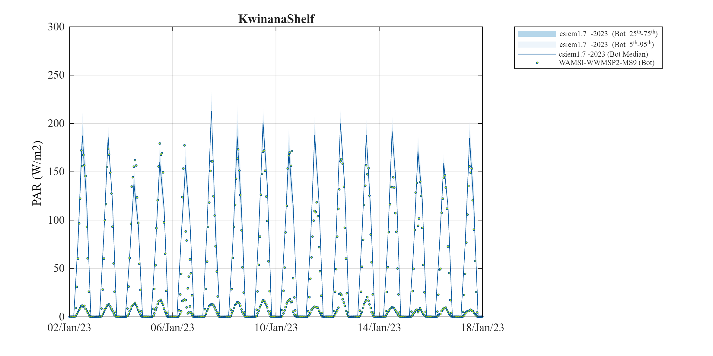
```

:::{.figcap}
**Figure 16.5-ii.** Comparison of observed and simulated light ($PAR,\:W/m^2$) on the Kwinana Shelf in January 2023.
:::


##### February {.unnumbered}

```{r, echo=FALSE, out.width="90%"}
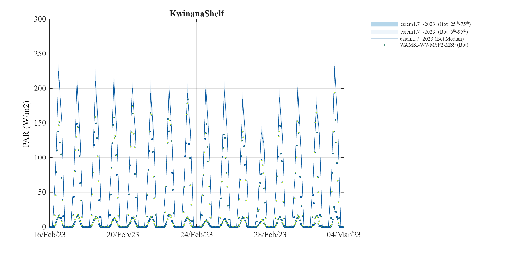
```

:::{.figcap}
**Figure 16.5-iii.** Comparison of observed and simulated light ($PAR,\:W/m^2$) on the Kwinana Shelf in February 2023.
:::


##### March {.unnumbered}

```{r, echo=FALSE, out.width="90%"}
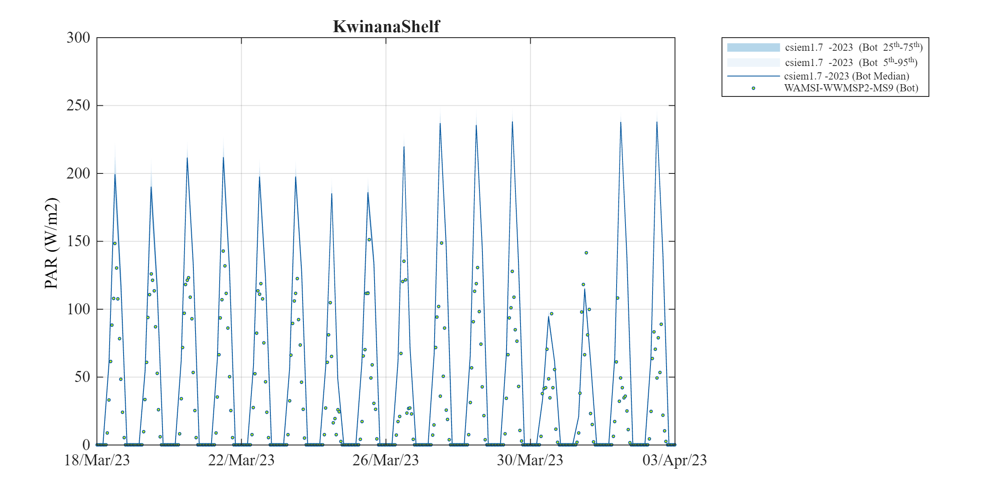
```

:::{.figcap}
**Figure 16.5-iv.** Comparison of observed and simulated light ($PAR,\:W/m^2$) on the Kwinana Shelf in March 2023.
:::

##### May (early){.unnumbered}

```{r, echo=FALSE, out.width="90%"}
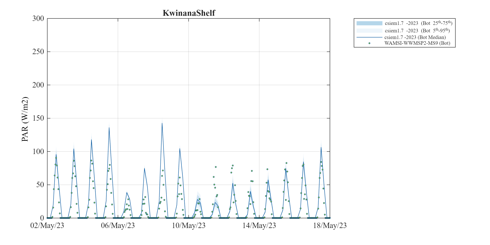
```

:::{.figcap}
**Figure 16.5-v.** Comparison of observed and simulated light ($PAR,\:W/m^2$) on the Kwinana Shelf in May 2023.
:::

##### May (late){.unnumbered}

```{r, echo=FALSE, out.width="90%"}
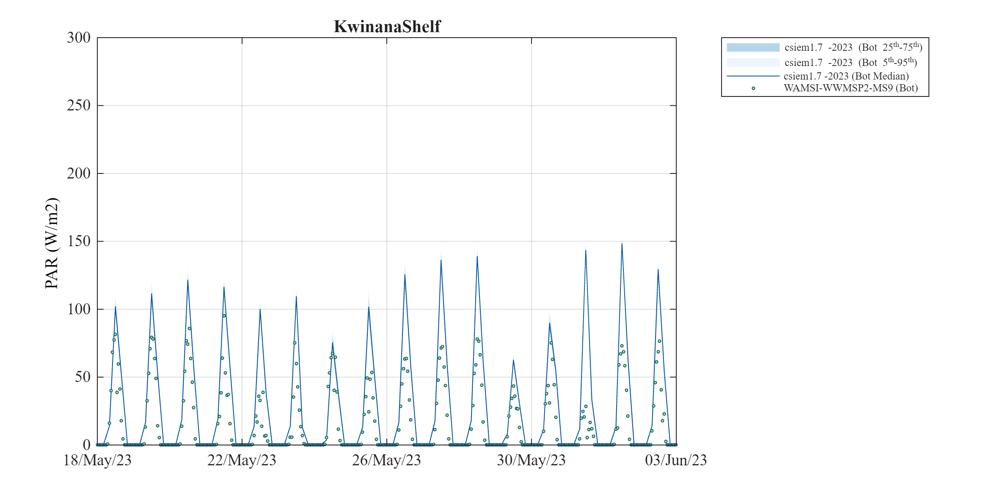
```

:::{.figcap}
**Figure 16.5-vi.** Comparison of observed and simulated light ($PAR,\:W/m^2$) on the Kwinana Shelf in May 2023.
:::


<br>
<br>

## Spectrally-resolved bio-optical model 

From CSIEM 1.5 and above, an implementation of a spectrally-resolved light model was included within the AED model configuration, and this chapter outlines the approach to this model, and assessment of its accuracy that was undertaken. The model includes both an above and below water component, and can be integrated with the water quality and biological components within AED. This model is benchmarked against the known reference approaches within the [HydroLight / EcoLight software](https://www.numericaloptics.com/hydrolight.html), and validated against below-water spectral data (see Section 13.2).

### Model description

The light model in CSIEM is based on OASIM (Gregg and Casey, 2009). Light is propagated from $250\:nm$ to $4\:\mu m$ in $33$ spectral bands, and reported out to a user-defined resolution, which for the default application  uses an interpolated wavelength vector that spans $280\:nm$ to $1.1\:um$ in $16$ steps. The above water illumination is provided in the same $33$ OASIM bands via one of two available methods, one based on OASIM downwelling radiation calculations, and a second custom method developed specifically for Cockburn Sound. The air/sea interface is a wind-roughened surface with a proportion of diffusely reflecting sea foam when near-surface wind speeds exceed $4\:m/s$. The above and below water model components are each described separately in the next sections.

#### Above-water

For sun and sky illumination OASIM includes a model for direct (sun) and diffuse (sky and cloud) down-welling solar radiation across the visible spectrum and out to 4 microns, (the long-wave spectral limit for solar-sourced photons of any practical significance to terrestrial energy flux). This model is driven by estimates of atmospheric column water vapour, stratospheric ozone, aerosol type and abundance, and cloud opacity (inferred from liquid water path), plus solar zenith angle and time of year.

Some of the inputs to this model are difficult to estimate sufficiently in order to obtain agreement with independent estimates of the short-wave surface flux (SWSF), a measured value which we have confidence in. Thus we developed a Cockburn Sound specific illumination model based on a calibration of the RADTRAN-X model (Gregg and Carder, 1990) within EcoLight which was constrained to match local SWSF data. In this revised implementation, direct and diffuse downwelling solar radiation are calculated under an aerosol regime consistent with local conditions as characterised by quality assured aerosol optical depth data from the AERONET station at Rottnest Island. Appendix B provides detail on the CSIEM illumination model which takes the solar zenith angle, day of year and SWSF. The SWSF is converted to an estimate of cloud clover so that the direct and diffuse irradiances can be interpolated from look-up tables that are indexed by solar zenith angle (the coefficients are based on a fourth order polynomial in cosine of solar zenith angle) and a cloud cover that is discretized to values of $0$ and from $0.3$ to $1.0$ in $0.1$ increments (less than $0.3$ is treated as unoccluded sun). These estimates of direct and diffuse surface irradiance are computed at $5\: nm$ spectral resolution then aggregated to the $33$ spectral bands adopted in the OASIM model.

#### Below-water

Light propagation in the water column is an implementation of the OASIM underwater model. Light in $33$ OASIM spectral bands, distinguished as separate streams of direct and diffuse light provided by the Atmosphere model, is diminished as it crosses the air/sea interface. In each spectral band the bulk optical properties of each discrete layer of the in-water model act upon the light streams via scattering and absorption. The bulk optical properties are the volumetric aggregates of absorption, total scattering and back-scattering, expressed in units of extinction per metre. The aggregate is for the combination of sea water and several optically active biota and sediment species, quantified in the CSIEM model by concentration and inherent optical properties ($IOP$'s). In each layer there is some redirection of the direct beam via scattering into the diffuse component, and there is some diminution of both direct and diffuse streams via absorption. The photosynthetically available radiation ($PAR$) at levels in the water column are available by integration across the OASIM bands that capture the spectral range $400$ to $700\:nm$.

### Light climate exploration and benchmarking

In application of the light model within Cockburn Sound we first undertake a controlled assessment of CSIEM by comparing and benchmarking against expected profiles across a gradient of conditions. For this purpose, locations in Table 16.1 were selected.


**Table 16.1.** Location of sites for model benchmarking, including seafloor depth (metres below mean sea level).

  ----------------------------------------------------------------------------------------------------
  **LOCATION**         **NOTES**                                    **LON**   **LAT**   **SEAFLOOR**
  -------------------- -------------------------------------------- --------- --------- --------------
  Deep_Basin           middle of Cockburn Sound                     115.709   -32.187   21.60

  East_Garden_Island   seagrass area                                115.685   -32.196   10.88

  Freshwater_Bay       Swan estuary with high DOM and CHLA          115.778   -32.001   14.83

  Kwinana_Shelf        more turbid coastal water                    115.753   -32.214   7.95

  Mangles_Bay          southern Cockburn Sound                      115.716   -32.271   11.94

  Mullaloo_Beach       general northern coast                       115.677   -31.743   8.12

  Owen_Anchorage       coastal water                                115.704   -32.107   15.08

  Validation           site for light validation at kwinana Shelf   115.748   -32.196   7.04

  West_Rottnest        open ocean water                             115.397   -32.019   62.91
  ----------------------------------------------------------------------------------------------------


#### {.panelset .unnumbered}

##### 400nm {.unnumbered}

```{r, echo=FALSE, out.width="90%"}
knitr::include_graphics("./media/image74.png")
```

:::{.figcap}
**Figure 16.6-i.** Absorption and scattering ($/m$) of optically active constituent species at $400\:nm$ for each site over the sunlit portion of the two days of the CSIEM simulation.
:::

##### 550nm {.unnumbered}

```{r, echo=FALSE, out.width="90%"}
knitr::include_graphics("./media/image75.png")
```

:::{.figcap}
**Figure 16.6-ii**. Absorption and scattering (/m) of optically active constituent species at $550\:nm$ for each site over the sunlit portion of the two days of the CSIEM simulation.
:::

##### 700nm {.unnumbered}

```{r, echo=FALSE, out.width="90%"}
knitr::include_graphics("./media/image76.png")
```

:::{.figcap}
**Figure 16.6-iii**. Absorption and scattering (/m) of optically active constituent species at $700\:nm$ for each site over the sunlit portion of the two days of the CSIEM simulation.
:::

### -


Figure 16.7 shows the shortwave radiation from CSIEM model data (upper panel) and from the weather observation data (lower panel) for the daylight hours of the two model simulation days. By choosing noon and 4pm on each day we have clear and cloudy conditions at the two solar zenith angles of approximately 10 and 50 degrees.

Summary plots are shown in Figure 16.6 that characterise these 9 locations in terms of extinction by optically active species and split into extinction due to absorption and to scattering. The results labelled 'TOTAL' represent the combined effect of all species. The aggregation is over the two days of the CSIEM simulation and are drawn from EcoLight computations for each profile at the half hour time-step of the CSIEM for the sunlit hours. The first figure is at 400nm, the second at 550nm and the third at 700nm.

For the three spectral channels, and for all sites except the open-ocean West Rottnest site, sediment is the dominant contributor to extinction. 

The relative proportion of Total absorption to scattering is highest at 700 nm. The plots show how, in general, the dominant absorber at 400nm is CDOM and at 700nm is the sea water itself.

The relative proportion of Total scattering is greatest at 550 nm. At 400 nm Total scattering dominates, but Total absorption also contributes a significant impact to spectral extinction. At 400 nm, at most sites the scattering due to sediment dominates, although at the open-ocean West Rottnest site extinction due to sediment scattering is similar to extinction due to ch-a and POC.

There is a close association between both scattering and absorption of Chl and POC at all three wavelengths. At Freshwater Bay the contribution of Total scattering is an order of magnitude larger than at all other sites.


```{r, echo=FALSE, out.width="70%"}
knitr::include_graphics("./media/image77.png")
```

:::{.figcap}
**Figure 16.7**. Shortwave flux from CSIEM model and from weather data. From 11:30 to 16:30 on 6 January, some amount of cloudiness diminishes the shortwave radiation compared to the clear sky conditions of the previous day, and cloudiness is greatest at noon and 4pm. These are the times we will use in comparing CSIEM model results with EcoLight to provide clear and cloudy conditions at two solar zenith angles.
:::

Figure 16.8 shows the surface illumination from NASA's Coupled Ocean and Atmosphere Radiative Transfer (COART) and from the developed light model in CSIEM for the 4 times identified in Figure 16.7. Whilst there can be noticeable differences in the direct/diffuse mix of light at the ocean surface, this plot shows a general agreement with an alternate well-regarded model. This supports the veracity of the locally-specific light model and its implementation in CSIEM.

```{r, echo=FALSE, out.width="83%"}
knitr::include_graphics("./media/image78.png")
```

:::{.figcap}
**Figure 16.8**. Surface illumination at the OASIM band centres from COART and CSIEM light models for the 4 comparison times in Figure 16.7. COART was run at 1nm resolution and aggregated to the OASIM bands.
:::

### PAR Comparisons

The plots on the following pages show comparisons between PAR computed using CSIEM and EcoLight for the 9 locations and 4 times. The solar zenith angle at noon is about 11 degrees and at 4pm about 49 degrees. The plots are grouped into sites with similar bathymetry.

The agreement between CSIEM and EcoLight is very good, and much improved relative to a generic single band light propagation model (which is included as an uninformed reference by which to compare).

Dashed lines on each plot indicate the depth at irradiance falls to $10\:\%$ of the near-surface value. For all sites the $10\:\%$  depth is greater for CSIEM than for Ecolight. This shows the diffuse attenuation coefficient of downwelling $PAR$, $K_{PAR}$, is slightly lower for CSIEM than for Ecolight.

#### {.panelset .unnumbered}

##### 1 {.unnumbered}

```{r, echo=FALSE, out.width="90%"}
knitr::include_graphics("./media/image79.png")
```

:::{.figcap}
**Figure 16.9-i**. $PAR$ at depth comparisons for sites Kwinana_Shelf, Mullaloo_Beach and Validation.
:::

##### 2 {.unnumbered}

```{r, echo=FALSE, out.width="90%"}
knitr::include_graphics("./media/image80.png")
```

:::{.figcap}
**Figure 16.9-ii**. PAR at depth comparisons for sites East_Garden Island, Freshwater_Bay and Mangles_Bay.
:::

##### 3 {.unnumbered}

```{r, echo=FALSE, out.width="90%"}
knitr::include_graphics("./media/image81.png")
```

:::{.figcap}
**Figure 16.9-iii**. PAR at depth comparisons for sites Deep_Basin and Owen_Anchorage.
:::

##### 4 {.unnumbered}

```{r, echo=FALSE, out.width="90%"}
knitr::include_graphics("./media/image82.png")
```

:::{.figcap}
**Figure 16.9-iv**. PAR at depth comparisons for site West_Rottnest.
:::


Additionally, an integration of PAR over a single day to obtain the daily energy flux was compared, sometimes termed the Daily Light Integral (DLI), available at several ocean depths. There is a slight bias to over-estimate this quantity from the CSIEM OASIM implementation as compared to EcoLight which is at its least for site *West_Rottnest* and at its most for site *Freshwater_Bay*. The fundamental difference between the two models is the modelling of the diffuse light field. For clearer water, or more correctly waters with a lower proportion of scattering, the diffuse nature of the light field in each model is very similar and attenuation is dominated by absorption. However, as the impact of scattering increases, the downwelling light field in Ecolight becomes more diffuse than in CSIEM. The slight difference in the modelled diffuse light field was shown to affect the $10\:\%$ depth in Figure 16.9.

```{r, echo=FALSE, out.width="90%"}
knitr::include_graphics("./media/image83.png")
```

:::{.figcap}
**Figure 16.10**. Daily energy flux in the $PAR$ band (known as $DLI$), as derived from EcoLight and from the CSIEM results for all nine sites at several depths.
:::

### Spectral Irradiance Comparisons

The following analyses present plots of multi-spectral irradiance from CSIEM and EcoLight at depths of 1 and 5 metres for each location. Each page is for one of the four times identified in Figure 16.7 to cover clear and cloudy conditions at two solar zenith angles.

If we ignore the very turbid Freshwater Bay site, then the agreement of CSIEM with EcoLight is excellent for Figure 16.11-i, clear sky at 12:00 pm and for 1 m depth. For the other days and times, spectra are in very good agreement.

For the Freshwater Bay site, the downwelling irradiance spectra for CSIEM and Ecolight display distinct differences in overall intensity. For all times, the Ecolight modelled spectral irradiance is less than the CSIEM modelled irradiance. These results are the same as portrayed earlier in PAR depth profiles and for the daily integrated energy FLUX.

#### {.panelset .unnumbered}

##### 1 {.unnumbered}

```{r, echo=FALSE, out.width="90%"}
knitr::include_graphics("./media/image84.png")
```

:::{.figcap}
**Figure 16.11-i**. January 5, 2023 at noon (clear sky), spectral irradiances from EcoLight and CSIEM interpolated to 1m and 5m depths for the nine comparison sites.
:::

##### 2 {.unnumbered}

```{r, echo=FALSE, out.width="90%"}
knitr::include_graphics("./media/image85.png")
```

:::{.figcap}
**Figure 16.11-ii**. January 6, 2023 at noon (cloudy conditions), spectral irradiances from EcoLight and CSIEM interpolated to 1m and 5m depths for the nine comparison sites.
:::

##### 3 {.unnumbered}

```{r, echo=FALSE, out.width="90%"}
knitr::include_graphics("./media/image86.png")
```

:::{.figcap}
**Figure 16.11-iii**. January 5, 2023 at 4pm (clear sky), spectral irradiances from EcoLight and CSIEM interpolated to 1m and 5m depths for the nine comparison sites.
:::

##### 4 {.unnumbered}

```{r, echo=FALSE, out.width="90%"}
knitr::include_graphics("./media/image87.png")
```

:::{.figcap}
**Figure 16.11-iv**. January 6, 2023 at 4pm (cloudy conditions), spectral irradiances from EcoLight and CSIEM interpolated to 1m and 5m depths for the nine comparison sites.
:::


### Assessment of light dynamics

The field spectra from Cockburn Sound are made by MS9 instrument with 10nm FWHM spectral filters centered on wavelengths 448, 470, 524, 554, 590, 628, 656, 699 nm. Across the PAR band, CSIEM channels are 25 nm wide and the Curtin light model provides illumination representative of these wider channels. In its output data product, CSIEM provides results interpolated to another set of discrete wavelengths. Across the PAR band these are 410, 440, 490, 510, 550, 590, 635, 660, 700 nm. Whilst these differences are not outcome determinant to the modelling objectives, they can lead to small apparent anomalies when comparing model data to field spectra.

```{r, echo=FALSE, out.width="43%", fig.show="hold"}
knitr::include_graphics(c("./media/image88.png", "./media/image89.png"))
```

:::{.figcap}
**Figure 16.12**. Surface illumination on January 5, 2023 (left panel) and how these data yield synthetic CSIEM and MS9 outputs (right panel). The source data are from EcoLight at $1\:nm$ resolution and the differences in the right panel are artefacts due only to the different processing paths.
:::

### Single profile assessment

In this section we compare Hydrolight-modelled light profiles to in-situ spectral profile measurements, in order to understand spectra attenuation coefficients.

We aimed to run Hydrolight with known concentrations of optical constituents which would then enable us to predict the spectral light profiles. These modelled profiles could then be compared to in-situ spectral profiles. Note, we don't know what IOPs to use so we used "standard" Hydrolight IOP models.

We searched the in-situ data from DWER-CSMOORING-MS9 to identify dates and locations where coincident spectral light profiles and in-water constituent concentration data existed. Specifically, we searched for chlorophyll, TSS and CDOM concentrations. There were no dates and locations with all four sets of coincident data and so we then limited the search to co-incident spectral profiles, chlorophyll and TSS data. Four dates were identified, all at site 6147034 (South CS11). Table 16.X lists the dates, chlorophyll and TSS concentrations for the four sets of in-situ data.

Table 16.2. Dates, chlorophyll and TSS concentrations for the four in-situ comparison data sets.

  -----------------------------------------------------------------------
  Site code         date              Chl mg/m3         TSS mg/L
  ----------------- ----------------- ----------------- -----------------
  6147034           2/2/2022          0.7               1.9

  6147034           3/6/2021          0.7               1.1

  6147034           7/5/2021          0.7               0.8

  6147034           20/7/2021         1.3               1.1
  -----------------------------------------------------------------------

We ran Hydrolight for the four situations outlined in Table 16.X, and in the absence of a complete description of the optical conditions, we undertook model runs across a range of conditions to help identify the impact of this uncertainty.

**Table 16.3**. Various input values for Hydrolight modelling

  ------------------- ---------------------------------------------------------------
  CDOM a440 (m^-1^)   0.02, 0.12, 0.30, 1.50, 3.00

  Sky conditions      clear, cloudy (100%)

  Substrate albedo    sandy, black

  Wavelengths (nm)    412.5, 442.5, 492.5, 512.5, 552.5, 592.5, 637.5, 662.5, 702.5
  ------------------- ---------------------------------------------------------------

Figure 16.13(a-d) show the *in-situ* and modelled spectral profiles as well as derived spectral diffuse attenuation coefficients, $K_{\lambda}$. Each figure contains nine separate plots, one for each spectral profiling band \[410 nm, 440 nm, 490 nm, 510 nm, 550 nm, 590 nm, 635 nm, 660 nm, 700 nm\]. The vertical axis is depth in metres. The lower axis of each plot is the spectral irradiance in $uW/cm^2^/nm$. The axes are only labelled on the lower row of plots. The top axis is the spectral diffuse attenuation coefficient in m^-1^, only labelled for the top row of plots.

Red stars and green dots indicate the spectral profiling irradiance data. Exponential curves were fitted to the profile data, however near-surface measurements were discarded. For the example plots shown here, any data shallower than 4 m was not employed in the curve fitting (noted on the plots by "depth limit = 4.0 m"). It is not uncommon for near-surface light data to be impacted by wavy surface conditions and/or instrument shading issues. In fact, for some of the Cockburn Sound in-situ data there were quality control notes included that sometimes mentioned potential shading of the instrument by surface floats. The thick dark-blue curve indicates the exponential function fitted to the measurements indicated by the red stars. The spectral diffuse attenuation coefficient, K, derived from each of these curves is indicted on each plot as text in the upper left corner. The coefficient of determination, *R^2^*, is also indicated on each plot.

A simple approach to determining depth profile K values is to consider the change in light intensity between each successive light measurement. The cyan "jagged curves" indicate K values derived by this method. It is interesting to consider the range of K values (top axis) compared to the K values derived by fitting a curve to the light profiles.

The orange curve on each plot is the spectral irradiance profile derived from Hydrolight for the Chl and TSS concentration values listed in Table 16.2, and for a CDOM value a440 = 0.02 m^-1^, clear sky and a sandy substrate.

The various thin blue curves show the spectral irradiance profiles derived from Hydrolight for the increasing CDOM values listed in Table 16.3 at either sandy or black substrate and clear or cloudy sky conditions.

#### {.panelset .unnumbered}

##### 2 Feb 2022 {.unnumbered}

```{r, echo=FALSE, out.width="90%"}
knitr::include_graphics("./media/image90.png")
```

:::{.figcap}
**Figure 16.13-i.** Wavelength specific light profiles for 2 February 2022, showing best fit curves for light attenuation.
:::

##### 3 Jun 2021 {.unnumbered}

```{r, echo=FALSE, out.width="90%"}
knitr::include_graphics("./media/image91.png")
```

:::{.figcap}
**Figure 16.13-ii.** Wavelength specific light profiles for 3 June 2021, showing best fit curves for light attenuation.
:::

##### 7 May 2021 {.unnumbered}

```{r, echo=FALSE, out.width="90%"}
knitr::include_graphics("./media/image92.png")
```

:::{.figcap}
**Figure 16.13-iii.** Wavelength specific light profiles for 7 May 2021, showing best fit curves for light attenuation.
:::

##### 20 Jul 2021 {.unnumbered}

```{r, echo=FALSE, out.width="90%"}
knitr::include_graphics("./media/image93.png")
```

:::{.figcap}
**Figure 16.13-iv.** Wavelength specific light profiles for 20 July 2021, showing best fit curves for light attenuation.
:::

### Spectral $K_d$ from paired MS9 sensors

In addition to the single-profile spectral assessments above, spectral diffuse attenuation coefficients ($K_{\lambda}$) were derived from the paired MS9 logger array at the CS86 mooring site. The dual-sensor configuration, with loggers separated by 1 m vertically in the water column, enables continuous high-frequency estimation of $K_d$ at each of the nine MS9 wavelengths (410–700 nm), using the Beer-Lambert relationship applied between the two measurement depths.

Figure 16.14 shows the spectral $K_d$ pattern for the two sensor pairs (SN89+SN90 and SN67+SN136), with individual daily profiles shown as faint lines and the median highlighted. Both pairs exhibit the characteristic U-shaped spectral attenuation curve, with minimum $K_d$ in the 490–550 nm range and elevated attenuation at shorter wavelengths (due to CDOM and detrital absorption) and longer wavelengths (due to pure water absorption and particle scattering). The SN67+SN136 pair recorded generally lower $K_d$ values, consistent with its deployment during clearer water conditions.

```{r, echo=FALSE, out.width="90%"}
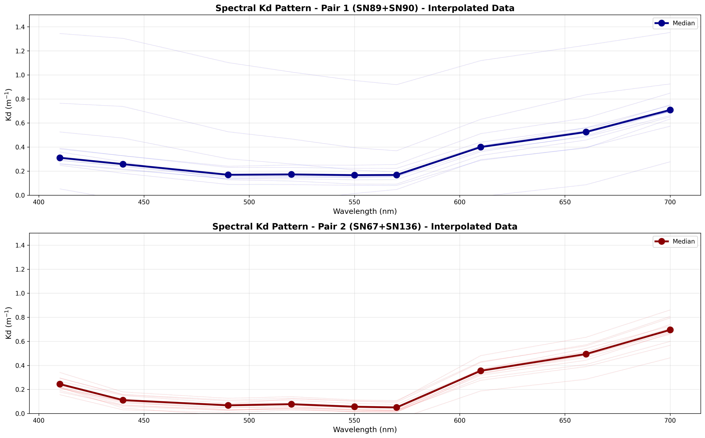
```

:::{.figcap}
**Figure 16.14.** Spectral $K_d$ patterns derived from paired MS9 loggers at the CS86 mooring site for sensor pair 1 (SN89+SN90, upper) and pair 2 (SN67+SN136, lower). Faint lines show individual profiles; bold lines with markers show the median $K_d$ at each wavelength.
:::

The distribution of spectral $K_d$ values across all trustworthy deployments is summarised in Figure 16.15. The histogram (left) highlights the separation between the shorter, less-attenuated wavelengths (490, 550 nm) and the longer, more-attenuated wavelengths (610, 660 nm). The box-and-whisker summary (right) confirms the U-shaped spectral dependence, with median $K_d$ lowest at 520–570 nm (~0.1–0.15 m$^{-1}$) and highest at 700 nm (~0.7 m$^{-1}$). These observed spectral attenuation patterns provide a key benchmark for assessing the spectral light model described in the following sections.

```{r, echo=FALSE, out.width="90%"}
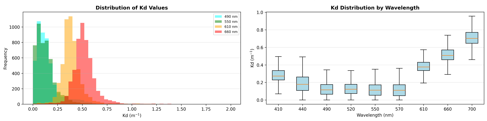
```

:::{.figcap}
**Figure 16.15.** Distribution of spectral $K_d$ values from the CS86 paired MS9 loggers. Left: frequency histograms for selected wavelengths (490, 550, 610, 660 nm). Right: box-and-whisker plots of $K_d$ across all nine MS9 wavelengths (410–700 nm).
:::


## Spectral validation

Figure 16.16 shows a comparison of the CSIEM spectral measurement vs the *in situ* measurement sensor at the Kwinana Shelf site. The field data from this sensor had some questionable signatures, including peak irradiance at 470nm, so this was not further explored.

```{r, echo=FALSE, out.width="90%"}
knitr::include_graphics("./media/image94.png")
```

:::{.figcap}
**Figure 16.16**. CSIEM modelled spectral irradiance at depth compared to MS9 field spectra.
:::

### Seasonal spectral validation

Both the measured and modelled light climates showed a similar seasonal trend with peak light intensity in December 2022 then gradually decreased to July 2023, and higher light intensity in wave lengths of 448 nm -- 590 nm (Figure 16.17). A regression of measured vs. modelled light in all spectrum (Figure 16.18 indicated the model captured the range and trend of light, though the model tended to overpredict the short wavelength (398 nm) and underpredict the long wavelength (699 nm). This is probably due to that the model slightly overpredicted the concentration of suspended solids (SS), that has major impacts on reducing the short wavelength light. Other factors such as POC and DOC also have major impacts on the relatively short wave length spectrum. However, there is no field observations for validating the POC and DOC concentrations in Cockburn Sound.

```{r, echo=FALSE, out.width="90%"}
knitr::include_graphics("./media/image95.png")
```

:::{.figcap}
**Figure 16.17**. Seasonal variation in spectral irradiance compared to MS9 field spectra at the Kwinana Shelf site.
:::

To further examine the effects of inherent optical properties (IOPs) on the light decaying along the water column, the modelled SS, total chlorophyll-a (TCHLA), POC and DOC concentrations and their effects on the light absorbance are shown in Figure 16.18. The mean SS concentration during the model period is \*, which led to a reduction rate of \*\* /m for wavelength of 350. In comparison, the mean TCHLA, POC, and DOC concentrations are \*\*\*, respectively, which led to a reduction rate of \*\*/m for wave length of 350. The SS concentration showed to be the relatively dominant factor affecting light climate with short wave lengths. However, the absorbance of light of SS, POC, and DOC decreased quickly with the increase in wave lengths, while TCHLA has higher absorbance in wave lengths \> \*\*\* nm.

```{r, echo=FALSE, out.width="54%"}
knitr::include_graphics("./media/image96.png")
```

:::{.figcap}
**Figure 16.18.** Wavelength specific light profiles, showing best fit curves for light attenuation.
:::

```{r, echo=FALSE, out.width="90%"}
knitr::include_graphics("./media/image97.png")
```

:::{.figcap}
**Figure 16.19.** Wavelength specific light profiles, showing best fit curves for light attenuation.
:::

<br>

## Summary

The CSIEM model is well suited to resolving the variability in the underwater light climate. Underwater irradiance is closely related the inherent optical properties of water, such as suspended solids, detrital material, and total chlorophyll-a, and the performance of CSIEM in capturing these is reported in Chapter 15.  

The bulk-PAR simulation approach accounts for the various drivers of light attenuation, and is consistent with the routinely collected $K_d$ estimates from light profile data, including from areas which are more wave-exposed (e.g., Gage Roads) vs areas which are more protected  (e.g., Cockburn Sound). Some uncertainty exists in the exact contribution between detrital vs inorganic sediments vs chl-a in the overall attenuation and further sensitivity testing and calibration is recommended in future version updates. Nonetheless, the underwater light intensity at the Kwinana Shelf site was accurate and the current base calibration is well-suited to investigations of the sensitivity between water quality and seagrass habitat. 

The more advanced spectral-light model option has also been able to accurately capture the underwater light intensities, with the advantage that it was able to also reasonably resolve the full light spectra, particularly for wavelengths between 448-656 nm, which are the major energy provider to primary producers such as seagrass. Some, misalignments were noted in wavelengths \<448 nm and \> 656 nm, and further refinement of the IOP concentrations over time will improve these. It is worth noting that these wavelengths produce a small portion to support the photosynthetic activities of seagrass. 


