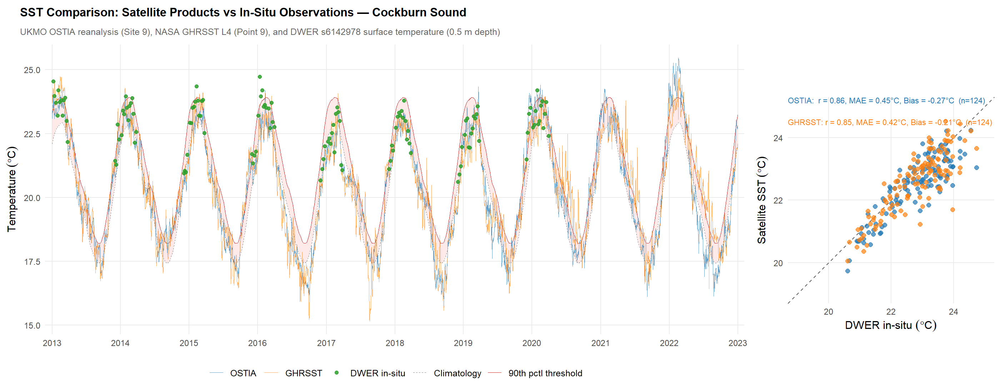
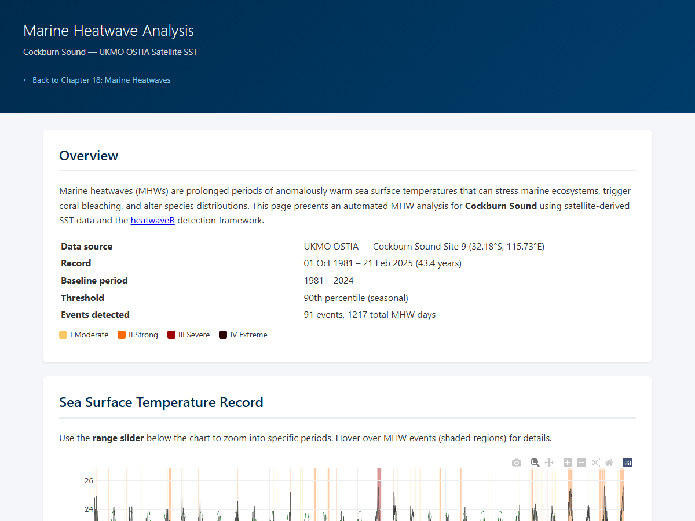

# Marine Heatwaves {#heatwave}

## Overview

Marine heatwaves (MHWs) are prolonged periods of anomalously warm ocean temperatures that can alter marine ecosystem structure and function. Defined formally by Hobday et al. (2016) as discrete warming events where sea surface temperatures exceed the local 90th percentile threshold for five or more consecutive days, MHWs have emerged as one of the most widely documented climate-related pressures on coastal and marine environments worldwide. Hobday et al. (2018) further introduced a categorisation scheme based on the magnitude of exceedance above the seasonal climatology, classifying events as Category I (Moderate), II (Strong), III (Severe), or IV (Extreme) --- an intuitive, colour-coded scale analogous to the Saffir--Simpson hurricane classification. MHW frequency has increased by 34% globally since 1925, with average event duration increasing by 17% (Oliver et al., 2018), and projections indicate continued escalation through the 21st century.

The waters off Western Australia represent a globally recognised MHW hotspot, driven largely by the warm, poleward-flowing Leeuwin Current --- the dominant boundary current in the southeast Indian Ocean. The strength of the Leeuwin Current varies interannually in response to El Nino--Southern Oscillation (ENSO) dynamics; during La Nina years, the current strengthens and delivers anomalously warm tropical water southward along the WA coast, creating conditions conducive to extreme warming events. The Leeuwin Current region has warmed at rates exceeding the global mean, with satellite records showing a long-term SST trend of approximately 0.01--0.02 $^\circ$C per year superimposed on high interannual variability. The most severe MHWs off WA tend to coincide with strong La Nina events, as occurred in 2011 and again in 2021--2022.

Cockburn Sound, as a semi-enclosed coastal embayment with restricted flushing and relatively shallow bathymetry, is exposed to the effects of MHWs. Elevated temperatures can compound existing pressures on the Sound's marine ecosystems --- depressing dissolved oxygen, promoting algal blooms, and directly stressing benthic communities including the seagrass meadows that form the ecological foundation of the Sound (Chapter \@ref(benthic); Chapter \@ref(habitat)).

```{block2, hintM2-mhw, type='rmdnote2'}
*This chapter provides a general summary of marine heatwave conditions in the CSIEM domain. A satellite SST analysis undertaken using the heatwaveR detection framework.*
```


## MHW Event Detection {#heatwave-sst}

An interactive marine heatwave analysis has been developed for Cockburn Sound using the UKMO OSTIA satellite SST reanalysis product (1981--2025) and the heatwaveR detection framework (Schlegel & Smit, 2018). The analysis applies the Hobday et al. (2016) detection algorithm and the Hobday et al. (2018) categorisation scheme to the daily SST record (@ site 32.18$^\circ$S, 115.73$^\circ$E), located within Cockburn Sound.

The interactive report card includes a long-term SST time series with MHW events highlighted by category, an annual summary of MHW days, event intensity analysis and a MHW Event explorer.

To assess the reliability of the satellite SST products used in this analysis, the OSTIA reanalysis and GHRSST L4 records at Site 9 (32.18$^\circ$S, 115.73$^\circ$E) were compared against DWER in-situ surface temperature measurements from station s6142978 (32.26$^\circ$S, 115.71$^\circ$E; 0.5 m depth) over the period 2013--2022 (Figure 18.1). Both satellite products show strong agreement with in-situ observations (OSTIA: r = 0.86, MAE = 0.45$^\circ$C; GHRSST: r = 0.85, MAE = 0.42$^\circ$C), with a small negative bias consistent with satellite skin-temperature measurements being slightly cooler than sub-surface in-situ readings.

```{r sst-comparison, echo=FALSE, out.width='100%', fig.cap=NULL}

```

:::{.figcap}
**Figure 18.1.** Comparison of satellite SST products with DWER in-situ observations in central Cockburn Sound (2013--2022). Left: time series of UKMO OSTIA reanalysis, NASA GHRSST L4, and DWER surface temperature, with MHW climatology and 90th percentile threshold from the OSTIA record. Right: scatter plot with correlation, mean absolute error, and bias statistics.
:::

<br>

:::{.rmdsummary}
**[View the interactive MHW analysis for Cockburn Sound](validation/mhw.html)**
<a href="validation/mhw.html">

</a>
:::

<br>


## The 2011 Marine Heatwave

The austral summer of 2010/2011 produced the most extreme marine heatwave recorded in Australian waters. A combination of a record-strength Leeuwin Current, a near-record La Nina event, and anomalously high air--sea heat flux into the ocean resulted in unprecedented warming along more than 2,000 km of the Western Australian coastline (Pearce et al., 2011; Pearce & Feng, 2013). Satellite-derived SST anomalies in February 2011 peaked at approximately +3 $^\circ$C above long-term monthly means over a broad area from Ningaloo (22$^\circ$S) to Cape Leeuwin (34$^\circ$S), extending more than 200 km offshore. Nearshore temperature loggers in the central west coast region recorded anomalies of up to +5 $^\circ$C above average over a period encompassing late February and early March (Pearce & Feng, 2013).

Rose, Smale and Botting (2012) provided the first detailed characterisation of the 2011 MHW within Cockburn Sound, using in-situ monitoring data from four long-term stations (CS4, CS9, CS11 in Cockburn Sound and WS4 in Warnbro Sound). A warming event of 2--4 $^\circ$C magnitude persisted for more than eight weeks from late January through April 2011. Bottom water temperatures at 10--20 m depth were statistically significantly higher than those recorded during the preceding nine years (2002--2010). Thermal Stress Anomalies (TSAs) --- defined as weekly temperatures $\geq$1 $^\circ$C above the warmest climatological week --- were recorded at all monitoring sites, indicating sustained exceedance of maximum expected summertime conditions.

Dissolved oxygen levels were depressed at most monitoring sites during the event, being approximately 2 mg L$^{-1}$ lower than the 2002--2010 mean in early March 2011. The combination of elevated temperatures (reducing oxygen solubility) and stimulation of biological oxygen demand likely contributed to this depression, with implications for hypoxic stress in the deeper basins of the Sound.


## Recent Events and Long-Term Trends

Analysis of the UKMO OSTIA satellite SST record for Cockburn Sound site (1982--2025; Section \@ref(heatwave-sst)) indicates a statistically significant increasing trend in annual MHW days. A Mann-Kendall test yields $\tau$ = 0.27 (p = 0.012), and a linear regression estimates an increase of approximately 0.8 MHW days per year over the 44-year record (R$^2$ = 0.14, p = 0.012). Mean annual MHW days have increased from 18.8 days yr$^{-1}$ in the pre-2000 period (1982--1999) to 33.0 days yr$^{-1}$ since 2000, with the 2020s to date averaging 61.7 days yr$^{-1}$. Mean event duration has also increased, from 11.8 days per event in the 1980s to 16.0--16.6 days per event in the 2010s and 2020s, while mean peak intensity has remained relatively stable at 1.7--1.8 $^\circ$C across decades. These trends are consistent with the global patterns reported by Oliver et al. (2018) and indicate that Cockburn Sound is experiencing longer and more frequent MHW events, driven primarily by the long-term warming trend rather than by changes in event intensity.

**The 2021--2022 event**: The summer of 2021--2022 produced the highest cumulative MHW intensity on record for Cockburn Sound. The event spanned approximately 88 days from late December 2021 to mid-March 2022, accumulating 153 $^\circ$C$\cdot$days of thermal stress --- exceeding the cumulative intensity of the 2011 event (130 $^\circ$C$\cdot$days over 82 days), though with a lower peak intensity (2.6 $^\circ$C compared to 3.2 $^\circ$C in 2011). The year 2023 recorded the highest total of 93 MHW days, distributed across multiple events.

**The 2024--2025 event**: In January 2025, the Department of Primary Industries and Regional Development (DPIRD) issued a marine heatwave alert for the North Coast and Gascoyne regions, with SSTs recorded 4--5 $^\circ$C above long-term averages in the Pilbara and 2--3 $^\circ$C above average in the Gascoyne (Recfishwest, 2025). The event was associated with a strengthening Leeuwin Current, and as of February 2025, 52 MHW days had been recorded at the Cockburn Sound site, consistent with southward propagation of the warm anomaly along the west coast.

** SST Anomaly Animation** *This section is under development.* A spatially resolved SST anomaly animation for the Cockburn Sound region will be added to illustrate the spatial propagation and structure of MHW events across the CSIEM model domain.

<center>
<!-- Placeholder for SST anomaly animation -->
<!-- <video width="97%" height="97%" controls>
<source src="./media/heatwave/sst_anomaly_animation.mp4" type="video/mp4">
</video> -->
*Animation pending.*
</center>

<br>


## Ecological Responses

The ecological consequences of the 2011 MHW along the Western Australian coast were widespread. An estimated 43% of the kelp (*Ecklonia radiata*) along the west coast perished, and kelp habitat was replaced by turf algae, as mediated by feedback processes that have prevented kelp recovery more than a decade after the event (Wernberg, 2020). Hard corals at Rottnest Island also exhibited high rates of bleaching in May 2011, among the highest-latitude bleaching events recorded globally at that time (Thomson et al., 2011). Fish kills were reported at multiple locations, and temporary southward range extensions of tropical species including whale sharks and manta rays were observed (Pearce et al., 2011). Impacts on fishery stocks (Caputi et al., 2014), and  changes in benthic community structure were also documented along the entire coast (Wernberg et al., 2012; Smale & Wernberg, 2012).

Within Cockburn Sound, ecological observations during the 2011 event included mortality of the sea star *Archaster angulatus* and algal bloom development. However, as noted in Rose et al. (2012), a paucity of historical ecological baseline data in the Sound has meant that uncertainity remains about the extent of biological responses of cumualtive heat stress. This underlies the importance of routine monitoring for thermally sensitive taxa to allow us to understan the ecological footprint of these events.

Research conducted under WAMSI's Westport Marine Science Program (WWMSP) Theme 2 has advanced understanding of the thermal physiology of local seagrass species. Experimental work has established that *Posidonia sinuosa* --- the dominant meadow-forming species in Cockburn Sound --- exhibits declining net productivity at water temperatures above approximately 23--25 $^\circ$C, with sustained exposure to temperatures exceeding 27--28 $^\circ$C leading to tissue damage, reduced shoot density, and increased vulnerability to secondary stressors such as light limitation and epiphyte loading (WAMSI, 2024). These thermal thresholds are regularly exceeded during MHW events. The WWMSP program has also investigated the capacity of different *Posidonia* species and populations to acclimate to warming, finding that resilience varies among species and sites --- information that is relevant to guiding restoration priorities and interpreting CSIEM model predictions of seagrass habitat suitability under future climate scenarios (Chapter \@ref(habitat)).

Marine heatwaves act as compounding stressors on seagrass communities. Elevated temperatures directly reduce net photosynthesis and accelerate respiration in *Posidonia sinuosa*, narrowing the carbon balance and increasing the plant's dependence on adequate light availability (Chapter \@ref(habitat)). Simultaneously, warmer water promotes epiphyte and macroalgal growth, further reducing light at the leaf surface, while oxygen depression in bottom waters creates additional stress and promotes nutrient release (Chapter \@ref(candi-aed)). Long-term trends in seagrass condition documented by Mohring and Rule (2013) indicate that Cockburn Sound meadows have experienced sustained pressure over the past two decades, and the recurrence of major MHW events in 2021--2022 and 2024--2025, following the 2011 event, suggests that recovery time between thermal stress episodes may be insufficient.

## Summary

This chapter has provided an overview of marine heatwave conditions relevant to Cockburn Sound, drawing on satellite SST analysis, in-situ observations, and ecological research undertaken through the WAMSI Westport Marine Science Program. The  MHW detection tool developed using the UKMO OSTIA reanalysis and the heatwaveR framework identifies three major events affecting Cockburn Sound since 2011, with the 2021--2022 event exceeding the 2011 benchmark in cumulative intensity. Ecological responses to these events in the broad region is thought to span kelp loss, coral bleaching, fishery impacts and seagrass stress, with *Posidonia sinuosa* observed thermal thresholds regularly exceeded during MHW periods. These observations inform the CSIEM model's representation of heat-stress impacts on benthic habitats and water quality.


<br>

```{block2, hintMHWSummary, type='rmdsummary'}
- An MHW assessment for Cockburn Sound has been undertaken as part of the CSIEM platform, using satellite SST reanalysis and the heatwaveR detection framework
- MHW frequency and cumulative intensity in the region appear to be increasing, with three major events since 2011 and shortening recovery intervals
- Recent MHW events regularly produce temperatures in the 23--28 $^\circ$C range known to negatively impact *Posidonia sinuosa* productivity and survival
```

<br>
