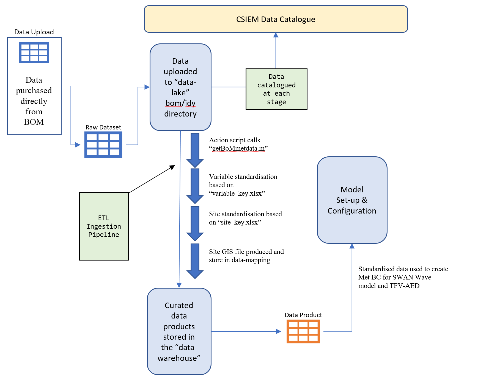

```{r}
knitr::opts_chunk$set(cache = F)
knitr::opts_knit$set(root.dir = rprojroot::find_rstudio_root_file())
```

```{r, include=FALSE}
knitr::knit_hooks$set(class = function(before, options, envir) {
  if(before){
    sprintf("<div class = '%s'>", options$class)
  }else{
    "</div>"
  }
})
```

```{r panel-setup, include = FALSE}
library(downlit)
xaringanExtra::use_panelset()
xaringanExtra::style_panelset(font_family = "inherit")
```


# Welcome {-}

<br>

```{r banner, echo=FALSE, out.width='100%', class = "text-image"}
knitr::include_graphics("images/general/kwinana_banner.jpg")

```

<br>

Welcome to the <span style="color:darkblue">**Cockburn Sound Integrated Ecosystem Model** </span> ($\mathbf{CSIEM}$) information pages!

<br>

## Project background {-}

Cockburn Sound is a marine embayment in Western Australia that supports a wide range of environmental, cultural, social and economic values. The development of the *Cockburn Sound Integrated Ecosystem Model* seeks to deliver a state-of-the-art environmental modelling tool able to support our understanding of this iconic environment.  This report documents the CSIEM technical specification, including how the model integrates with historical data and new findings from the science projects being undertaken within the WAMSI Westport Research program. As they are developed, improvements in the model functional capability, detailed validation tests, and assessment of various management and climate scenarios are reported here.


## Document layout and guidance {-}

This documentation is structured to allow a systematic description of the model rationale, model description and performance from the model. The document starts with an introduction to the site and general model approach, including an overview of previous modelling work in Cockburn Sound, and the research challenges and knowledge gaps that motivated the present work. 


## Contributing {-}

### Coordinating authors {.unnumbered}

The $\mathbf{CSIEM}$ manual has been developed by the following project team:

 - 

<sub><sup>ǂ Aquatic Ecodynamics, UWA Centre for Water and Spatial Sciences, The University of Western Australia, Crawley WA 6009, Australia.</sup></sub><br>


### Adding and updating content {.unnumbered}

The intent of the CSIEM Manual is that the model - *and its documentation* - can continually be updated; thus the correction, improvement and addition of material is encouraged. This online book is therefore open-source and interested stakeholders can comment, raise issues, and further develop content.

This CSIEM documentation is available via GitHub and prepared in "R Mark Down" language. This is an implementation of mark down that can integrate with the R environment for enabling interactive content.

To access and edit the manual you can [download the csiem-science repository](https://github.com/AquaticEcoDynamics/csiem-science) and work with the R project file in RStudio.


### Using RStudio's visual editor {.unnumbered}

If you're unfamiliar with writing `.Rmd` and `.md` files, the [RStudio IDE 1.4](https://blog.rstudio.com/2020/09/30/rstudio-v1-4-preview-visual-markdown-editing/) release implements a visual markdown editor that minimises the need to learn most syntax. To use this feature, open a `.Rmd` or `.md` file and click the visual editor button in the top right-hand corner of the editor window. You will now see a live-rendered version of your document and the addition of numerous buttons/menus that provide a GUI for formatting. Standard word processing functionality, such as buttons to **bold**, *italicise*, and [underline]{.ul} text are available, as well as shortcuts to features that can be more finicky in the basic source editor (e.g. citations, links, and simple tables). Returning to the source editor will reveal the formatting changes made are directly translated to the syntax of the raw file.

<center>
<video width="80%" height="80%" controls>
<source src="images/general/video1.mp4" type="video/mp4">
</video>
</center>

<br>

## Citing this document  {-}

Please cite this online book in reports and scientific publications as: 

...*citation pending*...

<br>

```{r logo1, echo=FALSE, out.width='18%', class = "text-image"}
knitr::include_graphics(c("images/general/wamsi_logo.png","images/general/white.png","images/general/aed-transparent-background.png","images/general/white.png","images/general/UWA-Full-Hor-CMYK.png"))

```

<br>


<!--chapter:end:index.Rmd-->

# Introduction


<!--chapter:end:csiem_introduction.Rmd-->

# CSIEM Model Overview

<br>


<!--chapter:end:csiem_overview.Rmd-->

# Cockburn Environmental Data

## Background/Context

There are diverse types of data (e.g. hydrologic and/or water quality) existing or being collected for the SCIEM project. These datasets are managed by different agencies and available for the research members as described in chapter 3.2.

These datasets are critical for understanding the Cockburn Sound ecosystem as well as to be integrated into the SCIEM system. However, there is a need to organise the data in consistent format (e.g. units, data structure, etc). This is especially important for model-data integration therefore the data can be feasibly used for model set up, validation and reporting. With this regard, workflows have been developed to organise and store the project data in a consistent way. The details of SCIEM data organisation are described in chapter 3.3, and the methodology for model-data integration is described in chapter 4.

## Relevant data management initiatives

Various information management activities are active and relevant to Cockburn Sound Environmental Management. These include:

### Microsoft Azure Blob Storage {.unnumbered}

The Azure Blob Storage was set up by Westport as a location for WAMSI Westport Marine Science Program data to be stored, and in some cases, historical data. This storage option is suitable for medium to large sized data (1 - 100GB) e.g., raster bathymetry data. Access to the Azure Blob Storage is available to Westport staff and selected WAMSI Theme 10 data team members. Data and reports will become accessible for viewing and downloading only to all involved in the WAMSI Westport Marine Science Program and Westport Office through links with the WAMSI GIS portal.

```{r data-pic1, echo = FALSE, out.width='100%', class = "text-image", fig.cap = "Microsoft Azure Blob Storage."}

knitr::include_graphics("images/cdm/blob.png")

```

### WAMSI GIS Portal {.unnumbered}

The WAMSI GIS Portal is a Westport ArcGIS managed website that acts as a navigation centre for researchers accessing commonly requested datasets and documents, both historical and provided under the WAMSI Westport Marine Science Program. The home page is intended to provide summary information and search functionality and will be the default landing page when researchers log into their Westport ArcGIS accounts. Information such as the most up to date Cockburn Sound data audit, Theme 10 workshop slides and Westport Technical Standards can be found here. Contrary to appearance, the WAMSI Portal does not ‘host’ data - rather, it provides searchable listings that link to data and reports stored on one of the four data stores: Westport SDE (Spatial Database Engine), Azure Blob Storage, WAMSI Sharepoint (mentioned above), Pawsey Acacia Storage.

```{r data-pic2, echo = FALSE, out.width='100%', class = "text-image", fig.cap = "WAMSI GIS Portal."}

knitr::include_graphics("images/cdm/GIS_Portal.png")

```

### WAMSI Sharepoint – title: “WAMSI Westport Reports and Data Sharepoint” {.unnumbered}

WAMSI set up a Microsoft Sharepoint page to store historical Cockburn Sound data and reports acquired from proponents. Some of the data and reports and copied across from the BMT Sharepoint page, and others are obtained outside of BMT. Small datasets collected under the current WAMSI Westport Marine Science Program may also be stored here. The data and reports are sorted under a folder structure with the first folder division being ‘Open access use’ or ‘WAMSI Westport use’. Data and reports are then organised by proponent/organisation -> year -> report title. Document and folder URLs from the WAMSI Sharepoint will be linked to the WAMSI GIS portal to become searchable by WAMSI Westport Marine Science Program researchers and the Westport Office. The WAMSI Sharepoint is currently accessible to WAMSI staff and selected Theme 10 data team members, and will become accessible (view and download only) to all involved in the WAMSI Westport Marine Science Program and Westport Office through links with the WAMSI GIS portal.

### Pawsey Acacia Storage {.unnumbered}

The Pawsey Acacia Storage is intended for the largest of datasets (100s-1000s GB) sourced from external proponents or the WAMSI Westport Marine Science Program e.g. Theme 5's ROMs model output. Access to the Pawsey Acacia Storage is available to Westport staff and selected WAMSI Theme 10 data team members. Data will become accessible for viewing and downloading only to all involved in the WAMSI Westport Marine Science Program and Westport Office through links with the WAMSI GIS portal.

```{r data-pic3, echo = FALSE, out.width='100%', class = "text-image", fig.cap = "Pawsey Acacia Storage."}

knitr::include_graphics("images/cdm/Acacia.png")

```

### BMT Sharepoint – title: “WAMSI Data SharePoint” {.unnumbered}

BMT Commercial Australia Pty Ltd (BMT, previously Oceanica) is a large and established consultancy that monitors and collects marine and coastal data within Cockburn Sound for a variety of proponents, particularly Fremantle Ports, Water Corporation and Cockburn Cement Limited. BMT was engaged by WAMSI as they hold proponent’s data and are best placed to share data with WAMSI once sharing permissions are received from proponents. BMT set up a Microsoft Sharepoint page that contains a catalogue of reports and data held by BMT, data sharing license agreements from proponents, and requested reports and data related to the data sharing license agreements. WAMSI then migrates the approved reports and data across to a WAMSI Sharepoint. Access to the BMT Sharepoint has been provided to selected Theme 10 data team members and BMT staff. BMT also set up restricted access folders within the BMT Sharepoint for major proponents to easily review their reports prior to giving access to WAMSI. WAMSI Theme 10 data team members can not access these restricted proponent folders.

## CSIEM Environmental Information Management

This document summaries a synthesis of the above into a CSIEM Environmental Information Management set of standards and workflows.

- Support a federation of datasets
- Document a standard way to organise obs and modelled data, using standard metadata and workflow setup

This will provide:

- Entry point for new data generators
- Standards for data users
- Developed compiled data products for ease of use
- Facilitate model and data integration for visualisation and analytics

CSIEM Environmental Information Management can be viewed as three separate systems:

- Data Collation
- Data Governance & Reporting
- Data Integration

```{r data-pic4, echo = FALSE, out.width='100%', class = "text-image", fig.cap = "CSIEM Environmental Information Management Overview."}

knitr::include_graphics("images/cdm/Information_Management.png")

```

### Data Collation

Data that is sourced and collated from various government agencies, researchers and industry groups is stored in the data lake (see section 3.3.3) in their raw format. Each data provider is assigned a unique agency and program identifiers. Raw data is stored in a rigid folder structure based on these two identifiers (Agency/Program/...).

```{r data-pic5, echo = FALSE, out.width='100%', class = "text-image", fig.cap = "Data flow into the date lake."}

knitr::include_graphics("images/cdm/data_collation.png")

```

Data stored within the data lake is not formatted or processed in any way. Removal of duplicated and depeciated datasets is handled by the ETL (**"Extract, Transform, Load"**) pipelines outlined in secion 3.3.3. As such, strict data governance is required to maintain control and understanding of the contents of the data lake.

### Data Governance

Data Governance is the process of managing the availablity and usablity of data within the **CSIEM Environmental Information Management** system. Governance can be loosely broken up into three key areas:

- Classsification
- Catalogue
- Mapping

<!--
```{r data-pic6, echo = FALSE, out.width='100%', class = "text-image", fig.cap = "Data Governance."}

knitr::include_graphics("images/cdm/governance.png")

```
-->

Each area has been designed to allow the users of the system to quickly understand the avalaiable data contained within the lake, the extents that data covers, as well as identify areas of missing or poor data.

```{r data-pic7, echo = FALSE, out.width='100%', class = "text-image", fig.cap = "Data Governance."}

knitr::include_graphics("images/cdm/Governance_Pipeline.png")

```

#### Classification

Each dataset that is added to the data lake is classified with a standard set of attributes (see section 3.3.2.2), the three most important being:

- Agency
- Program
- Data Type

<br>

In order to maintain the usability of the data lake, given it's unstructured nature, it's important to ensure consistancy when deciding where a particular dataset is to be stored. In the CSIEM Environmental Information Management system, all raw data is stored in the strict folder stucture `agencycode/programcode`. If a particular agency program is unknown, a program code will be assigned during the cataloguing proceedure.

Each dataset is also given a specific data catagory to facilitate user searches and downstream conversions. Data is categorised in the general areas of :

- _Bathymetry_
- _Meteorology_
- _Hydrology_
- _Water Quality_
- _Sediment_
- _Biota_

These are defined into sub-categories, as outlined in Table \@ref(tab:data-classes).

<br>

```{r data-classes, echo=FALSE, message=FALSE, warning=FALSE}
library(knitr)
library(kableExtra)
library(readxl)
library(rmarkdown)
theSheet <- read_excel('tables/CDM_Classes.xlsx', sheet = 2)
theSheet <- theSheet[theSheet$Table == "Data",]
theSheetGroups <- unique(theSheet$Group)

kbl(theSheet[,3:4], caption = "CSIEM Data Classification", align = "l",) %>%

row_spec(0, background = "#002B4D", bold = TRUE, color = "white") %>%
  kable_styling(full_width = T,font_size = 10) %>%
    scroll_box(fixed_thead = FALSE)
```

<br>

#### Catalogue

All data entering the sytem is recording in the CSIEM_Data_Catalogue.xlsx spreadsheet that can be found the data-lake directory in the cseim-data github repository. The details of data catalogue are included in **Appendix A: Data Catalogue**.

<br>

#### Mapping

Independant GIS files are produced for each dataset added to the data lake. Not only does this allow for ease of mapping and visualisation, it serves as an important cross check of the ingestion pipelines and any co-ordinate system conversions that have occurred within the pipeline.

Each dataset has a corresponding csv file saved within the `data-mapping` directory of the csiem-data, with the file name corresponding the the agencycode/programcode outlined above.

<br>

```{r data-mapping, echo=FALSE, message=FALSE, warning=FALSE}
library(knitr)
library(kableExtra)
library(readxl)
library(rmarkdown)
theSheet <- read_excel('tables/DOT_TIDE.xlsx', sheet = 1)
theSheet <- theSheet[theSheet$Table == "Data",]
theSheetGroups <- unique(theSheet$Group)

kbl(theSheet[,2:10], caption = "Example GIS file for data-mapping", align = "l",) %>%

row_spec(0, background = "#002B4D", bold = TRUE, color = "white") %>%
  kable_styling(full_width = T,font_size = 10) %>%
    scroll_box(fixed_thead = FALSE)
```

<br>

<!---
```{r data-pic8, echo = FALSE, out.width='100%', class = "text-image", fig.cap = "Site Map"}

knitr::include_graphics("images/cdm/CSIEM_Site_Map_v1.png")

```
--->

```{r echo=FALSE, message=FALSE, warning=FALSE}
library(leaflet)
library(leafem)
library(magrittr)
library(leaflet.extras)
library(htmlwidgets)
library(fontawesome)
library(sf)

dataset <- read.csv("maps/csiem_data/Obs/obs_maps.csv")

tfv <- sf::st_read("maps/csiem_data/Models/tfv_cockburn.geojson",quiet = TRUE)
plt <- sf::st_read("maps/csiem_data/Models/plotting_regions.geojson",quiet = TRUE)

dataset$colour <- NA
dataset$agencyLegend <- NA

colours <- c("#66c2a5", "#fc8d62", "#8da0cb", "#e78ac3", "#a6d854", "#ffd92f", "#e5c494", "#b3b3b3")
agency <- unique(dataset$Agency.ID)

for(i in 1:length(agency)){
  dataset[dataset[["Agency.ID"]]==agency[i],10] <- colours[i]
  dataset[dataset[["Agency.ID"]]==agency[i],11] <- paste0(agency[i], " <div style='position: relative; display: inline-block' class='circle'>",fa(name="circle", fill=colours[i]),"</div>")
}

leaflet::leaflet() %>%
  leaflet::addPolygons(
    data = tfv,
    group = "TUFLOW",
    color = "#e41a1c",
    fillColor = "#e41a1c",
    opacity = 0.7,
    fillOpacity = 0.7,
    weight = 0,
    label = "TUFLOW Model Boundary"
  ) %>%
  leaflet::addPolygons(
    data = plt,
    group = "PLOTTING",
    color = "#8da0cb",
    fillColor = "#8da0cb",
    opacity = 0.7,
    fillOpacity = 0.7,
    weight = 0,
    label = plt$Name
    #label = "Plotting Regions"
  ) %>%
  leaflet::addCircleMarkers(
    data = dataset,
    lat = dataset$Lat,
    lng = dataset$Lon,
    fillColor = dataset$colour,
    group = dataset$agencyLegend,
    color = "black",
    opacity = 0.2,
    fillOpacity = 1,
    radius = 4,
    weight = 1,
    label = dataset$Program,
    popup = paste(
      paste0("<b>",dataset$Agency,"</b>"),
      "<br>",
      "Program: ", dataset$Program,
       "<br>",
      "Data Classification: ", dataset$Data.Classification,
      "<br>",
      "Station ID: ", dataset$Station.ID
      )
    ) %>%
  leaflet::addLayersControl(
    baseGroups = c("None", "TUFLOW", "PLOTTING"),
    overlayGroups = dataset$agencyLegend,
    options = leaflet::layersControlOptions(collapsed = FALSE)
  ) %>%
  leafem::addLogo(
    img = "aed.png", # This image needs to be in /docs
    src = "remote",
    position = "bottomleft",
    width = 120,
    height = 47.76,
    offset.x = 10
    ) %>%
  leaflet::setView(
    lng = 115.72447,
    lat = -32.20063,
    zoom = 9
    ) %>%
  leaflet.extras::addFullscreenControl() %>%
  leaflet::addProviderTiles(providers$CartoDB.Positron) %>%
  htmlwidgets::onRender("
        function() {
            $('.leaflet-control-layers-overlays').prepend('<label style=\"text-align:center\"><b>Agencies</b></label>');
            $('.leaflet-control-layers-list').prepend('<label style=\"text-align:center\"><b>Model<br>Boundaries</b></label>');
        }
    ") %>%
   htmlwidgets::onRender("
    function(el, x) {
      this.on('baselayerchange', function(e) {
        e.layer.bringToBack();
      })
    }
  ")


```

### Data Integration

The CSIEM Environmental Information Management system ustilised a **Data Lake** --> **Data Warehouse** data management system, driven via customise batch **ETL** functions, triggered via GitHub actions. This system was implimented due to both the vast array of raw data inputs into the project, as well as the diverse data analyical demands required across different agences and platforms.

#### GitHub

GitHub is a cloud based git repository service, with enterprise level version control and tracking. It has been chosen as the central repository for the data and the pipeline functions based upon it's maturity as a platform, as well as it's widespread adoption within industry and academia.

The csiem-data repository can be viewed and cloned [here](https://github.com/AquaticEcoDynamics/csiem-data)

#### Data Lake

A **Data Lake** is simply a centralised store of raw, disparate datasets, be it structured or unstructured. Centralising and cataloguing this raw data allows for customised **ETL** processes to be constructed that can be tailored to each analytics usecase, as opposed to forcing the data into a **one size fits all** structure.

However, because the data is primarily being stored in it's raw format, goverance beomes extremely important so that data assests are not lost in the lake.

#### Data Warehouse

The **Data Warehouse** is the store of boutique, costomised data products produced through the batch **ETL (Extract, Transform and Load)** pipelines. Each folder within the `data-warehouse` directory on GitHub contains processed data in different formats, based upon end user requirements.

All data usage outside of the ETL pipelines should and must be carried out from products within the warehouse. This will ensure both the efficient and repeatability of any script or data product produced downstream, as well as providing a constant data pathway for data validation.

#### Data Pipelines & ETL

Each dataset found within the data-lake is extracted via the **ETL** pipeline ustilising code found in the `code\import` directory. As each dataset is stored in it's raw form, extraction and transformation is more often than not going to require a unique codebase. As such, a unified pipeline is not being developed at this stage, and each data source will have it's own codebase. To facilitate this, each code base will draw upon share glossaries (such as the variable glossay discussed below) and conversion tables, to ensure standardisation.

```{r data-pic9, echo = FALSE, out.width='100%', class = "text-image", fig.cap = "ETL."}

knitr::include_graphics("images/cdm/ETL.png")

```

#### GitHub Actions

One of the primary reason for choosing GitHub to house the CSIEM Environmental Information Management system is GitHub Actions. GitHub actions allows for the automation of workflows, using a variety of languages and technologies. Pipelines constructed in both Pyhton and Matlab can be automated and run in parrallel via simple configurations. Pipelines can be constructed that can be automated and processed on a wide variety of platforms and operating systems.

#### Variable Standardisation

Fundamental to the data collation program is the concept of data standardisation. All data contained within the data lake is processed nightly into standardised data products.

As part of this standardisation, all incoming variables need to be converted into a common variable name and unit. To facilitate this, a global variable translation glossary is being developed, which will allow the data engineers to quickly and transparently create importation scripts to process new datasets.

Master variables are first defined, with a unique identifier, variable name, units and symbol (if applicable) Table \@ref(tab:variable-classes).

<br>

```{r variable-classes, echo=FALSE, message=FALSE, warning=FALSE}
library(knitr)
library(kableExtra)
library(readxl)
library(rmarkdown)
theSheet <- read_excel('tables/variable_key_extract.xlsx', sheet = 1)
theSheet <- theSheet[theSheet$Table == "Data",]
theSheetGroups <- unique(theSheet$Group)

kbl(theSheet[,2:9], caption = "CSIEM Variable Classification", align = "l",) %>%

row_spec(0, background = "#002B4D", bold = TRUE, color = "white") %>%
  kable_styling(full_width = T,font_size = 10) %>%
    scroll_box(fixed_thead = FALSE)
```

<br>

Once a new data source has been added to the data lake, a custom key is defined for the new variables and unit conversions created to standardise the dataset to the ingestion data standard (see Chapter 4) \@ref(tab:dwer-classes).

<br>

```{r dwer-classes, echo=FALSE, message=FALSE, warning=FALSE}
library(knitr)
library(kableExtra)
library(readxl)
library(rmarkdown)
theSheet <- read_excel('tables/variable_key_extract.xlsx', sheet = 2)
theSheet <- theSheet[theSheet$Table == "Data",]
theSheetGroups <- unique(theSheet$Group)

kbl(theSheet[,2:5], caption = "DWER Variable Conversion", align = "l",) %>%

row_spec(0, background = "#002B4D", bold = TRUE, color = "white") %>%
  kable_styling(full_width = T,font_size = 10) %>%
    scroll_box(fixed_thead = FALSE)
```

<br>

## Model Governance

Model derived data is used extensively throughout the research program, from providing direct input into other models (nesting) through to model validation. As such, model governance plays an equally import role as data governance. It is treated separately as model data is not stored directly in a single lake environment, but accessed and processed in a variety of ways depending on it's size and storage location.

<br>

```{r model-classes, echo=FALSE, message=FALSE, warning=FALSE}
library(knitr)
library(kableExtra)
library(readxl)
library(rmarkdown)
theSheet <- read_excel('tables/CSIEM_Model_Catalogue_Extract.xlsx', sheet = 1)
theSheet <- theSheet[theSheet$Table == "Data",]
theSheetGroups <- unique(theSheet$Group)

kbl(theSheet[,2:13], caption = "CSIEM Model Catalogue", align = "l",) %>%

row_spec(0, background = "#002B4D", bold = TRUE, color = "white") %>%
  kable_styling(full_width = T,font_size = 10) %>%
    scroll_box(fixed_thead = FALSE)
```

<br>

<!--chapter:end:csiem_data.Rmd-->

# Model-Data Organisation

<br>

The data requirements for the modelling are diverse and varied, spanning hydrological, meteorological, water and sediment quality (long-term monitoring, data from intensive campaigns and in situ sondes), plus ecological survey data. This creates an integration challenge for model setup, parameterisation and assessment (calibration and validation) (Figure \@ref(fig:csiem-pic5)).

```{r csiem-pic5, echo = FALSE, out.width='100%', class = "text-image",fig.align='center', fig.cap = "The model-data ecosystem and conceptual approach to model-data integration, accomodating data diversity and varied model requirements."}

knitr::include_graphics("images/cdm/2_picture2.png")
```

To enable the ongoing use and development of the CSIEM in this context, we have developed a **model-data integration framework** able to be used by stakeholders to co-ordinate the reference datasets needed for model development, and standardise the data integration and modelling workflows. The below sections describe how the CSIEM is organised, the tools and approaches used for model provenance and managing data streams, and model versioning.
<br>

## CSIEM repository structure and organisation

The CSIEM repository ecosystem has been designed is such a way to both facilitate the sharing of data and models across various agencies and researchers, as well as providing a formalised structure to store, catalogue and process complex and unique datasets. Comparmentalised data structures have been implemented to allow for tracking and version control of data and models as they are utilised and upgraded throughout the project. Given the complexitites and scope of the requirements, four interconnected repositories have been created to house and share the accumulated project outputs:

- **csiem-science:** a repository for documenting the CSIEM workflows, model-data structure and integration, and results (the current CSIEM bookdown online manual);
- **csiem-data:** a platform for storing and sharing environmental data for this project;
- **csiem-model:** a platform for storing and sharing model files and configurations;
- **csiem-marvl:** a collection of scripts for visualising, assessing and reporting the data and model performance.

Github has been chosen to house the repository based on it's mature version control systems and cross platform program support to aid all stakeholders accessing the data and models (https://github.com/). In addition, there is a [wide variety of documentation online](https://guides.github.com/activities/hello-world/) to assist users new to GitHub. Information on how to clone a publicly available GitHub repository can be found [here](https://docs.github.com/en/github/creating-cloning-and-archiving-repositories/cloning-a-repository-from-github/cloning-a-repository).

Data cataloguing via the "CSIEM Data Catalogue" (described in Section 3.3) has been designed with cross-agency usage in mind. Integration with the WAMSI Theme 10 Data Catalogue is essential to allow for the tracking of data changes and upgrades throughout the project. The "Point of Truth", "WAMSI Catalogue Classification" and "Status Notes" categories have been included in the CSIEM Data Catalogue to track a dataset's evolution throughout the project.

### **Online repository access**

The data and model files are stored in the Github [CSIEM Repository](https://github.com/AquaticEcoDynamics/CSIEM) and shared with WAMSI research partners and end-users.

### **High level model-data integration workflows**

The raw data collected from previous works and current WAMSI research project outcomes are stored in the `csiem-data` folder and classified by their sources. These raw data are then post-processed using standard scripts to convert the raw data into ‘standardised’ data formatd (stored in the `data-warehouse` folder) that can be used for model configuration and boundary/initial conditions (stored in the `csiem-model` folder), and for model/data visualization, model calibration/validation, and reporting using the `csiem-marvl` analysis library. The data-model workflow is shown in Figure \@ref(fig:csiem-pic8).

```{r csiem-pic8, echo = FALSE, out.width='100%', class = "text-image",fig.align='center', fig.cap = "CSIEM conceptual diagram showing the flow of data through the system"}

knitr::include_graphics("images/cdm/Workflow.png")

```

<br>

## Data repository and management

### **Repository folder structure**

The data repository folder structure follows the logic of data types and resources as shown in Figure \@ref(fig:csiem-pic7).

```{r csiem-pic7, echo = FALSE, out.width='100%', class = "text-image",fig.align='center', fig.cap = "CSIEM Data online storage folder structure"}

knitr::include_graphics("images/cdm/csiem_data_folder_structure.png")

```

The root directories are listed and described below:

```{r A-folders, echo=FALSE, message=FALSE, warning=FALSE}
library(knitr)
library(kableExtra)
library(readxl)
library(rmarkdown)
theSheet <- read_excel('tables/folders.xlsx', sheet = 1)
theSheet <- theSheet[theSheet$Table == "data",]
theSheetGroups <- unique(theSheet$Group)

kbl(theSheet[,2:3], caption = "CSIEM Root Folder Descriptions", align = "l",) %>%

row_spec(0, background = "#14759e", bold = TRUE, color = "white") %>%
  kable_styling(full_width = T,font_size = 10) %>%
    scroll_box(fixed_thead = FALSE)
```

### **Data catalogue**

All data that is uploaded to the CSIEM github repository is logged in the `csiem-data` CSIEM Data Catalogue. The catalogue (found in the data-governance directory) is comprised of a main data sheet ("CSIEM Data Catalogue") as well as summary sheets for all processed data. Every raw datafile is logged with the following information:

```{r A-metadata, echo=FALSE, message=FALSE, warning=FALSE}
library(knitr)
library(kableExtra)
library(readxl)
library(rmarkdown)
theSheet <- read_excel('tables/CSIEM_Classes.xlsx', sheet = 1)
theSheet <- theSheet[theSheet$Table == "Data",]
theSheetGroups <- unique(theSheet$Group)

kbl(theSheet[,3:4], caption = "CSIEM Catalogue Metadata", align = "l",) %>%

row_spec(0, background = "#002B4D", bold = TRUE, color = "white") %>%
  kable_styling(full_width = T,font_size = 10) %>%
    scroll_box(fixed_thead = FALSE)
```

<br>

A catalogue of all relevant data under management is provided in [Appendix A](Appendix A : Data Catalogue).

<br>
<!--
Once imported, the data is then summerised via a script in the ```scripts/dataimport/summary``` directory to create a standard set of plots and summary tables that can be found in the ```data/summary``` directory. ESRI shapefiles are also automatically produced and saved into the ```gis/summary``` directory to be used to create a stardarised site map of the data's sampling locations.

```{r csiem-pic10, echo = FALSE, out.width='100%', class = "text-image",fig.align='center', fig.cap = "Example GIS Map showing the sampling locations for the Water Data SA online data "}

knitr::include_graphics("images/cdm/DEW WaterDataSA Locations.png")
```

-->

### **ETL (Extract, Transform and Load) workflows**

All of the ETL pipeline scripts for the CSIEM Environmental Information Management are all contained within the `code/` directory, which has three subfolders:

- `import`: All scripts that process the raw data from the data-lake into the data-warehouse.
- `actions`: GitHub action functions, and well as secondary functions to control with pipeline is executed automatically.
- `functions`: Shared function that scripts within the above directories may call.

Scripting has been predominately carried out utilising the [Matlab](https://au.mathworks.com/?s_tid=gn_logo) programming language, however there are scripts within the `scripts` directory using both [R](https://www.r-project.org/about.html) and [Python](https://www.python.org/). Users are able to add scripts in their preferred language; the repository core scripts for data storage and model plotting are currently in Matlab.

Below is an example workflow outlining how a meteorological boundary condition file for the TUFLOW-FV model is created (Figure \@ref(fig:csiem-pic9). Data is first downloaded and processed by scripts in the `code` directory. Standardised data is then stored in the `data-warehouse` for usage in the creation of model boundary input file and in the MARVL visualisation and analytics package.

```{r csiem-pic9, echo = FALSE, out.width='100%', class = "text-image",fig.align='center', fig.cap = "CSIEM work flow diagram for met data"}



```

<br>

## Model repository and management

### **Model catalogue**

All model files are stored in the `models` folder. As the model is developed over time, the model files are classified with project names and model generation identifiers. The ‘WC’ folder contains the model files used for assessing PSDP by the Water Corporation; the ‘Westport’ folder contains the model files developed for assessing Westport Phase 1 scenarios, and the ‘WWSMP’ folder contains the the core CSIEM files being updated throughout the WAMSI Westport integration project.

Models within each project directory are separated via both _generation_ and model _type_. Within the WWSMP model folder there are currently 4 distinct models:

- `wwmsp_swan_v1`
- `wwmsp_tfvaed_Gen1.0_1PFT`
- `wwmsp_tfvaed_Gen1.5_4PFT_MAG`
- `wwmsp-rapid`

The `wwmsp_swan_v1` is the first generation of the Cockburn SWAN Wave model that has been developed (see Section 3.2). Found inside the `wwmsp_swan_v1` directory are two zipped model folders:

- `Coorong_swn_20170101_20220101_UA_Wind_200g_2000w.zip`
- `Coorong_swn_20191101_20220101_UA_Wind_200g_2000w.zip`

The `wwmsp-rapid` simulation folder and the `wwmsp_tfvaed_Gen1.0_1PFT` simulation folder both contain TUFLOW-FV - AED simulations, but are kept separate as they constitute different generations, using different grids, simulation periods and BC files. The Generation 1.5 simulation (`wwmsp_tfvaed_Gen1.5_4PFT_MAG`) represents an upgrade in the number of phytoplankton groups, new material zones and the addition of seagrass.

Each model folder may contain multiple simulation sets, but they will all rely on the same model base configuration, with minor differences or adujstments. Major changes to a model's configuration will constitute a change in generation numeber and these are stored in a separate folder. Note, models uploaded to the CSIEM repository may have been created by different agencies and researchers and should maintain a consistent naming convention.

### **TUFLOW-FV model organisation**

The TUFLOW-FV model found in the WWMSP project folder was created prior to the above structure being implemented and contains the following folder structure:

- `BCs`: boundary condition files, including tide and inflow boundary files; meteorological boundary files, and initial condition files;
- `External`: AED model files linked with the TUFLOW-FV, and optionally the ‘GOTM’ vertical mixing model if the CSIEM is in 3D mode;
- `Geo`: TUFLOW-FV model structure files, including geometry and mesh files, and GIS files controlling the nodestrings and material zones;
- `Input`: model control/configuration files;
- `Plotting` : Directory to store model output images;

The `wwmsp_tfvaed_Gen1.5_4PFT_MAG` simulation folder also contains a `bin` directory containing the windows binaries for the TFV-AED model

- `TFV:` Build version: 2020.03.105
- `AED:` Build version: 2.0.5b

### **SWAN Wave Model organisation**

The SWAN wave models found in the model directory have the following format:

- `01_geometry` : Contains the bathymetry input files as well as a automatically generated image of the bathymetry and a matlab .mat file containing the bathymetry information;
- `02_bc_dbase` : Contains the processed wind input files
- `03_simulation` : Contains the INPUT control file required to run the simulation
- `04_results` : Model output directory

The script required to create and configure a new SWAN wave model can be found in the `scripts/datatools/wave` directory.

## Model Assessment, Reporting and Visualisation Toolbox Repository

The publicly available GitHub repository called [`csiem-marvl`](https://github.com/AquaticEcoDynamics/csiem-marvl) contains a wide variety of matlab scripts and functions that are used to process and visualise model output. Scripts that have been specifically developed for this project are contained within the `csiem-marvl` repository. Plotting and model processing types include:

- Time-series plotting;
- Transect plotting;
- Model animation creation;
- Error assessment;
- Wave model plotting;
- Habitat mapping (e.g., Ruppia & Fish HSI processing and mapping)
- Scenario comparison and "DelMap" plotting;
- Nutrient budget assessments.

In particular, `AEDmarvl_plot_timeseries` and `AEDmarvl_plot_transect` are the main functions that are frequently used. The `AEDmarvl_plot_timeseries` function uses data and gis files stored in the csiem-marvl repository, in addition to model output to create timeseries plots of the model (averaged within a polygon region) compared against field data. The plotting function will also automatically calculate a range of error statistics based on model output and field measured data.

```{r csiem-plottfvpolygon, echo = FALSE, out.width='100%', class = "text-image",fig.align='center', fig.cap = "Example output from plottfv_polygon with error matrix"}

knitr::include_graphics("images/cdm/0005_CS_South.png")

```

`AEDmarvl_plot_transect` can also be found in the `csiem-marvl` repository. This plots model data extracted along a transect line during a specified plotting period, and compares against the range of field data found within that period.

```{r csiem-plottfvtransect, echo = FALSE, out.width='100%', class = "text-image",fig.align='center', fig.cap = "Example output from plottfv_transect with distance from Goolwa Barrage (km) along the x-axis"}

knitr::include_graphics("images/cdm/2021-09-01_2022-01-01_Surface.png")

```

The `csiem-marvl` analysis library also houses scripts and functions for:

- Nutrient Budgeting;
- Stacked Area Transect;
- Curtain plotting;
- Mesh manipulation tools;
- Data exports;
- Sheet plotting and animation tools;

Some of the example plots from previous research projects using the marvl-similar scripts are shown below illustrating their capability and presentations. The `csiem-marvl` analysis library is currently under development to meet the needs with more data collection and modelling progress, such as sediment profiling and habitat index.

```{r csiem-stackedarea, echo = FALSE, out.width='100%', class = "text-image",fig.align='center', fig.cap = "Example output from plottfv_transect_StackedArea with distance along the x-axis"}

knitr::include_graphics("images/cdm/stackedarea.png")

```

```{r csiem-nutrientbudget, echo = FALSE, out.width='100%', class = "text-image",fig.align='center', fig.cap = "Example Nutrient Budgeting output of a polygon region."}

knitr::include_graphics("images/cdm/nutrient_budget_1.png")

```

<!--chapter:end:csiem_integration.Rmd-->

# Integrated Assessment

<br>

## Overview

The previous chapters have detailed the nature of the model setup, additions and areas of development. In this section, the model is assessed in its entirety, using the fully coupled model, against the complete dataset. The approach to assess the model loosely follows the CSPS framework of Hipsey et al. (2020). The framework considers:

- _Level 0_: conceptual evaluation; the conceptual diagrams for each of the water quality variables, biogeochemical reactions, and habitat modelling are based on the scientific review and data inspection as detailed in the previous chapters;
- _Level 1_: simulated state variables; a range of metrics is used for a large number of predicted variable and different sites.
- _Level 2_: process rates; and
- _Level 3_: system-level patterns and emergent properties; this is evaluated by the overall nutrient budget analysis, nutrient cycling pathway analysis, and assessment of the relationship between the areas of habitat for seagrass.

The specific data available for validation and the assessment metrics used are described next. The level of model uncertainty is discussed in terms of how much confidence is in the current generation of model outputs for the purposes of defining model reliability.

In addition to the model performance assessment, the model is also routinely used to support management decision-making. Detail is provided on how the diverse model outputs can be processed and analysed for informing the decision making and other applications.

<br>
<!---
```## Integrated simulations
A summary of the different simulations used through the model life cycle of model development:
```
--->
## Model assessment approach

### Summary of validation data-set

The field observation data available for the model validation and assessment include a diversity of historical data (collected pre 2021), and a large volume of data generated by recent monitoring and WAMSI-Westport research projects. Relevant data for validation include:

- In situ water quality sensors; high frequency measurements at fixed locations.
- Water quality grab samples
- Biotic surveys
- Strategic experimental data.

All the data relevant to model calibration and validation are included in the _CSIEM Data Catalogue_ and detailed in [Appendix A](Appendix A : Data Catalogue). The data spans a wide range of locations and time-periods; however the primary model assessment will focus the most intense period of monitoring. Long-term assessments are also undertaken for different versions of the model, as outlined next.

### Performance assessment metrics

The modelling results are compared against historical data collected within Cockburn Sound (where available), using both traditional statistical metrics of model error, and other metrics relevant to model performance. The approach is applied to each model generation with the aim to identify areas where the model is accurate, and areas for further improvement and ongoing calibration effort.

**Error metrics** : Initially, the model performance in predicting a range of relevant variables including salinity, temperature, nitrogen, phosphorus and total chlorophyll-a are assessed with a set of statistical metrics, and the calculations of statistical metrics was performed for each observation site where the number of field observations was >10 in the assessment period.

The core statistical metrics considered consist of:

- $r$: regression coefficient, Varies between -1 and 1, with a score of 1 indicating the model varies perfectly with the observations and a negative score indicating the model varies inversely with the observations. A consistent bias may be present even when high score of r is obtained.
- $BIAS$: bias of average prediction to the average observation during the assessing period. This method presents a magnitude for the discrepancy between the model results and the observational data.
- $MAE$: mean absolute error: Similar to RMSE except absolute value is used. This reduces the bias towards large events. Values near zero indicate good model skill.
- $RMS$: root mean squared error, Measures the mean magnitude, but not direction, of the difference between model data and observations, and hence can be used to measure bias. Values near zero are desirable. This method is not affected by cancellation of negative and positive errors, but squaring the data may cause bias towards large events.
- $nash$: the Nash-Sutcliffe metric (also called $NSE$ or $MEF$ is a matrix of modelling efficiency, measures the mean magnitude of the difference between model data and observations. This method compares the performance of the model to that only uses the mean of the observed data. A value of 1 would indicate a perfect model, while a value of zero indicates performance similar to simply using the mean of observed data.

**Seasonality** : The model results are assessed in terms of the degree of seasonal fluctuation, as seen in the field data. Whilst this is captured in the error metrics (e.g. R, the visual assessment can assess timing issues related with seasonal peaks.

**Transects** : The model results are assessed in terms of the seasonal mean along the length of the domain (longitudinal transect). The transect analysis allows a system wide scale assessment of conditions, that smooths out noise and local variability in the field and model predictions.

**Advanced measures** : The model results were finally assessed considered that partitioning of nutrients in terms of inorganic vs organic, and other expected measures.

**Confidence** : Based on the above assessment we evaluate confidence in the model by assigning each variable to the following categories:

- Good
- Acceptable, and
- Caution.

This confidence evaluation, considers:

- Quality of observed data, which is influenced by field and laboratory data limitations, methodologies, processes and protocols.
- Error metric scores relative to what is typically reported in the literature for water quality models (e.g., Arhonditsis and Brett, 2004).
- Ability of the CSIEM to capture the mean of an indicator and its spatial gradient and seasonality.
- Partitioning of water quality constituents within different ecosystem pools.
- Natural variability of the indicator at different temporal scales (i.e. sub-daily to seasonal).

<br>

## Assessment and validation periods

- _Historical period_: 1970-2010: initial assessment prior to availability of WAMSI research project data;
- _Recent period_: 2010-2020: initial assessment prior to availability of WAMSI research project data;
- _Focus period_: 2021-2022: initial calibrated against the intensive field sampling and observations obtained from different components of the WAMSI research project;
- _Long-term performance_: 2017 – 2022: calibrated against the long-term water quality data collected from the routine measurements, as well as from the WAMSI research project. These results are summarised below.

<br>

## Integrated simulation performance

This integrated simulation performance will be provided in Appendix B which is pending and to be updated with the CSIEM modelling progress.

<!--chapter:end:csiem_integrated_assessment.Rmd-->

# References {-}

<div id="refs"></div>

<!--chapter:end:csiem_references.Rmd-->

# Appendix A : Data Catalogue {-}

<br>
This appendix documents the details of the data catalogue for the CSIEM project, including the data classification, organization, and summary. All data that is uploaded to the CSIEM github repository is logged in the `csiem-data` CSIEM Data Catalogue. The catalogue (found in the data-governance directory) is comprised of a main data sheet ("CSIEM Data Catalogue") as well as summary sheets for all processed data.

## Cockburn data organization {-}

All raw data is initially uploaded into the `data/incoming` directory is filed under either it's WWMSP theme, or the agency responsible for supplying the data.

Data is then imported into a common format via the scripts found in the `scripts/dataimport` directory and stored in the `data/store` directory. Although some imported data may contain extra fields, all imported data contains the following fields:

```{r CSIEM-datastorea1, echo=FALSE, message=FALSE, warning=FALSE}
library(knitr)
library(kableExtra)
library(readxl)
library(rmarkdown)
theSheet <- read_excel('tables/data_store_info.xlsx', sheet = 1)
theSheet <- theSheet[theSheet$Table == "Data",]
theSheetGroups <- unique(theSheet$Group)

kbl(theSheet[,3:4], caption = "CSIEM Stored Data", align = "l",) %>%
  pack_rows(theSheetGroups[1],
            min(which(theSheet$Group == theSheetGroups[1])),
            max(which(theSheet$Group == theSheetGroups[1])),
            background = '#ebebeb') %>%
  pack_rows(theSheetGroups[2],
            min(which(theSheet$Group == theSheetGroups[2])),
            max(which(theSheet$Group == theSheetGroups[2])),
            background = '#ebebeb') %>%
row_spec(0, background = "#002B4D", bold = TRUE, color = "white") %>%
  kable_styling(full_width = T,font_size = 11) %>%
  scroll_box(fixed_thead = FALSE)
```

<br>

## Cockburn data catalogue {-}

A summary of the available data categorised by these data types and by agency/supplier is shown below. Data is accesible via the `data` folder of the `csiem-data` [GitHub repository](https://github.com/AquaticEcoDynamics/csiem-data). Please refer to the master data catalogue spreadsheet therein for data provenance information.

<br>
```{r datacataloguea1, echo=FALSE, message=FALSE, warning=FALSE}
library(knitr)
library(kableExtra)
library(readxl)
library(rmarkdown)
theSheet <- read_excel('tables/CSIEM_Data_Catalogue_Extract.xlsx', sheet = 1)
theSheet <- theSheet[theSheet$Table == "Data",]
theSheetGroups <- unique(theSheet$Group)
kbl(theSheet[,2:10], caption = "CSIEM Data Catalogue", align = "l",) %>%
  pack_rows(theSheetGroups[1],
            min(which(theSheet$Group == theSheetGroups[1])),
            max(which(theSheet$Group == theSheetGroups[1])),
            background = '#ebebeb') %>%
  pack_rows(theSheetGroups[2],
            min(which(theSheet$Group == theSheetGroups[2])),
            max(which(theSheet$Group == theSheetGroups[2])),
            background = '#ebebeb') %>%
  pack_rows(theSheetGroups[3],
					  min(which(theSheet$Group == theSheetGroups[3])),
					  max(which(theSheet$Group == theSheetGroups[3])),
					  background = '#ebebeb') %>%
row_spec(0, background = "#002B4D", bold = TRUE, color = "white") %>%
  kable_styling(full_width = T,font_size = 10) %>%
    scroll_box(fixed_thead = FALSE)
```

<!--chapter:end:appendix_a.Rmd-->

# Appendix B : Results Archive {-}

The aim of this section is to statistically compare the modelling results against historical data collected within Cockbrun Sound and surrounding waters (where available), with outputs of various generations of the CSIEM The model performance in predicting a range of relevant variables such as salinity, temperature, nitrogen, phosphorus and total chlorophyll-a, are assessed with a set of statistical metrics.

This appendix is pending and to be updated with the CSIEM modelling progress.

<!--chapter:end:appendix_b.Rmd-->

