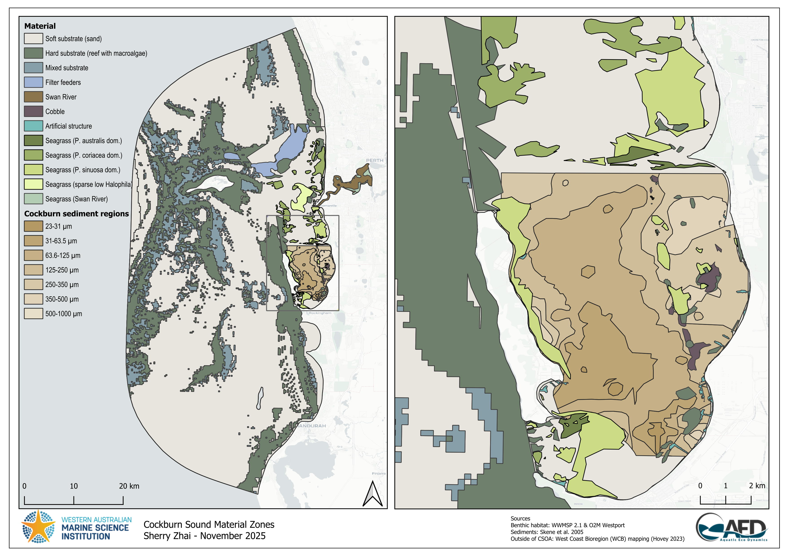

# B : Benthic Specification {#benthicapp}

The CSIEM platform has been designed to accommodate horizontal variation in benthic substrates. This is needed to be able to resolve:

-	the effect of bottom roughness on flow dynamics 
-	the variation of sediment properties, as relevant to sediment transport dynamics
-	variability in the dynamics of sediment biogeochemical processes.
-	the dynamics of bottom biotic communities, and their associated feedbacks to water column properties

Bottom properties are configured via setting of a) material zones and b) relevant benthic or sediment properties. This is done via loading shape files into a CSIEM simulation, and/or files with cell-specific BGC properties ("benthic_maps"). 

## Benthic mapping data sources

The CSIEM benthic substrate (material zone) maps are based on a combination of sediment and biotic data-sets. The two main biotic data-sets are:

-	WWMSP Theme 2.1 CSOA data product : recent benthic mapping as reported in Hovey et al. (2024)
-	O2M-Westport CSOA EIA data product: an updated benthic map with additional benthic categories to WWMSP 2.1 mapping. MORE INFO.

The main sediment/substrate data-set is:

-	Skene et al. (2005) : interpolated sediment size data from within CS

Since the available sediment physical and benthic habitat mapping in the above three mapping records is focused around the main Cockburn Sound and Owen Anchorage area, there are areas in the overall CSIEM domain that are do not have known habitat or substrate types. Therefore, additional datasets were considered including:

-	WC Bioregion survey : broadscale benthic habitat mapping product

## Benthic zone definition and layer descriptions 

The above raw data-sets require processing and merging before they are suitable for the CSIEM numerical model. Therefore, a synthesised product has been made for each fo the main CSOA benthic maps.

The benthic model is able to support layering such that default properties can be specified broadly across the domain, and where more accurate mapping data is available (i.e., within the main Cockburn Sound area) then these layers will supersede the defaults.  The layering adopted in this model is shown in Figure 4.3. 

Two map versions (WWMSP2.1 and WWMSP2.1-O2M-Westport merged) are available and can be selected during configuration. Note that the high resolution mapping of benthic habitats from the Hovey et al., 2024 and O2M-Westport data-set is smoothed, to simplify the complexity of the shapefile for alignment with the TUFLOW-FV mesh resolution. 

Depending on the mesh adopted, the layer information is translated to cell resolution accordingly, for example, as shown in Figure 4.4 for the three main types. 

...Link material ID numbers... to layer definitions, and epxlain how these IDs are used in benthic map scripts or in TUFLOW or in AED

### {.panelset .unnumbered}

#### WWMSP 2.1 {.unnumbered}

{width="6.597234251968504in" height="4.664740813648294in"}

**Figure 4.3-i**. CSIEM model domain and material zone settings based on WWMSP2.1 mapping. Left: whole model domain; Right: zoom-in view of Cockburn Sound.

#### WWMSP2.1-O2M-Westport merged {.unnumbered}

{width="6.301388888888889in" height="4.458333333333333in"}

**Figure 4.3-ii**. CSIEM model domain and material zone settings based on merged WWMSP2.1-O2M-Westport mapping. Left: whole model domain; Right: zoom-in view of Cockburn Sound.

{width="95%"}

**Figure 4.4.** Plan-view of CSIEM model benthic material types around the Cockburn Sound region in A (coarse), B (optimized), C (fine) options.

...  maps of benthic map variables (fs1, fs2, ...)

## Zone parameterisation 

A summary table of key parameters for each benthic zone is summarised in Table B.1.

+------------------+---------------------------------------------+-------------------------------------------------------------------------------------------------------------------------------------------+--------------------------------+---------------------+-------------------------------------------------------------------------------------------------+
| Material zone ID | Name                                        | Note                                                                                                                                      | Sediment Functional Zone ^(1)^ | Roughness (m) ^(2)^ | Sediment-Water flux (mmol/m^2^/day) ^(3)^                                                       |
+:================:+:===========================================:+:=========================================================================================================================================:+:==============================:+:===================:+:===========:+:===========:+:===========:+:===========:+:===========:+:===========:+:===========:+
|                  | ** **                                       | ** **                                                                                                                                     | ** **                          | ** **               | **Oxygen**  | **PO4**     | **NH4**     | **NO3**     | **DOC**     | **DON**     | **DOP**     |
+------------------+---------------------------------------------+-------------------------------------------------------------------------------------------------------------------------------------------+--------------------------------+---------------------+-------------+-------------+-------------+-------------+-------------+-------------+-------------+
| 1                | Default model domain background             | Not used, just captures any unallocated cells if shapefiles are do not fully overlap                                                      |                                | 0.02                | 0           | 0           | 0           | 0           | 0           | 0           | 0           |
+------------------+---------------------------------------------+-------------------------------------------------------------------------------------------------------------------------------------------+--------------------------------+---------------------+-------------+-------------+-------------+-------------+-------------+-------------+-------------+
| 16               | Swan River                                  | non-vegetated lower Swan estuary sediment                                                                                                 | Type 2: deep basin             | 0.004               | -40         | 0.08        | 0.4         | 1.3         | -52         | -5.2        | -0.4        |
+------------------+---------------------------------------------+-------------------------------------------------------------------------------------------------------------------------------------------+--------------------------------+---------------------+-------------+-------------+-------------+-------------+-------------+-------------+-------------+
| 21               | Cockburn (23-31)                            | sediment grain size (uM), from Skene et al (2005)                                                                                         | Type 2: deep basin             | 0.001               | -45         | 0.09        | 0.45        | 1.5         | -60         | -6          | -0.44       |
+------------------+---------------------------------------------+-------------------------------------------------------------------------------------------------------------------------------------------+--------------------------------+---------------------+-------------+-------------+-------------+-------------+-------------+-------------+-------------+
| 22               | Cockburn (31-63.5)                          | sediment grain size (uM), from Skene et al (2005)                                                                                         | Type 2: deep basin             | 0.002               | -40         | 0.08        | 0.4         | 1.3         | -52         | -5.2        | -0.4        |
+------------------+---------------------------------------------+-------------------------------------------------------------------------------------------------------------------------------------------+--------------------------------+---------------------+-------------+-------------+-------------+-------------+-------------+-------------+-------------+
| 23               | Cockburn (63.6-125)                         | sediment grain size (uM), from Skene et al (2005)                                                                                         | Type 2: deep basin             | 0.004               | -40         | 0.08        | 0.4         | 1.3         | -52         | -5.2        | -0.4        |
+------------------+---------------------------------------------+-------------------------------------------------------------------------------------------------------------------------------------------+--------------------------------+---------------------+-------------+-------------+-------------+-------------+-------------+-------------+-------------+
| 24               | Cockburn (125-250)                          | sediment grain size (uM), from Skene et al (2005)                                                                                         | Type 3: shelf + MPB            | 0.008               | -40         | 0.08        | 0.4         | 1.3         | -52         | -5.2        | -0.4        |
+------------------+---------------------------------------------+-------------------------------------------------------------------------------------------------------------------------------------------+--------------------------------+---------------------+-------------+-------------+-------------+-------------+-------------+-------------+-------------+
| 25               | Cockburn (250-350)                          | sediment grain size (uM), from Skene et al (2005)                                                                                         | Type 3: shelf + MPB            | 0.01                | -35         | 0.07        | 0.35        | 1.12        | -44.8       | -4.48       | -0.36       |
+------------------+---------------------------------------------+-------------------------------------------------------------------------------------------------------------------------------------------+--------------------------------+---------------------+-------------+-------------+-------------+-------------+-------------+-------------+-------------+
| 26               | Cockburn (350-500)                          | sediment grain size (uM), from Skene et al (2005)                                                                                         | Type 3: shelf + MPB            | 0.015               | -30         | 0.06        | 0.3         | 1           | -40         | -4          | -0.32       |
+------------------+---------------------------------------------+-------------------------------------------------------------------------------------------------------------------------------------------+--------------------------------+---------------------+-------------+-------------+-------------+-------------+-------------+-------------+-------------+
| 27               | Cockburn (500-1000)                         | sediment grain size (uM), from Skene et al (2005)                                                                                         | Type 3: shelf + MPB            | 0.02                | -25         | 0.05        | 0.25        | 0.8         | -32         | -3.2        | -0.24       |
+------------------+---------------------------------------------+-------------------------------------------------------------------------------------------------------------------------------------------+--------------------------------+---------------------+-------------+-------------+-------------+-------------+-------------+-------------+-------------+
| 59               | Artificial structure                        |                                                                                                                                           |                                | 0.2                 | 0           | 0           | 0           | 0           | 0           | 0           | 0           |
+------------------+---------------------------------------------+-------------------------------------------------------------------------------------------------------------------------------------------+--------------------------------+---------------------+-------------+-------------+-------------+-------------+-------------+-------------+-------------+
| 60               | Seagrass (Swan River)                       | *Halophila* dominant community                                                                                                            | Type 4: shelf + seagrass       | 0.1                 | -5          | -0.012      | -0.06       | -0.18       | 0           | 0           | 0           |
+------------------+---------------------------------------------+-------------------------------------------------------------------------------------------------------------------------------------------+--------------------------------+---------------------+-------------+-------------+-------------+-------------+-------------+-------------+-------------+
| 61               | Soft substrate (Sand)                       |                                                                                                                                           | Type 1: offshore               | 0.008               | -15         | 0.03        | 0.15        | 0.5         | -20         | -2          | -0.16       |
+------------------+---------------------------------------------+-------------------------------------------------------------------------------------------------------------------------------------------+--------------------------------+---------------------+-------------+-------------+-------------+-------------+-------------+-------------+-------------+
| 68               | Hard substrate (Reef with macroalgae)       |                                                                                                                                           |                                | 0.1                 | 0           | 0           | 0           | 0           | 0           | 0           | 0           |
+------------------+---------------------------------------------+-------------------------------------------------------------------------------------------------------------------------------------------+--------------------------------+---------------------+-------------+-------------+-------------+-------------+-------------+-------------+-------------+
| 70               | Mixed substrate                             |                                                                                                                                           |                                | 0.05                | -10         | -0.02       | -0.01       | -0.03       | 0           | 0           | 0           |
+------------------+---------------------------------------------+-------------------------------------------------------------------------------------------------------------------------------------------+--------------------------------+---------------------+-------------+-------------+-------------+-------------+-------------+-------------+-------------+
| 90               | Seagrass (*Amphibolis*)                     |                                                                                                                                           | Type 4: shelf + seagrass       | 0.1                 | -5          | -0.012      | -0.06       | -0.18       | 0           | 0           | 0           |
+------------------+---------------------------------------------+-------------------------------------------------------------------------------------------------------------------------------------------+--------------------------------+---------------------+-------------+-------------+-------------+-------------+-------------+-------------+-------------+
| 91               | Seagrass (*P australis* dominant community) | merged from categories \"P. australis\", \"P. australis Amphibolis\", \"P. australis P. sinuosa\", \"P. australis P. sinuosa Amphibolis\" | Type 4: shelf + seagrass       | 0.1                 | -5          | -0.012      | -0.06       | -0.18       | 0           | 0           | 0           |
+------------------+---------------------------------------------+-------------------------------------------------------------------------------------------------------------------------------------------+--------------------------------+---------------------+-------------+-------------+-------------+-------------+-------------+-------------+-------------+
| 92               | Seagrass (*P coriacea* dominant community)  | merged from categories \"P. coriacea\", \"P. coriacea Amphibolis\", \"P. coriacea Amphibolis with Halophila\"                             | Type 4: shelf + seagrass       | 0.1                 | -5          | -0.012      | -0.06       | -0.18       | 0           | 0           | 0           |
+------------------+---------------------------------------------+-------------------------------------------------------------------------------------------------------------------------------------------+--------------------------------+---------------------+-------------+-------------+-------------+-------------+-------------+-------------+-------------+
| 93               | Seagrass (*P sinuosa* dominant community)   | merged from categories \"P. sinuosa\", \"P. sinuosa Amphibolis\", \"P. sinuosa P. coriacea Amphibolis\"                                   | Type 4: shelf + seagrass       | 0.1                 | -5          | -0.012      | -0.06       | -0.18       | 0           | 0           | 0           |
+------------------+---------------------------------------------+-------------------------------------------------------------------------------------------------------------------------------------------+--------------------------------+---------------------+-------------+-------------+-------------+-------------+-------------+-------------+-------------+
| 94               | *Lyngbya*                                   | this may be updated at a later stage by Theme2.1 as it could be interspesed with ephemeral seagrass                                       | Type 4: shelf + seagrass       | 0.1                 | -5          | -0.012      | -0.06       | -0.18       | 0           | 0           | 0           |
+------------------+---------------------------------------------+-------------------------------------------------------------------------------------------------------------------------------------------+--------------------------------+---------------------+-------------+-------------+-------------+-------------+-------------+-------------+-------------+
| 95               | Cobble                                      |                                                                                                                                           | Type 3: shelf + MPB            | 0.1                 | -5          | -0.012      | -0.06       | -0.18       | 0           | 0           | 0           |
+------------------+---------------------------------------------+-------------------------------------------------------------------------------------------------------------------------------------------+--------------------------------+---------------------+-------------+-------------+-------------+-------------+-------------+-------------+-------------+

: Table B.1. Summary of benthic material zones and associated sediment functional zones, roughness, and sediment fluxes. Refer to Figure XX2.3 and XX2.4 for maps of material zone locations.

\(1\) the sediment functional zone is associated with the types specified in the sediment biogeochemistry model;

\(2\) For roughness, CSIEM used the \'ks\' bottom drag model, in which the values are \'equivalent Nikuradse roughness (m)\';

\(3\) The Sediment-Water flux settings are assumed maximum fluxes in each zone combining sediment survey data (Eyre et al., 2025) and relevant environmental factors. The final modelled fluxes are also subject to oxygen concentration (redox potential) and temperature within the bottom water.

## Workign with zones in CSIEM

### Inputting zone shapefiles

The zone specification within a CSIEM setup is in 

`model_components/gis_repo/2_benthic/materials/ ... `

### Creating zone-based AED benthic-map files

`model_components/gis_repo/2_benthic/ecology ... `

### Settign zone-based parameetrs

#### Zone-based hydrodynamic parameters

#### Zone-based biogeochemical parameters

