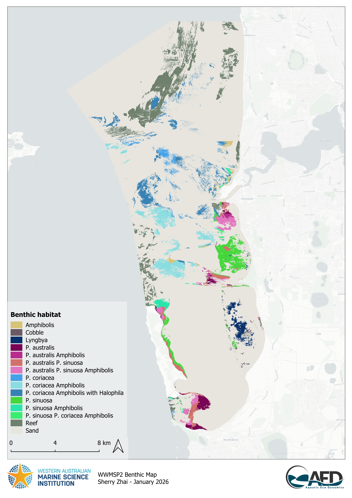
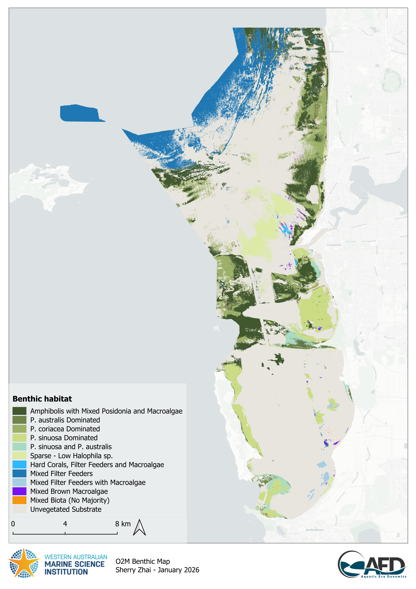
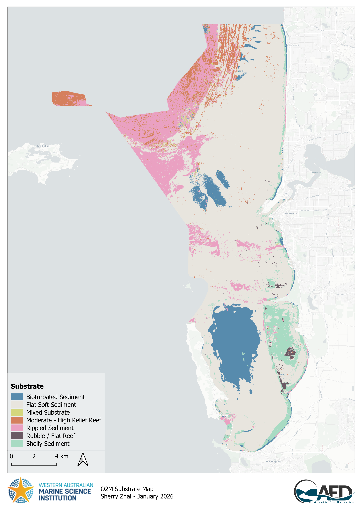
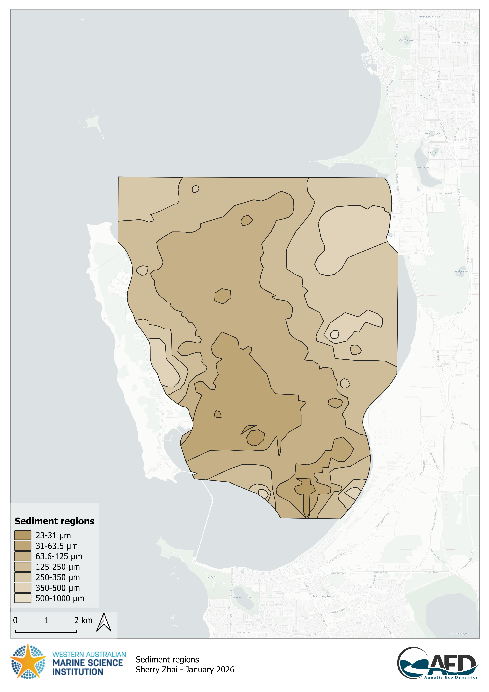
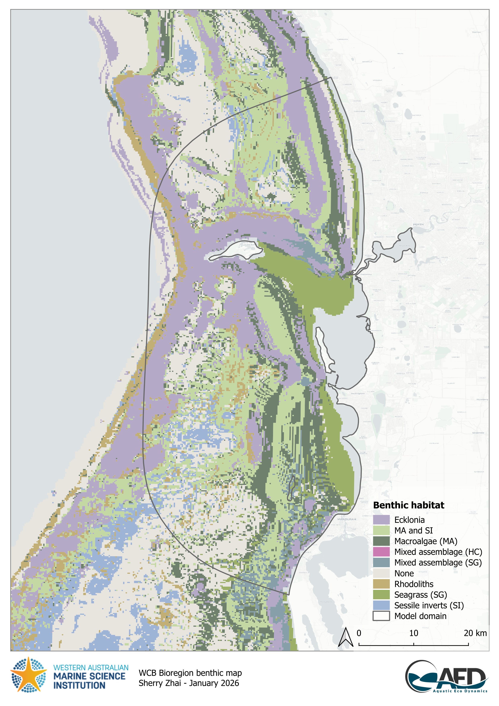
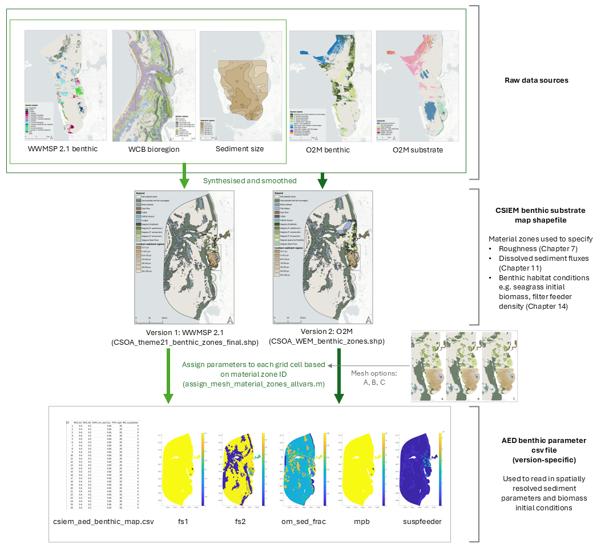
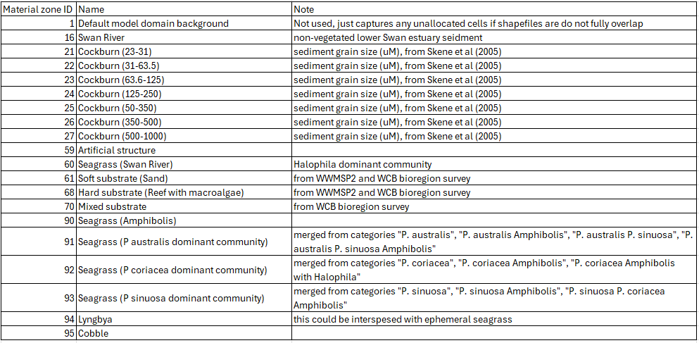
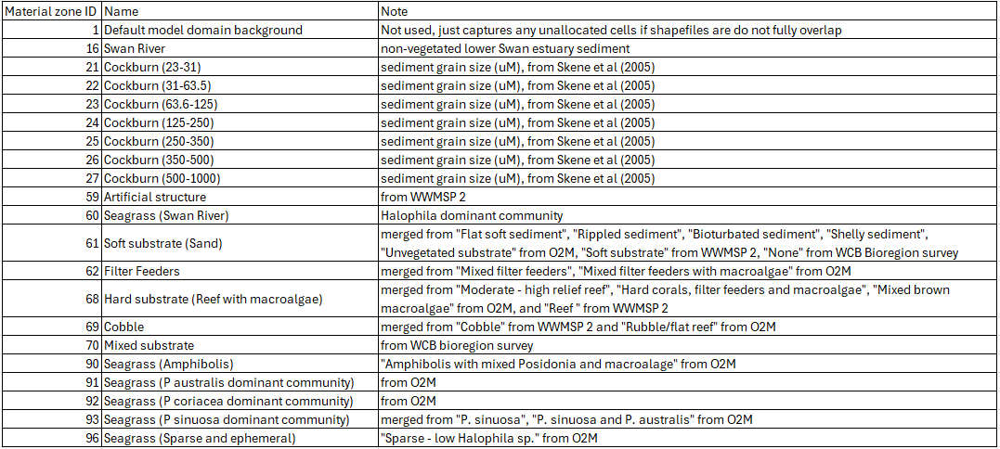

# B : Benthic Specification {#benthicapp}

The CSIEM platform has been designed to accommodate horizontal variation in benthic substrates. This is needed to be able to resolve:

-	the effect of bottom roughness on flow dynamics 
-	the variation of sediment properties, as relevant to sediment transport dynamics
-	variability in the dynamics of sediment biogeochemical processes.
-	the dynamics of bottom biotic communities, and their associated feedbacks to water column properties

Bottom properties are configured via setting of a) material zones and b) relevant benthic or sediment properties. This is done via loading shape files into a CSIEM simulation, and/or files with cell-specific BGC properties ("benthic_maps"). 

## Benthic mapping data sources

The CSIEM benthic substrate (material zone) maps are based on a combination of sediment and biotic data-sets. The two main biotic data-sets are:

-	WWMSP Theme 2.1 CSOA data product : recent benthic mapping as reported in Hovey *et al.* (2025) (Figure B.1) 
-	O2M-Westport CSOA EIA data product: an updated benthic map with additional benthic categories to WWMSP 2.1 mapping, including filter feeders and sparse/ephemeral seagrass. The classification of several dominant seagrass communities in this map differs to the WWMSP2.1 mapping (Figure B.2). This product also includes a separate substrate map (abiotic)(Figure B.3).

The main sediment/substrate data-set is:

-	Skene *et al.* (2005) : interpolated sediment size data from within CS (Figure B.4)

Since the available sediment physical and benthic habitat mapping in the above three mapping records is focused around the main Cockburn Sound and Owen Anchorage area, there are areas in the overall CSIEM domain that are do not have known habitat or substrate types. Therefore, additional datasets were considered including:

-	WC Bioregion survey : broadscale benthic habitat mapping product (Figure B.5)

{width="4.664740813648294in" height="6.597234251968504in"}

**Figure B.1**. WWMSP Theme 2.1 CSOA benthic habitat map.

{width="4.664740813648294in" height="6.597234251968504in"}

**Figure B.2**. O2M-Westport CSOA EIA benthic habitat map.

{width="4.664740813648294in" height="6.597234251968504in"}

**Figure B.3**. O2M-Westport CSOA EIA substrate map.

{width="4.664740813648294in" height="6.597234251968504in"}

**Figure B.4**. Sediment size map within CS.

{width="4.664740813648294in" height="6.597234251968504in"}

**Figure B.5**. WCB bioregion benthic map.

## Benthic zone definition and layer descriptions 

The above raw data-sets require processing and merging before they are suitable for the CSIEM numerical model. Therefore, a synthesised product has been made for each of the main CSOA benthic maps (Figure B.6).

The benthic model is able to support layering such that default properties can be specified broadly across the domain, and where more accurate mapping data is available (i.e., within the main Cockburn Sound area) then these layers will supersede the defaults.  The layering adopted in this model is shown in Figure B.7. 

Two map versions (WWMSP2 and O2M) are available and can be selected during configuration. Note that the high resolution mapping of benthic habitats from the Hovey *et al.*, 2025 and O2M-Westport data-set is smoothed, to simplify the complexity of the shapefile for alignment with the TUFLOW-FV mesh resolution. 

Depending on the mesh adopted, the layer information is translated to cell resolution accordingly, for example, as shown in Figure B.8 for the three main types. 

Each benthic layer/type in the shapefile has a unique ID (material zone ID, Table B.1) which can be used by TUFLOW-AED for model parameter configurations, or used by matlab scripts for processing (e.g. creating the AED benthic variable parameter csv by assigning parameters to each grid cell based on the zone ID it falls in using assign_mesh_material_zones_allvars.m, Figure B.6). 

{width="6.597234251968504in" height="6.597234251968504in"}

**Figure B.6**. Workflow illustrating how raw benthic datasets were synthesised and used to parameterise the spatially resolved model.


### {.panelset .unnumbered}

#### WWMSP 2.1 {.unnumbered}

{width="6.597234251968504in" height="4.664740813648294in"}

**Figure B.7-i**. CSIEM model domain and material zone settings based on WWMSP2.1 mapping. Left: whole model domain; Right: zoom-in view of Cockburn Sound.

#### WWMSP2.1-O2M merged {.unnumbered}

{width="6.597234251968504in" height="4.664740813648294in"}

**Figure B.7-ii**. CSIEM model domain and material zone settings based on merged WWMSP2.1-O2M mapping. Left: whole model domain; Right: zoom-in view of Cockburn Sound.

### { .unnumbered}

{width="95%"}

**Figure B.8.** Plan-view of CSIEM model benthic material types around the Cockburn Sound region in A (coarse), B (optimized), C (fine) options.


### {.panelset .unnumbered}

#### WWMSP 2.1 {.unnumbered}

{width="6.597234251968504in" height="4.664740813648294in"}

**Table B.1-i**.  Material zone IDs for benthic habitat types based on WWMSP2.1 mapping.

#### WWMSP2.1-O2M merged {.unnumbered}

{width="6.597234251968504in" height="4.664740813648294in"}

**Table B.1-ii**.  Material zone IDs for benthic habitat types based on WWMSP2.1-O2M mapping.


## Zone parameterisation 


A summary table of key parameters for each benthic zone is summarised in Table B.2.

**Table B.2.** Summary of benthic material zones and associated sediment functional zones, roughness, and sediment fluxes. Refer to Figure B.7 and Figure B.8 for maps of material zone locations.

```{r tbl-b2, echo=FALSE}
library(kableExtra)
tbl_b2 <- data.frame(
  ID   = c(1, 16, 21, 22, 23, 24, 25, 26, 27, 59, 60, 61, 68, 70, 90, 91, 92, 93, 94, 95),
  Name = c(
    "Default model domain background",
    "Swan River",
    "Cockburn (23\u201331)",
    "Cockburn (31\u201363.5)",
    "Cockburn (63.6\u2013125)",
    "Cockburn (125\u2013250)",
    "Cockburn (250\u2013350)",
    "Cockburn (350\u2013500)",
    "Cockburn (500\u20131000)",
    "Artificial structure",
    "Seagrass (Swan River)",
    "Soft substrate (Sand)",
    "Hard substrate (Reef with macroalgae)",
    "Mixed substrate",
    "Seagrass (<em>Amphibolis</em>)",
    "Seagrass (<em>P. australis</em> dominant community)",
    "Seagrass (<em>P. coriacea</em> dominant community)",
    "Seagrass (<em>P. sinuosa</em> dominant community)",
    "<em>Lyngbya</em>",
    "Cobble"
  ),
  Note = c(
    "Captures unallocated cells if shapefiles do not fully overlap",
    "Non-vegetated lower Swan estuary sediment",
    "Sediment grain size (\u00b5m), from Skene *et al.* (2005)",
    "Sediment grain size (\u00b5m), from Skene *et al.* (2005)",
    "Sediment grain size (\u00b5m), from Skene *et al.* (2005)",
    "Sediment grain size (\u00b5m), from Skene *et al.* (2005)",
    "Sediment grain size (\u00b5m), from Skene *et al.* (2005)",
    "Sediment grain size (\u00b5m), from Skene *et al.* (2005)",
    "Sediment grain size (\u00b5m), from Skene *et al.* (2005)",
    "",
    "<em>Halophila</em> dominant community",
    "",
    "",
    "",
    "",
    "Merged from <em>P. australis</em>, <em>P. australis Amphibolis</em>, <em>P. australis P. sinuosa</em>, <em>P. australis P. sinuosa Amphibolis</em>",
    "Merged from <em>P. coriacea</em>, <em>P. coriacea Amphibolis</em>, <em>P. coriacea Amphibolis</em> with <em>Halophila</em>",
    "Merged from <em>P. sinuosa</em>, <em>P. sinuosa Amphibolis</em>, <em>P. sinuosa P. coriacea Amphibolis</em>",
    "Interspersed with ephemeral seagrass",
    ""
  ),
  SFZ = c(
    "", "Type 2: deep basin",
    "Type 2: deep basin", "Type 2: deep basin", "Type 2: deep basin",
    "Type 3: shelf + MPB", "Type 3: shelf + MPB", "Type 3: shelf + MPB", "Type 3: shelf + MPB",
    "",
    "Type 4: shelf + seagrass",
    "Type 1: offshore",
    "", "",
    "Type 4: shelf + seagrass", "Type 4: shelf + seagrass", "Type 4: shelf + seagrass",
    "Type 4: shelf + seagrass", "Type 4: shelf + seagrass",
    "Type 3: shelf + MPB"
  ),
  Roughness = c(0.02, 0.004, 0.001, 0.002, 0.004, 0.008, 0.01, 0.015, 0.02, 0.2,
                0.1, 0.008, 0.1, 0.05, 0.1, 0.1, 0.1, 0.1, 0.1, 0.1),
  Oxygen = c(0, -40, -45, -40, -40, -40, -35, -30, -25, 0, -5, -15, 0, -10, -5, -5, -5, -5, -5, -5),
  PO4    = c(0, 0.08, 0.09, 0.08, 0.08, 0.08, 0.07, 0.06, 0.05, 0, -0.012, 0.03, 0, -0.02, -0.012, -0.012, -0.012, -0.012, -0.012, -0.012),
  NH4    = c(0, 0.4, 0.45, 0.4, 0.4, 0.4, 0.35, 0.3, 0.25, 0, -0.06, 0.15, 0, -0.01, -0.06, -0.06, -0.06, -0.06, -0.06, -0.06),
  NO3    = c(0, 1.3, 1.5, 1.3, 1.3, 1.3, 1.12, 1, 0.8, 0, -0.18, 0.5, 0, -0.03, -0.18, -0.18, -0.18, -0.18, -0.18, -0.18),
  DOC    = c(0, -52, -60, -52, -52, -52, -44.8, -40, -32, 0, 0, -20, 0, 0, 0, 0, 0, 0, 0, 0),
  DON    = c(0, -5.2, -6, -5.2, -5.2, -5.2, -4.48, -4, -3.2, 0, 0, -2, 0, 0, 0, 0, 0, 0, 0, 0),
  DOP    = c(0, -0.4, -0.44, -0.4, -0.4, -0.4, -0.36, -0.32, -0.24, 0, 0, -0.16, 0, 0, 0, 0, 0, 0, 0, 0),
  check.names = FALSE
)
names(tbl_b2) <- c("Zone ID", "Name", "Note",
                    "Sediment Functional Zone<sup>1</sup>",
                    "Roughness (m)<sup>2</sup>",
                    "Oxygen", "PO4", "NH4", "NO3", "DOC", "DON", "DOP")
kbl(tbl_b2,
    align = "rllllrrrrrrr", escape = FALSE) %>%
  row_spec(0, background = "#14759e", bold = TRUE, color = "white") %>%
  add_header_above(c(" " = 5, "Sediment\u2013water flux (mmol m\u207b\u00b2 d\u207b\u00b9)<sup>3</sup>" = 7),
                   background = "#14759e", color = "white", bold = TRUE, escape = FALSE) %>%
  kable_styling(full_width = TRUE, font_size = 10) %>%
  scroll_box(width = "100%") %>%
  footnote(number = c(
    "The sediment functional zone is associated with the types specified in the sediment biogeochemistry model.",
    "For roughness, CSIEM uses the <em>k<sub>s</sub></em> bottom drag model; values are equivalent Nikuradse roughness (m).",
    "Sediment\u2013water flux settings are assumed maximum fluxes combining sediment survey data (Eyre *et al.*, 2025) and relevant environmental factors. Final modelled fluxes are also subject to oxygen concentration (redox potential) and temperature within the bottom water."
  ), footnote_as_chunk = TRUE, escape = FALSE)
```


## Working with zones in CSIEM

The theory and rationale behind benthic zone definitions are described above. This section provides a practical guide for users who need to configure, modify, or extend the zone-based parameterisation within a CSIEM simulation. The relevant files are organised within the model repository:

```
csiem_model_tfvaed_1.7/
├── model_components/
│   ├── gis_repo/
│   │   └── 2_benthic/
│   │       ├── materials/      ← zone shapefiles
│   │       └── ecology/        ← benthic-map CSVs
│   └── includes/
│       ├── roughness/          ← zone-based roughness FVC files
│       ├── wq/                 ← AED config (aed.nml, sedflux, parameter CSVs)
│       └── wq-eco/             ← extended ecology config
└── model_runs/
    └── WQ/                     ← simulation control files (.fvc)
```


### Inputting zone shapefiles

Material zone shapefiles define the spatial extent of each benthic zone across the model domain. They are stored in:

`model_components/gis_repo/2_benthic/materials/`

Available shapefiles include:

- `CSOA_theme21_benthic_zones_final.shp` — zones based on the WWMSP Theme 2.1 benthic mapping
- `CSOA_WEM_benthic_zones.shp` — zones based on the merged WWMSP 2.1 and O2M-Westport mapping
- `CSOA_Ranae_SGspp_merged_reorder.shp` — merged product with seagrass species-level resolution

Each polygon in a shapefile carries a material zone ID (as listed in Table B.2). The shapefile is loaded into a simulation via the `Read GIS Mat` command in the TUFLOW-FV control file (`.fvc`):

```
! Material zones:
Read GIS Mat == ../../model_components/gis_repo/2_benthic/materials/CSOA_WEM_benthic_zones.shp
```

When TUFLOW-FV reads the mesh, each cell is assigned the material zone ID of the polygon it falls within. This ID is then used by both the hydrodynamic and biogeochemical model components to look up zone-specific parameters.


### Creating zone-based AED benthic-map files

Benthic-map CSV files provide cell-level parameter values for AED biogeochemical variables. They are stored in:

`model_components/gis_repo/2_benthic/ecology/`

Each CSV has one row per mesh cell (e.g. ~30,000 rows for the B010 mesh) with columns specifying parameter values:

```
ID, NCS_fs1, NCS_fs2, OGM_om_sed_frac, PHY_mpb, BIV_suspfeeder
1,  0.4,     0.5,     0.06,            20,      0
2,  0.4,     0.5,     0.06,            20,      0
...
```

The `ID` column corresponds to the mesh cell index (not the material zone ID). Parameter values for each cell are typically derived from the material zone the cell belongs to, using the MATLAB script `assign_mesh_material_zones_allvars.m` (Figure B.6), which maps zone IDs to cell-level values.

The benthic-map file is referenced within the AED configuration file (`aed.nml`):

```
init_values_file = '../../model_components/gis_repo/2_benthic/ecology/csiem_aed_benthic_map_B010_wq.csv'
```

File naming follows the convention `csiem_aed_benthic_map_{mesh}_{type}.csv`, where `{mesh}` identifies the grid resolution (e.g. A002 = coarse, B010 = optimised, C001 = fine) and `{type}` indicates the configuration variant (e.g. `wq`, `ECO`, `csiem20_MPB`).


### Setting zone-based parameters

#### Zone-based hydrodynamic parameters

Bottom roughness is the primary hydrodynamic parameter that varies by material zone. Roughness files are stored in:

`model_components/includes/roughness/`

Each `.fvc` file specifies the Nikuradse roughness length (`bottom roughness`, in metres) per material zone using a block structure:

```
material == 1    ! Default, and Deep Water
  bottom roughness == 0.02
  spatial reconstruction == 0
end material

material == 21   ! CS GS 1 23-31
  bottom roughness == 0.001
  spatial reconstruction == 1
end material
```

The roughness file is included in the simulation control file via:

```
include == ../../model_components/includes/roughness/CSOA_WEM_material_zones.fvc
```

The `spatial reconstruction` setting (0 or 1) controls the order of spatial accuracy for each zone, with first-order reconstruction (== 1) typically enabled for zones within the area of interest. For guidance on roughness values by habitat type, refer to Table B.2.

#### Zone-based biogeochemical parameters

Sediment--water fluxes are specified per material zone within the `&aed_sedflux` namelist block in `aed.nml`. The `active_zones` array lists all material zone IDs, and each flux variable (e.g. `Fsed_oxy`, `Fsed_amm`, `Fsed_nit`) is an array of the same length, with values corresponding positionally to the zone list:

```
&aed_sedflux
  sedflux_model = 'Constant2D'
  active_zones  = 1, 16, 61, 62, 68, 69, 70, 21, 22, ...
  Fsed_oxy      = 0, -40, -15, -20, -5, 0, -10, -42, -39, ...
  Fsed_amm      = 0, 0.55, 0.15, 0.15, 0, 0, -0.01, 0.49, 0.44, ...
  Fsed_nit      = 0, 1.3, 0.5, 0.5, 0, 0, -0.03, 0.75, 0.72, ...
/
```

A standalone CSV version of these settings is also maintained in `aed_sedflux.csv` for reference and scripted workflows.

Additional cell-level BGC parameters — such as sediment nitrogen fractions (`NCS_fs1`, `NCS_fs2`), organic matter fractions (`OGM_om_sed_frac`), microphytobenthos biomass (`PHY_mpb`), and filter-feeder density (`BIV_suspfeeder`) — are supplied via the benthic-map CSV described above. These values can be modified either by editing the CSV directly, or by re-running the zone-to-cell assignment script with updated zone parameter tables.


