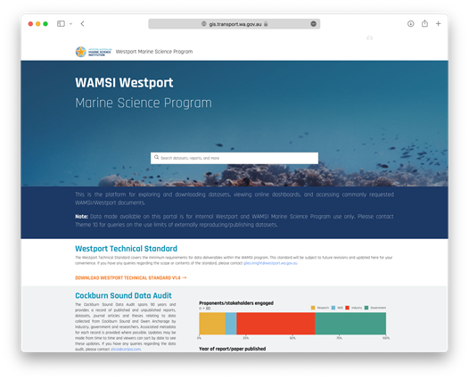
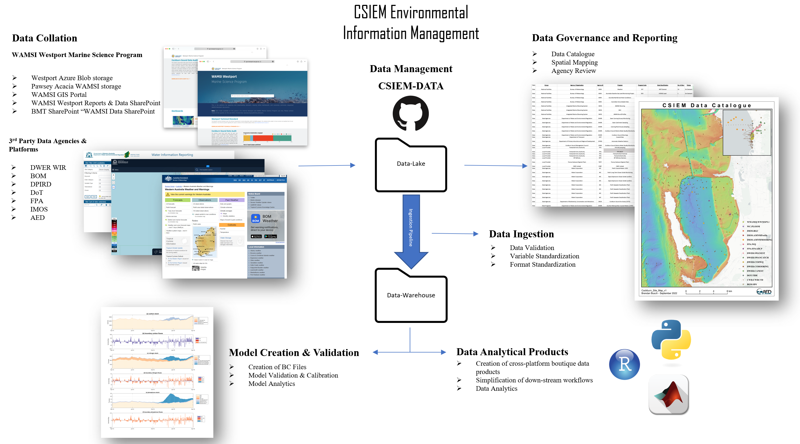
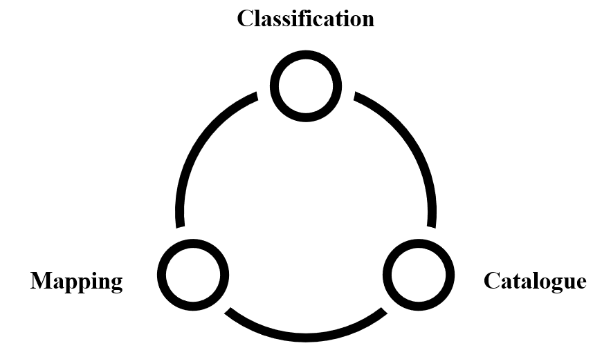
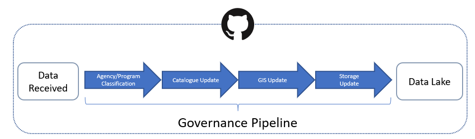

# Cockburn Environmental Data


## Background/Context

-	Diverse data
-	Challenge to integrate model and obs datasets in organised way


## Relevant data management initiatives

Various information management activities are active and relevant to Cockburn Sound Environmental Management. These include:


###	Microsoft Azure Blob Storage {.unnumbered}

The Azure Blob Storage was set up by Westport as a location for WAMSI Westport Marine Science Program data to be stored, and in some cases, historical data. This storage option is suitable for medium to large sized data (1 - 100GB) e.g., raster bathymetry data. Access to the Azure Blob Storage is available to Westport staff and selected WAMSI Theme 10 data team members. Data and reports will become accessible for viewing and downloading only to all involved in the WAMSI Westport Marine Science Program and Westport Office through links with the WAMSI GIS portal.  


```{r data-pic1, echo = FALSE, out.width='100%', class = "text-image", fig.cap = "Microsoft Azure Blob Storage."}

knitr::include_graphics("images/cdm/blob.png")

```

###	WAMSI GIS Portal {.unnumbered}

The WAMSI GIS Portal is a Westport ArcGIS managed website that acts as a navigation centre for researchers accessing commonly requested datasets and documents, both historical and provided under the WAMSI Westport Marine Science Program. The home page is intended to provide summary information and search functionality and will be the default landing page when researchers log into their Westport ArcGIS accounts. Information such as the most up to date Cockburn Sound data audit, Theme 10 workshop slides and Westport Technical Standards can be found here. Contrary to appearance, the WAMSI Portal does not ‘host’ data - rather, it provides searchable listings that link to data and reports stored on one of the four data stores: Westport SDE (Spatial Database Engine), Azure Blob Storage, WAMSI Sharepoint (mentioned above), Pawsey Acacia Storage. 

```{r data-pic2, echo = FALSE, out.width='100%', class = "text-image", fig.cap = "WAMSI GIS Portal."}



```


###	WAMSI Sharepoint – title: “WAMSI Westport Reports and Data Sharepoint” {.unnumbered}

WAMSI set up a Microsoft Sharepoint page to store historical Cockburn Sound data and reports acquired from proponents. Some of the data and reports and copied across from the BMT Sharepoint page, and others are obtained outside of BMT. Small datasets collected under the current WAMSI Westport Marine Science Program may also be stored here. The data and reports are sorted under a folder structure with the first folder division being ‘Open access use’ or ‘WAMSI Westport use’. Data and reports are then organised by proponent/organisation -> year -> report title. Document and folder URLs from the WAMSI Sharepoint will be linked to the WAMSI GIS portal to become searchable by WAMSI Westport Marine Science Program researchers and the Westport Office. The WAMSI Sharepoint is currently accessible to WAMSI staff and selected Theme 10 data team members, and will become accessible (view and download only) to all involved in the WAMSI Westport Marine Science Program and Westport Office through links with the WAMSI GIS portal. 


###	Pawsey Acacia Storage {.unnumbered}

The Pawsey Acacia Storage is intended for the largest of datasets (100s-1000s GB) sourced from external proponents or the WAMSI Westport Marine Science Program e.g. Theme 5's ROMs model output. Access to the Pawsey Acacia Storage is available to Westport staff and selected WAMSI Theme 10 data team members. Data will become accessible for viewing and downloading only to all involved in the WAMSI Westport Marine Science Program and Westport Office through links with the WAMSI GIS portal.   

```{r data-pic3, echo = FALSE, out.width='100%', class = "text-image", fig.cap = "Pawsey Acacia Storage."}

knitr::include_graphics("images/cdm/Acacia.png")

```

###	BMT Sharepoint – title: “WAMSI Data SharePoint” {.unnumbered}

BMT Commercial Australia Pty Ltd (BMT, previously Oceanica) is a large and established consultancy that monitors and collects marine and coastal data within Cockburn Sound for a variety of proponents, particularly Fremantle Ports, Water Corporation and Cockburn Cement Limited. BMT was engaged by WAMSI as they hold proponent’s data and are best placed to share data with WAMSI once sharing permissions are received from proponents. BMT set up a Microsoft Sharepoint page that contains a catalogue of reports and data held by BMT, data sharing license agreements from proponents, and requested reports and data related to the data sharing license agreements. WAMSI then migrates the approved reports and data across to a WAMSI Sharepoint. Access to the BMT Sharepoint has been provided to selected Theme 10 data team members and BMT staff. BMT also set up restricted access folders within the BMT Sharepoint for major proponents to easily review their reports prior to giving access to WAMSI. WAMSI Theme 10 data team members can not access these restricted proponent folders. 


##  CSIEM Environmental Information Management 

So why is another information management framework/standard needed? This document summaries a synthesis of the above into a CSIEM Environmental Information Management set of standards and workflows.

-	Support a federation of datasets
-	Document a standard way to organise obs and modelled data, using standard metadata and workflow setup


This will provide:

- Entry point for new data generators
- Standards for data users
- Developed compiled data products for ease of use 
- Facilitate model and data integration for visualisation and analytics

CSIEM Environmental Information Management can be viewed as three separate systems: 

-	Data Collation 
-	Data Governance & Reporting 
-	Data Integration 

```{r data-pic4, echo = FALSE, out.width='100%', class = "text-image", fig.cap = "CSIEM Environmental Information Management Overview."}



```

###    Data Collation

Data that is sourced and collated from various government agencies, researchers and industry groups is stored in the data lake (see section 3.3.3) in their raw format.  Each data provider is assigned a unique agency and program identifiers. Raw data is stored in a rigid folder structure based on these two identifiers (Agency/Program/...).

```{r data-pic5, echo = FALSE, out.width='100%', class = "text-image", fig.cap = "Data flow into the date lake."}

knitr::include_graphics("images/cdm/data_collation.png")

```

Data stored within the data lake is not formatted or processed in any way. Removal of duplicated and depeciated datasets is handled by the ETL (__"Extract, Transform, Load"__) pipelines outlined in secion 3.3.3. As such, strict data governance is required to maintain control and understanding of the contents of the data lake.

###    Data Governance

Data Governance is the process of managing the availablity and usablity of data within the **CSIEM Environmental Information Management** system. Governance can be loosely broken up into three key areas:

- Classsification
- Catalogue
- Mapping

<!--
```{r data-pic6, echo = FALSE, out.width='100%', class = "text-image", fig.cap = "Data Governance."}



```
-->
Each area has been designed to allow the users of the system to quickly understand the avalaiable data contained within the lake, the extents that data covers, as well as identify areas of missing or poor data.

```{r data-pic7, echo = FALSE, out.width='100%', class = "text-image", fig.cap = "Data Governance."}



```

####   Classification

Each dataset that is added to the data lake is classified with a standard set of attributes (see section 3.3.2.2), the three most important being:

- Agency
- Program
- Data Type

In order to maintain the usability of the data lake, given it's unstructured nature, it's important to ensure consistancy when deciding where a particular dataset is to be stored. In the CSIEM Environmental Information Management system, all raw data is stored in the strict folder stucture ``agencycode/programcode``. If a particular agency program is unknown, a program code will be assigned during the cataloguing proceedure.

Each dataset is also given a specific data catagory to facilitate user searches and downstream conversions.  Data is categorised in the general areas of :

+ *Bathymetry*
+ *Meteorology*
+ *Hydrology*
+ *Water Quality*
+ *Sediment*
+ *Biota*


These are defined into sub-categories, as outlined in Table \@ref(tab:data-classes).

<br>

```{r data-classes, echo=FALSE, message=FALSE, warning=FALSE}
library(knitr)
library(kableExtra)
library(readxl)
library(rmarkdown)
theSheet <- read_excel('tables/CDM_Classes.xlsx', sheet = 2)
theSheet <- theSheet[theSheet$Table == "Data",]
theSheetGroups <- unique(theSheet$Group)

kbl(theSheet[,3:4], caption = "CSIEM Data Classification", align = "l",) %>%

row_spec(0, background = "#002B4D", bold = TRUE, color = "white") %>%
  kable_styling(full_width = T,font_size = 10) %>%
    scroll_box(fixed_thead = FALSE)
```

<br>

####   Catalogue

All data entering the sytem is recording in the CSIEM_Data_Catalogue.xlsx spreadsheet found the data-lake directory in the cseim-data github repository.


<br>
```{r datacatalogue, echo=FALSE, message=FALSE, warning=FALSE}
library(knitr)
library(kableExtra)
library(readxl)
library(rmarkdown)
theSheet <- read_excel('tables/CSIEM_Data_Catalogue_Extract.xlsx', sheet = 1)
theSheet <- theSheet[theSheet$Table == "Data",]
theSheetGroups <- unique(theSheet$Group)
kbl(theSheet[,2:10], caption = "CSIEM Data Catalogue", align = "l",) %>%
  pack_rows(theSheetGroups[1],
            min(which(theSheet$Group == theSheetGroups[1])),
            max(which(theSheet$Group == theSheetGroups[1])),
            background = '#ebebeb') %>%
  pack_rows(theSheetGroups[2],
            min(which(theSheet$Group == theSheetGroups[2])),
            max(which(theSheet$Group == theSheetGroups[2])),
            background = '#ebebeb') %>%
  pack_rows(theSheetGroups[3],
					  min(which(theSheet$Group == theSheetGroups[3])),
					  max(which(theSheet$Group == theSheetGroups[3])),
					  background = '#ebebeb') %>%
row_spec(0, background = "#002B4D", bold = TRUE, color = "white") %>%
  kable_styling(full_width = T,font_size = 10) %>%
    scroll_box(fixed_thead = FALSE)
```

<br>


####   Mapping

Independant GIS files are produced for each dataset added to the data lake. Not only does this allow for ease of mapping and visualisation, it serves as an important cross check of the ingestion pipelines and any co-ordinate system conversions that have occurred within the pipeline.

Each dataset has a corresponding csv file saved within the ``data-mapping`` directory of the csiem-data, with the file name corresponding the the agencycode/programcode outlined above.

<br>

```{r data-mapping, echo=FALSE, message=FALSE, warning=FALSE}
library(knitr)
library(kableExtra)
library(readxl)
library(rmarkdown)
theSheet <- read_excel('tables/DOT_TIDE.xlsx', sheet = 1)
theSheet <- theSheet[theSheet$Table == "Data",]
theSheetGroups <- unique(theSheet$Group)

kbl(theSheet[,2:10], caption = "Example GIS file for data-mapping", align = "l",) %>%

row_spec(0, background = "#002B4D", bold = TRUE, color = "white") %>%
  kable_styling(full_width = T,font_size = 10) %>%
    scroll_box(fixed_thead = FALSE)
```

<br>

<!---
```{r data-pic8, echo = FALSE, out.width='100%', class = "text-image", fig.cap = "Site Map"}

knitr::include_graphics("images/cdm/CSIEM_Site_Map_v1.png")

```
--->

```{r echo=FALSE, message=FALSE, warning=FALSE}
library(leaflet)
library(leafem)
library(magrittr)
library(leaflet.extras)
library(htmlwidgets)
library(fontawesome)
library(sf)

# Combine CSV files into one data frame
for (data in list.files("maps/csiem_data/Obs")){
  
  if (!exists("dataset")){
    dataset <- read.csv(paste0("maps/csiem_data/Obs/",data), header=TRUE)
  }
  
  if (exists("dataset")){
    tempory <-read.csv(paste0("maps/csiem_data/Obs/",data), header=TRUE)
    dataset <-unique(rbind(dataset, tempory))
    rm(tempory)
  }
}

tfv <- sf::st_read("maps/csiem_data/Models/tfv_cockburn.geojson",quiet = TRUE)
plt <- sf::st_read("maps/csiem_data/Models/plotting_regions.geojson",quiet = TRUE)

dataset$colour <- NA
dataset$agencyLegend <- NA

colours <- c("#66c2a5", "#fc8d62", "#8da0cb", "#e78ac3", "#a6d854", "#ffd92f", "#e5c494", "#b3b3b3")
agency <- unique(dataset$Agency.ID)

for(i in 1:length(agency)){
  dataset[dataset[["Agency.ID"]]==agency[i],10] <- colours[i]
  dataset[dataset[["Agency.ID"]]==agency[i],11] <- paste0(agency[i], " <div style='position: relative; display: inline-block' class='circle'>",fa(name="circle", fill=colours[i]),"</div>")
}

leaflet::leaflet() %>% 
  leaflet::addPolygons(
    data = tfv,
    group = "TUFLOW",
    color = "#e41a1c",
    fillColor = "#e41a1c",
    opacity = 0.7,
    fillOpacity = 0.7,
    weight = 0,
    label = "TUFLOW Model Boundary"
  ) %>% 
  leaflet::addPolygons(
    data = plt,
    group = "PLOTTING",
    color = "#8da0cb",
    fillColor = "#8da0cb",
    opacity = 0.7,
    fillOpacity = 0.7,
    weight = 0,
    label = "PLotting Regions"
  ) %>% 
  leaflet::addCircleMarkers(
    data = dataset, 
    lat = dataset$Lat, 
    lng = dataset$Lon,
    fillColor = dataset$colour,
    group = dataset$agencyLegend,
    color = "black",
    opacity = 0.2,
    fillOpacity = 1,
    radius = 4,
    weight = 1,
    label = dataset$Program,
    popup = paste(
      paste0("<b>",dataset$Agency,"</b>"),
      "<br>",
      "Program: ", dataset$Program,
       "<br>",
      "Data Classification: ", dataset$Data.Classification,
      "<br>",
      "Station ID: ", dataset$Station.ID
      )
    ) %>% 
  leaflet::addLayersControl(
    baseGroups = c("None", "TUFLOW","PLOTTING"),
    overlayGroups = dataset$agencyLegend,
    options = leaflet::layersControlOptions(collapsed = FALSE)
  ) %>% 
  leafem::addLogo(
    img = "aed.png", # This image needs to be in /docs 
    src = "remote",
    position = "bottomleft",
    width = 120,
    height = 47.76,
    offset.x = 10
    ) %>% 
  leaflet::setView( 
    lng = 115.72447,
    lat = -32.20063, 
    zoom = 9
    ) %>%
  leaflet.extras::addFullscreenControl() %>% 
  leaflet::addProviderTiles(providers$CartoDB.Positron) %>% 
  htmlwidgets::onRender("          
        function() {
            $('.leaflet-control-layers-overlays').prepend('<label style=\"text-align:center\"><b>Agencies</b></label>');
            $('.leaflet-control-layers-list').prepend('<label style=\"text-align:center\"><b>Model<br>Boundaries</b></label>');
        }
    ") %>% 
   htmlwidgets::onRender("
    function(el, x) {
      this.on('baselayerchange', function(e) {
        e.layer.bringToBack();
      })
    }
  ")


```

###    Data Integration

The CSIEM Environmental Information Management system ustilised a **Data Lake** --> **Data Warehouse** data management system, driven via customise batch **ETL** functions, triggered via GitHub actions.  This system was implimented due to both the vast array of raw data inputs into the project, as well as the diverse data analyical demands required across different agences and platforms.


#### GitHub

GitHub is a cloud based git repository service, with enterprise level version control and tracking. It has been chosen as the central repository for the data and the pipeline functions based upon it's maturity as a platform, as well as it's widespread adoption within industry and academia. 

The csiem-data repository can be viewed and cloned [here](https://github.com/AquaticEcoDynamics/csiem-data)


#### Data Lake

A **Data Lake** is simply a centralised store of raw, disparate datasets, be it structured or unstructured. Centralising and cataloguing this raw data allows for customised **ETL** processes to be constructed that can be tailored to each analytics usecase, as opposed to forcing the data into a __one size fits all__ structure.

However, because the data is primarily being stored in it's raw format, goverance beomes extremely important so that data assests are not lost in the lake.


#### Data Warehouse

The **Data Warehouse** is the store of boutique, costomised data products produced through the batch **ETL (Extract, Transform and Load)** pipelines. Each folder within the ``data-warehouse`` directory on GitHub contains processed data in different formats, based upon end user requirements. 

All data usage outside of the ETL pipelines should and must be carried out from products within the warehouse. This will ensure both the efficient and repeatability of any script or data product produced downstream, as well as providing a constant data pathway for data validation.  

#### Data Pipelines & ETL

Each dataset found within the data-lake is extracted via the **ETL** pipeline ustilising code found in the ``code\import`` directory. As each dataset is stored in it's raw form, extraction and transformation is more often than not going to require a unique codebase. As such, a unified pipeline is not being developed at this stage, and each data source will have it's own codebase. To facilitate this, each code base will draw upon share glossaries (such as the variable glossay discussed below) and conversion tables, to ensure standardisation.

```{r data-pic9, echo = FALSE, out.width='100%', class = "text-image", fig.cap = "ETL."}

knitr::include_graphics("images/cdm/ETL.png")

```


#### GitHub Actions

One of the primary reason for choosing GitHub to house the CSIEM Environmental Information Management system is GitHub Actions. GitHub actions allows for the automation of workflows, using a variety of languages and technologies. Pipelines constructed in both Pyhton and Matlab can be automated and run in parrallel via simple configurations. Pipelines can be constructed that can be automated and processed on a wide variety of platforms and operating systems.


#### Variable Standardisation

Fundamental to the data collation program is the concept of data standardisation. All data contained within the data lake is processed nightly into standardised data products.

As part of this standardisation, all incoming variables need to be converted into a common variable name and unit. To facilitate this, a global variable translation glossary is being developed, which will allow the data engineers to quickly and transparently create importation scripts to process new datasets.

Master variables are first defined, with a unique identifier, variable name, units and symbol (if applicable) Table \@ref(tab:variable-classes).

<br>

```{r variable-classes, echo=FALSE, message=FALSE, warning=FALSE}
library(knitr)
library(kableExtra)
library(readxl)
library(rmarkdown)
theSheet <- read_excel('tables/variable_key_extract.xlsx', sheet = 1)
theSheet <- theSheet[theSheet$Table == "Data",]
theSheetGroups <- unique(theSheet$Group)

kbl(theSheet[,2:5], caption = "CSIEM Variable Classification", align = "l",) %>%

row_spec(0, background = "#002B4D", bold = TRUE, color = "white") %>%
  kable_styling(full_width = T,font_size = 10) %>%
    scroll_box(fixed_thead = FALSE)
```

<br>

Once a new data source has been added to the data lake, a custom key is defined for the new variables and unit conversions created to standardise the dataset to the ingestion data standard (see Chapter 4) \@ref(tab:dwer-classes).

<br>

```{r dwer-classes, echo=FALSE, message=FALSE, warning=FALSE}
library(knitr)
library(kableExtra)
library(readxl)
library(rmarkdown)
theSheet <- read_excel('tables/variable_key_extract.xlsx', sheet = 2)
theSheet <- theSheet[theSheet$Table == "Data",]
theSheetGroups <- unique(theSheet$Group)

kbl(theSheet[,2:5], caption = "DWER Variable Conversion", align = "l",) %>%

row_spec(0, background = "#002B4D", bold = TRUE, color = "white") %>%
  kable_styling(full_width = T,font_size = 10) %>%
    scroll_box(fixed_thead = FALSE)
```

<br>


## Model Management
