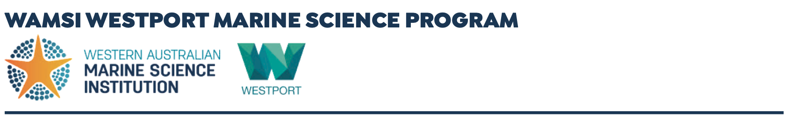
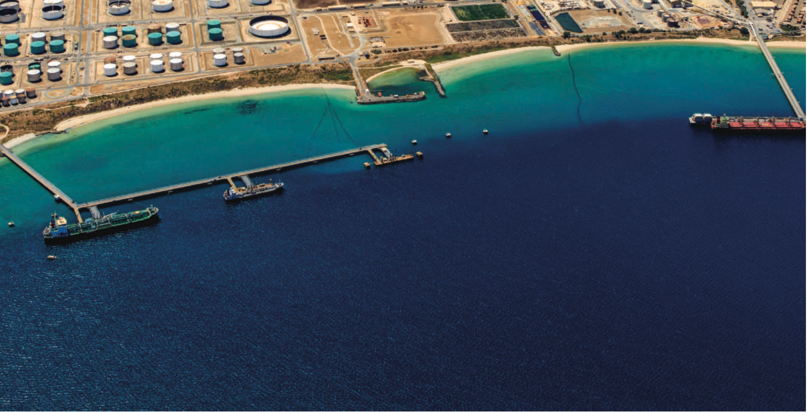

# About {-}

```{r frontmatter-banner, echo=FALSE, out.width='100%', class = "text-image"}

```

```{r frontmatter-kwinana, echo=FALSE, out.width='100%', class = "text-image"}

```

<br>

## About the Marine Science Program {-}

The WAMSI Westport Marine Science Program (WWMSP) is a \$13.5 million body of marine research funded by the WA Government. The aims of the WWMSP are to increase knowledge of Cockburn Sound in areas that will inform the environmental impact assessment of the proposed Westport development and help to manage this important and heavily used marine area into the future. Westport is the State Government's program to move container trade from Fremantle to Kwinana, and includes a new container port and associated freight, road and rail, and logistics. The WWMSP comprises more than 30 research projects in the biological, physical and social sciences that are focused on the Cockburn Sound area. They are being delivered by more than 100 scientists from the WAMSI partnership and other organisations.

<div class="row">
<div class="col-md-6">

### Ownership of Intellectual Property Rights {-}

Unless otherwise noted, any intellectual property rights in this publication are owned by the State of Western Australia.

Unless otherwise noted, all material in this publication is provided under a [Creative Commons Attribution 4.0 Australia License](https://creativecommons.org/licenses/by/4.0/deed.en).

```{r ccby-logo, echo=FALSE, out.width='25%', class = "text-image"}
knitr::include_graphics("images/ccby.png")
```

### Funding Sources {-}

The \$13.5 million WAMSI Westport Marine Science Program was funded by the Western Australian Government, Department of Transport. WAMSI partners provided significant in-kind funding to the program to increase the value to >\$22 million.

### Data {-}

Finalised datasets will be released as open data, and data and/or metadata will be discoverable through Data WA and the Shared Land Information Platform (SLIP).


</div>
<div class="col-md-6">

### Legal Notice {-}

The Western Australian Marine Science Institution advises that the information contained in this publication comprises general statements based on scientific research. The reader is advised and needs to be aware that such information may be incomplete or unable to be used in any specific situation. This information should therefore not solely be relied on when making commercial or other decisions. WAMSI and its partner organisations take no responsibility for the outcome of decisions based on information contained in this, or related, publications.

### Year of Publication {-}

April 2026

This report is part of the project: *Pathways to productivity: Development of a water quality response model for Cockburn Sound*.

### Citation {-}

Hipsey, M.R., Huang, P., Zhai, S., Paraska, D., Busch, B., Golder, R., Escuardo, S.G., Fearns, P., Davies, J. 2026. The Cockburn Sound Integrated Ecosystem Model (CSIEM). Prepared for the WAMSI Westport Marine Science Program. The University of Western Australia, Perth, Western Australia. https://doi.org/10.26182/tp2x-t920.

<!-- ### Front Cover Image {-}

Theme: Ecological modelling. Front cover image: Satellite image of Cockburn Sound and Fremantle Harbour, including Garden Island. Photo courtesy of Sentinel Hub (2023). -->

</div>
</div>
