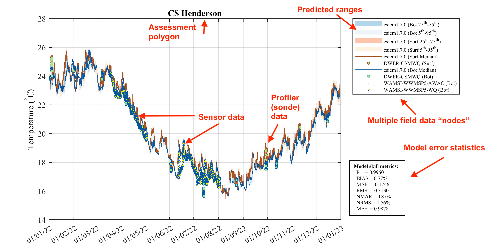
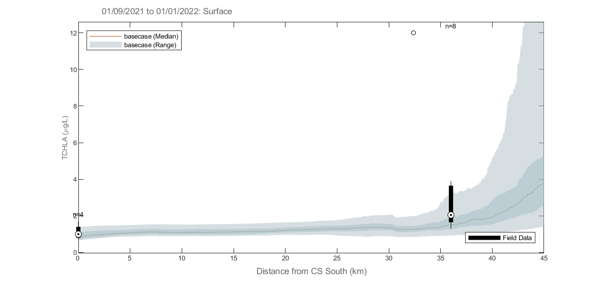
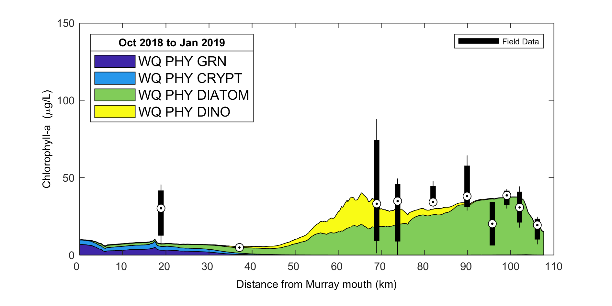
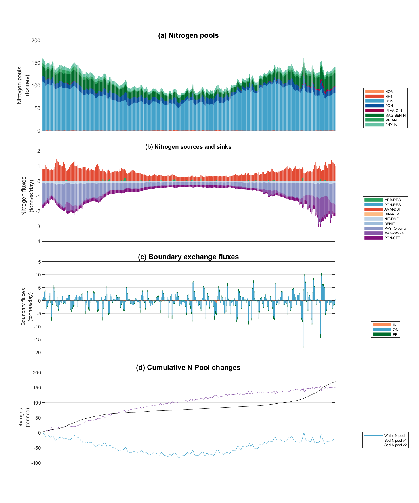
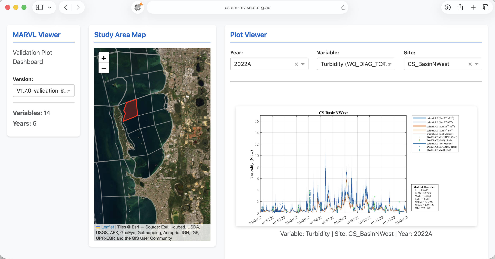
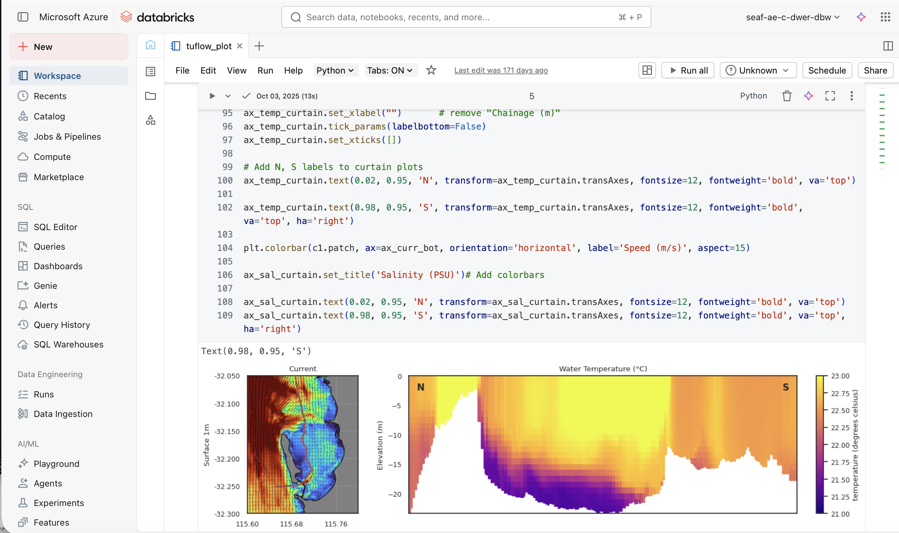

# CSIEM : marvl

<br>

## Overview

A central principle of the CSIEM collaborative modelling approach is the development of trust in model accuracy. Building confidence in the model requires extensive and transparent testing of model performance across the full range of spatial and temporal scales that the model is designed to resolve, and across all the scientific disciplines that it encompasses -- from physical oceanography and hydrodynamics, through to sediment dynamics, nutrient cycling, water quality, and ecological habitat prediction. Only through rigorous and systematic assessment can stakeholders, researchers and decision-makers be assured that the model provides a reliable basis for environmental management and planning in Cockburn Sound.

The subsequent chapters detail the nature of the model setup, and also focus on specific areas of model assessment. In general, the approach to assess the model loosely follows the CSPS framework of Hipsey *et al.* (2020). The framework considers:

- _Level 0_: conceptual evaluation; the conceptual basis for each of the hydrodynamic regimes, water quality variables, biogeochemical reactions, and habitat models as based on scientific review and data inspection;
- _Level 1_: traditional assessment of simulated state variables; a range of metrics is used for a large number of predicted variables and different sites.
- _Level 2_: evaluation of process rates; and
- _Level 3_: benchmarking system-level patterns and emergent properties; this is evaluated by assessments related to hydrodynamic regimes, nutrient budget analysis, nutrient cycling pathway analysis, and assessment of the relationship between the areas of habitat and water conditions.

The above assessments are supported by an analytics toolbox that co-ordinates the above scripts and necessary data and workflows. In particular, `csiem-marvl` refers to the Cockburn Sound Integrated Ecosystem Model - **Model Assessment, Reporting and Visualisation Library**, which is a collection of scripts and tools for assisting users to visualise model outputs and observational datasets, and for evaluating the model's performance. `csiem-marvl` uses the more generic `aed-marvl` package for core functions for plotting and evaluating model output, in addition to a suite of custom Python and MATLAB scripts developed for specific types of analyses. The MARVL toolkit can be operated locally, or via the SEAF-CS cloud-based **Databricks** platform.

The specific data available for validation and the assessment metrics are extensive and summarised below. The level of model uncertainty is discussed in terms of how much confidence there is in the current generation of model outputs for the purposes of defining model reliability.

<br>

## The Model Assessment, Reporting and Visualisation Library (MARVL)

The publicly available GitHub repository called [`csiem-marvl`](https://github.com/AquaticEcoDynamics/csiem-marvl) contains a wide variety of scripts and functions that are used to post-process and visualise model output. Scripts that have been specifically developed for this project are contained within the `csiem-marvl` repository. Plotting and model processing types include:

- Time-series plotting;
- Transect plotting;
- Model animation creation;
- Error assessment;
- Wave model plotting;
- Habitat mapping (e.g., Seagrass & Fish HSI processing and mapping)
- Scenario comparison and "DelMap" plotting;
- Nutrient budget assessments.

In particular, `AEDmarvl_plot_timeseries` and `AEDmarvl_plot_transect` are the main functions that are frequently used. The `AEDmarvl_plot_timeseries` function uses data and gis files stored in the csiem-marvl repository, in addition to model output to create timeseries plots of the model (averaged within a polygon region) compared against field data. The plotting function will also automatically calculate a range of error statistics based on model output and field measured data.

```{r csiem-plottfvpolygon, echo = FALSE, out.width='100%', class = "text-image",fig.align='center', fig.cap = "Example output from plottfv_polygon with error matrix. Image shows the modelled surface and bottom temperature comapred against 3 nearby data-sets."}



```

`AEDmarvl_plot_transect` can also be found in the `csiem-marvl` repository. This plots model data extracted along a transect line during a specified plotting period, and compares against the range of field data found within that period.

```{r csiem-plottfvtransect, echo = FALSE, out.width='100%', class = "text-image",fig.align='center', fig.cap = "Example output from plottfv_transect with distance from Goolwa Barrage (km) along the x-axis"}



```

The `csiem-marvl` analysis library also houses scripts and functions for:

- Nutrient Budgeting;
- Stacked Area Transect;
- Curtain plotting;
- Mesh manipulation tools;
- Data exports;
- Sheet plotting and animation tools;

Some of the example plots from previous research projects using the marvl-similar scripts are shown below illustrating their capability and presentations. The `csiem-marvl` analysis library is currently under development to meet the needs with more data collection and modelling progress, such as sediment profiling and habitat index.

```{r csiem-stackedarea, echo = FALSE, out.width='100%', class = "text-image",fig.align='center', fig.cap = "Example output from plottfv_transect_StackedArea with distance along the x-axis"}



```

```{r csiem-nutrientbudget, echo = FALSE, out.width='100%', class = "text-image",fig.align='center', fig.cap = "Example Nutrient Budgeting output of a polygon region."}



```

## Model assessment summary

Model assessment is managed by a series of workflows that align key data-sets, model outputs, and assessment metrics, and is undertaken for key focus years.

### Summary of validation data-set

The field observation data available for the model validation and assessment include a diversity of historical data (collected pre 2021), and a large volume of data generated by recent monitoring and WAMSI-Westport research projects. Relevant data for validation include:

- *In situ* water quality sensors; high frequency measurements at fixed locations.
- Water quality grab samples.
- Biotic surveys.
- Strategic experimental data.

All the data relevant to model calibration and validation are included in the _CSIEM Data Catalogue_ and detailed in [Appendix A](Appendix A : Data Catalogue); see also Chapter 3. The data spans a wide range of locations and time-periods; however the primary model assessment generally focuses on the most intense period of monitoring between 2022 and 2024. Long-term assessments are also undertaken for different versions of the model by comparing against the long-term monitoring data set.

### Performance assessment metrics

The modelling results are compared against historical data collected within Cockburn Sound (where available), using both traditional statistical metrics of model error, and other metrics relevant to model performance. The approach is applied to each model generation with the aim to identify areas where the model is accurate, and areas for further improvement and ongoing calibration effort.

**Error metrics** : The model performance in predicting a range of relevant variables including salinity, temperature, nitrogen, phosphorus and total chlorophyll-a is assessed with a set of statistical metrics. The calculation of statistical metrics is performed for each observation site where the number of field observations is >10 in the assessment period.

The core statistical metrics considered consist of:

- $r$: regression coefficient. Varies between -1 and 1, with a score of 1 indicating the model varies perfectly with the observations and a negative score indicating the model varies inversely with the observations. A consistent bias may be present even when a high score of $r$ is obtained.
- $BIAS$: bias of average prediction to the average observation during the assessment period. This metric presents the magnitude of the discrepancy between the model results and the observational data.
- $MAE$: mean absolute error. Similar to RMSE except the absolute value is used. This reduces the bias towards large events. Values near zero indicate good model skill.
- $RMS$: root mean squared error. Measures the mean magnitude, but not direction, of the difference between model data and observations. Values near zero are desirable. This metric is not affected by cancellation of negative and positive errors, but squaring the data may cause bias towards large events.
- $NSE$: the Nash-Sutcliffe efficiency metric (also called $MEF$) is a measure of modelling efficiency that compares the performance of the model to that of simply using the mean of the observed data. A value of 1 indicates a perfect model, while a value of zero indicates performance equivalent to using the observed mean.

**Seasonality** : The model results are assessed in terms of the degree of seasonal fluctuation, as seen in the field data. Whilst this is partially captured in the error metrics (e.g. $r$), visual assessment can identify timing issues related to seasonal peaks.

**Transects** : The model results are assessed in terms of the seasonal mean along the length of the domain (longitudinal transect). The transect analysis allows a system-wide scale assessment of conditions, smoothing out noise and local variability in the field and model predictions.

**Advanced measures** : The model results are also assessed by considering the partitioning of nutrients in terms of inorganic vs organic fractions, and other emergent measures.

A quick-reference summary of the context-specific validation undertaken across the science chapters is provided in Table C.1 (Appendix C).


### Assessment periods

In general, a range of data and model simulations are summarised as:

- _Historical period_: 1970-2010: initial assessment prior to availability of WAMSI research project data;
- _Recent period_: 2011-2020: initial assessment prior to availability of WAMSI research project data;
- _Focus period_: 2021-2023: initial calibrated against the intensive field sampling and observations obtained from different components of the WAMSI research project;
- _Long-term performance_: 2013 – 2024: calibrated against the long-term water quality data collected from the routine measurements, as well as from the WAMSI research project.

Specifically, seven focus simulation years have been used for the primary model assessment, and are summarised in Table \@ref(tab:focus-years). These years were selected to span a wide range of hydrologic and met-ocean conditions, from very dry years with minimal river influence through to some of the wettest years on record, ensuring the model is tested under the diversity of conditions experienced in Cockburn Sound.

```{r focus-years, echo=FALSE, message=FALSE, warning=FALSE}
library(knitr)
library(kableExtra)

focus_years <- data.frame(
  Year = c("2013", "2015", "2020", "2021", "2022", "2023", "2024"),
  Conditions = c(
    "Moderate flow year; average winter rainfall and river inflows; typical seasonal cycle of summer stratification and winter storm-driven mixing; Leeuwin Current influence within normal range.",
    "Very dry year; well below-average rainfall and minimal river discharge; negligible freshwater influence on Cockburn Sound; reduced catchment nutrient loads; extended periods of warm, calm conditions during summer. A major fish-kill event was reported in Cockburn Sound.",
    "Very dry year; minimal river inflows and reduced catchment nutrient loads; low Swan-Canning discharge with negligible plume connectivity to Cockburn Sound; limited freshwater dilution capacity.",
    "Large wet year; significant winter rainfall and major river plume event in August; brackish plumes from the Swan-Canning extended into Cockburn Sound with southward tendency; strong winter nutrient pulses and enhanced estuarine flushing; notable stratification episodes from freshwater influence.",
    "Very wet year; one of the largest flow years across the 2000-2024 record; strong winter discharge with river plume tending northward; regular storm-driven renewal events during winter-spring.",
    "Dry year; very low river flows with minimal freshwater influence; notable wind-driven turbidity pulses during winter storms; persistent summer-autumn stratification and oxygen drawdown in the deep basin during late 2023.",
    "Dry year; continuation of below-average rainfall; pronounced summer stratification event (November 2023 - February 2024) with bottom-water oxygen depletion; mild phytoplankton bloom event in January following stratification-mixing cycle."
  ),
  Data = c(
    "CSMC routine monthly grab samples; JPPL-AWAC wave measurements (summer); WCWA-PSDP intensive water column profiles (autumn); ROMS ocean boundary data; BARRA meteorological forcing.",
    "CSMC routine monitoring; ROMS and BARRA boundary products; Sentinel-2 satellite imagery commences; limited in-situ sensor deployments.",
    "CSMC routine monitoring; DWER Cockburn Sound moorings commenced; Sentinel-2 satellite imagery; ROMS and WRF boundary products; limited field campaign data.",
    "Intensive WAMSI Westport field data collection commenced; DWER mooring deployments (autumn and winter); CSMC monitoring with good seasonal coverage; WWMSP thermistor chains at CS1 and CS3; WWMSP5-AWAC wave measurements; enhanced nutrient and water quality sampling.",
    "Full annual cycle of CSMC and WWMSP monitoring programs; WWMSP5-MET meteorological station at Woodman Point (Jul-Nov); WWMSP thermistor chains continued; WWMSP Theme 4.2.2 zooplankton surveys; Sentinel-2 satellite imagery (96 images for TSM/chlorophyll analysis); CSIRO deep-basin DO data.",
    "WWMSP Theme 3.1 sediment deposition loggers; WWMSP9 coastal process AWAC/ADV at Success Bank and Parmelia Bank (winter deployment); WWMSP2-MS9 light sensor at Kwinana Shelf; DWER moorings including DESAL site; continued CSMC routine monitoring.",
    "WWMSP9 ADV measurements (summer deployment); DWER moorings capturing stratification dynamics; CSMC routine monitoring; Sentinel-2 and Sentinel-3 satellite products; MODFLOW groundwater model outputs extended to 2024."
  )
)

names(focus_years) <- c("Year", "Hydrologic and met-ocean conditions", "Key data availability")

kbl(focus_years, caption = "Summary of the seven focus simulation years used for CSIEM model assessment, including prevailing hydrologic and met-ocean conditions and key data sources available for validation.", align = "lcl") %>%
  row_spec(0, background = "#002B4D", bold = TRUE, color = "white") %>%
  column_spec(1, width = "4em", bold = TRUE) %>%
  column_spec(2, width = "22em") %>%
  column_spec(3, width = "22em") %>%
  kable_styling(full_width = TRUE, font_size = 10) %>%
  scroll_box(fixed_thead = FALSE)
```

<br>

### Model confidence reporting


Based on the above assessment, we evaluate confidence in the model by assigning each variable to the following categories:

- Good
- Acceptable, and
- Caution.

This confidence evaluation considers:

- Quality of observed data, which is influenced by field and laboratory data limitations, methodologies, processes and protocols.
- Error metric scores relative to what is typically reported in the literature for water quality models (e.g., Arhonditsis and Brett, 2004).
- Ability of the CSIEM to capture the mean of an indicator and its spatial gradient and seasonality.
- Partitioning of water quality constituents within different ecosystem pools.
- Natural variability of the indicator at different temporal scales (i.e. sub-daily to seasonal).

<br>

## MARVL-VIEWER

The model assessment considered ~70 assessment polygons, for 7 years, for multiple (>20) variables. To assist with reviewing these plots, readers are encouraged to browse [<span style="color: blue">via the **MARVL-VIEWER** web-app</span>](https://csiem-mv.seaf.org.au). The MARVL-VIEWER provides an interactive dashboard where results from different model versions (generations) can be viewed and compared for all major regions of Perth coastal waters. Users can select any assessment polygon on the study area map, choose from the suite of key variables (e.g. temperature, salinity, nutrients, chlorophyll-a, turbidity, dissolved oxygen), and view time-series validation plots that overlay model predictions from multiple model versions against the entire collated observational data-set. This allows users to track how model accuracy has improved across successive generations and to identify areas where further calibration effort may be needed.

```{r marvl-viewer-example, echo = FALSE, out.width='100%', class = "text-image", fig.align='center', fig.cap = "The MARVL-VIEWER web-app showing an interactive validation plot for turbidity in the CS Basin NW region, comparing multiple model versions against the collated field observations."}



```

<br>

## Databricks cloud analytics

The concept of the local MARVL toolkit has been extended to operate within the cloud via the Databricks data engineering environment, which is integrated into the SEAF-CS platform. Databricks provides a collaborative, notebook-based workspace where R and Python scripts can be attached to scalable cloud compute resources, enabling efficient online processing of large model output files and curated data products without the need for local infrastructure.

### Data access

Model simulation outputs (in NetCDF format) and the curated observational data products from the CSIEM data collection (Chapter 3) are stored within secure Azure Blob Storage containers that are accessible from within the Databricks workspace. This includes:

- TUFLOW-FV -- AED model output files (hydrodynamic, water quality, sediment transport and ecological variables);
- Curated time-series data products from the CSIEM data warehouse;
- GIS and spatial reference files used for assessment zones and transect definitions.

Access to these storage containers is managed through the SEAF-CS Landing Zone security framework, ensuring that users can only access data and model outputs that are appropriate to their role and project.

### Analytics notebooks

A library of pre-curated analytics notebooks is available within the SEAF-CS Databricks service, providing on-demand post-processing and visualisation capabilities. Many of the assessment and visualisation types available in the local MARVL toolkit (Section 5.2) have been ported to this environment, including time-series comparisons, transect plotting, error metric computation, and nutrient budget analyses. In addition, the cloud environment supports more computationally intensive tasks such as:

- Batch processing of multi-year simulation outputs across all assessment zones;
- Generation of sheet map animations and curtain plots from large 3D output files;
- Scenario comparison analytics, including "DelMap" difference mapping between simulations;
- Custom exploratory analyses using the full Python and R data science ecosystem.

The library of available analytics notebooks for Cockburn Sound continues to grow over time as new assessment types and research questions emerge. Users can also develop and share their own notebooks within the collaborative workspace, contributing to a growing collection of reusable analytical workflows for integrated ecosystem assessment.

```{r databricks-example, echo = FALSE, out.width='100%', class = "text-image", fig.align='center', fig.cap = "Example of the SEAF-CS Databricks workspace showing a Python notebook for generating curtain plots of current speed and water temperature from CSIEM model output."}



```


