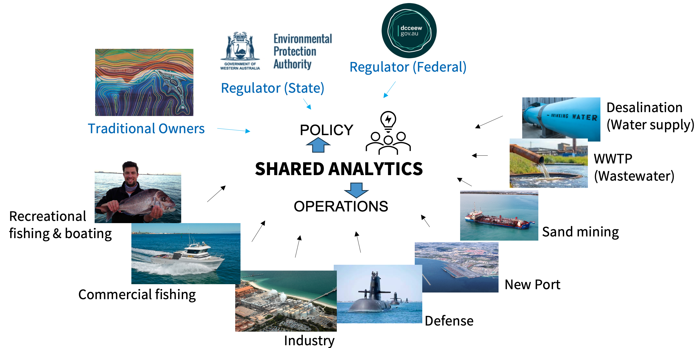

# Introduction

<br>

Cockburn Sound in Western Australia is a unique coastal ecosystem renowned for its important economic and environmental values, whilst also being under stress from a range of anthropogenic activities and climate change impacts.  Deleterious water quality conditions have been a feature of the system in the past which severely impacted upon the most important ecosystem values, including seagrass and benthic community health, pelagic fisheries, and potentially also apex predators and iconic species. The historically poor water quality has been improving over past decades due to nutrient source control, however, past nutrient enrichment has left a legacy within the system and issues of hypoxia, harmful algae, and lack of water clarity continue to challenge managers and negatively impact upon the range of users of the system (BMT, 2018a). Further, there are concerns that some risks associated with hypoxia, harmful algal blooms and excessive turbidity may worsen into the future if they are not actively managed. 

As part of the WAMSI Westport Marine Science Program (WWMSP), the Cockburn Sound Integrated Ecosystem Model (hereafter referred to as ‘CSIEM’) has been developed as a tool to quantify water quality and habitat changes within the ecosystem in response to different environmental conditions, and to assist by allowing integrated assessment of management scenarios, and other questions relevant to decision-making. In particular, the model has been developed to allow stakeholders to move towards a more holistic and cumulative assessment of environmental risks, which has been particularly motivated since recent updates to the *Environmental Protection Amendment Act (2020)* by the State Government of Western Australia.

In building the model the intent has been to develop an ecosystem model able to support the multi-scale prediction needs of both development proponents and environmental regulators seeking to optimise ecosystem use, whilst capturing the latest scientific findings and data from the WWMSP research projects. This is undertaken using the "Shared Analytics" philosophy, which is a key principle of the Shared Environmental Analytics Facility (SEAF), and involves the development of shared tools and has been designed to be open and transparent, with the aim of fostering collaboration and knowledge sharing among researchers, stakeholders and decision-makers.

```{r, echo=FALSE, out.width="85%"}

```

:::{.figcap}
**Figure 1.1.** Overview of the Shared Analytics approach underpinning CSIEM, illustrating the range of stakeholders — including regulators, Traditional Owners, industry, and community users — connected through a common modelling and decision-support platform.
:::

The core of the platform is a 3D hydrodynamic-ecological model, termed the Cockburn Sound Integrated Ecosystem Model (CSIEM), which is nested within regional met-ocean predictions and integrated with a variety of other environmental models. CSIEM has been developed as part of Project 1.2 of the WWMSP to undertake hindcast and forecast (scenario) predictions of water mixing and transport, salinity (S), temperature (T), aquatic biogeochemistry and ecology. The model has been implemented as part of an overarching integrated platform designed to coordinate the inter-dependencies between various modelling tools and outputs and model-data workflows, in order to provide a holistic view of the environmental conditions of Cockburn Sound.

At the heart of CSIEM is the Aquatic EcoDynamics (AED) modelling library — an open-source, modular biogeochemical framework developed at The University of Western Australia over approximately two decades and coupled to a host hydrodynamic model (TUFLOW-FV). AED has been applied across a wide range of research and industry contexts, including the Swan-Canning and Peel-Harvey estuaries, the Perth Seawater Desalination Plant, and the Coorong Restoration Project. For CSIEM, this established capability has been tailored to the local datasets of Cockburn Sound and extended to incorporate the new science emerging from the WWMSP research projects.

Model development was organised around three interlinked scientific challenges that together determine productivity and ecosystem condition in the Sound: **closing the nutrient budget** (resolving nitrogen and phosphorus sources, recycling and fate, including the role of benthic release and submarine groundwater discharge); **resolving benthic dynamics** (sediment biogeochemistry and habitat-forming communities such as seagrass and filter feeders); and **light and primary productivity** (including the drivers of harmful algal bloom risk). Boundary forcing for the embayment-scale domain — weather, waves and ocean circulation — is drawn from the regional WRF, SWAN and ROMS model outputs produced within the program.

Initial phases of the CSIEM development focused on model setup and testing, and included interim releases (v0.9, v1.0, v1.1 and v1.5). Version 1.7 (CSIEM-1.7.0) is the current operational release as of April 2026, and represents the culmination of the WWMSP Theme 1 research integration. This document provides a "living-manual" of the model, giving an overview and technical guide of the model design and capability as data and synthesis of the WWMSP research data and findings occurs.

