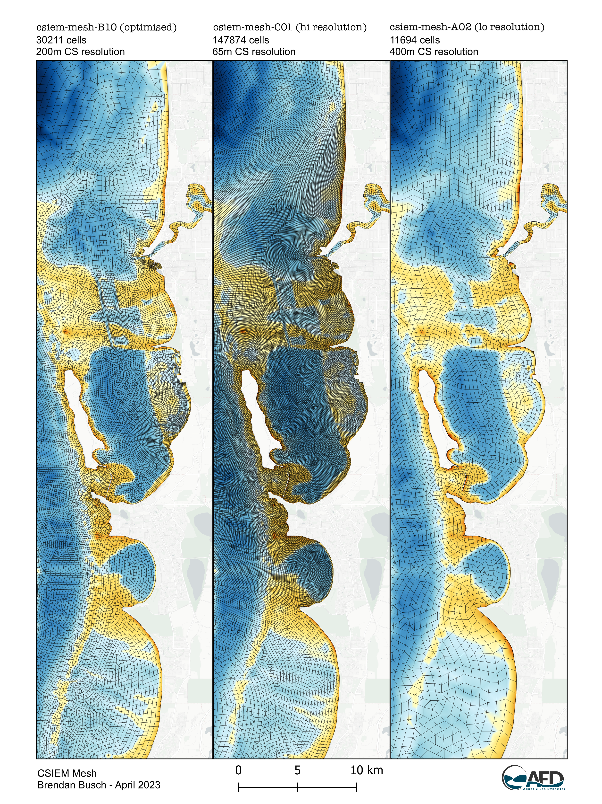

# CSIEM : model

<br>

## Overview

This chapter describes the technical specification of the CSIEM model platform, including the coupled hydrodynamic-biogeochemical modelling framework, the simulation domain and mesh design, the suite of boundary conditions that drive the model, the approach to benthic zonation, and the repository structure used for version control and collaborative model development. Together, these elements define the core model architecture that underpins all simulations presented in subsequent chapters.

Whereas earlier chapters have introduced the broader context of Cockburn Sound environmental management (Chapter 1), the overall organisational structure of the CSIEM platform (Chapter 2), the data integration framework (Chapter 3), and the MARVL visualisation and analytics toolkit (Chapter 5), the focus here is on the model configuration itself -- how the model is constructed, what inputs it requires, and how the model files are organised and maintained. More detailed scientific descriptions of the individual model components, their calibration, and performance assessments are provided in Chapters 6--15, which cover ocean climatology, hydrodynamics, catchment inflows, sediment biogeochemistry, water quality, light climate, and seagrass habitat modelling.

##	Water quality model : TUFLOW-FV – AED 

The base model used in the CSIEM platform is the finite volume hydrodynamic model TUFLOW-FV, developed by BMT Global Pty Ltd (BMTWBM, 2023). The model adopts a flexible-mesh and accounts for variations in water level, salinity, temperature, and density in response to tides, inflows and surface thermodynamics. At the ocean-side (western) boundary the model is driven by conditions predicted by the regional ROMS model (see Section 2.4).  At the surface, the model is driven by spatially-variable outputs from various weather data-sets. The model includes additional enhanced useability features including integration with QGIS, optimisation for operation on GPUs, multiple turbulence closure and numerical schemes, and ability for including a wide array of industry-relevant boundary conditions (e.g., for resolving aspects such as dredging, discharges and coastal infrastructure). The model has been widely validated in a range of coastal areas around Australia.

To simulate the water quality and benthic habitat aspects, the AED water quality model is linked with TUFLOW-FV. AED is a community-driven library of modules and algorithms for simulation of "aquatic eco-dynamics" - water quality, aquatic biogeochemistry, biotic habitat and aquatic ecosystem dynamics, developed by the Centre for Water and Spatial Science at UWA (Hipsey et al., 2022). Each module has options for resolving key aquatic processes sourced from a wide variety of scientific literature, making the library one of the most advanced available to aquatic ecosystem modellers. In subsequent chapters, several bespoke modifications made to AED modules for simulations of Cockburn Sound are outlined.

A summary of the included variables that are simulated by the coupled platform is presented in Table \@ref(tab:state-variables). These are described in more detail in subsequent chapters, as linked from the table.

<br>

```{r state-variables, echo=FALSE, message=FALSE, warning=FALSE}
library(knitr)
library(kableExtra)
library(readxl)
theSheet <- read_excel('tables/state_variables.xlsx', sheet = 1)
theSheetGroups <- unique(theSheet$Group)

for(i in seq_along(theSheet$Abbreviation)){
  if(!is.na(theSheet$Abbreviation[i])){
    theSheet$Abbreviation[i] <- paste0("$$",theSheet$Abbreviation[i],"$$")
  }
}
for(i in seq_along(theSheet$Unit)){
  if(!is.na(theSheet$Unit[i])){
    theSheet$Unit[i] <- paste0("$$\\small{",theSheet$Unit[i],"}$$")
  }
}

tbl <- kbl(theSheet[,3:NCOL(theSheet)], caption = "Summary of CSIEM simulated (state) variables (current as of v1.7).", align = "l", escape = FALSE)
for(g in theSheetGroups){
  tbl <- tbl %>%
    pack_rows(g,
              min(which(theSheet$Group == g)),
              max(which(theSheet$Group == g)),
              background = '#ebebeb')
}

tbl %>%
  row_spec(0, background = "#14759e", bold = TRUE, color = "white") %>%
  kable_styling(full_width = F, font_size = 10) %>%
  column_spec(1, width_min = "8em") %>%
  column_spec(2, width_max = "8em") %>%
  column_spec(3, width_min = "10em") %>%
  column_spec(4, width_min = "18em") %>%
  column_spec(5, width_min = "6em") %>%
  scroll_box(width = "700px",
             fixed_thead = FALSE)
```

<br>

##	Model simulation domain

The geographical extent of the CSIEM domain is centred around Cockburn Sound, extending from Mandurah at the south to Quinns Rocks at the north (32.677°S – 31.669°S), and from outer Rottnest Island at the west to Narrows Bridge at the east (115.323°E - 115.858°E) (Figure \@ref(fig:csiem-mesh)). The model adopted a flexible-mesh (finite-volume) approach, in which the mesh consists of triangular and quadrilateral elements of different sizes that are suited to simulating areas of complex morphometry, with the model resolution generally increases from the offshore areas to the nearshore areas. 

The model domain bathymetry was derived from a 10m DEM product and a range of other data sources (Gunaratne et al., 2023). The vertical mesh discretization adopted a hybrid σ-z coordinate allowing multiple surface Lagrangian layers to respond to tidal elevation changes. The layer thickness was 0.5 m at depths of 3.0–4.0 m, 1.0 m at depths of 4.0-23.0 m, that gradually increased to 50 m in deeper water, and then four uniformly distributed sigma layers were added above the fixed thickness layers. 

There are three mesh options (namely coarse, optimised, and fine resolutions) available to support different research and management needs. The mesh structures can be seen in Figure \@ref(fig:csiem-mesh). The fine- and coarse-mesh models share the same boundary conditions and have been bench-marked with each other. This is an advanced feature of CSIEM modelling platform.  Users can choose a mesh option that is suitable to their needs depending on the resolution and run time requirements, where different meshes can be used in different stages of model development. When modellers use the MARVL platform for visualisations and analysis of results (Hipsey et al. 2025), then plotting and assessment works in an identical way regardless of the chosen mesh, and simulations on different mesh resolutions can be compared.

(ref:csiem-mesh) Plan-view of CSIEM model mesh around the Cockburn Sound region for the B (optimized), C (fine) options, and A (coarse) mesh file options.

```{r csiem-mesh, echo=FALSE, fig.cap="(ref:csiem-mesh)", out.width="95%"}

```


## Boundary conditions

Regardless of the model mesh option that is chosen, the CSIEM system manages several standard boundary conditions to allow the model to be forced by tidal, meteorological and inflow information, which is brought together from various data sources (Figure \@ref(fig:csiem-integration)). 

The CSIEM boundary conditions include:   

•	Meteorology: Meteorological conditions are collected from a range of sources. For the years before 2019, the spatially resolved Bureau of Meteorology Atmospheric High-Resolution Regional Reanalysis for Australia (BARRA) climate model is used. Beyond 2019. The BARRA-PH 1.5km resolution product is discontinued, and the Weather Research and Forecasting (WRF) product is used instead. 

•	Wave conditions: Set on the surface of model domain, the wave conditions (significant wave heights, periods, directions) are specified based on the integration of the WWMSP WWM outputs, or BMT's SWAN outputs.

•	Ocean physical conditions: Set on the ocean side, an open boundary is specified based on the integration with WWMSP ROMS modelling outputs. Water level, velocity, water temperature and salinity are specified along the boundary extent.  

•	Ocean biogeochemical conditions: In addition to the variables needed for CSIEM hydrodynamic predictions, numerous water quality variables are specified using a 'monthly climatology' approach that is described in detail in Chapter 9. 

•	Swan-Canning and Peel-Harvey inflows: Inflows to the CSIEM model domain from the local catchment via Swan-Canning River and Peel-Harvey Estuary was set based on available flow data from Water Information Reporting (WIR) portal (https://wir.water.wa.gov.au/Pages/Water-Information-Reporting.aspx). The nutrient boundary condition inputs are extrapolated based on field measurements at the nearest sites to the model boundaries.

•	Groundwater inputs: Set at the sediment-water interface of Cockburn Sound, the groundwater fluxes and its associated nutrient loads are specified based on the integration of the Theme 3.3 groundwater model outputs. More details of linkage between the groundwater inputs and CSIEM are provided in Chapter 12.

•	Wastewater treatment plants (WWTPs) inputs: The discharge rates of the WWTPs and their water quality were obtained from the National Outfall Database (https://nod.org.au/), which included data of Alkimos, Beenyup, East Rockingham, Point Peron, Subiaco, and Woodman Point from Jan/2015 to Jun/2021 at monthly intervals. Outside the reporting period, mean values of water quality in the corresponding months were used. More details of linkage between the groundwater inputs and CSIEM are provided in Chapter 12 "Nutrient loads and sources".

•	Industrial operational discharges and intakes: these inputs were set according to the BMT development (Gunaratne et al., 2023) assuming a constant rate and water quality for each input. More details of linkage between the groundwater inputs and CSIEM are provided in Chapter 12 "Nutrient loads and sources".


(ref:csiem-integration) Overview of the CSIEM model integration ecosystem, depicting the links of the main hydrodynamic-water quality with other dependent model and data products that are required to run an integrated simulation. Down the list represents disicplinary integration and left to right represents spatio-temporal down-scaling.

```{r csiem-integration, echo=FALSE, fig.cap="(ref:csiem-integration)", out.width="95%"}
knitr::include_graphics("./media/image3.png")
```

## Benthic (bottom) zonation

The CSIEM platform has been designed to accommodate horizontal variation in benthic substrates. This is needed to be able to resolve:

-	the effect of bottom roughness on flow dynamics 
-	the variation of sediment physical properties, as relevant to sediment transport dynamics
-	variability in the dynamics of sediment biogeochemical processe, and
-	the dynamics of bottom biotic communities, and their associated feedbacks to water column properties.

Bottom properties are configured via setting of a) material zones and b) relevant benthic or sediment properties. This is done via loading shape files, and/or cell-specific properties into the model configuration. 

Refer to [Appendix B](benthicapp) for an overview of the data sources and approach to setup of benthic areas within the CSIEM platform.


## Model repository and version management

### **csiem-model repository**

The organisation of the CSIEM model system is via a set of version-controlled, cloud-based repositories managed under the [SEAF-CS GitHub organisation](https://github.com/SEAF-CS). The top-level `csiem-model` repository links to specific model simulation repositories using the Git sub-module feature. Each model is a standalone version-controlled repository that can be cloned in isolation, or the entire compatible model set can be cloned at key version/release points via the high-level `csiem-model` repository. The linked model repositories include:

- `csiem_model_tfvaed_1.7`: the current generation of the TUFLOW-FV -- AED hydrodynamic-biogeochemical model;
- `csiem_model_tfvaed_2.0`: the next-generation model configuration under development;
- `csiem_model_ecopath_1.0`: the EcoPath food-web and trophic pathways model;
- `csiem_model_candi_1.0`: the CANDI-AED sediment biogeochemistry model;
- `csiem_model_wrf_1.0`: the WRF weather model configuration for Perth;
- `csiem_model_tools`: utility scripts for boundary condition processing, model setup and plotting.

Major "generations" of model setup are each stored as a separate repository with a version number suffix, and each maintains its own version control and release history. New models can be added to the collection as they are developed.

In addition to the model repositories, the separately managed `environment_repo` (also referred to as `bc_repo` in earlier versions) contains boundary condition files spanning multiple decades. Due to the large volume of data (~1 Tb for the period 1990--2024), these files are not stored on GitHub but are archived on the Pawsey Acacia S3 server and the SEAF Azure platform, and are accessible via fetch scripts provided in `csiem_model_tools`.

Beyond the models developed within the WAMSI Westport Research program, there is also a range of supporting environmental models -- including meteorology, wave and hydrodynamic products -- that are used as boundary conditions or reference simulations for Cockburn Sound. These environmental models are outlined in Table \@ref(tab:model-classes1).

<br>

```{r model-classes1, echo=FALSE, message=FALSE, warning=FALSE}
library(knitr)
library(kableExtra)
library(readxl)
library(rmarkdown)
theSheet <- read_excel('tables/CSIEM_Model_Catalogue_Extract.xlsx', sheet = 1)
theSheet <- theSheet[theSheet$Table == "Data",]
theSheetGroups <- unique(theSheet$Group)

kbl(theSheet[,3:13], caption = "Summary of existing environmental models for Westport. ", align = "l",) %>%
  pack_rows(theSheetGroups[1],
            min(which(theSheet$Group == theSheetGroups[1])),
            max(which(theSheet$Group == theSheetGroups[1])),
            background = '#ebebeb') %>%
  pack_rows(theSheetGroups[2],
            min(which(theSheet$Group == theSheetGroups[2])),
            max(which(theSheet$Group == theSheetGroups[2])),
            background = '#ebebeb') %>%
  pack_rows(theSheetGroups[3],
					  min(which(theSheet$Group == theSheetGroups[3])),
					  max(which(theSheet$Group == theSheetGroups[3])),
					  background = '#ebebeb') %>%
  pack_rows(theSheetGroups[4],
          	min(which(theSheet$Group == theSheetGroups[4])),
          	max(which(theSheet$Group == theSheetGroups[4])),
          	background = '#ebebeb') %>%
  pack_rows(theSheetGroups[5],
          	min(which(theSheet$Group == theSheetGroups[5])),
          	max(which(theSheet$Group == theSheetGroups[5])),
          	background = '#ebebeb') %>%
row_spec(0, background = "#002B4D", bold = TRUE, color = "white") %>%
  kable_styling(full_width = T,font_size = 10) %>%
    scroll_box(fixed_thead = FALSE)

```

### **CSIEM TUFLOW-FV-AED model file organisation**

The main 3D hydrodynamic-biogeochemical simulation configuration files are stored in the `csiem_model_tfvaed` repositories. The current version is [csiem_model_tfvaed_1.7](https://github.com/SEAF-CS/csiem_model_tfvaed_1.7). This repository contains a carefully structured folder tree with the input files needed for a TUFLOW-FV -- AED model simulation. Note that the `environment_repo` (boundary condition files) and model outputs are not stored in this repository; they are separately archived on the Pawsey Acacia server or the SEAF Azure platform.

The repository is assembled around the following structure:

```
csiem_model_tfvaed_1.7/
|
|-- model_components/
|   |-- includes/                   # Model configuration files
|   |   |-- bc/                     # Boundary condition includes
|   |   |-- ic/                     # Initial condition includes
|   |   |-- domain/                 # Domain configuration
|   |   |-- turbulence/             # Turbulence parameters
|   |   |-- roughness/              # Roughness settings
|   |   |-- wq/                     # Water quality configuration
|   |   |-- wq-eco/                 # Water quality-ecosystem coupling
|   |   +-- output/                 # Output definitions
|   |
|   +-- gis_repo/                   # GIS files for model setup
|       |-- 1_domain/               # Mesh and bathymetry files
|       |-- 2_benthic/              # Benthic substrate maps
|       |-- 3_output/               # Output extraction points
|       +-- 4_gw/                   # Groundwater zone definitions
|
|-- model_runs/                     # Main simulation configurations (.fvc)
|   |-- HD/                         # Hydrodynamic simulations
|   |-- WQ/                         # Water quality simulations
|   |-- ST/                         # Sediment transport simulations
|   +-- ECO/                        # Ecosystem simulations
|
|-- model_modifier_library/         # Scenario modifiers for human activities
|   |-- discharges/
|   |-- dredging/
|   |-- intakes/
|   |-- shipping/
|   +-- modifier_catalogue.xlsx     # Catalogue of available modifiers
|
+-- environment_repo/  (external, on Pawsey S3)
    |-- 1_ocean/                    # ROMS-derived ocean boundaries
    |-- 2_weather/                  # Meteorological forcing (BARRA/WRF)
    |-- 3_waves/                    # Wave forcing (WWM/SWAN)
    |-- 4_sce/                      # Swan-Canning Estuary inflows
    |-- 5_phe/                      # Peel-Harvey Estuary inflows
    +-- 6_gw/                       # Groundwater inputs (SGD by zone)
```

The `model_components/` directory contains all modular configuration and geospatial files required by simulations. The `model_runs/` directory holds the main model configuration files (`.fvc` files) for each simulation type. The `model_modifier_library/` houses configuration "modifiers" that represent specific human activities or scenarios that can be applied on top of the base environmental model.

The `environment_repo` (boundary condition files) is managed separately due to its large size (~1 Tb for 1990--2024), and is stored on Pawsey S3 storage rather than in the GitHub repository. It is organised with a standard file naming convention, with files generally grouped by year.

### **Simulation naming conventions**

Model configuration files follow standardised naming conventions that encode the model generation, mesh resolution, simulation period, and simulation type. The main configuration file naming convention is:

`csiem_{model generation ID}_{mesh option}_{model period}_{simulation type}.fvc`

For example, the file `csiem_v1_B009_20130101_20131231_WQ.fvc` specifies a Generation 1 model on the B009 (optimised) mesh, covering the year 2013, configured for a coupled water quality simulation. The simulation type codes are:

- `WQ`: coupled TUFLOW-FV -- AED water quality simulation;
- `HD`: TUFLOW-FV hydrodynamic-only simulation;
- `ST`: TUFLOW-FV sediment transport simulation;
- `ECO`: ecosystem simulation.

Include files referenced within the main configuration adopt their own conventions depending on boundary type. For example, meteorological boundary files follow the pattern `met_{data source}_{domain}_{data period}.fvc`, and initial condition files follow `initial_conditions_{model version}.fvc`.

Users tailor their simulation by engaging specific include files, in the appropriate sequence, within the main model configuration file. The model requires an active TUFLOW-FV binary and license with a pre-compiled AED plugin. The current model is built with:

- `TUFLOW-FV:` Build version 2025.2.1
- `AED:` Build version 2.3.3

TUFLOW-FV can be downloaded from the [BMT TUFLOW website](https://www.tuflow.com/products/tuflow-fv/), and the compatible AED plugin from the [UWA AED website](https://aquatic.science.uwa.edu.au/research/models/AED/quickstart.html). Input and model output files can be processed using the `csiem-marvl` repository, which includes supporting scripts for model assessment, reporting and visualisation.

